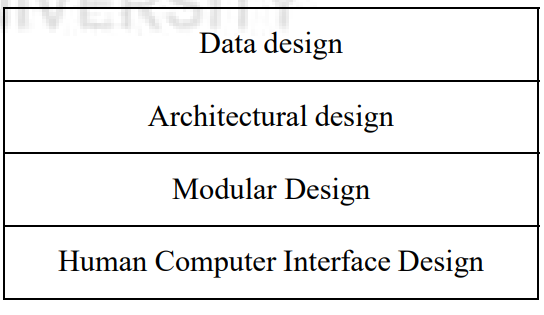
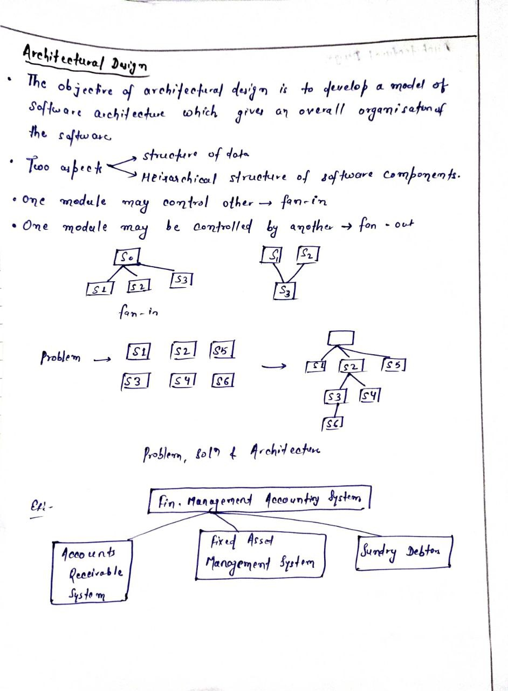
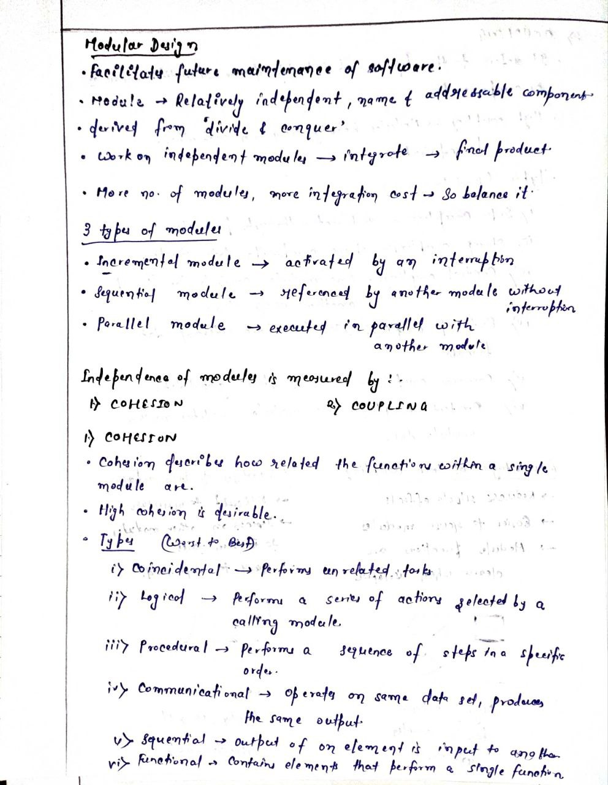
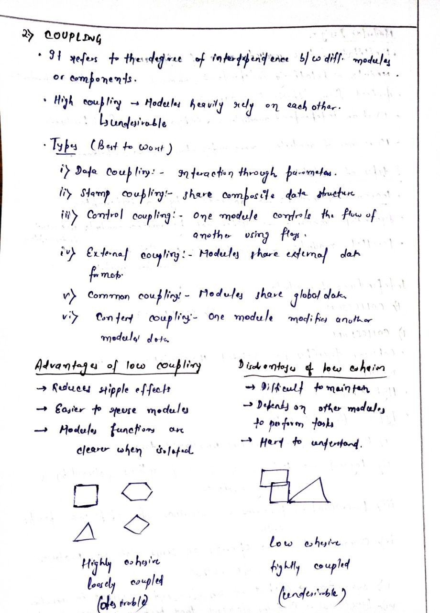

<!-- TOC start (generated with https://github.com/derlin/bitdowntoc) -->

- [Software Design Overview](#software-design-overview)
  - [Importance of Software Design](#importance-of-software-design)
  - [Software Design Process](#software-design-process)
  - [Fundamentals of Design](#fundamentals-of-design)
  - [Data Design](#data-design)
  - [Data Structures](#data-structures)
  - [Architectural Design](#architectural-design)
  - [Modular Design](#modular-design)
  - [Interface Design in Software Engineering](#interface-design-in-software-engineering)
    - [Importance of Interface Design](#importance-of-interface-design)
    - [Types of Interfaces](#types-of-interfaces)
      - [Command Line Interface (CLI)](#command-line-interface-cli)
      - [Menu-Based Interface](#menu-based-interface)
      - [Graphical User Interface (GUI)](#graphical-user-interface-gui)
    - [User Categories](#user-categories)
    - [Elements of Good Interface Design](#elements-of-good-interface-design)
  - [Design Models](#design-models)
  - [Design of Human-Computer Interface (HCI)](#design-of-human-computer-interface-hci)
    - [Overview](#overview)
    - [Process of HCI Design](#process-of-hci-design)
    - [Branch of Computer Science](#branch-of-computer-science)
    - [Principles of Good HCI Design](#principles-of-good-hci-design)
      - [Diversity of Users](#diversity-of-users)
      - [Rules for HCI Design](#rules-for-hci-design)
    - [Error Handling Insights](#error-handling-insights)
    - [Norman's Research](#normans-research)
    - [Design Mappings](#design-mappings)
  - [Check Your Progress 1](#check-your-progress-1)
  - [Check Your Progress-2](#check-your-progress-2)
  - [Check Your Progress-3](#check-your-progress-3)

<!-- TOC end -->

<!-- TOC -->
# Software Design Overview

<!-- TOC -->
## Importance of Software Design
- Software design creates blueprints for developing functional software.
- Unlike traditional engineering designs, software design is continually evolving.
- Initially focused on coding, software design is now central to software engineering.

<!-- TOC -->
## Software Design Process
- Translate user requirements into implementable software models.
- Various design models are developed and refined during the design phase.
- High-level designs provide a holistic view; low-level designs are closely related to final code.

<!-- TOC -->
## Fundamentals of Design
- Hierarchical organization of design
- Modular design for logical partitioning and independent task performance
- Interfaces facilitating external interactions
- Stepwise refinement to detailed designs for developers
- Balance modularity for parallel development vs. integration effort

<!-- TOC -->
## Data Design
- Data: Real-world information resources (e.g., customer data, student records)
- Iterative process to define and expand data details based on business needs.
- Technical aspects include:
  - Name, description, characteristics, ownership of data items
  - Logical events, processes, and relationships

<!-- TOC -->
## Data Structures
- Define logical relationships among data elements.
- Selection crucial for procedural design and algorithms.
- Scalar items (e.g., month name) vs. complex structures like arrays and linked lists.
- Example: `months_in_year = ['Jan', ..., 'Dec']`
  - Access via index: `months_in_year[4]` retrieves 'Apr'.
- Linked lists and hierarchical structures like trees also used.

<!-- TOC -->
## Architectural Design

<!-- TOC -->
## Modular Design

<!-- TOC -->
## Interface Design in Software Engineering

<!-- TOC -->
### Importance of Interface Design
- Crucial for user interaction with software.
- Evolved from text-based command line interfaces (CLI) to modern Graphical User Interfaces (GUI).

<!-- TOC -->
### Types of Interfaces
<!-- TOC -->
#### Command Line Interface (CLI)
- Example: `run prog1.exe /i=2 message=on`
- Liberty in concise commands but difficult for novice users and error-prone.

<!-- TOC -->
#### Menu-Based Interface
- Provides options like:
  1. Option 1
  2. Option 2
  3. Option 3
  4. Back
  5. Exit program
- Offers flexibility but limited navigation compared to GUI.

<!-- TOC -->
#### Graphical User Interface (GUI)
- Modern GUI advantages:
  - Display various information.
  - Use graphical icons and menus to reduce typing.
  - Keyboard shortcuts for frequent tasks.
  - Allows simultaneous operations without losing context.

<!-- TOC -->
### User Categories
- Expert, average, and novice users have different interface requirements.

<!-- TOC -->
### Elements of Good Interface Design
1. **Identify Task Goals:**
   - Clarify intentions for users.

2. **Consistency:**
   - Use consistent color schemes, messages, and terminology.

3. **Standards:**
   - Develop and adhere to interface design standards.

4. **Icons:**
   - Utilize icons to convey messages effectively.

5. **Undo Functionality:**
   - Allow users to reverse actions (undo).

6. **Context-Sensitive Help:**
   - Provide help relevant to the current context.

7. **Navigation Scheme:**
   - Implement intuitive navigation within the application.

8. **User Feedback:**
   - Gather feedback from users for interface improvements.

9. **Clear Communication:**
   - Avoid abbreviations; clearly communicate errors and reasons.

10. **Data Entry:**
    - Optimize navigation for keyboard-intensive data entry screens.

11. **Color Usage:**
    - Secondary importance; consider monochrome accessibility.

12. **Error Handling:**
    - Anticipate and manage user errors effectively.

13. **Grouping and Justification:**
    - Group related data items logically; justify data items as needed.

14. **Screen Layout:**
    - Avoid high-density layouts; maintain adequate blank space.

15. **Click Handling:**
    - Prevent unexpected actions from accidental double-clicks.

16. **File Management:**
    - Provide file browsers; avoid user memorization of file paths.

17. **Keyboard Shortcuts:**
    - Offer shortcuts for frequently performed tasks.

18. **Online Manuals:**
    - Include online help manuals for user assistance.

19. **Cancellation Option:**
    - Always allow users to cancel actions already initiated.

20. **User Warnings:**
    - Warn users about critical tasks (e.g., file deletion).

21. **Expert Involvement:**
    - Seek interface design expertise beyond programming skills.

22. **Feature Inclusion:**
    - Include all relevant features, even if OS provides them.

<!-- TOC -->
## Design Models
- Interface design should align with system and user models for seamless interaction.

<!-- TOC -->
## Design of Human-Computer Interface (HCI)

<!-- TOC -->
### Overview
- HCI design is crucial for enhancing user interaction with computers.
- Includes devices like keyboard, mouse, touch screens, and software interfaces.
- Evolution from cryptic command-line interfaces to intuitive GUIs.

<!-- TOC -->
### Process of HCI Design
- Translates design models into user models.
- Aims for efficient human-computer interaction and clear electronic messaging.
- Facilitates accessibility for physically disabled users.

<!-- TOC -->
### Branch of Computer Science
- Devoted to designing menus, icons, forms, messages, dialogues, and data displays.
- Enhances user-friendliness and accessibility of software programs.

<!-- TOC -->
### Principles of Good HCI Design
<!-- TOC -->
#### Diversity of Users
- Consider novice, intermittent knowledgeable, and expert users.
- Design layouts accommodating various user expectations and needs.

<!-- TOC -->
#### Rules for HCI Design
1. **Consistency:**
   - Ensure consistent actions and terminology across the interface.
   - Maintain uniformity in color scheme, layout, and fonts.
   
2. **Shortcuts for Expert Users:**
   - Enable productivity with shortcuts like ^P (Ctrl + P) for printing.

3. **Informative Feedback:**
   - Provide clear and informative feedback on user actions.

4. **Error Prevention and Handling:**
   - Design screens to prevent serious errors.
   - Allow undo actions and provide specific instructions for recovery.

5. **Action Reversal:**
   - Enable users to reverse actions and navigate back to previous screens.

6. **Memory Load Reduction:**
   - Minimize short-term memory load with clear options, pull-down menus, and icons.

7. **Relevance of Information:**
   - Display contextually relevant information for tasks at hand.

8. **Screen Size Consideration:**
   - Optimize information display for varying screen sizes.

9. **Minimize Data Input:**
   - Provide predefined selectable inputs to minimize user input actions.

10. **Help Functionality:**
    - Offer comprehensive help for all input actions with examples.

<!-- TOC -->
### Error Handling Insights
- Preventable errors should be avoided through functional screen organization.
- Anticipate user errors and design interfaces to mitigate them effectively.

<!-- TOC -->
### Norman's Research
- Norman D. A. integrates industrial product design insights into HCI design.
- Emphasizes using external aids (knowledge in the world) to reduce cognitive load.

<!-- TOC -->
### Design Mappings
- Ensure clear mappings between actions and their effects.
- Use established conventions for icons and buttons to maintain user familiarity.

<!-- TOC -->
## Check Your Progress 1 
1) Quality is built into the software during the design phase explain? 
2) Structure of information effects the design of algorithm. True or False 
3) Design form the foundation of Software Engineering, Explain?

<!-- TOC -->
## Check Your Progress-2 
1) Content coupling is a low level coupling. True or False 
2) Modules sharing global data refer to _________________. 
3) Which is the best form of cohesion?

<!-- TOC -->
## Check Your Progress-3
1) Keyboard short-cut is used to perform ______________.
2) What are the types of user errors you may anticipate while designing a user 
interface. Explain?