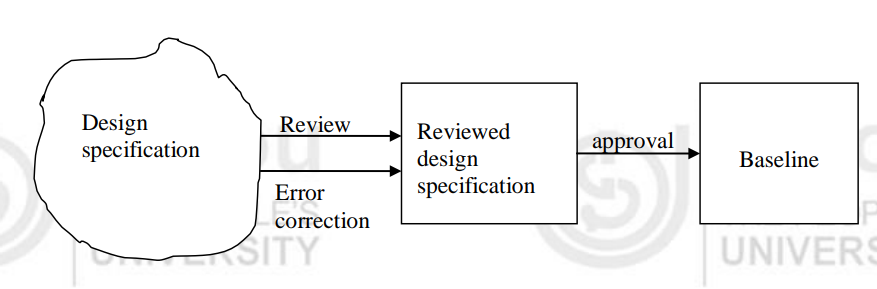

<!-- TOC start (generated with https://github.com/derlin/bitdowntoc) -->

- [Software Change Management](#software-change-management)
  - [Overview](#overview)
    - [Baselines](#baselines)
    - [Evolution of Baselines](#evolution-of-baselines)
    - [Software Change Management Process](#software-change-management-process)
    - [Process of Changes](#process-of-changes)
  - [Version Control](#version-control)
    - [Overview](#overview-1)
    - [Evolutionary Graph](#evolutionary-graph)
    - [Managing Versions](#managing-versions)
    - [Version Control Process](#version-control-process)
    - [Revision Control Example](#revision-control-example)
  - [Change Control](#change-control)
    - [Overview](#overview-2)
    - [Change Control Process](#change-control-process)
    - [Implementation of Changes](#implementation-of-changes)
    - [Types of Change Control](#types-of-change-control)
  - [Auditing and Reporting](#auditing-and-reporting)
    - [Auditing](#auditing)
    - [Reporting](#reporting)
  - [Check Your Progress-1](#check-your-progress-1)
  - [Check Your Progress-2](#check-your-progress-2)
  - [Check Your Progress-3](#check-your-progress-3)

<!-- TOC end -->

<!-- TOC --><a name="software-change-management"></a>
# Software Change Management

<!-- TOC --><a name="overview"></a>
## Overview
- **Definition**: Umbrella activity to maintain software product integrity amidst inevitable changes.
- **Challenge**: Managing changes in complex, geographically distributed environments.
- **Importance**: Ensures regulatory compliance and standards adherence.

<!-- TOC --><a name="baselines"></a>
### Baselines
- **Software Configuration Item (SCI)**: Part of development/deliverable system (e.g., source code, test plans).
- **Definition**: Approved SCI reviewed and finalized, serves as reference for future changes.
- **Purpose**: Basis for development; changes go through formal change control procedures.
- **Example**: Design specification baseline



<!-- TOC --><a name="evolution-of-baselines"></a>
### Evolution of Baselines
- **Functionality**: Baseline is functionally complete with documented features.
- **Quality**: Baseline undergoes formal testing and reviews.
- **Recreation**: Baseline can be recreated as needed.
- **Evolution**: Baselines evolve through approved changes

<!-- TOC --><a name="software-change-management-process"></a>
### Software Change Management Process
- **Complexity**: Managed in complex, distributed environments with multiple versions and technologies.
- **Objectives**:
  1. **Configuration Identification**: Naming and versioning components.
  2. **Configuration Control**: Controlling changes and releases.
  3. **Review**: Ensuring consistency among configuration items.
  4. **Status Accounting**: Recording and reporting changes.
  5. **Auditing and Reporting**: Validating and maintaining consistency.

<!-- TOC --><a name="process-of-changes"></a>
### Process of Changes
- **Reference**: Baseline serves as reference for any change.
- **Modification**: Changes are copied to developer's private area.
- **Locking**: Baseline is locked during modification to prevent inconsistency.
- **Tracking**: Changes are tracked and recorded in a status accounting file.
- **Approval**: Approved changes update the original baseline (Figure 8.3).

<!-- TOC --><a name="version-control"></a>
## Version Control

<!-- TOC --><a name="overview-1"></a>
### Overview
- **Definition**: Manages revisions of the same item during software development.
- **Example**: System Requirement Specification (SRS) evolves through versions.
- **Identification**: Hierarchical naming (e.g., Project identifier, Configuration item, Version number).

<!-- TOC --><a name="evolutionary-graph"></a>
### Evolutionary Graph
- **Purpose**: Tracks history and changes over time.
- **Example**: Ver 1.0 → Ver 1.1 → Ver 1.2 → Ver 2.0.

<!-- TOC --><a name="managing-versions"></a>
### Managing Versions
- **Purpose**: Ensures traceability and maintenance of configuration items.
- **Tools**: Rational ClearCase, Microsoft Visual SourceSafe, etc.
- **Functions**: Source code control, revision control, concurrent version control.

<!-- TOC --><a name="version-control-process"></a>
### Version Control Process
- **Usage**: Tracks source code, documentation, and configuration items.
- **Check-out**: Copies baseline version for modification.
- **Check-in**: Updates modified version back to project database.
- **Example**: HTML file revisions (welcome.htm).

<!-- TOC --><a name="revision-control-example"></a>
### Revision Control Example
- **Scenario**: Modifying HTML file (welcome.htm).
- **Steps**:
  - Register initial version (1.0).
  - Check-out for modification.
  - Add new content (e.g., email link).
  - Check-in as version 1.1.
  - Add graphic (version 1.2).
- **Version Tree**: Illustrates evolution and changes.


<!-- TOC --><a name="change-control"></a>
## Change Control

<!-- TOC --><a name="overview-2"></a>
### Overview
- **Purpose**: Manage justified changes in software development without compromising product integrity.
- **Formal Process**: Essential in large software environments to prevent uncontrolled changes.
- **Initiation**: Change requests can arise from users or stakeholders during maintenance or development phases.

<!-- TOC --><a name="change-control-process"></a>
### Change Control Process
- **Change Request**
  - **Format**:
    - **Identification**: Name, description, version numbers of affected configuration items.
    - **Requester**: Contact details of change requester.
    - **Date/Time**: Timestamp of change request.
  - **Description**: Detailed explanation of requested change.
    - **Background**: Context and reasons for change.
    - **Examples**: Supporting information, screenshots, error reports.
    - **Change Details**: Specifics of the change requested.
  - **Justification**: Detailed rationale behind the change request.
  - **Priority**: Importance of the change to system functionality.

- **Change Report**
  - **Format**:
    - **Identification**: Name, description, version numbers of affected configuration items.
    - **Requester**: Contact details of requester.
    - **Evaluator**: Name of evaluating team or person.
    - **Date/Time**: Timestamp of change report.
  - **Overview of Changes**: Summary of modifications required.
    - **Change Categorization**: Type of change (e.g., bug fix, enhancement).
    - **Scope**: Extent and impact of proposed changes.
    - **Technical Work Required**: Tools and resources needed.
    - **Technical Risks**: Potential risks associated with changes.
  - **Cost Assessment**: Estimation of time and resources needed.
  - **Recommendation**: Evaluation team’s recommendation and internal priority.

- **Engineering Change Order (ECO)**
  - **Format**:
    - **Identification**: Name, description, version numbers of affected configuration items.
    - **Requester**: Name of requester.
    - **Evaluator**: Name of evaluating team or person.
  - **Description of Change**:
    - **Affected Configurations**: Specific items to be modified.
    - **Scope of Change**: Extent and details of modifications.
    - **Technical Work and Tools Required**: Tools/resources needed for implementation.
    - **Technical Risks**: Risks associated with implementing changes.
  - **Testing and Validation Requirements**:
    - **Review Plan**: Procedures for technical reviews.
    - **Test Plan**: Testing procedures and new tests required post-change.

<!-- TOC --><a name="implementation-of-changes"></a>
### Implementation of Changes
- **Identification**: Baseline versions of configuration items copied from project database.
- **Incorporation**: Changes made to copied versions, subject to review (audit) before testing.
- **Approval**: Approved changes result in new version generation for distribution.

<!-- TOC --><a name="types-of-change-control"></a>
### Types of Change Control
- **Formal vs. Informal**: Baseline items follow formal change control; non-baseline items may use informal methods.

<!-- TOC --><a name="auditing-and-reporting"></a>
## Auditing and Reporting

<!-- TOC --><a name="auditing"></a>
### Auditing
- **Purpose**: Ensure proper implementation of changes without adverse impacts.
- **Formal Reviews**:
  - **Formal Technical Review (FTR)**: Technical correctness of changes reviewed.
  - **Software Configuration Audit**: Broader parameters (e.g., documentation, standards) checked.

<!-- TOC --><a name="reporting"></a>
### Reporting
- **Status Reporting**:
  - **Purpose**: Tracks changes leading to each new version of an item.
  - **Content**: Includes changes made, responsible personnel, dates, effects, and reasons.

Ex:
```
# Title : Sub routine Insert to Employee Data
# Version : Ver 1.1.3
# Purpose : To insert employee data in the master file
# Author : John Wright
# Date : 23/10/2001
# Auditor : J Waltson
# Modification History:
12/12/2002 : by D K N
To fix bugs discovered in the first release
4/5/2003 : by S K G
to allow validation in date of birth data
6/6/2004 : by S S P
To add error checking module as requested by the customer
```

<!-- TOC --><a name="check-your-progress-1"></a>
## Check Your Progress-1
1) ________________serves as reference for any change.
2) What is the aim of software change management process?

<!-- TOC --><a name="check-your-progress-2"></a>
## Check Your Progress-2
1) ________________is an example of source code control tool.
2) Version control mechanism allows multiple versions of an item to be maintained
at the same time. (Yes/No)
3) How do version control systems ensure that two software developers do not
attempt the same change at the same time?

<!-- TOC --><a name="check-your-progress-3"></a>
## Check Your Progress-3
1) Who decides the acceptance of a change request?.
2) How auditing is different from a Formal Technical Review (FTR)?