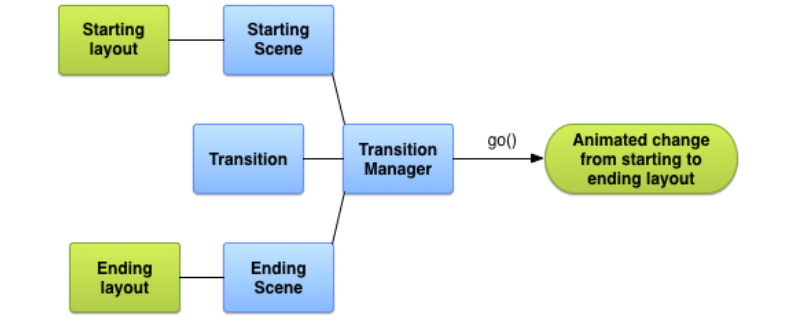

<!-- TOC start (generated with https://github.com/derlin/bitdowntoc) -->

- [MOBILE SOFTWARE ENGINEERING](#mobile-software-engineering)
  - [Transition from Design to Coding of Mobile Applications](#transition-from-design-to-coding-of-mobile-applications)
    - [Creating a Transition](#creating-a-transition)
    - [Transition Using Wireframes](#transition-using-wireframes)
    - [Prototyping Mobile UI Animations](#prototyping-mobile-ui-animations)
    - [Application Wireframing Features](#application-wireframing-features)
    - [Importance of UI/UX](#importance-of-uiux)
    - [Animated Transitions](#animated-transitions)
    - [Transition Framework Features](#transition-framework-features)
    - [Basic Process to Animate Between Layouts](#basic-process-to-animate-between-layouts)
  - [Scenes in Android](#scenes-in-android)
  - [Overview](#overview)
  - [Creating Scenes](#creating-scenes)
    - [From Layout Resource File](#from-layout-resource-file)
    - [Define Layouts for Scenes](#define-layouts-for-scenes)
    - [Generate Scenes from Layouts](#generate-scenes-from-layouts)
    - [Create a Scene in Your Code](#create-a-scene-in-your-code)
    - [Create Scene Actions](#create-scene-actions)
  - [Apply a Transition](#apply-a-transition)
    - [Transition Lifecycle](#transition-lifecycle)
    - [Supported Transitions](#supported-transitions)
  - [Using Android Wireframes Effectively](#using-android-wireframes-effectively)
  - [Benefits of Using Wireframes](#benefits-of-using-wireframes)
  - [Elements of Mobile Applications](#elements-of-mobile-applications)
    - [1. Product Strategy](#1-product-strategy)
    - [2. Understanding Application Needs](#2-understanding-application-needs)
    - [3. User Interface Design (UI)](#3-user-interface-design-ui)
    - [4. Screen Resolution](#4-screen-resolution)
    - [5. Graphics](#5-graphics)
    - [6. User Experience Design (UX)](#6-user-experience-design-ux)
    - [7. Performance (Speed)](#7-performance-speed)
    - [8. User-Friendly Navigation](#8-user-friendly-navigation)
    - [9. Application Content](#9-application-content)
    - [10. Mobile Device Performance](#10-mobile-device-performance)
    - [11. Social Sharing Option](#11-social-sharing-option)
    - [12. Security](#12-security)
    - [13. Power Consumption](#13-power-consumption)
    - [14. Compatibility](#14-compatibility)
    - [15. Simplicity](#15-simplicity)
    - [16. Offline Functionality](#16-offline-functionality)
    - [17. High Performance](#17-high-performance)
    - [18. Feedback Option](#18-feedback-option)
    - [19. Regular Updates](#19-regular-updates)
    - [20. Marketing](#20-marketing)
  - [Approaches to the Development of Mobile Applications](#approaches-to-the-development-of-mobile-applications)
    - [Types of Mobile Development Approaches](#types-of-mobile-development-approaches)
    - [Choosing the Right Approach](#choosing-the-right-approach)
    - [Native Application Development](#native-application-development)
      - [Prime Reasons to Choose Native Mobile App Development](#prime-reasons-to-choose-native-mobile-app-development)
      - [Advantages of Native Application Development](#advantages-of-native-application-development)
    - [Native iOS Application Development Stack](#native-ios-application-development-stack)
      - [Objective-C](#objective-c)
      - [Swift](#swift)
    - [Toolset: AppCode and Xcode](#toolset-appcode-and-xcode)
      - [AppCode](#appcode)
      - [Xcode](#xcode)
    - [Android Application Development Stack](#android-application-development-stack)
      - [Kotlin](#kotlin)
      - [Java](#java)
    - [Toolset: Android Studio and Eclipse](#toolset-android-studio-and-eclipse)
      - [Eclipse](#eclipse)
      - [Android Studio](#android-studio)
    - [Cross-Platform Application Development](#cross-platform-application-development)
    - [Hybrid Application Development](#hybrid-application-development)
    - [Rapid Mobile Application Development (RMAD)](#rapid-mobile-application-development-rmad)
    - [Progressive Web Applications (PWAs)](#progressive-web-applications-pwas)
  - [Check Your Progress-1](#check-your-progress-1)
  - [Check Your Progress-2](#check-your-progress-2)
  - [Check Your Progress-3](#check-your-progress-3)

<!-- TOC end -->

<!-- TOC -->
# MOBILE SOFTWARE ENGINEERING

<!-- TOC -->
## Transition from Design to Coding of Mobile Applications

***Transition***
    - **Definition:** Manages animations during scene changes.
    - **Main Jobs:** 
    1. Capture property values.
    2. Play animations based on changes to captured property values.
    - **Custom Transition:** 
    - Knows relevant property values on view objects.
    - Animates changes to those values.

<!-- TOC -->
### Creating a Transition
- Define starting and ending scenes.
- Create a `Transition` object for animation.
- Use built-in transitions either via resource file or directly in code.

<!-- TOC -->
### Transition Using Wireframes
- **Purpose:** Demonstrate functionalities, user interactions, and screen flows.
- **Benefit:** Minimizes upfront development effort and cost.
- **Android Wireframes:** Screen sketches to present and explain design ideas to customers.
- **Goal:** Reach consensus on design transitioning into proposed application.

<!-- TOC -->
### Prototyping Mobile UI Animations
- **Purpose:** Guide users through the mobile application experience.
- **Key Points:**
  - Animations should be relevant and purposeful.
  - Enhance user experience and conversion goals.
  - Include effects like sliding, flipping, turning, popping, fading, folding, dropping, bouncing.

<!-- TOC -->
### Application Wireframing Features
- **Benefits:**
  - Speed up the wireframing process.
  - Get real feedback from user testing.
  - Accelerate innovation and avoid rework.
  - Launch the right app.

<!-- TOC -->
### Importance of UI/UX
- **Critical for Success:**
  - Exceptional UI/UX needed alongside perfect backend code.
  - UI/UX and visuals can make apps an instant hit or cause them to be ignored.
- **UI vs. UX:**
  - **UI (User Interface):** Visuals and graphics.
  - **UX (User Experience):** User retention and experience.
  - UI is a subset of UX.
  
<!-- TOC -->
### Animated Transitions
- **Impact:** Difference between a great app and a mediocre one.
- **Role:** 
  - Make UI elements visible/invisible.
  - Contribute to a seamless user experience.

<!-- TOC -->
### Transition Framework Features
- **Animate Layout Changes:**
  - Provide starting and ending layout.
  - Choose animation type (e.g., fade, change view sizes).
- **Group-level Animations:** Apply effects to all views in a hierarchy.
- **Built-in Animations:** Use predefined effects (e.g., fade out, movement).
- **Resource File Support:** Load hierarchies and animations from layout resource files.
- **Lifecycle Callbacks:** Control over animation and hierarchy changes.

<!-- TOC -->
### Basic Process to Animate Between Layouts
1. Create a `Scene` object for starting and ending layouts.
   - Starting layout often determined automatically.
2. Create a `Transition` object to define the animation type.
3. Call `TransitionManager.go()`.
4. System runs the animation to swap layouts.

<!-- TOC -->
## Scenes in Android

<!-- TOC -->
## Overview
- **Scenes**: Store the state of a view hierarchy, including all its views and property values.
- **Transitions Framework**: Runs animations between a starting and an ending scene.

<!-- TOC -->
## Creating Scenes
<!-- TOC -->
### From Layout Resource File
- **Usage**: Suitable for static view hierarchies.
- **Process**:
  - Retrieve the scene root as a `ViewGroup` instance.
  - Use `Scene.getSceneForLayout()` with the scene root and the layout file resource ID.

<!-- TOC -->
### Define Layouts for Scenes
- **Example Layouts**:
  - Main layout with a text label and a child layout.
  - First scene: Relative layout with two text fields.
  - Second scene: Relative layout with the same two text fields in a different order.
- **Note**: Animation occurs within the child layout; the text label in the main layout remains static.

<!-- TOC -->
### Generate Scenes from Layouts
- Obtain a scene for each layout using the scene root and layout resource ID.

<!-- TOC -->
### Create a Scene in Your Code
- **Usage**: Modify view hierarchies directly in code or generate them dynamically.
- **Process**: Use the `Scene(sceneRoot, viewHierarchy)` constructor.

<!-- TOC -->
### Create Scene Actions
- **Custom Scene Actions**: Define custom actions to run when entering or exiting a scene.
  - **Use Cases**:
    - Animate views not in the same hierarchy.
    - Animate views the transitions framework cannot animate automatically.
  - **Implementation**: Define actions as `Runnable` objects and pass them to `Scene.setExitAction()` or `Scene.setEnterAction()`.

<!-- TOC -->
## Apply a Transition
- **Transition Object**: Represents the style of animation between scenes.
  - **Built-in Subclasses**: `AutoTransition`, `Fade`, etc.
  - **Process**: Run animation between scenes using `TransitionManager.go(endScene, transition)`.

<!-- TOC -->
### Transition Lifecycle
- **Enter Transition**: Determines how views enter the scene.
- **Exit Transition**: Determines how views exit the scene.
- **Shared Elements Transition**: Determines how shared views transition between activities.

<!-- TOC -->
### Supported Transitions
- **Enter and Exit Transitions**:
  - `explode`: Moves views in or out from the center.
  - `slide`: Moves views in or out from one of the edges.
  - `fade`: Changes the opacity of a view.
- **Shared Elements Transitions**:
  - `changeBounds`: Animates layout bounds changes.
  - `changeClipBounds`: Animates clip bounds changes.
  - `changeTransform`: Animates scale and rotation changes.
  - `changeImageTransform`: Animates size and scale changes.

<!-- TOC -->
## Using Android Wireframes Effectively
- **Purpose**: Clarify user interface, consider usability early, engage clients, cost-efficient.
- **Tips**:
  - Keep wireframes simple and quick to produce.
  - Use placeholders or dummy text to avoid distractions.
  - Annotate elements and behaviors only when necessary.
- **Tools**:
  - **State**: Create child wireframes based on an existing one.
  - **Storyboard**: Present screen flow of a scenario.
  - **User Story Management**: Record user concerns and requirements, include wireframes in scenarios.

<!-- TOC -->
## Benefits of Using Wireframes
1. Clarify user interface.
2. Early consideration of usability.
3. Engaged clients.
4. Cost-efficient: Easy to create, edit, and inexpensive for basic screen sketches.

<!-- TOC -->
## Elements of Mobile Applications

<!-- TOC -->
### 1. Product Strategy
- Essential for aligning business goals with application development.
- Prioritize features that bring measurable business value.

<!-- TOC -->
### 2. Understanding Application Needs
- Define the scope clearly based on business priorities.
- Ensure the application addresses critical aspects of the business.

<!-- TOC -->
### 3. User Interface Design (UI)
- Focus on usability and intuitive design.
- Design UI to enhance user experience (UX).

<!-- TOC -->
### 4. Screen Resolution
- Consider different device screen sizes and resolutions.
- Adhere to technical guidelines for optimal display.

<!-- TOC -->
### 5. Graphics
- Importance of appealing visuals for user engagement.
- Ensure compatibility across various screen sizes.

<!-- TOC -->
### 6. User Experience Design (UX)
- Create positive interactions and emotional connections.
- Design intuitive and interactive features.

<!-- TOC -->
### 7. Performance (Speed)
- Optimize application speed to enhance user satisfaction.
- Ensure minimal loading times and smooth operation.

<!-- TOC -->
### 8. User-Friendly Navigation
- Simplify navigation for ease of use.
- Avoid complex interfaces to improve usability.

<!-- TOC -->
### 9. Application Content
- Provide clear and concise information.
- Avoid keyword stuffing and focus on relevance.

<!-- TOC -->
### 10. Mobile Device Performance
- Optimize application size to conserve device resources.
- Minimize battery and processor usage for efficient operation.

<!-- TOC -->
### 11. Social Sharing Option
- Integrate social media sharing for user engagement.
- Leverage social sharing to increase application visibility.

<!-- TOC -->
### 12. Security
- Prioritize user data protection and application security.
- Implement robust encryption and secure protocols.

<!-- TOC -->
### 13. Power Consumption
- Optimize app resources to conserve battery life.
- Minimize background processes that drain power.

<!-- TOC -->
### 14. Compatibility
- Ensure compatibility with different OS versions.
- Update features to match platform advancements.

<!-- TOC -->
### 15. Simplicity
- Emphasize simplicity in design and functionality.
- Improve user adoption with intuitive interfaces.

<!-- TOC -->
### 16. Offline Functionality
- Enable offline access to enhance usability.
- Cater to users in areas with limited connectivity.

<!-- TOC -->
### 17. High Performance
- Ensure consistent and reliable application performance.
- Address performance issues promptly to retain users.

<!-- TOC -->
### 18. Feedback Option
- Provide channels for user feedback and reviews.
- Use feedback to improve application features.

<!-- TOC -->
### 19. Regular Updates
- Release updates to add new features and enhancements.
- Maintain application relevance and user engagement.

<!-- TOC -->
### 20. Marketing
- Implement effective marketing strategies to promote the app.
- Increase visibility and attract a broader audience.

<!-- TOC -->
## Approaches to the Development of Mobile Applications

<!-- TOC -->
### Types of Mobile Development Approaches
1. Native Application Development
2. Cross-Platform Application Development
3. Hybrid Application Development
4. Rapid Mobile Application Development (RMAD)
5. Progressive Web Applications (PWAs)

<!-- TOC -->
### Choosing the Right Approach
- Define the purpose of the mobile application based on target audience needs.
- Estimate project timeline, financial, and technical resources.
- Choose the most favorable development approach.

<!-- TOC -->
### Native Application Development
- **Definition:** Uses platform-specific programming languages, SDKs, and development environments.
- **Features:** Developed separately for each platform with different technology stacks.
- **Benefits:** Higher performance and responsiveness, supports all platform features.

<!-- TOC -->
#### Prime Reasons to Choose Native Mobile App Development
1. Access to Complete Device Features
2. Scalability
3. Offline Performance
4. Stability
5. Cost

<!-- TOC -->
#### Advantages of Native Application Development
- Best performance
- Platform-specific UI implementation
- 100% support of OS features
- Total access to hardware-related features
- Clear application update path and supported toolset
- Highly reliable, secure, and responsive

<!-- TOC -->
### Native iOS Application Development Stack
- **Programming Languages:** Objective-C and Swift

<!-- TOC -->
#### Objective-C
- High-level, object-oriented language modeled like C.
- Used for complex projects and software engineering challenges.
- **Advantages:**
  - Works with C++
  - Well-tested and recommended
  - Expressive message syntax
  - Simple and effective use of private APIs
  - Multiple third-party libraries
  - Large community support

<!-- TOC -->
#### Swift
- Multi-purpose and multi-paradigm language.
- **Advantages:**
  - Open-source
  - Code less prone to error
  - Dynamic libraries
  - Simplifies development and maintenance
  - Enhances code reusability and readability
  - Multi-feature, fast, and compatible with Objective-C
  - Supports Cocoa Touch frameworks and Apple’s Cocoa
  - Multi-device support
  - Community support

<!-- TOC -->
### Toolset: AppCode and Xcode

<!-- TOC -->
#### AppCode
- Fast coding alternative to Xcode.
- Supports multiple programming languages.
- Drawback: Can only design interfaces with written code.

<!-- TOC -->
#### Xcode
- Official IDE of Apple.
- Supports mobile and desktop application development.
- Features: User interface development, gaming applications, Git repositories, documentation, debugging tools, graphical editor.
- Supports multiple programming languages.

<!-- TOC -->
### Android Application Development Stack
- **Programming Languages:** Java and Kotlin

<!-- TOC -->
#### Kotlin
- Recent, object-oriented, open-source language.
- Interoperable with Java.
- **Advantages:**
  - Runs on multi-platform
  - Concise and secure code
  - Supports higher-order functions
  - Big community support
  - Easy code maintenance

<!-- TOC -->
#### Java
- Widely used class-based, object-oriented language.
- Ideal for mobile and web applications, Big Data.
- **Advantages:**
  - Highly secure
  - Great network capability
  - Portable and scalable code
  - Automatic memory management
  - Robust and easy to compile
  - Rich open-source tools and libraries

<!-- TOC -->
### Toolset: Android Studio and Eclipse

<!-- TOC -->
#### Eclipse
- Free, open-source SDK.
- Originated from IBM, primarily coded in Java.
- Extendable with plug-ins.

<!-- TOC -->
#### Android Studio
- Google’s integrated development environment.
- Features: Code editing, performance tooling, debugging, flexible development, immediate build/deploy system.
- Works with multiple PC operating systems.

<!-- TOC -->
### Cross-Platform Application Development
- **Definition:** Applications that can run on different platforms using languages and tools different from native toolsets.
- **Advantages:**
  - Uniformity across platforms
  - Effective budget control
  - Easy implementation
  - Simultaneous publishing
  - Reusable source code
  - High demographic coverage
  - Fast time to market

<!-- TOC -->
### Hybrid Application Development
- **Definition:** Blend of native and web applications.
- **Features:** Developed using standard web technologies (JavaScript, CSS, HTML5) within a native shell.
- **Advantages:**
  - Single development team
  - Short time to market
  - Easy portability of code
  - Capable use of hardware components
  - Native-like user experience
  - Lower development cost
  - Works online and offline

<!-- TOC -->
### Rapid Mobile Application Development (RMAD)
- **Definition:** Develops cross-platform applications quickly using code-free or low-code tools.
- **Platforms:** Examples include Alpha Software, MobileFrame, MobileSmith.
- **Advantages:**
  - Secure
  - Works online and offline
  - Good backend data integration
  - Cross-platform support
  - Code-free development
  - Requires little developer experience
  - Reusable components
  - Low production cost

<!-- TOC -->
### Progressive Web Applications (PWAs)
- **Definition:** Native app-like web applications using HTML.
- **Advantages:**
  - Easy application maintenance
  - Single codebase
  - Mobile-friendly UI
  - No need for application stores
  - Works online and offline

<!-- TOC -->
## Check Your Progress-1
1. Transition holds _________ that will be run on its targets during a scene change. 

<!-- TOC -->
## Check Your Progress-2
1. Write few elements of mobile application development?
2. What is user friendly navigation?

<!-- TOC -->
## Check Your Progress-3
1. Which application development is the use of platform-specific programming languages?
2. Which approach can be used to run application the on different platforms?
3. Which application Development approach is used to develop cross-platform applications in a short time?