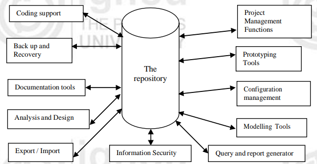
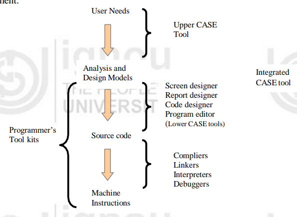

<!-- TOC start (generated with https://github.com/derlin/bitdowntoc) -->

- [CASE TOOLS](#case-tools)
  - [Introduction](#introduction)
  - [What are CASE Tools?](#what-are-case-tools)
    - [CASE Tools Functions](#case-tools-functions)
    - [Benefits of CASE Tools](#benefits-of-case-tools)
    - [Types of CASE Tools](#types-of-case-tools)
    - [Essential Features of CASE Tools](#essential-features-of-case-tools)
    - [Categories of CASE Tools](#categories-of-case-tools)
    - [Need for CASE Tools](#need-for-case-tools)
    - [Limitations of CASE Tools](#limitations-of-case-tools)
    - [Deployment Factors for CASE Tools](#deployment-factors-for-case-tools)
    - [Characteristics of Successful CASE Tools](#characteristics-of-successful-case-tools)
  - [CASE SOFTWARE DEVELOPMENT ENVIRONMENT](#case-software-development-environment)
    - [Features of CASE Tools for Software Development](#features-of-case-tools-for-software-development)
    - [Major Features Supported by CASE Development Environment](#major-features-supported-by-case-development-environment)
    - [CASE Tools and Web Engineering](#case-tools-and-web-engineering)
  - [CASE TOOLS AND REQUIREMENT ENGINEERING](#case-tools-and-requirement-engineering)
    - [Common Source of Risk in Software Development](#common-source-of-risk-in-software-development)
    - [Effective Requirements Engineering with CASE Tools](#effective-requirements-engineering-with-case-tools)
    - [Four-Step Requirements Engineering Process](#four-step-requirements-engineering-process)
    - [Requirement Elicitation](#requirement-elicitation)
    - [Software Analysis and Specification](#software-analysis-and-specification)
    - [Validation of Requirements](#validation-of-requirements)
    - [Managing Requirements](#managing-requirements)
    - [Software Change Management](#software-change-management)
  - [CASE TOOLS AND DESIGN AND IMPLEMENTATION](#case-tools-and-design-and-implementation)
    - [Support for Analysis and Design Phases](#support-for-analysis-and-design-phases)
    - [Modeling Tools](#modeling-tools)
    - [Characteristics of Good Modeling Tools](#characteristics-of-good-modeling-tools)
    - [CASE Repository](#case-repository)
    - [Implementation Tools and CASE](#implementation-tools-and-case)
  - [SOFTWARE TESTING](#software-testing)
    - [Features Needed for Testing](#features-needed-for-testing)
  - [Software Quality and CASE Tools](#software-quality-and-case-tools)
  - [Software Configuration Management](#software-configuration-management)
  - [Software Project Management and CASE Tools](#software-project-management-and-case-tools)
  - [Check Your Progress-1](#check-your-progress-1)
  - [Check Your Progress-2](#check-your-progress-2)
  - [Check Your Progress-3](#check-your-progress-3)

<!-- TOC end -->

<!-- TOC -->
# CASE TOOLS

<!-- TOC -->
## Introduction

Software Engineering is associated with developing quality software using standards and guidelines. Software is the most expensive item in a computer system, costing more than 95% of the total cost (including hardware). Given the extensive data collection and information generation required, automating software engineering tasks using CASE (Computer Aided Software Engineering) tools is beneficial. CASE tools support various phases of the Software Development Life Cycle (SDLC).

<!-- TOC -->
## What are CASE Tools?

CASE tools support collaborative software development and maintenance, aiding almost all SDLC phases and umbrella activities like project management and configuration management. They support standard methods like Jackson Structure Programming and Structured System Analysis and Design Method.

<!-- TOC -->
### CASE Tools Functions
- **Development Steps for Database Applications:**
  - Creation of data flow and entity models.
  - Establishing a relationship between requirements and models.
  - Development of top-level design.
  - Development of functional and process description.
  - Development of test cases.
  
- **Automatic Generation:**
  - Data base tables.
  - Forms and reports.
  - User documentation.

<!-- TOC -->
### Benefits of CASE Tools
- Support contemporary software development.
- Automate SDLC using standard methods.
- Minimize repetitive work.
- Allow developers to focus on creative problem-solving.
- Improve documentation, testing, project management, and software maintenance quality.

<!-- TOC -->
### Types of CASE Tools
- **Analysis Tools**
- **Repository:** Store all diagrams, forms, models, and report definitions.
- **Diagramming Tools**
- **Screen and Report Generators**
- **Code Generators**
- **Documentation Generators**
- **Reverse Engineering Tools:** Take source code as input to produce graphical and textual program design-level information.
- **Re-engineering Tools:** Take source code as input to improve quality and performance.

<!-- TOC -->
### Essential Features of CASE Tools
- **Security:** Information visible/changeable by authorized users only.
- **Version Control:** For various products.
- **Import/Export Utility:** Compatible with external resources.
- **Backup and Recovery:** Protects precious data.

<!-- TOC -->
### Categories of CASE Tools

- **Upper CASE Tools:** Focus on analysis and design phases, including tools for analysis modeling, reports, and forms generation.
- **Lower CASE Tools:** Support system implementation, including tools for coding and configuration management.
- **Integrated CASE Tools:** Link lower and upper CASE tools, creating a cohesive software development environment.

<!-- TOC -->
### Need for CASE Tools

- **Reduce Cost:** Automate repetitive manual tasks.
- **Reduce Development Time:** Support standardization, avoid repetition, and promote reuse.
- **Develop Better Quality Projects:** Provide consistency and coordination.
- **Create Good Quality Documentation**
- **Maintainable Systems:** Control configuration items supporting traceability requirements.

<!-- TOC -->
### Limitations of CASE Tools

- Cannot automatically develop functionally relevant systems.
- Cannot force system analysts to follow a prescribed methodology.
- Cannot change the system analysis and design process.
- Complex functionality.
- Cannot solve all project management problems.

<!-- TOC -->
### Deployment Factors for CASE Tools

- **Training:** Users must be trained in the CASE environment and its benefits.
- **Compulsory Use:** Developers should initially use CASE tools.
- **Methodology Closeness:** Should align with the Software Development Life Cycle.
- **Compatibility:** Must be compatible with other development platforms used in the organization.
- **Vendor Support:** Low-cost support, ease of use, good graphic support, and multiple user support.
- **Reverse Engineering Support:** Should handle complex reverse engineering tasks.

<!-- TOC -->
### Characteristics of Successful CASE Tools

- **Standard Methodology:** Support standard software development methodologies and modeling techniques like UML.
- **Flexibility:** Offer flexible editors and development environments.
- **Strong Integration:** Changes in one stage should reflect in related design and documentation.
- **Integration with Testing Software:** Interface with automatic testing tools.
- **Support for Reverse Engineering:** Generate models from existing code.
- **Online Help:** Provide online tutorials.

<!-- TOC -->
## CASE SOFTWARE DEVELOPMENT ENVIRONMENT

<!-- TOC -->
### Features of CASE Tools for Software Development
- Creating software requirements specifications
- Creation of design specifications
- Creation of cross references
- Verifying/Analysing the relationship between requirement and design
- Performing project and configuration management
- Building system prototypes
- Containing code and accompanying documents
- Validation and verification, interfacing with external environment

<!-- TOC -->
### Major Features Supported by CASE Development Environment
- Strong visual support
- Prediction and reporting of errors
- Generation of content repository
- Support for structured methodology
- Integration of various life cycle stages
- Consistent information transfer across SDLC stages
- Automating coding/prototype generation

<!-- TOC -->
### CASE Tools and Web Engineering
- Useful in the design, development, and implementation of website development
- Categories of tools:
  - Site content management tools
  - Site version control tools
  - Server management tool
  - Site optimisation tools
  - Web authoring and deployment tools
  - Site testing tools (load and performance testing)
  - Link checkers
  - Program checkers
  - Web security test tools

<!-- TOC -->
## CASE TOOLS AND REQUIREMENT ENGINEERING

<!-- TOC -->
### Common Source of Risk in Software Development
- Major risk: ability to successfully elicit requirements to get a solution
- 80% of rework in projects due to requirement defects

<!-- TOC -->
### Effective Requirements Engineering with CASE Tools
- Features needed:
  - Dynamic, rich editing environment for team members
  - Centralised repository
  - Task-driven workflow for change management and defect tracking

<!-- TOC -->
### Four-Step Requirements Engineering Process
1. Requirement Elicitation
2. Requirement Management
3. Requirement Specification
4. Requirement Validation

<!-- TOC -->
### Requirement Elicitation
- Techniques:
  - Asking “WHY”
- Features of CASE tools for elicitation:
  - Reusable requirements and design templates
  - Tracking important system attributes (performance, security)
  - Common vocabulary of user-defined terms
  - Assessment of quality of requirements
  - Separate glossary for ambiguous terms

<!-- TOC -->
### Software Analysis and Specification
- Documenting requirements to remove ambiguity
- Features of CASE tools for specification:
  - Storing and documenting requirements
  - Creating models critical to functional requirements
  - Developing test cases to verify requirements
  - Labeling requirements for traceability

<!-- TOC -->
### Validation of Requirements
- Features:
  - Collaboration and customizable workflows
  - Facilitating approvals and electronic signatures
  - Assigning owner of requirements
  - Prioritised, validated, documented, and approved requirements

<!-- TOC -->
### Managing Requirements
- Features of CASE tools:
  - Estimation of efforts and cost
  - Specification of project schedule and constraints
  - Specification of quality parameters

<!-- TOC -->
### Software Change Management
- Early detection of incomplete or ambiguous requirements
- Features:
  - Tracking software requirements and associated models/documents
  - Determining components impacted by changes
  - Labeling requirements for traceability
  - Storing requirement baselines, including type, status, priority, and change history

<!-- TOC -->
## CASE TOOLS AND DESIGN AND IMPLEMENTATION

<!-- TOC -->
### Support for Analysis and Design Phases
- Tools supported:
  - Structured Chart
  - Program Document Language (PDL)
  - Optimisation of ER and other models
  - Flow charts
  - Database design tools
  - File design tools

<!-- TOC -->
### Modeling Tools
- Advantages of modeling:
  - Enhances communication (more pictorial, less code)
  - Reduces project cost
  - Conveys broad spectrum of information

<!-- TOC -->
### Characteristics of Good Modeling Tools
- Continuous synchronization of models and code
- Management of source code through visual models
- Refactoring of code
- Facilitating reverse engineering

<!-- TOC -->
### CASE Repository
- Content:
  - Data
  - Process
  - Models
  - Rules/Constraints
- Segments:
  - Information repository
  - Data dictionary

<!-- TOC -->
### Implementation Tools and CASE
- Features:
  - Visual representation of system and components
  - Representing process flows
  - Implementing data and program structures
  - Automatic creation of system forms and reports
  - Ready prototype generation
  - Creating technical and user documentation
  - Generating program and database from design documents

<!-- TOC -->
## SOFTWARE TESTING

<!-- TOC -->
### Features Needed for Testing
- Support for all testing phases (plan, manage, execute)
- Integration with third-party testing tools
- Local and remote test execution
- Establishing and managing traceability
- Creating log of test runs
- Outputting meaningful reports on test completeness and analysis
- Automated testing

<!-- TOC -->
## Software Quality and CASE Tools

- **Software Quality Importance**: Good quality enhances speed, reduces costs, and allows for easier enhancements. Poor quality leads to higher maintenance costs.
- **Role of CASE Tools**:
  - Support standard methodologies and processes in software development.
  - Aid in change management and visual modeling for continuous quality assurance.
  - Ensure quality across all phases: analysis, design, development, testing, and deployment.
- **Analysis Phase**:
  - Helps in reflecting and resolving system requirements clearly and accurately.
  - Supports requirements analysis and modeling, improving requirement quality.
- **Design Phase**:
  - Detects and resolves structural deficiencies early.
  - Helps in testing software architecture.
- **Testing Phase**:
  - Integrates functionality and performance testing.
  - Supports automated testing tools for improved reliability.
- **Deployment Phase**:
  - Facilitates operational deployment with configuration management support.
- **Teamwork and Quality**: Integrates workflow, enhances traceability, and improves communication through shared workload documents.

<!-- TOC -->
## Software Configuration Management

- **Importance of SCM**: Controls software deployment, integrates with automated solutions for efficient release management.
- **Features of SCM**:
  - Automatic version control, access control, and software rebuild.
  - Build audit and maintenance capabilities.
  - Supports distributed deployment across global networks.

<!-- TOC -->
## Software Project Management and CASE Tools

- **Collaborative Development**: Emphasizes team-based development for complex and critical systems.
- **Features of CASE Tools in Project Management**:
  - Secure project sharing with user authentication.
  - Document linking and versioning with revision labels.
  - Task management, change request tracking, and milestone monitoring.
  - Reporting capabilities and automatic notifications.
  - Supports scheduling with PERT and Gantt charts, network usability, and task management.

<!-- TOC -->
## Check Your Progress-1
1. What is the need of CASE tools?
2. What are the important characteristics of CASE tools?

<!-- TOC -->
## Check Your Progress-2
1. List any four tools that are used in web software engineering but are not used in general software projects.
2. Which of the requirements engineering processes is not supported by CASE tools?
3. List any four major requirements of a design tool.
4. List four important features of a testing tool.

<!-- TOC -->
## Check Your Progress-3
1. How do CASE tools support quality?
2. What is the role of CASE in software configuration management?
3. Can CASE tools result in perfect project management?