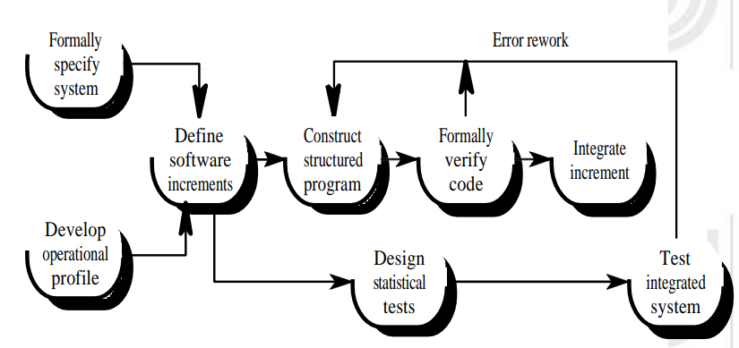
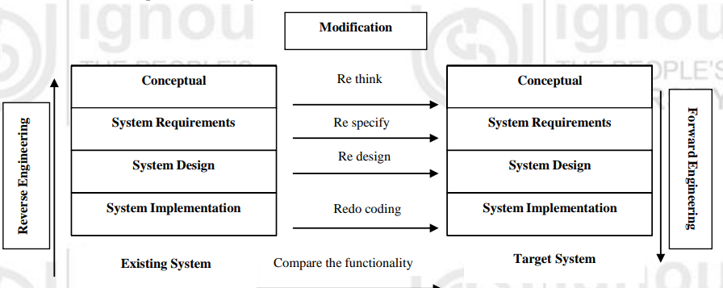

# ADVANCED TOPICS IN SOFTWARE ENGINEERING

## INTRODUCTION
- **Formality Spectrum**:
  - Conventional software engineering methods are categorized by their formality.
  - Methods discussed previously are informal to moderately rigorous.
  - Use diagrams, text, tables, and simple notation.

- **Formal Methods**:
  - Completely mathematical in form.
  - Specification and design described using formal syntax and semantics.
  - Focus on system function and behavior.

- **Specialized Models**:
  - Cleanroom software engineering
  - Component-based software engineering
  - Re-engineering
  - Reverse engineering

- **Cleanroom Software Engineering**:
  - Developed by Harlan Mills.
  - Integrates formal methods, structured programming, Statistical Process Control (SPC), spiral lifecycle, incremental releases, inspections, and software reliability modeling.
  - Emphasizes defect prevention over defect removal.

- **Systematic Reuse**:
  - Software engineers are adopting systematic reuse for better quality, quicker, and lower-cost software.
  - Component-based software engineering is one model.

## EVOLUTION OF FORMAL METHODS
- **1970s Structured Programming Revolution**:
  - Better programs result from following certain precepts in program design.
  - Imperative programming languages support structured programming.

- **Continuous Change in Software Development**:
  - New concepts: top-down development, modular decomposition, data abstraction, object-oriented design.
  - Core ideas from formal methods underpin these changes.

- **Improving Software Quality**:
  - Change documentation methods: at design stage, during development, and after release.
  - Formal methods produce precise, unambiguous documentation.

- **Mathematical Basis**:
  - Formal methods add precision, aid understanding, and reason about design properties.
  - Existing applications: probability theory in performance modeling, context-free grammars in compiler design, relational calculus in database theory.

## USE OF MATHEMATICS IN SOFTWARE DEVELOPMENT
- **Mathematics Supports Abstraction**:
  - Exact mathematical specifications are unambiguous.
  - Validate specifications for functionality.

- **Application in Software Development**:
  - Requirements, design, coding phases.
  - Influences programming languages, specification and design methodology.

- **Key Mathematical Topics**:
  - Formal logic (propositional and predicate calculus), set theory, formal languages, automata (finite state machines).

## FORMAL METHODS
- **Definition**:
  - Provides a formal language for describing software artifacts (e.g., specifications, designs, source code).
  - Enables formal proofs about properties of the artifact.

- **Components**:
  - Formal language: set of strings over a well-defined alphabet.
  - Formal reasoning: formal proofs using axioms and inference rules.

- **Major Concerns**:
  - Correctness of the problem.
  - Programs as mathematical objects: formal language, semantics, and theories.

- **Specification Methods and Languages**:
  - Methods: what a specification must say.
  - Languages: how concepts in a specification are expressed.

- **Common Formal Methods**:
  - Z (Zed)
  - Communicating Sequential Processes (CSP)
  - Vienna Development Method (VDM)
  - Larch
  - Formal Development Methodology (FDM)

### WHAT CAN BE FORMALLY SPECIFIED?
- **Graphical Languages**:
  - Data Flow Diagrams (DFDs) and Petri nets.

- **Levels of Abstraction**:
  - Specifications describe what a system should do.
  - Designs and source code provide more detailed models.

### GOALS OF FORMAL SPECIFICATION
- **Removal of Ambiguity**:
  - Formal syntax eliminates ambiguity.
  - Encourages rigour in early stages of software engineering.

- **Consistency**:
  - Mathematically prove consistency of specifications.

- **Completeness**:
  - Difficult to achieve, some aspects may be left undefined.

### APPLICATION AREAS
- **Areas of Use**:
  - Safety-critical systems
  - Security systems
  - Standards definition
  - Hardware development
  - Operating systems
  - Transaction processing systems
  - Complex or critical systems

### LIMITATIONS OF FORMAL SPECIFICATION USING FORMAL METHODS
- **Problems**:
  - Focus on function and data, difficult to represent timing, control, and behavioral aspects.
  - Human-machine interface better specified using graphical techniques.
  - Formal methods are difficult to learn.

- **Drawbacks**:
  - **Cost**: Full formal specification can be costly. Only specify critical subsystems.
  - **Complexity**: Not everyone can read formal specifications. Provide detailed documentation.
  - **Deficiencies of Less Formal Approaches**:
    - Contradictions, ambiguities, vagueness, incomplete statements, mixed levels of abstraction.

- **Popular in Safety-Critical Software**:
  - Aircraft avionics, medical devices.
  - Less applicable in business environments.

## Cleanroom Software Engineering

Cleanroom software engineering is an engineering and managerial process for developing high-quality software with certified reliability. It was originally developed by Dr. Harlan Mills. The term “Cleanroom” reflects the emphasis on defect prevention and certification of reliability for the intended environment.

### Key Attributes
- **Correct by mathematically sound design**
- **Certified by statistically valid testing**
- **Reduced cycle time** from incremental development and avoidance of rework
- **Well-documented**
- **Early error detection**, reducing development costs and failure incidence

### Principles
1. **Incremental development under Statistical Quality Control (SQC)**
   - Each increment is a complete iteration.
   - Performance measures are compared to pre-established standards.
   - If quality standards are not met, testing ceases and developers return to design.
   
2. **Software development based on mathematical principles**
   - Programs are expressions of mathematical functions.
   - The Box Structure Method is used for specification and design.
   - Functional verification confirms design correctness.
   - No code execution before independent testing.
   
3. **Software testing based on statistical principles**
   - Testing is viewed as a statistical experiment.
   - Performance of a subset is used to draw conclusions about general performance.
   - Statistically valid statements about reliability and confidence can be made.

### Comparison with Conventional Models
- **Team Size**: Small teams of 6-8 qualified professionals.
- **Time Allocation**: More time spent in the design phase.
- **Integration with Existing Practices**: Can be gradually implemented and tuned to local culture.

### Example Projects
- IBM COBOL/SF product
- Ericsson OS-32 operating system project
- USAF Space Command and Control Architectural Infrastructure (SCAI)
- US Army Cleanroom project at the Picatinny Arsenal

### Cleanroom Development Process
1. **Increment Planning**: Project plan is built around incremental strategy.
2. **Requirements Gathering**: Elicit and refine customer requirements for each increment.
3. **Formal Design**: Use of Box structures for specification and design.
4. **Code Generation, Inspection, Verification**: Translate box structures into code; ensure conformance and correctness.
5. **Statistical Test Planning**: Create test cases matching the projected usage pattern.
6. **Correctness Verification**: Team reviews based on correctness questions.
7. **Statistical Use Testing**: Use a statistical sample of test cases.
8. **Certification**: Once verification and testing are complete, the increment is certified.

### Limitations
- Perceived as too theoretical and mathematical for real development.
- Relies on correctness verification and statistical quality control instead of unit testing.
- Rigorous processes required, making it challenging for organizations at an ad hoc level of the Capability Maturity Model.

### Similarities and Differences with OO Paradigm
#### Similarities
- Both rely on incremental development.
- Cleanroom usage model is similar to OO use cases.
- State box in Cleanroom is similar to OO transition diagram.
- Both emphasize reuse.

#### Differences
- Cleanroom relies on decomposition; OO relies on composition.
- Cleanroom uses formal methods; OO allows informal use case definition and testing.
- OO inheritance hierarchy is a design resource; Cleanroom usage hierarchy is the system itself.

## Software Reuse and Its Types

To adopt systematic reuse as a design process, it's essential to understand the different types of software reuse. Here are the main categories:

### Types of Software Reuse

#### Application System Reuse
- **Commercial Off-The-Shelf (COTS) Reuse:** Incorporating one application inside another by reusing an entire application.
- **Development of Application Families:** Creating families of applications, like MS Office, where various applications share common features and code.

#### Component Reuse
- **Component-Based Software Engineering (CBSE):**
  - **Example Analogy:** Imagine you have purchased a Television. Each component is designed to fit a specific architectural style with standardized connections and a pre-established communication protocol. Assembly is straightforward because you don’t need to build the system from scratch. Similarly, CBSE aims to achieve this in software engineering. Pre-built, standardized software components are available to fit a specific architectural style for some application domains. The application is then assembled using these components rather than conventional programming language "discrete parts."

#### Function Reuse
- **Subsystems or Single Objects:** Reusing components of one application in another.
- **Single Well-Defined Function Components:** Reusing software components that implement a single well-defined function.

## Why Component-Based Software Engineering (CBSE)?

The goal of CBSE is to increase productivity and quality while decreasing time-to-market in software development. This approach involves:
- Building software systems from standard components rather than creating everything from scratch.
- Thinking in terms of system families rather than single systems.
- Applying software engineering principles similar to Object-Oriented Programming (OOP) but to the whole process of designing and constructing software systems.
- Focusing on reusing and adapting existing components.

## Software Component and Its Types

A software component is a nontrivial, independent, and replaceable part of a system that fulfills a clear function in the context of a well-defined architecture. Components can be characterized based on their use in the CBSE process:

- **Commercial Off-The-Shelf (COTS) Components:** Pre-built components that can be purchased. They usually don't come with source code and rely on the manufacturer’s specifications.
- **Qualified Components**
- **Adapted Components**
- **Assembled Components**
- **Updated Components**

## CBSE Process

The CBSE process is similar to conventional or object-oriented software engineering but focuses on component reuse:

1. **Domain Engineering:** Identifying, constructing, cataloging, and disseminating software components for existing and future software in a particular application domain.
2. **Component-Based Development:** Involving three stages:
   - **Qualification:** Examining reusable components by their interfaces, services provided, and compatibility with the system's architecture.
   - **Adaptation (Wrapping):** Modifying components to resolve incompatibilities, which can be done through:
     - **White Box Wrapping:** Direct modification of the component's implementation (if source code is available).
     - **Grey Box Wrapping:** Using a component extension language or API to remove conflicts.
     - **Black Box Wrapping:** Pre/post-processing at the interface level when source code is unavailable.
   - **Composition:** Integrating qualified, adapted, or engineered components into a working system using an established infrastructure.

### Challenges for CBSE

CBSE faces various challenges, including:
- Ensuring dependability in safety-critical and real-time systems.
- Providing adequate tool support for component selection, evaluation, repositories, testing, and configuration.
- Ensuring trusted components, especially when delivered in binary form.
- Establishing component certification standards.
- Achieving composition predictability for system attributes.
- Managing requirements and component selection effectively.
- Long-term management of component-based systems.
- Developing comprehensive development models.
- Handling complex component configurations.

## Reengineering

Reengineering is crucial for adapting legacy systems to new requirements and technologies. The process involves:

1. **Reverse Engineering:** Extracting design and requirements from existing system code.
2. **Forward Engineering:** Developing the replacement system based on the extracted information.

### Objectives of Reengineering

- **Improve Quality:** Enhance software reliability, maintainability, and documentation.
- **Migration:** Update software to newer platforms or languages while preserving functionality.

### Software Reengineering Life Cycle

The life cycle involves several phases:

1. **Requirements Analysis Phase:** Identifying concrete reengineering goals and violations to be repaired.
2. **Model Analysis Phase:** Documenting and understanding the architecture and functionality of the legacy system.
3. **Source Code Analysis Phase:** Identifying parts of the code responsible for requirement violations.
4. **Remediation Phase:** Selecting target software structures to repair defects.
5. **Transformation Phase:** Physically transforming software structures according to remediation strategies.
6. **Evaluation Phase:** Assessing the new system and establishing its compliance with quality requirements.

## Check Your Progress-1
1. What are Formal methods?
2. What are the main parts of the Formal methods?

## Check Your Progress-2
1. What is Cleanroom Engineering and what are its objectives?
2. What is Statistical Process Control?
3. What are the benefits of Cleanroom software engineering?
4. What are the limitations of Cleanroom software engineering?

## Check Your Progress-3
1. What are the benefits of reuse of software?
2. What is Commercial off the Shelf Software (COTS)?

## Check Your Progress-4
1. What is Software Reengineering and what are its objectives?
2. What is Reverse Engineering?
