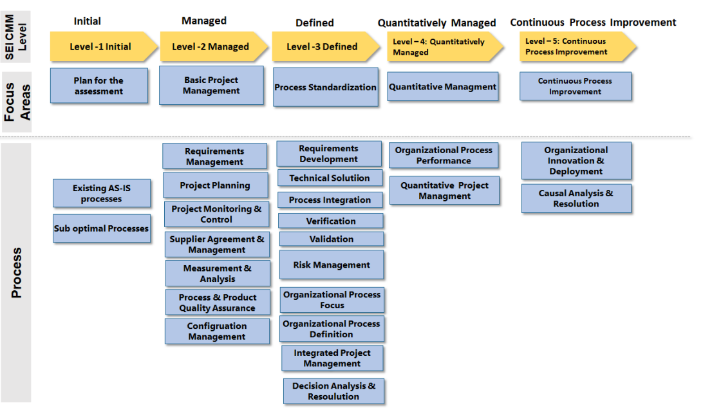

# Software Process Improvement

## Software Engineering Institute Capability Maturity Model Integrated (SEI-CMMI)

- The Capability Maturity Model developed by SEI in 1987 is a tool used to improve and refine software development processes.
- It provides a structured way for organizations to assess their current practices and identify areas for improvement.
- CMM consists of five levels:
  1. Initial
  2. Managed
  3. Defined
  4. Qunatitatively Managed
  5. Continuous Process Improvement

- **Level 1** is *initital*: The as is or present stage of the organization.
- **Level 2** is *managed*:
  - The key focus area is *basic project management*.
  - At this stage, the processes related to requirements management, project planning, project monitoring, supplier agreement, and measurement, process and product quality assurance and configuration management are optimized and improved.
- **Level 3** is *defined*:
  - The key focus area is *standardization*.
  - The processes related to requirements development, technical solution, process integration, verification, validation, risk management, organizational process focus, organizational process definition, and integrated project management and decision analysis are standardiized.
- **Level 4** is *qunatitatively managed*.
  - The key focus area is *quantitative management*
  - The aim is to optimize the processes such as organizational process performance and quantitative project management.
- **Level 5** is *continuous process improvement*.
  - The key forcus area is *continuous process improvement*
  - The focus is on iteratively improving the organizational processes such as organizational innovation and deployment and causal analysis and resolution.

## Software Process Optimization Through First Time Right Framework

### Key Components of FTR framework 
