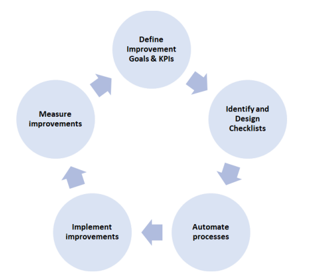
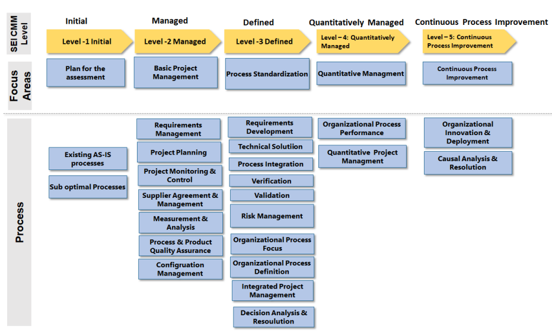
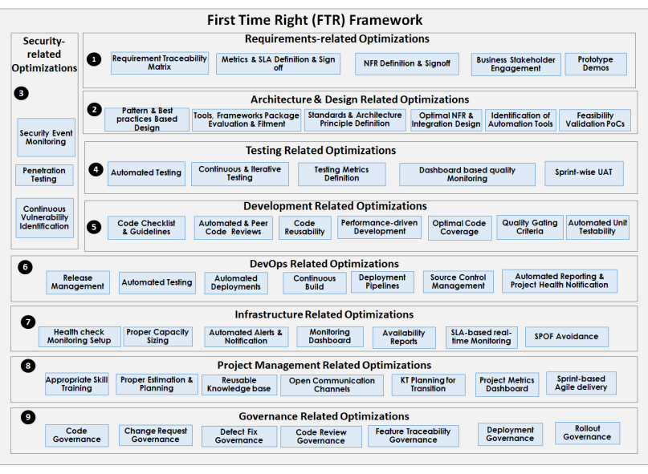

<!-- TOC start (generated with https://github.com/derlin/bitdowntoc) -->

- [Software Process Improvement](#software-process-improvement)
  - [Introduction](#introduction)
    - [Continuous Improvement Process](#continuous-improvement-process)
  - [SEI CMMi (Software Engineering Institute Capability Maturity Model Integrated)](#sei-cmmi-software-engineering-institute-capability-maturity-model-integrated)
    - [Advantages of SEI CMMi Model](#advantages-of-sei-cmmi-model)
    - [SEI CMMi Levels](#sei-cmmi-levels)
  - [Software Process Optimization Through First Time Right Framework](#software-process-optimization-through-first-time-right-framework)
    - [FTR Framework](#ftr-framework)
      - [1. Requirements Related Optimizations](#1-requirements-related-optimizations)
      - [2. Architecture and Design Related Optimizations](#2-architecture-and-design-related-optimizations)
      - [3. Security Related Optimizations](#3-security-related-optimizations)
      - [4. Testing Related Optimizations](#4-testing-related-optimizations)
      - [5. Development Related Optimizations](#5-development-related-optimizations)
      - [6. DevOps Related Optimizations](#6-devops-related-optimizations)
      - [7. Infrastructure Related Optimizations](#7-infrastructure-related-optimizations)
      - [8. Project Management Related Optimizations](#8-project-management-related-optimizations)
      - [9. Governance Related Optimizations](#9-governance-related-optimizations)
      - [10. Tools](#10-tools)
  - [Performance Testing and Monitoring](#performance-testing-and-monitoring)
    - [Performance Testing Tools](#performance-testing-tools)
      - [Table 13.2: Performance Testing Tools](#table-132-performance-testing-tools)
    - [Performance Monitoring and Notification](#performance-monitoring-and-notification)
      - [Core Monitoring Capabilities](#core-monitoring-capabilities)
      - [Application Server Monitoring Capabilities](#application-server-monitoring-capabilities)
      - [Reporting Dashboard](#reporting-dashboard)
      - [Reporting](#reporting)
    - [Performance Monitoring Tools](#performance-monitoring-tools)
      - [Table 13.3: Performance Testing Tools](#table-133-performance-testing-tools)
  - [SEI CMMi Process Examples](#sei-cmmi-process-examples)
    - [Requirements Development](#requirements-development)
      - [Key Focus Areas](#key-focus-areas)
      - [Methods for Process Standardization](#methods-for-process-standardization)
    - [Technical Solution](#technical-solution)
      - [Key Focus Areas](#key-focus-areas-1)
      - [Methods for Process Standardization](#methods-for-process-standardization-1)
    - [Requirements Management](#requirements-management)
      - [Key Focus Areas](#key-focus-areas-2)
      - [Methods for Basic Project Management](#methods-for-basic-project-management)
    - [Product Integration](#product-integration)
      - [Key Focus Areas](#key-focus-areas-3)
      - [Methods for Process Standardization](#methods-for-process-standardization-2)
    - [Project Planning](#project-planning)
      - [Key Focus Areas](#key-focus-areas-4)
      - [Methods for Basic Project Management](#methods-for-basic-project-management-1)
  - [Check Your Progress-1](#check-your-progress-1)
  - [Check Your Progress-2](#check-your-progress-2)

<!-- TOC end -->

<!-- TOC -->
# Software Process Improvement

<!-- TOC -->
## Introduction

The process of Software Engineering is undergoing rapid changes due to factors such as cloud platforms, tools, open-source frameworks, and AI-driven automation. To mitigate the high risk in software projects, it is essential to adopt best practices and continuously improve software engineering processes.

This unit discusses improvements and optimizations for software engineering processes.

<!-- TOC -->
### Continuous Improvement Process

The continuous improvement process involves:

1. Defining main improvement goals and KPIs aligned with the business vision.
2. Identifying design checklists, naming conventions, tools, frameworks, methods, etc.
3. Automating processes and implementing planned improvements.
4. Measuring improvements and iteratively fine-tuning.

<!-- TOC -->
## SEI CMMi (Software Engineering Institute Capability Maturity Model Integrated)

The SEI CMMi is a process improvement model developed by the Software Engineering Institute at Carnegie Mellon University. It integrates software engineering processes, assesses maturity levels, and covers technical, physical, and functional aspects of the system. The SEI CMMi model provides phase-wise steps for each level, defining capabilities, focus areas, process areas, and maturity needs.

<!-- TOC -->
### Advantages of SEI CMMi Model

- Improves software engineering processes using best practices.
- Applies proven processes and methods.
- Standardizes and benchmarks processes.
- Ensures quality deliverables.
- Assesses organizational maturity and process capability readiness.
- Compares organizations using maturity levels.
- Mitigates risks by following proven methods.

<!-- TOC -->
### SEI CMMi Levels

- **Level 1: Initial (As-Is Stage)**
- **Level 2: Managed** - Focus on basic project management. Optimize processes like requirements management, project planning, monitoring, supplier agreement, measurement, quality assurance, and configuration management.
- **Level 3: Defined** - Standardize processes related to requirements development, technical solution, process integration, verification, validation, risk management, organizational process focus, organizational process definition, integrated project management, and decision analysis.
- **Level 4: Quantitatively Managed** - Focus on quantitative management. Optimize organizational process performance and quantitative project management.
- **Level 5: Continuous Process Improvement** - Focus on iteratively improving processes like organizational innovation and deployment, and causal analysis and resolution.

<!-- TOC -->
## Software Process Optimization Through First Time Right Framework

The First Time Right (FTR) framework incorporates best practices at various phases of the software engineering lifecycle (SDLC), including requirements gathering, architecture and design, testing, DevOps, infrastructure, project management, and governance.

<!-- TOC -->
### FTR Framework

<!-- TOC -->
#### 1. Requirements Related Optimizations

- **Requirement Traceability Matrix**: Maps each use case/story to the corresponding test case, code artifact, and release details.
- **Metrics and SLA Definition and Sign-Off**: Quantify functional and non-functional requirements with accurate metrics and SLAs.
- **NFR Definition and Sign-Off**: Define and sign off on all non-functional requirements (security, performance, scalability, accessibility, etc.).
- **Business Stakeholder Engagement**: Actively engage stakeholders throughout the requirements phase.
- **Prototype Demos**: Prepare mockups/prototypes iteratively for feedback.
- **Design Thinking Approach**: Use a design thinking approach to define optimal solutions iteratively.

<!-- TOC -->
#### 2. Architecture and Design Related Optimizations

- **Patterns and Best Practices Based Design**: Identify application architecture patterns, best practices, and design patterns.
- **Tools, Frameworks, Package Evaluation, and Fitment**: Evaluate products, frameworks, and libraries that fit the requirements.
- **Standards and Architecture Principles Definition**: Define applicable standards and principles for the solution.
- **Optimal NFR and Integration Design**: Design the application to meet specified NFRs and integration SLAs.
- **Identification of Automation Tools**: Identify automation tools for the project.
- **Feasibility Validation PoCs**: Conduct proof-of-concepts for complex requirements to finalize tools, technologies, integration methods, performance, scalability, etc.

<!-- TOC -->
#### 3. Security Related Optimizations

On the security front, continuous monitoring and auditing for critical security events such as failed login attempts, password changes, and role modifications are essential. Establishing a notification infrastructure to alert on such events is crucial. Additionally, iterative penetration testing and vulnerability testing should be conducted to identify security vulnerabilities early in the development process.

<!-- TOC -->
#### 4. Testing Related Optimizations

Comprehensive validation is critical for delivering high-quality software. Key optimizations for the validation team include:

- **Automated Testing:** Utilize tools like Apache JMeter or Selenium to automate regression and functional testing scenarios.
- **Continuous Iterative Testing:** Implement continuous and iterative testing across all sprints to detect defects early.
- **Testing Metrics Definition:** Define quality metrics such as defect rate, density, and slippage rate, and monitor them via dashboard-based quality monitoring.
- **Sprint-wise Early UAT:** Involve business stakeholders in each sprint's User Acceptance Testing (UAT) to uncover and address business-related gaps early.

<!-- TOC -->
#### 5. Development Related Optimizations

The development team plays a crucial role in achieving first-time-right deliverables. Key optimizations include:

- **Code Checklist and Guidelines:** Implement coding best practices, naming conventions, and checklists covering language-specific practices, performance, security, and design.
- **Automated and Peer Review Process:** Utilize automated static code analyzers (e.g., PMD, SonarQube) and conduct peer reviews to ensure code quality.
- **Code Reusability:** Actively explore and implement code reusability through libraries, modules, and open-source options.
- **Performance-Driven Development:** Conduct performance testing early and integrate performance considerations throughout development.
- **Optimal Code Coverage:** Ensure unit tests achieve over 90% code coverage and utilize automated tools for test case generation.
- **Quality Gating Criteria:** Establish multi-level code quality criteria including developer-level adherence, automated local and integrated code reviews.

<!-- TOC -->
#### 6. DevOps Related Optimizations

DevOps optimizations focus on enhancing delivery and release processes:

- **Release Management:** Automate release management processes.
- **Automated Testing and Deployment:** Configure automated unit and functional testing, as well as deployment pipelines using tools like Jenkins.
- **Continuous Build and Deployment Pipelines:** Implement continuous integration/delivery (CI/CD) practices.
- **Source Control Management:** Define and enforce processes for source control management, pull requests, and code merges.

<!-- TOC -->
#### 7. Infrastructure Related Optimizations

Optimizations for efficient infrastructure management include:

- **Health Check Monitoring Setup:** Establish proactive health monitoring to ensure server availability.
- **Proper Capacity Sizing and Disaster Recovery:** Size server and network capacities based on load and non-functional requirements, and implement disaster recovery measures.
- **Automated Alerts and Notification:** Configure alerts for SLA violations and critical infrastructure metrics.
- **Monitoring Dashboard and Availability Reports:** Utilize dashboards for real-time monitoring and generate on-demand reports.
- **SLA-Based Real-Time Monitoring:** Implement real-time monitoring across geographies to track performance and availability.
- **Avoiding Single Point of Failure (SPOF):** Ensure high availability through clustering, redundancy, and disaster recovery setups.

<!-- TOC -->
#### 8. Project Management Related Optimizations

Project management optimizations focus on process efficiency and stakeholder communication:

- **Skill Training and Staffing:** Provide relevant training and maintain a balanced skill set in the team.
- **Proper Estimation and Risk Management:** Estimate efforts accurately and manage risks effectively.
- **Reusable Knowledge Base:** Maintain a centralized knowledge base for best practices, SOPs, and troubleshooting documents.
- **Open Communication Channels:** Establish open communication using tools like Slack or MS Teams.
- **Knowledge Transfer (KT) Planning:** Plan and execute proper knowledge transfer during transitions.
- **Project Metrics Dashboard:** Monitor project health metrics such as burn rate, defect count, and sprint performance.
- **Sprint-Based Agile Delivery:** Implement agile delivery practices to mitigate risks and incorporate early user feedback.

<!-- TOC -->
#### 9. Governance Related Optimizations

Governance optimizations ensure streamlined project processes and compliance:

- **Code Governance:** Define processes for code management including merging, versioning, and reviews.
- **Change Request Governance:** Manage scope changes with defined criteria and impact analysis.
- **Defect Fix Governance:** Prioritize and manage defects effectively.
- **Review and Feature Traceability Governance:** Establish processes for code review, approval, and requirement traceability.
- **Deployment and Rollout Governance:** Plan and execute deployments across geographies and features.

<!-- TOC -->
#### 10. Tools

A variety of tools can be used for implementing the FTR framework, categorized as follows:

| Tool Category | Open Source/Commercial Tool(s) |
| ------------- | ------------------------------ |
| Web Page Analysis tools | Yahoo YSlow, Google PageSpeed, HTTPWatch, Dynatrace AJAX Edition |
| Page Development tools | Firebug, Google Chrome Developer toolbar, Fiddler, HTTP Archive WEB PAGEiddle, CSSLint, JSLint, W3 CSS Validator, W3 HTML validator |
| Asset Merging and Minification tools | Yahoo UI (YUI) minifier, JSMini, JSCompress |
| Page Performance Testing tools | JMeter, LoadUI, Grinder, Selenium |
| Image Compression tools | PNGCrush, Smush It, Img min, JPEG Mini |
| Web Server Plugins | Mod_pageSpeed, mod_cache, mod_SPDY, mod_expiry, mod_gzip |
| Website Performance Testing | GTMetrix, Pingdom |
| Synthetic Monitoring | Web Page test, DynaTrace Synthetic monitoring |
| CDN | Akamai, CloudFlare, KeyCDN |
| Web Analytics | Google Web Analytics, Omniture, Piwik |
| CSS Optimization tools | CSS Sprites, SpriteMe, SpritePad |
| Bottleneck Analysis | WebProphet, WProf |
| Real User Monitoring (RUM) | New Relic, Dynatrace, Gomez |
| Network Analysis | Wireshark, Charles Proxy |
| Application Performance Monitoring (APM) | New Relic, DynaTrace Monitoring, Nagios |

---

<!-- TOC -->
## Performance Testing and Monitoring

<!-- TOC -->
### Performance Testing Tools

Given below are the key testing tools that can be used for web performance testing:

<!-- TOC -->
#### Table 13.2: Performance Testing Tools

| Category | Performance Testing Tools |
| --- | --- |
| **Web Page Testing** | Google Chrome Lighthouse, Google PageSpeed Insights |
| **Application Profiling** | Open Source: JProbe, Eclipse Profiler; Commercial: Jprofiler, OptimizeIt |
| **Load Testing** | Open Source: Apache JMeter, Grinder, Apache Bench, HTTPPerf; Commercial: HP LoadRunner, NeoLoad, BlazeMeter |
| **Service Testing** | LoadUI, SOAPUI |
| **Client Side Performance Testing** | [Webpagetest.org](https://www.webpagetest.org/) |
| **Real Time Web Performance Monitoring** | Open Source: Nagios, Hyperic – HQ, Perfmon, NMon; Commercial: HP SiteScope, Wily Introscope |
| **Application Performance Monitoring (APM)** | Dynatrace, AppDynamics, New Relic |
| **Mobile App Testing** | Appium, UI Automator |
| **Analysis Tools** | GC Analyzer, JVM Analyzer |

<!-- TOC -->
### Performance Monitoring and Notification

A robust monitoring and alerting setup should be able to capture system metrics (CPU, memory), log metrics (system logs, application logs), errors, performance, etc. The monitoring setup should be flexible to monitor various systems such as Linux OS, database servers, stand-alone servers, etc. The alert and notification setup should send notifications to various channels such as email, pager, incident management system, etc. Performance thresholds and resource utilization thresholds should trigger notifications.

A comprehensive monitoring tool should support these features:

<!-- TOC -->
#### Core Monitoring Capabilities
- Resource (CPU, Memory) monitoring
- Network (Router, Switch, and Firewall, etc.) Monitoring
- Server Monitoring
- Windows Event Log Monitoring
- Applications Monitoring
- Virtual instances

<!-- TOC -->
#### Application Server Monitoring Capabilities
- Database Monitoring
- Web Page, Web Server/ Web Services Monitoring
- Middle Ware Monitoring
- Custom Application Monitoring

<!-- TOC -->
#### Reporting Dashboard
- Business service management views
- Comprehensive dashboard
- Real-Time trends and availability of devices
- Events and Correlated Alarms

<!-- TOC -->
#### Reporting
- Standard daily, weekly, monthly, quarterly, and yearly reports

<!-- TOC -->
### Performance Monitoring Tools

Various open source and commercial tools can be used for performance monitoring. 

<!-- TOC -->
#### Table 13.3: Performance Testing Tools

| Monitoring Needs | Monitoring Tool |
| --- | --- |
| **System Monitoring (CPU, Memory, and Disk)** | Windows Performance Monitor (perfmon), NMon for AIX servers, System Activity Report (SAR) for UNIX systems, Node exporter for container pods |
| **File Monitoring** | Filebeat |
| **Network Monitoring, System Monitoring, and Infrastructure Monitoring** | Nagios, ELK (Elastic search, Logstash, and Kibana), Grinder, AppDynamics (Commercial), New Relic (Commercial), Zabbix ([https://www.zabbix.com/](https://www.zabbix.com/)) |
| **Statistics Dashboard and Visualizations** | Kibana, Grafana |
| **Alert and Monitoring Dashboard** | Prometheus & Grafana |
| **Search Engine** | Elasticsearch |
| **Synthetic Monitoring Tool** | DynaTrace (Commercial), Selenium, Lighthouse, Webpagetest.org |
| **Database Monitoring** | Automatic Workload Repository (AWR), Fluentd |
| **Log Monitoring** | Splunk, Fluentd |
| **Message Streaming** | Apache Kafka |
| **Notification** | Alert Manager |
| **Container Monitoring** | Node Exporter, Docker Stats, cAdvisor, Prometheus |
| **Web Page Monitoring (page size, page response time, number of requests, asset load time, etc.)** | Webpagetest.org, Site Speed ([https://www.sitespeed.io/](https://www.sitespeed.io/)), Google Page Speed Insights ([https://developers.google.com/speed/pagespeed/insights/](https://developers.google.com/speed/pagespeed/insights/)), Pingdom (Commercial), Silk Performance Manager (Commercial), Uptrends (Commercial), [https://web.dev/measure/](https://web.dev/measure/) |
| **Development Tools/Page Auditing** | Google Chrome Developer Tools, Test My Site ([https://www.thinkwithgoogle.com/feature/testmysite/](https://www.thinkwithgoogle.com/feature/testmysite/)), Google Chrome Lighthouse, HTTP Watch, [https://speedrank.app/en](https://speedrank.app/en), Fiddler, Firebug, Web Tracing Framework ([http://google.github.io/tracing-framework/](http://google.github.io/tracing-framework/)), Timeline Tool ([https://developers.google.com/web/tools/chrome-devtools/evaluate-performance/timeline-tool#profile-painting](https://developers.google.com/web/tools/chrome-devtools/evaluate-performance/timeline-tool#profile-painting)) |
| **Multi-Geo Web Performance Testing** | [https://performance.sucuri.net/](https://performance.sucuri.net/) |
| **Cloud Monitoring** | AWS CloudWatch |
| **Website Speed Test** | [https://tools.keycdn.com/speed](https://tools.keycdn.com/speed) |
| **Load Testing** | BlazeMeter, Apache JMeter |
| **Website Latency Test** | Ping Test ([https://tools.keycdn.com/ping](https://tools.keycdn.com/ping)) |
| **Real User Monitoring (RUM)** | New Relic, SpeedCurve ([https://speedcurve.com/](https://speedcurve.com/)), DynaTrace, Akamai mPulse (Commercial), AppDynamics (Commercial) |
| **Analyze Network Timings** | Resource Timing API ([https://developer.mozilla.org/en-US/docs/Web/API/Resource_Timing_API/Using_the_Resource_Timing_API](https://developer.mozilla.org/en-US/docs/Web/API/Resource_Timing_API/Using_the_Resource_Timing_API)), Network Information ([https://developer.mozilla.org/en-US/docs/Web/API/NetworkInformation](https://developer.mozilla.org/en-US/docs/Web/API/NetworkInformation)) |

<!-- TOC -->
## SEI CMMi Process Examples

<!-- TOC -->
### Requirements Development

This is part of level 3 "Defined" stage wherein the expectation is to thoroughly understand the requirements and develop the solution.

<!-- TOC -->
#### Key Focus Areas
- Understand the requirements from various perspectives (business, operations, performance) and document them.
- Thoroughly understand the integration requirements and related non-functional SLAs (security, performance, scalability, availability).
- Understand the exception scenarios for each requirement.

<!-- TOC -->
#### Methods for Process Standardization
- Design a comprehensive requirements gathering template to cover requirements from various dimensions.
- Elaborate user stories and document the exception flows.
- Define a bi-directional requirement traceability matrix to trace the requirements to their corresponding development artifacts.
- Validate requirements with stakeholders and obtain formal sign-off.
- Build quick prototypes to validate user experience-related requirements.

<!-- TOC -->
### Technical Solution

This is part of level 3 "Defined" stage wherein the expectation is to build the solution based on best practices and best-of-breed technologies.

<!-- TOC -->
#### Key Focus Areas
- Evaluation of alternate solution options and tools.
- Evaluate build, reuse, or buy decisions.
- Design and develop a scalable and high-performing solution.

<!-- TOC -->
#### Methods for Process Standardization
- Evaluate alternate solution options against defined criteria (cost, effort, performance).
- Elaborate detailed design and leverage best practices, recommended naming conventions, and use patterns.
- Use automated static code analyzers to ensure code quality.
- Develop unit test cases to ensure adequate code coverage.
- Document the code and provide a user guide.

<!-- TOC -->
### Requirements Management

This is part of level 2 "Managed" stage wherein the expectation is to manage the requirements and resolve any inconsistencies across various requirements.

<!-- TOC -->
#### Key Focus Areas
- Change management for the requirements.
- Identify inconsistencies among the requirements.
- Manage requirement changes and their impact.

<!-- TOC -->
#### Methods for Basic Project Management
- Leverage various methods such as prototyping, user journey mapping, interviews, focus group discussions, and storyboarding for gathering requirements.
- Define the change management process.
- Develop a bi-directional requirement traceability matrix to ensure proper implementation of requirements.

<!-- TOC -->
### Product Integration

This is part of level 3 "Defined" stage wherein the expectation is to provide optimal integration across various interfaces.

<!-- TOC -->
#### Key Focus Areas
- Identify all needed interfaces.
- Optimal assembly of product components.
- Define the integration SLAs.

<!-- TOC -->
#### Methods for Process Standardization
- Design and implement an integration specification document to specify all APIs, contracts, and exception scenarios.
- Test interfaces at various loads to understand performance and scalability.
- Handle exception scenarios such as timeouts and system down issues.

<!-- TOC -->
### Project Planning

This is part of level 2 "Managed" stage wherein the expectation is to define an accurate project plan for managing the project.

<!-- TOC -->
#### Key Focus Areas
- Accurate scope, effort, and time estimation.
- Accurate risk management.
- Appropriate stakeholder management.

<!-- TOC -->
#### Methods for Basic Project Management
- Use accurate estimates for proper project planning.
- Create a comprehensive project plan to cover risks, milestones, project metrics, dependencies, resources, acceptance criteria, training plan, escalation matrix, knowledge management plan, and others.
- Identify main business stakeholders for each department.
- Develop a comprehensive stakeholder management plan covering the following:

  - Map their roles, responsibilities, and ownership in the matrix.
  - Communicate key decisions and articulate impact for each stakeholder, highlighting the impact for their respective departments.
  - Address their concerns in separate spin-off meetings.
  - Take key stakeholders into confidence in the overall decision making.

<!-- TOC -->
## Check Your Progress-1

1. The focus of SEI CMMi level 2 is ____.
2. Requirements development is included in level ____.
3. The focus areas of level 3 of SEI CMMi is ____.
4. ______ maps each use case/Jira story to the corresponding test case.
5. ______ approach to empathize with the user and iteratively define the optimal solution exploring the alternatives.
6. We assess the feasibility of the tool/method through ______.

<!-- TOC -->
## Check Your Progress-2
1. _________ captures the system metrics (CPU, memory), log metrics (system logs, application logs), errors and performance. 
2. Splunk is one of the _______ tools 
3. ____________ traces the requirements to its corresponding development artifacts 
4. _________ specifies all the APIs, contracts and exception scenarios 
5. One of the tools to check the web site latency is ________