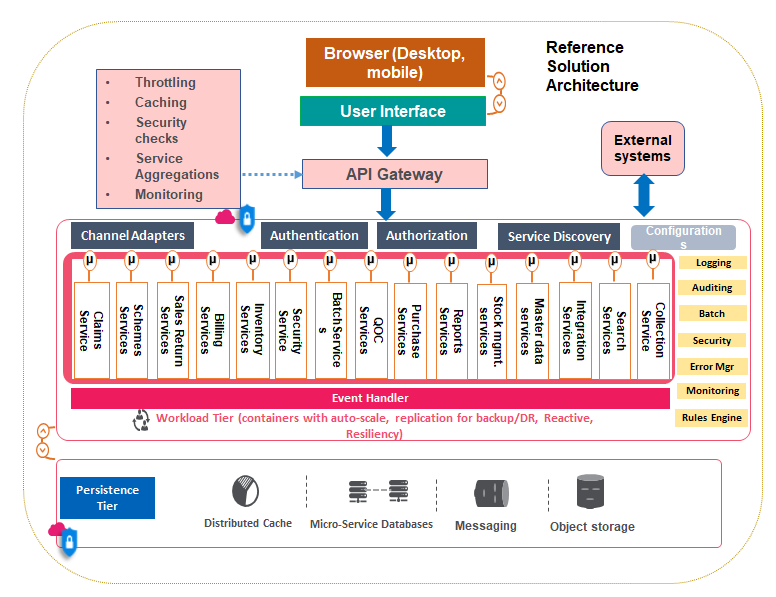

<!-- TOC start (generated with https://github.com/derlin/bitdowntoc) -->

- [Emerging Trends in Software Engineering](#emerging-trends-in-software-engineering)
  - [Introduction](#introduction)
  - [Drivers for Innovation](#drivers-for-innovation)
  - [Key Emerging Trends in Software Engineering](#key-emerging-trends-in-software-engineering)
  - [Architecture Brief Details of Emerging Trends](#architecture-brief-details-of-emerging-trends)
    - [Low Code and No Code Platforms (LCNC)](#low-code-and-no-code-platforms-lcnc)
    - [Artificial Intelligence (AI)](#artificial-intelligence-ai)
  - [Blockchain](#blockchain)
    - [Key Features](#key-features)
    - [Key Applications](#key-applications)
  - [Internet of Things (IoT)](#internet-of-things-iot)
    - [Key Components](#key-components)
    - [Advantages](#advantages)
  - [Augmented Reality/Extended Reality](#augmented-realityextended-reality)
    - [Key Applications](#key-applications-1)
  - [Containerization](#containerization)
    - [Key Features](#key-features-1)
    - [Advantages](#advantages-1)
  - [Continuous Delivery](#continuous-delivery)
    - [Continuous Integration (CI)](#continuous-integration-ci)
    - [Key Metrics](#key-metrics)
  - [Cloud Platforms](#cloud-platforms)
    - [Types of Cloud Services](#types-of-cloud-services)
    - [Advantages](#advantages-2)
  - [Big Data](#big-data)
    - [Key Attributes](#key-attributes)
    - [Key Scenarios](#key-scenarios)
  - [Software Development Methodologies](#software-development-methodologies)
    - [Approaches](#approaches)
  - [Other Emerging Trends](#other-emerging-trends)
    - [Serverless Computing](#serverless-computing)
    - [Cross Platform Development](#cross-platform-development)
    - [Conversational Interfaces](#conversational-interfaces)
  - [Check Your Progress-1](#check-your-progress-1)
  - [Check Your Progress-2](#check-your-progress-2)

<!-- TOC end -->

<!-- TOC -->
# Emerging Trends in Software Engineering

<!-- TOC -->
## Introduction

The field of Software Engineering is rapidly evolving. Innovations and changes are driven by:
- Productivity improvement
- Quality improvement
- Quick time to market
- Cost optimization
- High performance
- High availability
- High scalability

<!-- TOC -->
## Drivers for Innovation

Key drivers for software engineering innovations:
- **Productivity Improvement:** Methods like low-code/no-code, containerization, and cloud delivery models.
- **Quality Improvement:** Process innovations such as continuous improvement and agile delivery.
- **User Experience Improvement and User Engagement:** Technologies like AR, VR, AI, blockchain, and machine learning.
- **Automation:** AI and Machine Learning as key enablers.

<!-- TOC -->
## Key Emerging Trends in Software Engineering

Key emerging trends:
- **Low Code/No Code Development:** Enables minimal coding for solution development.
- **Artificial Intelligence (AI) and Machine Learning:** Analyzing data, detecting patterns, predicting trends.
- **Blockchain Technologies:** Secure, distributed record handling.
- **Internet of Things (IoT):** Tools to track and monitor devices.
- **Continuous Delivery:** Agile, iterative delivery with incremental features.
- **Cloud Platforms:** Redefines software building, deployment, and delivery.
- **Containerization:** Self-contained, portable deployment models.
- **Big Data Technologies:** Handling massive volumes of data with high performance and availability.
- **Augmented Reality (AR):** Enhances real-world objects with digital objects.
- **Emerging Delivery Methods:** Mobile-first, cloud-first, offline-first.
- **Other Trends:** Serverless functions, conversational applications, analytics, computer vision, service orchestration, SaaS, cross-platform development.

<!-- TOC -->
## Architecture Brief Details of Emerging Trends

<!-- TOC -->
### Low Code and No Code Platforms (LCNC)

LCNC platforms allow rapid building of user interfaces (UI), solution components, integrations with minimal code. Key features and advantages:
- **Features:**
  - Visual programming model
  - Pre-built integrators
  - Drag and drop features
  - Model-driven approach
  - Reusable pre-built components
  - Configurable solution components
- **Advantages:**
  - Faster time to market
  - Improved developer productivity
  - Enablement of business teams with minimal coding experience
  - Rapid development and deployment
  - Increased quality of the solution
  - Scalable application with reusable components
  - Quicker integration with enterprise systems
  - Business self-service model
  - Increased agility and responsiveness to market dynamics
  - Fast innovation with increased productivity

Examples of LCNC platforms:
- **Pega:** Visual tools for modeling enterprise business processes.
- **Salesforce Lightning Platform:** Automation tools for flows, mobile app development.
- **Microsoft Power Platform:** App building with pre-defined templates and easy connections.
- **Appian:** Drag-and-drop features for complex business processes.

<!-- TOC -->
### Artificial Intelligence (AI)

AI is the guiding force behind the automation revolution, helping machines perform intelligent and cognitive tasks. AI includes various disciplines and applications:
- **Disciplines:**
  - **Philosophy:** Logic, reasoning, learning foundations, language, rationality.
  - **Mathematics:** Probability, logic, algorithms, formal representation.
  - **Economics:** Game theory, decision theory.
  - **Linguistics:** Grammar, NLP, knowledge representation.
  - **Statistics:** Regression models, learning from data, modeling uncertainty.
  - **Neuroscience:** Neural networks, brain functioning.
  - **Psychology:** Behaviorism, cognitive psychology.
  - **Computer Science:** Programming, algorithms, design patterns, ML, grid computing.
  - **Control Theory:** System stability, optimal agent design, feedback adaptation.
- **Applications:**
  - **Autonomous Vehicles**
    - Self-driving cars and trucks
    - Tasks: Obstacle sensing, automatic navigation, autonomous planning, real-time sensor data processing, reasoning, and decision making

  - **Conversational Interface**
    - Chatbots and virtual assistants (e.g., Siri, Alexa)
    - Tasks: Booking appointments, route navigation, search, recommendations, activity planning, reminders

  - **Computer Vision**
    - Machines perceive images
    - Applications: Object recognition, face recognition, navigation, information extraction

  - **Robotics**
    - Commercial and industrial robots
    - Tasks: Car washing, floor cleaning, assembling parts, motion planning
    - Advanced use in complex surgeries

  - **Natural Language Processing (NLP)**
    - Methods: Entity extraction, part of speech (POS) identification, intent identification, language understanding
    - Applications: Voice bots, chat bots, voice search, virtual assistants, machine translation, sentiment analysis, information retrieval, text mining

  - **Expert Systems**
    - Specialized activities: Legal advisory, medical advisory, domain-specific problem diagnosis (e.g., financial analysis, legal analysis, medical diagnosis, financial forecasting, spam controls, logistics planning, document summarization, fraud detection)
    - Functions: Store, process, and use knowledge for tasks

  - **Game Playing**
    - Uses: Automated reasoning, decision making
    - Examples: Chess, Go, Checkers, Jeopardy!
    - Learn and adapt from mistakes

  - **Theorem Proving**
    - Prove correctness of mathematical theorems

  - **Vision/Perception**
    - Applications: Object recognition, face recognition, navigation, information extraction

  - **Search Engines and Q&A Systems**
    - Enhances search capabilities and provides accurate answers to queries

**Emerging AI Trends:**
- **Deep Learning**
  - Uses artificial neural networks for complex tasks like:
    - Automatic navigation
    - Pattern recognition
    - Computer vision
    - Autonomous vehicles
- **Autonomous Vehicles:** Increasing use in consumer and transportation vehicles.
- **Facial Recognition:** Popular for biometric authentication.
- **Edge AI:** AI chips enhance speed for facial recognition, NLP, speech recognition, computer vision, and autonomous vehicles.
- **Conversational AI:** Automates user-facing actions (e.g., chatbots for incident management, text search, voice search, recommendations).
- **Analytics:** Improves accuracy in predictive analytics.
- **Personalized Search:** AI algorithms learn user interests and behavior to provide personalized search results.
- **Explainable AI:** Ensures AI algorithms can explain their outputs for auditing, governance, and regulatory compliance.
- **Cognitive Computing:** Provides contextual, interactive, and personalized information using AI technologies.
- **Reinforcement Learning:** Learns through experience and mistakes without explicit rules or training.
- **Convergence:** Integration with IoT, blockchain, and other emerging technologies, especially in autonomous vehicles.
---

<!-- TOC -->
## Blockchain

Blockchain technology provides a decentralized, distributed database for non-tamperable record-keeping. Built using peer-to-peer systems, it offers cryptographic security. Bitcoin cryptocurrency utilizes blockchain technology.

<!-- TOC -->
### Key Features
- Permanent and distributed record of all genuine transactions
- Decentralized governance
- Immutable and irreversible data/records
- Transparent tracking of records and transactions
- Secure transactions due to distributed copies
- Data updates only upon consensus among participants

<!-- TOC -->
### Key Applications
- Storing legal contracts
- Product inventory information
- Supply chain information tracking
- Managing cryptocurrencies
- Securing medical records
- Managing property records

<!-- TOC -->
## Internet of Things (IoT)

IoT represents a network of objects ("things") embedded with sensors, software, and devices to track, monitor, collect, and exchange data. 

<!-- TOC -->
### Key Components
- **Sensors**: Collect information about the object (e.g., light, temperature)
- **Communication**: Sensors communicate collected information to the cloud platform
- **Data Analysis**: Analyze incoming data streams to understand trends, patterns, and insights

<!-- TOC -->
### Advantages
- Increased user experience through real-time tracking
- Cost optimization via preventive maintenance
- Remote monitoring and control
- Advanced analytics for proactive actions

<!-- TOC -->
## Augmented Reality/Extended Reality

Augmented Reality (AR) enhances natural world objects by overlaying computer-generated information. It uses AI, computer vision, and analytics.

<!-- TOC -->
### Key Applications
- Mobile apps for virtual clothing fitting
- Apps for virtually painting houses
- Games like Pokemon GO

<!-- TOC -->
## Containerization

Containers are virtualized environments providing independent, portable computing environments. They include all necessary software to execute applications.

<!-- TOC -->
### Key Features
- Portability: Easily port containers across different environments
- Independence: Self-contained and independent platforms
- Management and Security: Easy resource management and security

<!-- TOC -->
### Advantages
- Performance: Lightweight and better performance than traditional virtual machines
- DevOps Friendly: Fits well into modern DevOps methodology
- Flexibility and Scalability: Elastic scalability with platforms like Kubernetes
- Fault Isolation: Isolates faulty containers without impacting others
- Agility and Speed: Easily configure, start, or spin up new containers
- Efficiency: Better scaling, ease of management, faster updates, logging, and security

<!-- TOC -->
## Continuous Delivery

Continuous Delivery (CD) involves iterative and frequent release of new updates. It makes enterprises responsive to changes and reduces delivery risks.

<!-- TOC -->
### Continuous Integration (CI)
- Associated with CD, CI involves frequent and iterative integration to reduce integration risks.

<!-- TOC -->
### Key Metrics
- Defect Leakage
- Code Complexity
- Burnup Charts
- Commit to Complete
- Code Coverage
- Velocity

<!-- TOC -->
## Cloud Platforms

Cloud computing provides on-demand computing resources, offering a "pay-as-you-go" model. Popular platforms include Microsoft Azure, Amazon Web Services, and Google Cloud.

<!-- TOC -->
### Types of Cloud Services
- **Infrastructure as Service (IaaS)**: Provides virtual machines, servers, databases, operating systems
- **Platform as Service (PaaS)**: End-to-end environment for development, testing, and deployment
- **Software as Service (SaaS)**: Software applications available over the cloud on a subscription basis

<!-- TOC -->
### Advantages
- Cost: Metered billing avoids upfront IT costs
- Scalability: Elastic scalability based on demand
- Performance: State-of-the-art computing infrastructure
- Availability: High availability due to distributed resources
- Security: Inbuilt methods and tools for safeguarding against security attacks

<!-- TOC -->
## Big Data

Big Data involves managing, analyzing, and reporting massive amounts of data. It handles data ingestion, sharing, searching, updating, and reporting.

<!-- TOC -->
### Key Attributes
- **Volume**: Massive amount of data (e.g., above 1 Terabyte)
- **Velocity**: Speed at which data is generated
- **Variety**: Format of data (structured, semi-structured, unstructured)

<!-- TOC -->
### Key Scenarios
- Managing sensor data from IoT devices
- Storing and searching social media/user-generated data
- Managing unstructured data (text, images, video)
- Capturing customer behavioral data
- Managing user transaction data for recommendation engines
- Providing personalized web-scale search

<!-- TOC -->
## Software Development Methodologies

<!-- TOC -->
### Approaches
- **Cloud First**: Develop applications using cloud-native technologies
- **Mobile First**: Build applications primarily for mobile devices
- **AI First**: Use AI methods and machine learning for insights from data
- **Offline First**: Handle network unavailability issues using local storage mechanisms (e.g., Progressive Web Applications)

<!-- TOC -->
## Other Emerging Trends

<!-- TOC -->
### Serverless Computing
- Quick development and deployment of business functions without managing underlying infrastructure (e.g., AWS Lambda, Azure Functions)

<!-- TOC -->
### Cross Platform Development
- Develop code once and reuse across multiple platforms (e.g., Xamarin, Google Flutter)

<!-- TOC -->
### Conversational Interfaces
- AI-powered chatbots handling first-level queries in sectors like banking, retail, and e-commerce

<!-- TOC -->
## Check Your Progress-1

1. **Low code/no code applications** are mainly used for rapid development.
2. Machines can perceive images through **computer vision**.
3. Conversational interfaces interact with humans through **natural language processing**.

<!-- TOC -->
## Check Your Progress-2
1. Blockchain provides a _______ governance
2. The key components of IoT are sensors, communication and _______ 
3. _______ abstract the application from underlying OS
4. Normally Agile delivery involves _______ sprint cycles
5. The cloud service type that provides provide infrastructure components such 
as virtual machines, servers is called _______