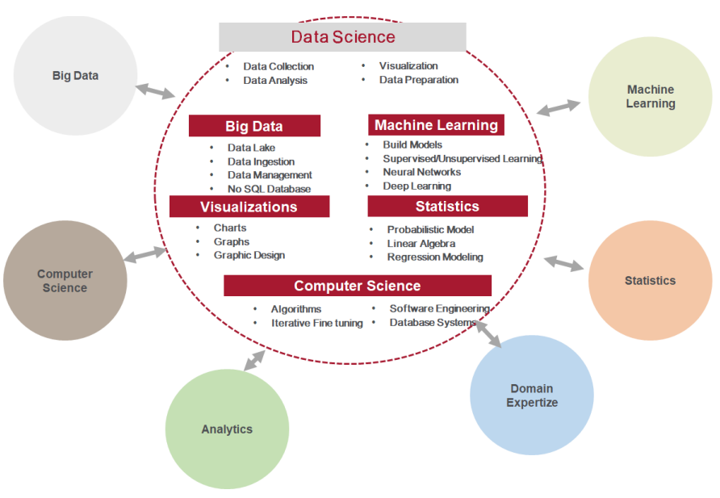
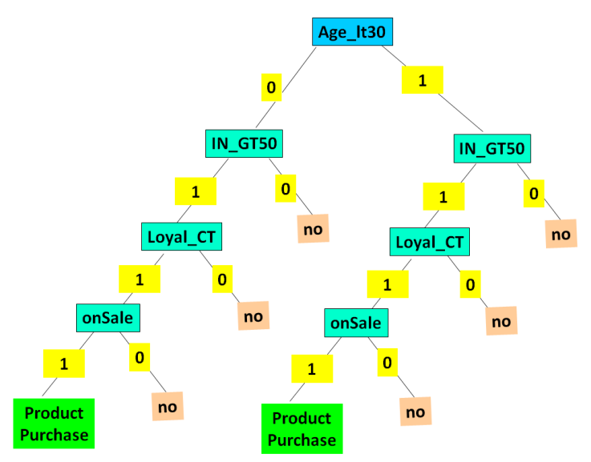

# Data Science for Software Engineers

## Introduction
- Data-driven world with exponential data growth
  - Social media (tweets, Facebook posts, Instagram pictures, YouTube videos)
  - IoT devices and wearables generate high-velocity data
- Popularity of Data Science with Big Data emergence
- Historical data analysis evolution
- Organizations use data science for cost reduction, cross-sell/upsell opportunities, new market exploration, forecasting, recommendations
- Data science: interdisciplinary field (statistics, computer science, machine learning, etc.)
- Data as a strategic asset for businesses
- Data science for data-driven decision making

## Applications of Data Science
- **Smart Recommendations**: Analyze historical data for recommendations
- **Big Data Analytics**: Analyze sensor data, IoT data, social media data, log data
- **Web Search**: Analyze web-scale data for accurate search results
- **Data Analytics**: Analyze and visualize data for insights, predictions, forecasting, prescription
- **Business Intelligence**: Identify challenges, opportunities, marketing, product pricing, cost optimization, ROI analysis, revenue prediction, store planning, customer analytics
- **Healthcare**: Monitor and reduce health complications using wearable data
- **Finance**: Fraud detection, risk detection, insights, pattern recognition, predictive analytics
- **Automobile**: Train driverless vehicles, evaluate model performance
- **Supply Chain and Inventory Management**: Forecasting, demand planning, revenue forecasting
- **Telecom**: Customer churn forecasting
- Other applications: election campaigning, chatbots, virtual assistants, automated cars, disaster prediction, product pricing, preventive maintenance, customer retention, pattern recognition, online advertisement, demand forecasting, trend analysis, campaign effectiveness, recommendations

## Background of Data Science
- Data science related to statistics, uses statistical methods for data analysis
- Term "Data Science" traced back to 1974 by Peter Naur, popularized by C.F. Jeff Wu in 1985
- Evolution of data analysis methods for product recommendation
  - Early 2010: Formal and rigid business rules
  - 2011: Linear regression model
  - 2013: Logistical regression
  - 2014: Decision trees
  - 2015: Collaborative filtering (Amazon, Netflix)
  - 2017: Bayesian network
  - 2019 onwards: Machine learning and deep learning

## Definition of Data Science
- Interdisciplinary field dealing with collecting, analyzing, visualizing data using statistical and machine learning methods
- Data scientist: make sense and actionable insights from raw data
- Various disciplines of data science:

## Data Science Tools
- **AI and Machine Learning**: Deep learning, regression analysis, ML models, SVM, supervised and unsupervised learning, TensorFlow, Pytorch
- **Big Data**: Apache Spark, Apache Hadoop, NoSQL databases (DynamoDB, MongoDB)
- **Statistics**: Probability, vector algebra, calculus, linear regression, logistical regression
- **Data Visualization**: Qlik, PowerBI, Tableau
- **Domain Skills**: Understanding problem domain (finance, retail, commerce)
- **Data Science Platforms**: Matlab, IBM Watson Studio, Anaconda, Numpy, Jupyter
- **Operations Research**: Decision tree, decision modeling (deterministic, probabilistic)
- **Programming Languages**: R, Python, Scala, Julia, Java, C
- **Model Development**: Matlab, Octave, MADLib

## Data Science and Big Data
- Big Data increases popularity of Data Science
- Big Data challenges: volume, velocity, veracity, variety (structured, semi-structured, unstructured)
- Examples of Big Data: sensor data, user click data, tweet data
- Big Data systems: NoSQL products (MongoDB, DynamoDB, CouchDB)
- Data science development involves model building, exploration, fine-tuning for massive data sets
- Big Data systems provide data management and processing technologies (Apache Hadoop, NoSQL databases)

## Phases Involved in Data Science Process
- **Requirements Gathering and Data Discovery**:
  - Understand business requirements, goals, challenges
  - Identify data sources, existing data analysis tools, stakeholders, time, and budget
  - Domain experts provide business domain heuristics
  - Formulate initial hypothesis after understanding the domain
  - Collect data from various sources (data lakes, relational databases, ERP systems, social media, etc.)
- **Data Preparation Stage**:
  - Cleanse data to standardize format, structure, remove inconsistencies (duplicates, missing values, errors)
  - ETL (Extract, Transform, Load) tools for data conditioning
  - Activities: remove duplicates, standardize format, infer missing values, smooth data, filter, sample, make data types consistent, replace missing values
- **Data Exploration Stage**:
  - Extract features, perform first cut analysis, form initial hypothesis
  - Classify, cluster data into logical categories
  - Identify relationships between variables
  - Select key predictors for recommendations and predictions
- **Model Development and Prediction Stage**:
  - Design, develop, train, fine-tune, and test machine learning models iteratively
  - Evaluate various models for selected data, select highest performing model for prediction
  - Use statistical methods (regression analysis, qualitative methods, decision trees, deep learning models)
- **Data Visualization Stage**:
  - Communicate insights using reports, BI tools, charts, infographics
  - Document findings, model behavior for test cases
  - Operationalize accepted model, use for business prediction, continuously fine-tune based on feedback

## Data Science Methods
- **Clustering Method**:
  - Group objects into logical clusters based on attributes
  - Methods: hierarchical clustering, fuzzy clustering, K-means clustering, nearest neighbor
  - Use cases: group-based personalization, customer segmentation, image processing
- **Collaborative Filtering or Similarity Matching Method**:
  - Identify users with similar interests for product recommendations
  - Co-occurrence grouping: recommend closely related products together
  - Use cases: recommendation systems for cross-sell, up-sell, campaigns, product promotions, offers
- **Regression Methods**:
  - Identify relationship (function) between dependent and independent variables
  - Methods: linear regression, logistical regression
  - Use cases: prediction and forecasting, demand forecasting, price prediction, event probability prediction
- **Classification Methods**:
  - Supervised learning with labeled data
  - Methods: decision tree, naïve Bayes classification, confusion matrix
  - Use cases: prediction, recommendation scenarios
- **Other Methods**:
  - Time series prediction for regular interval events
  - Text analysis and sentiment analysis (bag of words, TFIDF, topic modeling)
  - Profiling: characterizing event, user, or object
  - Reduction: reduce large data set to represent key samples

## Data Science Process for Predicting Product Purchase Probability Case Study

### 1. Requirements Gathering Product Purchase Data

| Age_LT30 | Age_GT30 | In_LT50      | In_GT50 | Loyal_CT | onSale | Prod_buy |
|----------|----------|--------------|---------|----------|--------|----------|
| 0        | 1        | 0            | 1       | 1        | 1      | 1        |
| 0        | 1        | 0            | 1       | 0        | 1      | 1        |
| 1        | 0        | 0            | 1       | 1        | 1      | 1        |
| 0        | 1        | 0            | 1       | 1        | 1      | 1        |
| 1        | 0        | Yes          | 0       | 1        | 1      | 0        |
| 0        | 1        | Correct      | 0       | 1        | 1      | 1        |
| 1        | 0        | Y            | 0       | 0        | 1      | 0        |
| 1        | 0        | Less than 50 | 0       | 0        | 0      | 0        |
| 0        | 1        | Confirmed    | 0       | 0        | 1      | 1        |
| 1        | 0        | One          | 0       | 1        | 1      | 0        |
| 1        | 0        | NA           | 0       | 1        | 1      | 0        |

***Key Features Influencing Product Purchase***

- Age_LT30: Stands for age less than 30, indicates if the buyer is aged below 30 years. 1 indicates Yes and 0 indicates No.
- Age_GT30: Stands for age greater than 30, indicates if the buyer is aged above 30 years. 1 indicates Yes and 0 indicates No.
- In_LT50: Stands for income less than 50, indicates if the buyer’s monthly income is less than 50K. 1 indicates Yes and 0 indicates No.
- In_GT50: Stands for income greater than 50, indicates if the buyer’s monthly income is greater than 50K. 1 indicates Yes and 0 indicates No.
- Loyal_CT: Stands for loyal customer who has enrolled into the loyalty program. 1 indicates Yes and 0 indicates No.
- onSale: Stands for product on sale. 1 indicates Yes and 0 indicates No.
- Prod_buy: Stands for product buy. 1 indicates Yes and 0 indicates No.

### 2. Data Cleansing Stage

In this phase, we fix the data errors and condition the data so that it can be easily modeled using one of the existing models. The highlighted rows in the table need to be properly coded. For accurate model training, we need to use the correct code. Table 16.4 provides the correctly coded values.

#### Product Purchase Data Coded

| Age_LT30 | Age_GT30 | In_LT50 | In_GT50 | Loyal_CT | onSale | Prod_buy |
|----------|----------|---------|---------|----------|--------|----------|
| 0        | 1        | 0       | 1       | 1        | 1      | 1        |
| 0        | 1        | 0       | 1       | 0        | 1      | 1        |
| 1        | 0        | 0       | 1       | 1        | 1      | 1        |
| 0        | 1        | 0       | 1       | 1        | 1      | 1        |
| 1        | 0        | 1       | 0       | 1        | 1      | 0        |
| 0        | 1        | 1       | 0       | 1        | 1      | 1        |
| 1        | 0        | 1       | 0       | 0        | 1      | 0        |
| 1        | 0        | 1       | 0       | 0        | 0      | 0        |
| 0        | 1        | 1       | 0       | 0        | 1      | 1        |
| 1        | 0        | 1       | 0       | 1        | 1      | 0        |
| 1        | 0        | 1       | 0       | 1        | 1      | 0        |

### 3. Data Exploration Stage

In this stage, we identify the key features and their relation to the product purchase decision. We apply statistical methods to understand the data distribution and the feature relationship. We can infer the following based on our analysis:

- Feature Age_GT30 is positively and linearly correlated to Prod_buy. Conversely, Age_LT30 is inversely related to Prod_buy.
- Feature In_GT50 is positively and linearly correlated to Prod_buy. Conversely, In_LT50 is inversely related to Prod_buy.
- Loyal_CT and onSale are positively correlated to Prod_buy.

We can use these features and insights for building and training models.

### 4. Prediction Stage

- In this stage, we build and evaluate various models. We can evaluate various models such as linear regression, logistic regression, and others to understand their performance. We have selected the decision tree model as it factors in all the key features. We can visualize the combination and impact of various features with the decision tree model. 

- We validate the decision tree model with the test data to ensure that the decision tree model does accurate predictions.

### 5. Data Visualisation Stage

## Check Your Progress-1
1. In ____ phase we do the data pre-processing. 
2. The key features of the data set are extracted in _____ phase 
3. we group the objects into a logical cluster/group based on the object attribute 
in ______ method 
4. _____ uses set of rules to understand the similarity between users, products 
and information 
5. Understanding the association of products happens in _____

## Check Your Progress-2
1. ______methods identify the relationship (as a function) between dependent 
variables and independent variable. 
2. In _______ method, labelled data is used for understanding of the data. 
3. _____ involves characterizing the event or user or an object
4. _________ involves reducing the large data set into a smaller data set 