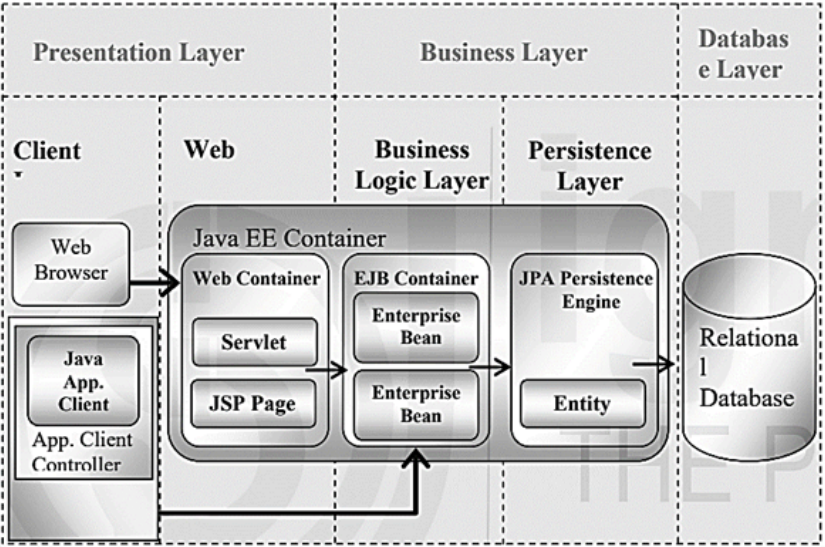
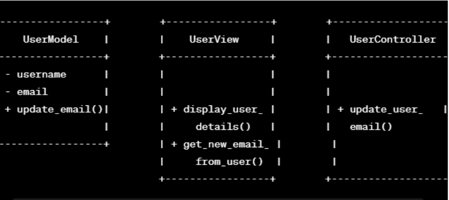
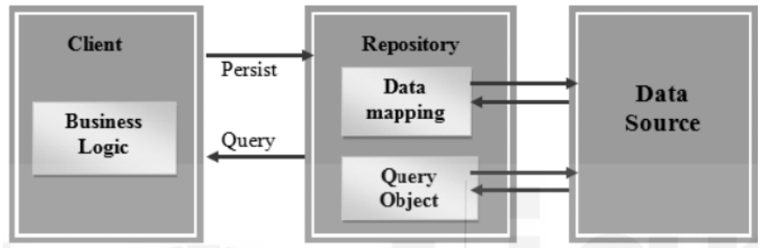
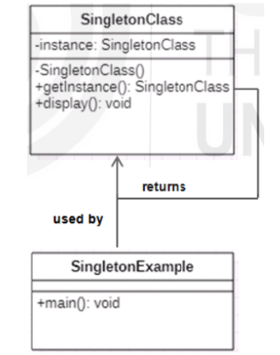
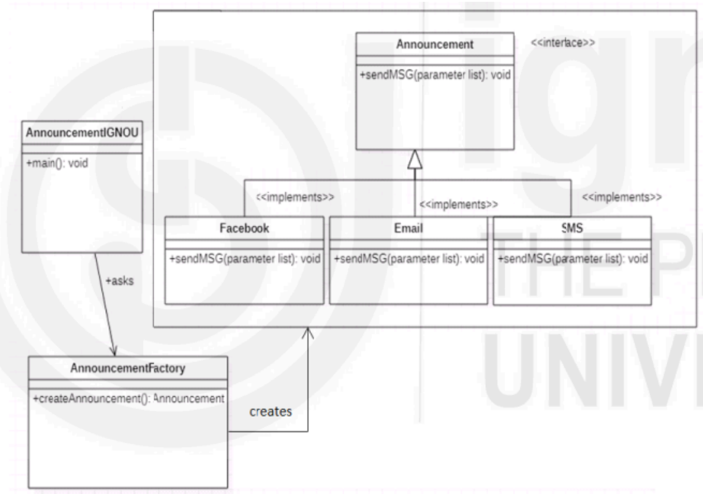

<!-- TOC start (generated with https://github.com/derlin/bitdowntoc) -->

- [Introduction to J2EE and design patterns](#introduction-to-j2ee-and-design-patterns)
  - [Web Server](#web-server)
  - [Web Container](#web-container)
  - [INTRODUCTION TO J2EE](#introduction-to-j2ee)
    - [J2EE Components/J2EE Architecture](#j2ee-componentsj2ee-architecture)
    - [Modules in J2EE](#modules-in-j2ee)
  - [Design Patterns](#design-patterns)
    - [Creational Design Patterns](#creational-design-patterns)
    - [Structural Design Patterns](#structural-design-patterns)
    - [Behavioral Design Patterns](#behavioral-design-patterns)
  - [Model-View-Controller (MVC) Design Pattern](#model-view-controller-mvc-design-pattern)
  - [Repository Design Pattern](#repository-design-pattern)
  - [Singleton Design Pattern](#singleton-design-pattern)
  - [Factory Design Pattern](#factory-design-pattern)
  - [JAR vs WAR](#jar-vs-war)
  - [Check Your Progress-1](#check-your-progress-1)
  - [Check Your Progress-2](#check-your-progress-2)
  - [Check Your Progress-3](#check-your-progress-3)

<!-- TOC end -->

<!-- TOC -->
# Introduction to J2EE and design patterns

<!-- TOC -->
## Web Server
Web Server is a server software that handles HTTP requests and responses to deliver web pages or web content to clients (i.e. web browser) using HTTP protocol. Web browser communicates with web server using the Hypertext Transfer Protocol (HTTP). Hypertext Transfer Protocol (HTTP) is specially meant to communicate between Client and Server using Web (or Internet). To
successfully execute web application, the number of server side technologies (such as JSP, Servlets and PHP) and their libraries are installed on the web server. Without these libraries, a web server cannot execute those server technologies
based applications. In other words, we may say that the web server creates an execution infrastructure for the server technologies. An example of web server is Apache HTTP Server.

<!-- TOC -->
## Web Container
Web Container is a web server component that handles Servlets, Java Server Pages (JSP) files, and other Web-tier components. Web container is also called a Servlet Container or Servlet Engine. It is the responsibility of the Web container to
map a URL to a particular servlet. Also, Web container ensures that the mapped URL requester has the correct access rights. It means that it provides the run time environment to web applications. The most common web containers are Glassfish, Eclipse, JBOSS, Apache Tomcat, WebSphere and Web Logic. For deployment and running the JSPs/Servlets we need a compatible web server with a servlet container.

<!-- TOC -->
## INTRODUCTION TO J2EE
- Core java or Java Standard Edition (Java SE). Java SE provides all core functionalities of java programming language. Java technology is used as a programming language as well as a platform. A Java platform provides a specific environment in which Java applications run. The Java Enterprise Edition platform resides on top of the Java Standard Edition platform.
- The J2EE platform is a set of services, application programming interfaces (APIs) and protocols. J2EE is used to develop and deploy multi-tier web-based enterprise applications using a series of protocols and application programming interfaces
(APIs). J2EE contains several APIs such as Java Servlets, Java Server Pages (JSP),Enterprise Java Beans (EJB), Java Database Connectivity (JDBC), Java Message Service (JMS), Java Naming and Directory Interface (JNDI) and so on.
- The J2EE application model divides applications into three basic parts like components, containers and connectors. The application developers works on the components part, whereas system vendors are responsible for implementing containers and connectors. Containers act as a mediator between clients and components by providing services like transaction support and resource pooling.Connectors provide bidirectional communication between J2EE components and
enterprise systems.

<!-- TOC -->
### J2EE Components/J2EE Architecture
- A J2EE application contains four components or tiers: Presentation, Application,Business, and Resource adapter components. The presentation component is the client side component that is visible to the client and runs on the client’s server.
The Application component is web side layer that runs on the J2EE server. The business component is the business layer which includes server-side business logic such as JavaBeans, and it is also run on the J2EE server. The resource adaptor component comprises an enterprise information system.

<!-- TOC -->
### Modules in J2EE
- A module in J2EE is a group of one or more components of the same container type and one component deployment descriptor of the same type. There are four different modules used in J2EE: ***application client module***, ***web***, ***EJB***, and ***resource adapter module***.
  - The ***Application Client module*** is bundled as a JAR file which contains class files and client deployment descriptor (web.xml) file. 
  - The ***WEB*** module is bundled as a JAR file that comprises class files (servlets), web deployment descriptor file, JSP pages, images, and HTML files. 
  - The ***Enterprise Java Beans (EJB)*** module is wrapped as a JAR file, collections of class files (ejb) and EJB deployment descriptor. 
  - The fourth module is ***Resource Adapter*** which is packaged as a JAR file consisting of classes, a resource adapter deployment descriptor, Java interfaces and native libraries.

<!-- TOC -->
## Design Patterns
- Design patterns are the best solutions that are tested, verified developed prototypes that can speed up your development process. When you may face problems during software development, the design patterns gives you explanations for those problems. Experienced developers have developed these explanations to provide the finest solutions to the problems. It is also beneficial for un-experienced software developers to learn software design in a simpler manner.
- Design Patterns provides a general reusable solution to commonly occurring problems. It is not a complete design that can be directly mapped into your code and solve your purpose. It is just like a template or explanation for how to solve your problems. It offers a common platform for all software developers.
- There are 23 classic design patterns and they are categorized into three groups: ***Creational***, ***Structural*** and ***Behavioral***. The **Creational design** patterns deal with the creation of an object. **Structural design** patterns deal with the class structure, and the **behavioral design** patterns define the interaction between objects.

<!-- TOC -->
### Creational Design Patterns
- **Singleton Pattern**: Ensures a class has only one instance and provides a global point to this instance. Useful for scenarios where a single point of control or coordination is required.
- **Factory Pattern**:Defines an interface for creating an object but leaves the choice of its type to the subclasses.Centralizes object creation, making it easier to manage and extend
- **Abstract Factory Pattern**: Provides an interface for creating families of related or dependent objects.Allows the creation of objects without specifying their concrete classes.
- **Builder Pattern**:Separates the construction of a complex object from its representation.Allows the same construction process to create different representations.
- **Prototype Pattern**:Creates new objects by copying an existing object, known as the prototype.Useful when creating a new instance is more resource-intensive.

<!-- TOC -->
### Structural Design Patterns
- **Adapter Pattern**:Acts as a bridge between two incompatible interfaces.Allows existing classes to be used with others without modifying their code.
- **Bridge Pattern**:Decouples abstraction from its implementation, allowing them to vary independently.Utilizes principles like encapsulation and inheritance to achieve separation.
- **Composite Pattern**:Treats a group of objects as a single object.Useful for representing part-whole hierarchies.
- **Decorator Pattern**:Dynamically adds or overrides behavior of objects.Enhances the functionality of objects at runtime.
- **Facade Pattern**:Provides a simplified interface to a set of interfaces in a subsystem.Hides the complexities of the subsystem from clients.
- **Flyweight Pattern**:Reduces memory usage or computational expenses by sharing as much as possible with related objects.Efficiently handles a large number of similar objects.
- **Proxy Pattern**:Acts as a placeholder for another object to control access to it.Useful for scenarios involving remote objects, lazy loading, or access control.

<!-- TOC -->
### Behavioral Design Patterns
- **Chain of Responsibility Pattern**:Passes a request along a chain of handlers.Allow multiple objects to handle the request without the sender needing to know the specific handler.
- **Command Pattern**:Encapsulates a request as an object, allowing for parameterization of clients with different requests.Enables queuing, logging, and support for undoable operations. 
- **Interpreter Pattern**:Provides a way to evaluate language grammar o expressions.Defines a grammar for the language and an interpreter that interprets sentences.
- **Iterator Pattern**:Provides a way to access elements of an aggregate objec sequentially without exposing its underlying representation.Commonly used in programming languages like Java and .Net.
- **Mediator Pattern**:Defines an object that centralizes communication between other objects.Reduces direct connections between components, promoting loose coupling.
- **Memento Pattern**:Captures and externalizes an object's internal state, allowing it to be restored to this state later.Useful for implementing undo mechanisms.
- **Observer Pattern**:Defines a one-to-many dependency between objects, ensuring that when one object changes state, all its dependents are notified and updated. Facilitates a loosely coupled system where objects can react to changes without being explicitly aware of the changes.
- **State Pattern**:Allows an object to alter its behavior when its internal state changes.Encapsulates states into separate classes, making it easier to add new states.
- **Strategy Pattern**:Defines a family of algorithms, encapsulates each algorithm, and makes them interchangeable.Allows the client to choose the appropriate algorithm at runtime.
- **Template Method Pattern**:Defines the skeleton of an algorithm in the superclass but lets subclasses override specific steps of the algorithm without changing its structure.Provides a common structure for multiple algorithms.
- **Visitor Pattern**:Represents an operation to be performed on elements of an object structure.Allows defining new operations without changing the classes on which they operate.

<!-- TOC -->
## Model-View-Controller (MVC) Design Pattern
- The Model-View-Controller (MVC) is a software architectural pattern that separates an application into three interconnected components: Model, View, and Controller. This separation helps in managing complexity, promoting code reusability, and facilitating modular development.
- **Model**
  - Represents the application's data and business logic.
  - Responds to requests for information, processes input, and performs data manipulation.
  - Notifies observers (usually Views) about changes in state.
- **View**
  - Displays the data provided by the Model to the user.
  - Listens for user input and forwards it to the Controller.
  - Can be updated by the Model when the underlying data changes.
- **Controller**
  - Handles user input and updates the Model and View accordingly.
  - Acts as an intermediary between the Model and the View.
  - Orchestrates the flow of data and updates

<!-- TOC -->
## Repository Design Pattern
- The Repository Design Pattern is a structural pattern that provides a way to encapsulate storage, retrieval, and querying of data in an application. It abstracts the data access logic, separating it from the business logic, and provides a uniform interface to interact with the underlying data store (such as a database, API, or file system). This pattern promotes code organization, maintainability, and testability by centralizing data access operations. 
- ***Components of the Repository Design Pattern***:
  - **Repository Interface**:
    - Defines the contract or interface for data access operations.
    - Includes methods for common CRUD (Create, Read, Update, Delete) operations.
  - **Concrete Repository**:
    - Implements the Repository Interface with specific logic for a particular data store.
    -  Manages the interaction with the underlying data store, such as a database or external service
 - **Client or Service**"
   - Uses the Repository interface to perform data access operations without directly interacting with the underlying data store.

<!-- TOC -->
## Singleton Design Pattern
- The Singleton Design Pattern is a creational pattern that ensures a class has only one instance and provides a global point of access to that instance. This pattern is useful when exactly one object is needed to coordinate actions across the system.
It helps in controlling access to shared resources, such as a database connection or a logging service, and provides a single point of control for that resource.
- ***Key Characteristics of the Singleton Pattern***:
  - **Single Instance**:The Singleton class ensures that only one instance of itself is created.
  - **Global Access Point**:Provides a global point of access to the single instance.
  - **Lazy Initialization**:The instance is created only when it is first requested.
  - **Thread Safety**:Singleton implementations should be thread-safe to handle multiple threads trying to access or create the instance concurrently.

<!-- TOC -->
## Factory Design Pattern
- The Factory Design Pattern is a creational pattern that provides an interface for creating objects in a superclass but allows subclasses to alter the type of objects that will be created. It involves defining an interface or abstract class for creating objects, and concrete classes that implement this interface to create specific types of objects. The goal is to delegate the responsibility of instantiating objects to its subclasses.
- The following example demonstrates to you how to work Factory Design Pattern. Assume that IGNOU wants to send announcement details of new courses to users through Facebook, Email and SMS. Let's implement this example with the help of the Factory design pattern. For implementing this, first, you can design a UML class diagram, and then you can transform this class diagram into source code implementation. For implementing the above class diagram, you can create an interface as Announcement and three concrete classes such as Facebook.java,Email.java and SMS.java. These three classes can implement ‘Announcement'
interface. Besides these, you can also create two more classes. You can create a factory class 'AnnouncementFactory.java' to get an Announcement object.
- Creation of 'AnnouncementIGNOU.java' class is to use factory class and get an object of a concrete class.

<!-- TOC -->
## JAR vs WAR
- The JAR(Java Archive) is a package file format. The file extension of JAR files is .jar, and may contain libraries, resources and metadata files. Basically, it is a zipped file containing the compressed versions of .class files, compiled Java libraries and applications. WAR(Web Archive) is used to package web applications. We can deploy any Servlet/JSP container. It may contain JSP, Servlet, XML, images, HTML pages, CSS files and other resources. It combines all the files into a single unit and takes a smaller amount of time while transferring file from client to server. The extension of WAR files is .war and needs a server to execute a WAR file.
- We can create war file using jar tool of JDK. We can use -c switch of jar to create the war file. For creating war file, we can go inside the project application directory (outside the WEB-INF folder) then write command as jar -cvf projectname.war * on the command prompt. For the deployment of WAR file, we can place war file in specific folder of server. If we are using the tomcat server and want to deploy the war file manually, go to the 'webapps' directory of apache tomcat and paste the war file. The server will extract the war file internally. Now, we are able to access the web project through the browser. If we wish to extract the war file manually then we need to use -x switch of jar tool of JDK.

<!-- TOC -->
## Check Your Progress-1
1. What is a web server, and how does it differ from a web container? Also, 
name any four web containers.
2. What is J2EE? What are the components of J2EE applications? What 
technologies are included in the J2EE platform?
3. Define the term module in J2EE. What are the four specific modules used in 
J2EE applications? 

<!-- TOC -->
## Check Your Progress-2
1. What do you mean by Design Patterns? Can you name some of the design 
patterns used in JDK core libraries?
2. What is Singleton pattern? Name one singleton class in Java. How can you 
create Singleton class in java? Can we create a clone of a singleton object? If 
yes, then how to prevent cloning of a singleton object? 
3. Explain the benefits of Factory pattern. 

<!-- TOC -->
## Check Your Progress-3
1. What is the difference between JAR and WAR files?