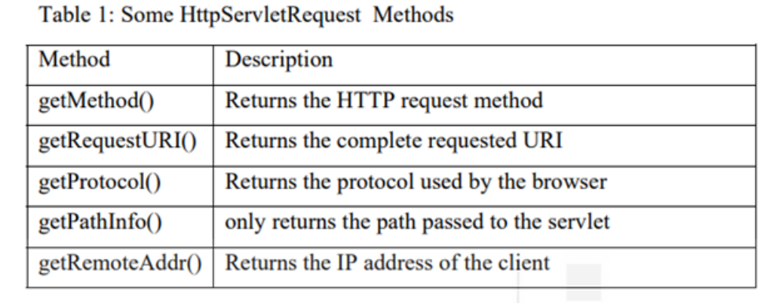

<!-- TOC start (generated with https://github.com/derlin/bitdowntoc) -->

- [Basics of Servlet](#basics-of-servlet)
  - [Servlet Introduction](#servlet-introduction)
    - [Key Points about Java Servlets](#key-points-about-java-servlets)
  - [Life Cycle of a Servlet](#life-cycle-of-a-servlet)
  - [HTTP Protocol and HTTP methods](#http-protocol-and-http-methods)
    - [HTTP Protocol Foundation](#http-protocol-foundation)
    - [HTTP Evolution](#http-evolution)
    - [HTTP Message Exchange](#http-message-exchange)
    - [HTTP Requests](#http-requests)
    - [HTTP Responses](#http-responses)
  - [Servlet Architecture](#servlet-architecture)
    - [Servlet API](#servlet-api)
    - [Key Components](#key-components)
    - [Servlet Interface and Lifecycle Methods](#servlet-interface-and-lifecycle-methods)
    - [ServletConfig Interface](#servletconfig-interface)
    - [HttpServletRequest Interface](#httpservletrequest-interface)
    - [HttpServletResponse Interface](#httpservletresponse-interface)
    - [HttpSession Interface](#httpsession-interface)
  - [Servlet Life Cycle](#servlet-life-cycle)
    - [Life Cycle Phases](#life-cycle-phases)
  - [Creating a Servlet](#creating-a-servlet)
  - [Running and Deployment of Servlet](#running-and-deployment-of-servlet)
  - [Check Your Progress-1](#check-your-progress-1)
  - [Check Your Progress-2](#check-your-progress-2)
  - [Check Your Progress-3](#check-your-progress-3)

<!-- TOC end -->

<!-- TOC --><a name="basics-of-servlet"></a>
# Basics of Servlet

<!-- TOC --><a name="servlet-introduction"></a>
## Servlet Introduction
- Java Servlets are essential components of server-side programming, providing a foundation for developing web applications. A servlet is essentially a Java class that extends either `GenericServlet` or `HttpServlet` from the `javax.servlet.http`
package. By inheriting from these classes, developers implement specific methods to handle incoming requests and generate dynamic responses. This allows the servlet container, such as Tomcat, to execute the servlet within the web server's address space.

<!-- TOC --><a name="key-points-about-java-servlets"></a>
### Key Points about Java Servlets
1. **Servlet Class hierarchy**
   - Servlets are Java classes that extend `GenericServlet` or `HttpServlet` from the `javax.servlet.http` package.
   - Developers override methods in these classes to define the servlet's behavior in handling requests. 

2. **Web Container Responsibilities**
   - Servlets operate within a web container, like Tomcat, which manages the servlet's lifecycle.
   - The web container's role involves handling incoming requests, processing them, generating responses, and sending them back to the web server.

3. **Servlet API**
   - The Servlet API provides various interfaces and classes for creating servlets,such as `GenericServlet`, `HttpServlet`, `ServletRequest`, `ServletResponse`, and `Servlet`.
   - Developers leverage these components to build robust and dynamic web applications.

4. **HTTP Servlets**
   - Java Servlet technology defines HTTP-specific servlet classes, and HTTP Servlets operate under the HTTP protocol.
   - The HTTP protocol follows an asymmetrical request-response model, where clients send requests, and servers respond with the requested data.

5. **Foundation for Server Side Technologies**
   - Servlets serve as the foundation for various Java server-side technologies, including JSP (Java Server Pages), JSF (Java Server Faces), Struts, Spring, and Hibernate.
   - These technologies build upon the servlet model, extending and enhancing capabilities for developing feature-rich web applications.

<!-- TOC --><a name="life-cycle-of-a-servlet"></a>
## Life Cycle of a Servlet
- A java servlet program has a life cycle that defines:
  1. how the servlet is loaded and initiated,
  2. how a Servlet receives and responds to requests, and
  3. How it is taken out of service.

<!-- TOC --><a name="http-protocol-and-http-methods"></a>
## HTTP Protocol and HTTP methods
- HTTP, or Hypertext Transfer Protocol, serves as a communication protocol between clients and servers over the web or the Internet. It is a stateless protocol, allowing only one request per connection to enhance the server's capacity to handle more users over time. Web browsers utilize HTTP to communicate with web servers when users input a URL, sending a request and receiving the requested data in response.

<!-- TOC --><a name="http-protocol-foundation"></a>
### HTTP Protocol Foundation

- **Request Response Model**
  - HTTP operates on a request-response model between a client and a server.
  - An HTTP client sends a request message to an HTTP server, and the server responds with the requested data.
- **Statelessness**
  -  HTTP is stateless, meaning each request is independent and doesn't retain information from previous requests.
  -  To maintain communication between web pages, sessions or cookies are established.
- **Connectionless Protocol**
  - HTTP is connectionless; the client establishes a connection with the server for a request, and once the response is delivered, the connection is terminated.
  - For subsequent requests, a new connection is established
- **Resource Allocation**
  - Connectionless design ensures fair resource allocation to clients globally.
  - Continuous connections from one client could monopolize server resources,hindering access for other clients.

<!-- TOC --><a name="http-evolution"></a>
### HTTP Evolution
- **Development History**
  - HTTP was developed by Tim Berners-Lee and his team in the early 1990s.
  - HTTP/1.0 introduced basic methods like GET, POST, and HEAD without informational status codes.
- **HTTP/1.1**
  - Defines seven HTTP methods: GET, POST, HEAD, OPTIONS, TRACE, PUT, DELETE.
  - Introduces headers and facilities, enhancing the original HTTP/1.0.
- **HTTP/2.0**
  - Major revision of the HTTP network protocol, providing improved efficiency.
- **HTTP/3**
  - The third major version of HTTP for exchanging information on the World Wide Web.

<!-- TOC --><a name="http-message-exchange"></a>
### HTTP Message Exchange
- **Message Types**
  -  Two types of HTTP messages: Requests sent by the client to the server and Responses, the server's answer.
- **Message Flow**
  - The client's browser translates a requested URL into a request message based on the protocol and sends it to the HTTP server.
  - The server interprets the request, maps it to a server-side program, executes he program, and returns an appropriate response.
- **HTTP Versions**
  - HTTP has evolved through versions, with HTTP/1.0, HTTP/1.1, HTTP/2.0, an HTTP/3, each bringing improvements and new features.

<!-- TOC --><a name="http-requests"></a>
### HTTP Requests
- When a client initiates communication with a server, it sends an HTTP request.This request is a message containing essential details for the server to process and respond. The client, typically a web browser, utilizes one of the seven HTTP request methods, specifies the resource's location, protocol version, optional headers, and an optional message body.
- **Components of an HTTP Request**:
  1. **HTTP Request Methods**: Clients use one of the seven methods to communicate their intent. These methods include GET, POST, PUT, DELETE, HEAD, OPTIONS, and TRACE.
  2. **Request URL Structure**: When a user enters a URL in their browser, such as http://www.ignou.ac.in/studentzone/hallticket.jsp, the following components are involved:
     1. *Domain Name*: Translated to an IP address by the Domain Name System (DNS) server.
     2. *Path*: The remaining part of the URL after the domain name, e.g.,`/studentzone/`.
     3. *Resource File*: The specific resource being requested, in this case, `hallticket.jsp`.
  3. **Connection Establishment**:The client establishes a connection to the server, and technical operations, including DNS resolution, are performed to facilitate this connection.
  4. **HTTP Request Line**: A simplified representation of the client's request may look like the following:
     - **Method**: The HTTP method used, e.g., GET.
     - **Path**: The path component of the URL, e.g., `/studentzone/`
     - **Resource Name**: The specific resource requested, e.g., `hallticket.jsp`.
     - **Protocol Version**: The version of the HTTP protocol being used.
     - “GET /studentzone/hallticket.jsp HTTP/1.1”


- Example showing HttpServletRequestMethods

```
import javax.servlet.*;
import javax.servlet.http.*;
import java.io.*;
import java.util.*;
public class RequestServlet extends HttpServlet {
    public void doGet(HttpServletRequest request, HttpServletResponse response)throws ServletException, IOException {
        response.setContentType("text/html");
        PrintWriter out = response.getWriter();
        java.util.Date date = new java.util.Date();
        out.println("Current Date & Time: " + date.toString());
        out.println("<h3>Request Information Example</h3>");
        out.println("Method: " + request.getMethod() + "<br>");
        out.println("Request URI: " + request.getRequestURI() + "<br>");
        out.println("Protocol: " + request.getProtocol() + "<br>");
        out.println("PathInfo: " + request.getPathInfo() + "<br>");
        out.println("Remote Address: " + request.getRemoteAddr() + "<br>");
    }
    //do Get
}
```
<!-- TOC --><a name="http-responses"></a>
### HTTP Responses
- When a server receives an HTTP request, it processes the request and generates an HTTP response to send back to the client. The response message includes key components such as the HTTP version, response or status code, a description of the response code, optional headers, and an optional message body.
- **Components of a HTTP Response**
  1. **HTTP Version**:Specifies the version of HTTP being used. For example, HTTP/1.1.
  2. **Status Code**:Indicates whether the HTTP request has been successfully completed or not. Responses are grouped into five classes:
     - ***1xx (Informational)***: Request received, continuing process.
     - ***2xx (Success)***: The request was successfully received, understood, and accepted.
     - ***3xx (Redirection)***: Further action needs to be taken in order to complete the request.
     - ***4xx (Client Error)***: The request contains bad syntax or cannot be fulfilled.
     - ***5xx (Server Error)***: The server failed to fulfil a valid request.
  3. **Description of Status Code**:A human-readable description providing more details about the status code.
  4. **Optional Headers**:Additional information or metadata about the response, such as content type length, server information, etc.
  5. **Optional Message Body**: Contains the actual content of the response. This can include HTML, JSON, or any other data relevant to the request.
- Example HTTP Response:
  ```
  HTTP/1.1 200 OK
  Date: Thu, 11 Nov 2023 12:00:00 GMT
  Server: Apache/2.4.41
  Content-Type: text/html; charset=UTF-8
  Content-Length: 1234
  ```

  ```
  <!DOCTYPE html>
    <html>
        <head>
            <title>Example Page</title>
        </head>
        <body>
            <h1>Hello, World!</h1>
        </body>
    </html>
  ```
- In this example:
  - HTTP version is 1.1.
  - Status code is 200 (OK), indicating a successful request.
  - Description might provide additional details like "OK."
  - Optional headers include Date, Server, Content-Type, and Content-Length.
  - Optional message body contains an HTML page with a simple "Hello, World!"message.

Understanding these components helps in comprehending how servers communicate with clients and how the result of an HTTP request is conveyed.


<!-- TOC --><a name="servlet-architecture"></a>
## Servlet Architecture
- Servlets are Java programs that run on Java-enabled web servers, processing client (browser) requests and generating dynamic responses. The key flow involves:
  - The client sends an HTTP request to the web server.
  - The web server forwards this request to the servlet container.
  - The servlet container directs the request to the appropriate servlet.
  - The servlet processes the request, possibly interacting with databases or web services.
  - The servlet constructs a response and sends it back through the servlet container to the web server, which then forwards it to the client.

<!-- TOC --><a name="servlet-api"></a>
### Servlet API
- Servlets are created using the Servlet API, which consists of two main packages:
  - **javax.servlet**: Contains generic interfaces and classes for all servlets.
  - **javax.servlet.http**: Contains interfaces and classes specific to HTTP protocol.

<!-- TOC --><a name="key-components"></a>
### Key Components
- **GenericServlet Class**:
  - An abstract class implementing Servlet, ServletConfig, and Serializable interfaces.
  - Subclasses like HttpServlet extend GenericServlet.
  - Requires implementing the service() method.
- **HttpServlet Class**:
  - An abstract class extending GenericServlet.
  - Provides HTTP-specific service methods like doGet() and doPost() which handle GET and POST requests respectively.
  - Automatically calls the appropriate method based on the HTTP request type.

<!-- TOC --><a name="servlet-interface-and-lifecycle-methods"></a>
### Servlet Interface and Lifecycle Methods
- All servlets must implement the Servlet interface, which defines five methods:
  - **init()**: Initializes the servlet.
  - **service()**: Processes requests.
  - **destroy()**: Called before the servlet is destroyed.
  - **getServletConfig()**: Returns a ServletConfig object with servlet configuration information.
  - **getServletInfo()**: Provides servlet information.

<!-- TOC --><a name="servletconfig-interface"></a>
### ServletConfig Interface
- Created by the servlet container for each servlet.
- Used to pass initialization parameters and configuration info to the servlet.
- Key methods include getServletContext(), getServletName(), getInitParameter(), and getInitParameterNames().

<!-- TOC --><a name="httpservletrequest-interface"></a>
### HttpServletRequest Interface
- Captures request functionality for HTTP servlets.
- Extends ServletRequest interface.
- Common Methods:
  - `getParameter(String name)`: Retrieves request parameter values.
  - `getQueryString()`: Returns query string in the request URL.
  - `getCookies()`: Returns cookies sent with the request.
  - `getHeader(String name)`: Retrieves specified request header.
  - `getMethod()`: Returns the HTTP method (GET, POST, etc.).
  - `getSession(boolean create)` and `getSession()`: Manages HTTP sessions.

<!-- TOC --><a name="httpservletresponse-interface"></a>
### HttpServletResponse Interface
- Provides HTTP-specific functionality for sending responses.
- Extends ServletResponse interface.
- Common methods:
  - `getWriter()`: Obtains a PrintWriter object for sending text data.
  - `addCookie(Cookie cookie)`: Adds a cookie to the response.
  - `addHeader(String name, String value)`: Adds a response header.
  - `getOutputStream()`: Obtains a byte-based output stream for binary data.
  - `sendError(int statusCode)`: Sends an error response.
  - `sendRedirect(String uri)`: Redirects the client to a specified URL.

<!-- TOC --><a name="httpsession-interface"></a>
### HttpSession Interface
- Manages user sessions across multiple requests.
- Methods include:
  - `getId()`: Returns the session's unique identifier.
  - `getCreationTime()`: Returns the session creation time.
  - `getLastAccessedTime()`: Returns the last access time.
  - `getAttribute(String name)`: Retrieves an attribute from the session.
  - `setAttribute(String name, String value)`: Sets an attribute in the session.
  - `invalidate()`: Invalidates the session.

<!-- TOC --><a name="servlet-life-cycle"></a>
## Servlet Life Cycle
- Introduction to Servlet Life Cycle:
  - The servlet life cycle encompasses the entire process from creation to destruction.
  - Managed by the servlet container using the `javax.servlet.Servlet` interface.
  - A servlet is loaded once, resides in memory, and serves requests until it's taken out of service.

<!-- TOC --><a name="life-cycle-phases"></a>
### Life Cycle Phases
- **Loading and Initialization**
  - Servlet container instantiates the servlet class.
  - Calls the `init()` method exactly once to indicate the servlet is in service.
  - In `init()`, resources and data members are initialized
  - *Method signature*: `public void init(ServletConfig config) throws ServletException`.
- **Request Handling**
  - Servlet handles incoming requests and generates responses.
  - `service()` method is central to request processing.
  - Can't start servicing until `init()` has been executed.
  - *Method signature*: `public void service(ServletRequest req, ServletResponse res) throws ServletException, IOException`.
- **Out of Service**
  -  The `destroy()` method is called when servlet processing is complete.
  -  Executed once during servlet termination or when the Servlet Container shuts down.
  -  Cleans up resources created in the `init()` method.
  -  *Method signature*: `public void destroy()`.

- **init() method**
  - *Purpose*: Servlet initialization.
  - *Signature*: `public void init(ServletConfig config) throws ServletException`.
  - *Functionality*:
    - Called once by the container after instantiation.
    - Receives a `ServletConfig` object with configuration parameters.
    - Initializes resources and data members.
- **service() method**
  - *Purpose*:Handle incoming requests and generate responses.
  - *Signature*:`public void service(ServletRequest req, ServletResponse res) throwsServletException, IOException`.
  - *Functionality*:
    - Called by the container to handle requests.
    - Implements a request and response paradigm.
    - Receives `ServletRequest` and `ServletResponse` objects.
    - Overrides `doGet` or `doPost` in `HttpServlet` for response generation.
- **destroy() Method**
  - *Purpose*:Cleanup and finalization.
  - *Signature*:`public void destroy()`.
  - *Functionality*:
    - Called once during servlet termination or container shutdown.
    - Clears resources created in the `init()` method

- **Exception Handling**
  - *init()*:
    - May throw a `ServletException` if initialization fails.
  - *service()*:
    - Throws `ServletException` and `IOException` if exceptions interfere with normal operation or during input/output.

<!-- TOC --><a name="creating-a-servlet"></a>
## Creating a Servlet
```
import javax.servlet.*; 
import javax.servlet.http.*; 
import java.io.*; 
import java.util.*; 
public class WelcomeServlet extends HttpServlet 
{ 
    public void doGet(HttpServletRequest request, HttpServletResponse response)throws ServletException, IOException{ 
        PrintWriter out = response.getWriter(); 
        out.println("<HTML>"); 
        out.println("<HEAD>"); 
        out.println("<TITLE>Servlet Testing</TITLE>"); 
        out.println("</HEAD>"); 
        out.println("<BODY>"); 
        out.println("Welcome to the IGNOU Family!!"); 
        out.println("</BODY></HTML>"); 
    } 
} 
```

<!-- TOC --><a name="running-and-deployment-of-servlet"></a>
## Running and Deployment of Servlet
1. Setting Up the Environment
   1. Install NetBeans: Ensure you have the latest version of NetBeans IDE.
   2. Install Apache Tomcat: Download and install Apache Tomcat, then configure it in NetBeans:
      - Go to Tools > Servers.
      - Click Add Server, select Apache Tomcat, and follow the setup instructions.
2. Creating a New Project
   1. Open NetBeans.
   2. Create a New Project:
      - Go to File > New Project.
      - Select Java Web > Web Application and click Next.
      - Name your project and choose a location to save it. Click Next.
      - Select a server (e.g., Apache Tomcat) and set the Java EE version. Click Next.
      - Choose a framework if needed (e.g., JavaServer Faces), or leave it as None. Click Finish.
3. Creating a Servlet
   1. Create a New Servlet:
    - Right-click on the Source Packages in the Projects tab.
    - Select New > Servlet.
    - Enter the package name (e.g., com.example) and class name (e.g., MyServlet). Click Next.
    - Configure the URL mapping (e.g., /myServlet). Click Finish.
   2. Implement the Servlet:
   - NetBeans will generate the boilerplate code for the servlet.
   - Implement the doGet and doPost methods to handle GET and POST requests.

4. Running the Project
   1. Build the Project:
      - Right-click on the project in the Projects tab.
      - Select Clean and Build.
   2. Deploy and Run the Project:
      - Right-click on the project again.
      - Select Run.
      - NetBeans will deploy the project to the configured server and open a browser window with the URL of the deployed servlet (e.g., http://localhost:8080/YourProjectName/myServlet).

<!-- TOC --><a name="check-your-progress-1"></a>
## Check Your Progress-1
1. What is a Servlet? Define the workflow of a servlet.
2. What are the basic Features of HTTP?
3. What is HTTP Message? What are request and response in the context of HTTP?
4. How is GET method different to POST method? 

<!-- TOC --><a name="check-your-progress-2"></a>
## Check Your Progress-2
1. What is Servlet interface and what is the use of it?
2. Write the difference between GenericServlet and HTTPServlet? 
3. What is ServletConfig? 
4. What is ServletContext?

<!-- TOC --><a name="check-your-progress-3"></a>
## Check Your Progress-3
1. Which interface contains Servlet life cycle methods?
2. Explain servlet life cycle methods.
3. What is the difference between init() and destroy() methods in servlet?
4. Write a servlet program to display “We are student of SOCIS, IGNOU!!”. 