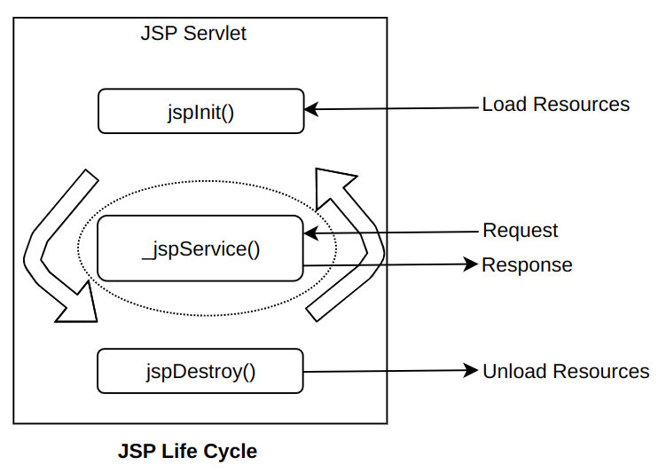

<!-- TOC start (generated with https://github.com/derlin/bitdowntoc) -->

- [Java Server Pages](#java-server-pages)
  - [What are Java Server Pages?](#what-are-java-server-pages)
  - [JSP Life Cycle](#jsp-life-cycle)
    - [Transalation and Compilation](#transalation-and-compilation)
    - [JSP Life Cycle Methods](#jsp-life-cycle-methods)
  - [JSP API](#jsp-api)
  - [Components of JSP](#components-of-jsp)
  - [1. Directives in JSP](#1-directives-in-jsp)
    - [(i) The Page Directive](#i-the-page-directive)
    - [(ii) The Include Directive](#ii-the-include-directive)
    - [(iii) The Taglib Directive](#iii-the-taglib-directive)
  - [2. Scripting Elements in JSP](#2-scripting-elements-in-jsp)
    - [(i) Declarations](#i-declarations)
    - [(ii) Expressions](#ii-expressions)
    - [(iii) Scriptlets](#iii-scriptlets)
  - [3. Action Elements in JSP](#3-action-elements-in-jsp)
  - [JSP Implicit Object](#jsp-implicit-object)
    - [1. out Object](#1-out-object)
    - [2. request Object](#2-request-object)
    - [3. response Object](#3-response-object)
    - [4. session Object](#4-session-object)
    - [5. application Object](#5-application-object)
    - [6. page Object](#6-page-object)
    - [7. pageContext Object](#7-pagecontext-object)
    - [8. config Object](#8-config-object)
    - [9. exception Object](#9-exception-object)
  - [JSP Standard Tag Library (JSTL)](#jsp-standard-tag-library-jstl)
    - [Introduction](#introduction)
    - [Types of JSTL tags](#types-of-jstl-tags)
    - [Important JSTL SQL Tags](#important-jstl-sql-tags)
  - [Exception Handling in JSP](#exception-handling-in-jsp)
    - [Types of Errors in JSP](#types-of-errors-in-jsp)
    - [Exception Handling](#exception-handling)
  - [Database Connectivity in JSP](#database-connectivity-in-jsp)
  - [Check your progress - 1](#check-your-progress---1)
  - [Check your progress - 2](#check-your-progress---2)
  - [Check your progress - 3](#check-your-progress---3)

<!-- TOC end -->

<!-- TOC --><a name="java-server-pages"></a>
# Java Server Pages

<!-- TOC --><a name="what-are-java-server-pages"></a>
## What are Java Server Pages?

- In Java, JSP stands for Java Server Pages. It is a server-side technology which is used for creating web applications.
- It is used to create dynamic web content. JSP consists of both HTML tags and JSP tags.
- In this, JSP tags are used to insert JAVA code into HTML pages. It is an advanced version of Servlet Technology i.e. a web-based technology that helps us to create dynamic and platform-independent web pages.
- In this, Java code can be inserted in HTML/ XML pages or both. JSP is first converted into a servlet by the JSP container before processing the client’s request.
- JSP has various features like JSP Expressions, JSP tags, JSP Expression Language, etc.

<!-- TOC --><a name="jsp-life-cycle"></a>
## JSP Life Cycle

<!-- TOC --><a name="transalation-and-compilation"></a>
### Transalation and Compilation

- When a JSP is first accessed, it is translated into a corresponding servlet (Java class) and compiled. The translation process is handled by the JSP engine of the underlying web container (e.g., Tomcat). The resulting servlet is then executed to handle incoming requests.

<!-- TOC --><a name="jsp-life-cycle-methods"></a>
### JSP Life Cycle Methods

- The life cycle of a JSP is controlled by three methods: **_jspInit()_**, **_\_jspService()_**, and **_jspDestroy()_**.
- **_jspInit()_**
  - **Purpose**: The jspInit() method is called only once during the life cycle of a JSP. Similar to the init() method in servlets, it is used to initialize objects and variables that persist throughout the life cycle of the JSP.
  - **Interface**:Defined in the JspPage interface
  - **Signature**:`public void jspInit() { // Initialization code }`
  - Invoked when the JSP page is initialized.
  - Takes no parameters, returns no value, and throws no exceptions.
- **_\_jspService() Method_**
  - **Purpose**: The \_jspService() method is called every time the JSP page is requested to serve a request.
    Corresponds to the body of the JSP page and should not be redefined by developers.
  - **Interface**:Defined in the javax.servlet.jsp.HttpJspPage interface.
  - **Signature**:
    ```
    public void _jspService(javax.servlet.http.HttpServletRequest request, javax.servlet.http.HttpServletResponse response) throws javax.servlet.ServletException, java.io.IOException {
            // services handling code
        }
    ```
  - Takes HttpServletRequest and HttpServletResponse objects as parameters.
  - Returns no value
- **_jspDestroy() Method_**
  - **Purpose**: The jspDestroy() method is invoked only once when the JSP page is about to be terminated. Similar to the destroy() method in servlets. Used for cleanup tasks, such as releasing database connections or closing open files.Corresponds to the body of the JSP page and should not be redefined by developers.
  - **Interface**:
  - **Signature**:`public void jspDestroy() { // cleanup code }`
  - Should be overridden if cleanup tasks are necessary.



<!-- TOC --><a name="jsp-api"></a>
## JSP API

- JSP technology relies on the JSP API (Application Programming Interface).
- Two primary packages are used: **javax.servlet.jsp** and **javax.servlet.jsp.tagext**.
- Additionally, servlet packages are required: **javax.servlet** and **javax.servlet.http**.

- Package **javax.servlet.jsp**: The javax.servlet.jsp package has two interfaces such as
  HttpJspPage and JspPage and four classes such as JspEngineInfo, JspFactory, JspWriter and
  PageContext.
- Package **javax.servlet.jsp.tagext**: The javax.servlet.jsp.tagext encompasses classes and
  interfaces for the definition of JSP Tag Libraries.The interfaces
  in the javax.servlet.jsp.tagext package are BodyTag, IterationTag, Tag, and TryCatchFinally.
  The classes are defined in this package such as BodyContent, BodyTagSupport, PageData,
  TagAttributeInfo, TagData, TagExtraInfo, TagInfo, TagLibraryInfo, TagLibraryValidator,
  TagSupport, TagvariableInfo and VariableInfo

| Interface/Class   | Description                                                                                                                                                                                                                                                                                                                                                                                                  |
| ----------------- | ------------------------------------------------------------------------------------------------------------------------------------------------------------------------------------------------------------------------------------------------------------------------------------------------------------------------------------------------------------------------------------------------------------ |
| **JspPage**       | The JspPage is the interface that all JSP servlet classes must implement. The JspPage interface has two methods, `JspInit` and `JspDestroy`. The `jspInit` method is similar to the `init` method in the `javax.servlet.Servlet` interface. The `jspDestroy` method is analogous to the `destroy` method of the `javax.servlet.Servlet` interface. JSP developers rarely make full use of these two methods. |
| **HttpJspPage**   | The HttpJspPage interface directly extends the JspPage interface. Each JSP page implements this interface. It supports only one method `_jspService()`. The `_jspService()` method is already described in the life cycle of JSP in section 4.3 of this Unit.                                                                                                                                                |
| **JspEngineInfo** | The JspEngineInfo is an abstract class that provides information on the current JSP engine.                                                                                                                                                                                                                                                                                                                  |
| **JspFactory**    | The JspFactory is an abstract class that defines a number of factory methods available to a JSP page at runtime for the purposes of creating instances of various interfaces and classes used to support the JSP implementation.                                                                                                                                                                             |
| **JspWriter**     | The JspWriter class is derived from the `java.io.Writer` class. This is the normal mechanism for JSP pages to produce output to the response. A number of methods are defined in this class such as `print()` and `println()`.                                                                                                                                                                               |
| **PageContext**   | The PageContext class is an abstract class. It extends JspContext to provide useful context information when JSP technology is used in a servlet environment. This class provides methods that are used to create other objects. For example, `getServletConfig()` returns a `ServletConfig` object and `getServletContext()` returns a `ServletContext` object.                                             |
| **JspException**  | The JspException is the base class for all JSP exceptions.                                                                                                                                                                                                                                                                                                                                                   |
| **JspError**      | The JspError class is defined in the `javax.servlet.jsp` package of the JSP API.                                                                                                                                                                                                                                                                                                                             |

<!-- TOC --><a name="components-of-jsp"></a>
## Components of JSP

- There are three types of JSP components: **1. Directives**, **2. Scripting**, **3. Action**

<!-- TOC --><a name="1-directives-in-jsp"></a>
## 1. Directives in JSP

- Directives guide the JSP container for translating and compilation of JSP page.
- It appears at the top of the page. Using directives, the container translates a JSP page into the
  corresponding servlet.
- Directives are defined by using `<%@` and `%>` tags.
- Syntax: `<%@ directive attribute = "value" %>`
- There are three types of directive tag −

  (i) `<%@ page ... %>` : Defines page-dependent attributes, such as scripting language, error page, and buffering requirements.

  (ii) `<%@ include ... %>`: Includes a file during the translation phase.

  (iii) `<%@ taglib ... %>`: Declares a tag library, containing custom actions, used in the page

<!-- TOC --><a name="i-the-page-directive"></a>
### (i) The Page Directive

- The page directive is used to provide instructions to the container. These instructions pertain to the current JSP page. You may code page directives anywhere in your JSP page. By convention, page directives are coded at the top of the JSP page.
- Syntax:
  `<%@ page attribute = "value" %>`
- **Attributes**

| S.No | Attribute          | Purpose                                                                                                        |
| ---- | ------------------ | -------------------------------------------------------------------------------------------------------------- |
| 1    | buffer             | Specifies a buffering model for the output stream.                                                             |
| 2    | autoFlush          | Controls the behavior of the servlet output buffer.                                                            |
| 3    | contentType        | Defines the character encoding scheme.                                                                         |
| 4    | errorPage          | Defines the URL of another JSP that reports on Java unchecked runtime exceptions.                              |
| 5    | isErrorPage        | Indicates if this JSP page is a URL specified by another JSP page's errorPage attribute.                       |
| 6    | extends            | Specifies a superclass that the generated servlet must extend.                                                 |
| 7    | import             | Specifies a list of packages or classes for use in the JSP as the Java import statement does for Java classes. |
| 8    | info               | Defines a string that can be accessed with the servlet's getServletInfo() method.                              |
| 9    | isThreadSafe       | Defines the threading model for the generated servlet.                                                         |
| 10   | language           | Defines the programming language used in the JSP page.                                                         |
| 11   | session            | Specifies whether or not the JSP page participates in HTTP sessions.                                           |
| 12   | isELIgnored        | Specifies whether or not the EL expression within the JSP page will be ignored.                                |
| 13   | isScriptingEnabled | Determines if the scripting elements are allowed for use.                                                      |

- Example :
  ```
  <%@ page import=”java.io.*, java.util.Date” buffer=”16k” autoFlush=”false” % >
  <%@ page errorPage=”error.jsp” %>
  ```

<!-- TOC --><a name="ii-the-include-directive"></a>
### (ii) The Include Directive

- JSP include directive is used to include files such as HTML, JSP into the current JSP document at the translation time. It means that it enables you to import the content of another static file into a current JSP page. The advantage of using an include directive is to take advantage of code re-usability. This directive can appear anywhere in a JSP document.
- Syntax:
  `<%@ include file = "relative url" >`
- The filename in the include directive is actually a relative URL. If you just specify a filename with no associated path, the JSP compiler assumes that the file is in the same directory as your JSP.
- Example:

  `header.html`

  ```
  <html>
    <body>
        <h4>The text is from Header File</h4>
    </body>
  </html>
  ```

  `index.jsp`

  ```
  <html>
    <body>
        <h4>Example of include directive</h4>
        <%@ include file= "header.html" %>
    </body>
  </html>
  ```

  **Output:** _localhost:8080/exampleproject/index.jsp_

  ```
  Example of include directive
  The text is from Header File
  ```

<!-- TOC --><a name="iii-the-taglib-directive"></a>
### (iii) The Taglib Directive

- This directive allows users to use Custom tags in JSP.
- A custom tag is **user-defined tag**. The custom tag eliminates the need for scriptlet tag.
- Syntax:
  `<%@ taglib uri=”tagLibraryURI” prefix=”tagPrefix” %>`

<!-- TOC --><a name="2-scripting-elements-in-jsp"></a>
## 2. Scripting Elements in JSP

- JSP scripting elements is a mechanism for **_embedding java code fragments_** directly into a HTML page.
- There are three scripting language elements such as

  (i) **declarations**: To declare the variables and methods for the page.
  (ii) **expressions**: To return a value from the scripting code as String to the page.
  (iii) **scriptlets**: To execute java source code.

<!-- TOC --><a name="i-declarations"></a>
### (i) Declarations

- Declarations are used **_to declare the variables and methods_** that we can use in the JSP document.
- The declaration part is initialized when the JSP document is initialized.
- After the declarations have been initialized, they are available to other expressions,declarations and scriptlets.
- Syntax:
  `<%! declaration %>`
- Example:

  **Declaring variable**

  ```
  <html>
    <body>
        <%! int data=50; %>
        <%= "Value of the variable is:"+data %>
    </body>
  </html>
  ```

  **Declaring Methods**

  ```
  <html>
    <body>
        <%!
            int cube(int n){
                return n*n*n*;
            }
        %>
        <%= "Cube of 3 is:"+cube(3) %>
    </body>
    </html>
  ```

<!-- TOC --><a name="ii-expressions"></a>
### (ii) Expressions

- The code placed within JSP expression tag is **written to the output stream of the response.** So you need not write out.print() to write data. It is mainly used to print the values of variable or method.
- Syntax:
  `<%=  statement %>`
- **_Do not end your statement with semicolon_** in case of expression tag.
- Example:

```
<html>
    <body>
        Current Time: <%= java.util.Calendar.getInstance().getTime() %>
    </body>
</html>
```

<!-- TOC --><a name="iii-scriptlets"></a>
### (iii) Scriptlets

- A scriplet is used to execute java source code in JSP.
- It is executed at the request time and makes use of declarations, expressions and java beans.
- We can write scriptlets anywhere anywhere in a page.
- Syntax:
  `<%  java source code %>`
- Note:**_Semicolon at the end of scriptlet is necessary_**.
- Example

  `index.html`

  ```
  <html>
    <body>
        <form action="welcome.jsp">
            <input type="text" name="uname">
            <input type="submit" value="go"><br/>
        </form>
    </body>
  </html>
  ```

  `welcome.jsp`

  ```
  <html>
    <body>
    <%
        String name=request.getParameter("uname");
        out.print("welcome "+name);
    %>
    </body>
  </html>
  ```

<!-- TOC --><a name="3-action-elements-in-jsp"></a>
## 3. Action Elements in JSP

<!-- TOC --><a name="jsp-implicit-object"></a>
## JSP Implicit Object

- JSP Implicit objects or predefined variables are the java objects that you can use directly without being declared first in scriptlets of JSP document. JSP implicit objects are created during the translation phase of JSP to the servlet. These variables are automatically available for the JSP page developer to use.

- There are **9 implicit objects**

| S.No | Implicit Object | Type                              | Scope       |
| ---- | --------------- | --------------------------------- | ----------- |
| 1    | out             | javax.servlet.jsp.JspWriter       | Page        |
| 2    | request         | javax.servlet.HttpServletRequest  | Request     |
| 3    | response        | javax.servlet.HttpServletResponse | Page        |
| 4    | session         | javax.servlet.http.HttpSession    | Session     |
| 5    | application     | javax.servlet.ServletContext      | Application |
| 6    | page            | javax.servlet.jsp.HttpJspPage     | Page        |
| 7    | pageContext     | javax.servlet.jsp.pageContext     | Page        |
| 8    | config          | javax.servlet.http.servletConfig  | Page        |
| 9    | exception       | java.lang.throwable               | Page        |

<!-- TOC --><a name="1-out-object"></a>
### 1. out Object

- For writing any data to the buffer, JSP provides an implicit object named out. It is the object of JspWriter.
- Example:

```
<html>
    <body>
        <% out.print("Today is:"+java.util.Calendar.getInstance().getTime()); %>
    </body>
</html>
```

<!-- TOC --><a name="2-request-object"></a>
### 2. request Object

- The JSP request is an implicit object of type HttpServletRequest i.e. created for each jsp request by the web container. It can be used to get request information such as parameter, header information, remote address, server name, server port, content type, character encoding etc.
- It can also be used to set, get and remove attributes from the jsp request scope.
- Example

  `index.html`

  ```
  <html>
    <body>
        <form action="welcome.jsp">
            <input type="text" name="uname">
            <input type="submit" value="go"><br/>
        </form>
    </body>
  </html>
  ```

  `welcome.jsp`

  ```
  <html>
    <body>
    <%
        String name=request.getParameter("uname");
        out.print("welcome "+name);
    %>
    </body>
  </html>
  ```

<!-- TOC --><a name="3-response-object"></a>
### 3. response Object

- In JSP, response is an implicit object of type HttpServletResponse. The instance of HttpServletResponse is created by the web container for each jsp request.
- It can be used to add or manipulate response such as redirect response to another resource, send error etc.
- Example

  `index.html`

  ```
  <html>
    <body>
        <form action="welcome.jsp">
            <input type="text" name="uname">
            <input type="submit" value="go"><br/>
        </form>
    </body>
  </html>
  ```

  `welcome.jsp`

  ```
  <%
    response.sendRedirect("http://www.google.com");
  %>
  ```

<!-- TOC --><a name="4-session-object"></a>
### 4. session Object

- In JSP, session is an implicit object of type HttpSession.The Java developer can use this object to set,get or remove attribute or to get session information.
- This object is most often used when there is a need to share information between requests
  for a single user. It is used to store the user’s data to make it available on other JSP
  pages until the user session is active. This object is used to track the user information
  in the same session.
- Example

  `index.html`

  ```
  <html>
    <body>
        <form action="welcome.jsp">
            <input type="text" name="uname">
            <input type="submit" value="go"><br/>
        </form>
    </body>
  </html>
  ```

  `welcome.jsp`

  ```
    <html>
        <body>
            <%

                String name=request.getParameter("uname");
                out.print("Welcome "+name);

                session.setAttribute("user",name);

                <a href="second.jsp">second jsp page</a>

            %>
        </body>
    </html>
  ```

  `second.jsp`

  ```
  <html>
    <body>
        <%

            String name=(String)session.getAttribute("user");
            out.print("Hello "+name);

        %>
    </body>
  </html>
  ```

<!-- TOC --><a name="5-application-object"></a>
### 5. application Object

<!-- TOC --><a name="6-page-object"></a>
### 6. page Object 

<!-- TOC --><a name="7-pagecontext-object"></a>
### 7. pageContext Object 

<!-- TOC --><a name="8-config-object"></a>
### 8. config Object

<!-- TOC --><a name="9-exception-object"></a>
### 9. exception Object 

<!-- TOC --><a name="jsp-standard-tag-library-jstl"></a>
## JSP Standard Tag Library (JSTL)

<!-- TOC --><a name="introduction"></a>
### Introduction

- JSP Standard Tag Library (JSTL) is a collection of useful JSP tags to simplify JSP development.
- It helps improve readability and maintainability of JSP pages compared to scriptlets.
- JSTL includes tags for core functions, formatting, SQL operations, XML manipulation, and common functions.

<!-- TOC --><a name="types-of-jstl-tags"></a>
### Types of JSTL tags

1. **Core Tags**
   - Used for common tasks such as iteration, conditionals, and URL management.
   - To use core tags in JSP, include:
   ```
   <%@ taglib prefix="c" uri="http://java.sun.com/jsp/jstl/core" %>
   ```
2. **Formatting Tags**
   - Provide support for message formatting, number formatting, and date formatting.
   - To use formatting tags in JSP, include:
   ```
   <%@ taglib prefix="fmt" uri="http://java.sun.com/jsp/jstl/fmt" %>
   ```
3. **XML tags**
   - Provide support for creating and manipulating XML documents.
   - Include tags for parsing XML, transforming XML data, and flow control based on XPath expressions.
   - To use XML tags in JSP, include:
   ```
   <%@ taglib prefix="x" uri="http://java.sun.com/jsp/jstl/xml" %>
   ```
4. **Functions**
   - Include standard functions, mainly for string manipulation.
   - To use functions in JSP, include:
   ```
   <%@ taglib prefix="fn" uri="http://java.sun.com/jsp/jstl/functions" %>
   ```
5. **SQL Tags**
   - Provide tags to access and manipulate databases like Oracle, MySQL, or Microsoft SQL Server.
   - To use SQL tags in JSP, include:
   ```
   <%@ taglib prefix="sql" uri="http://java.sun.com/jsp/jstl/sql" %>
   ```

<!-- TOC --><a name="important-jstl-sql-tags"></a>
### Important JSTL SQL Tags

1. `sql:setDataSource` Tag

   - Used to create a DataSource configuration that can be used in other JSTL database actions.
   - Example usage:

   ```
   <sql:setDataSource var="db" driver="com.mysql.cj.jdbc.Driver"
                  url="jdbc:mysql://localhost:3306/exampleDB"
                  user="root" password="password" />
   ```

   - **_Attributes_**:
     - **var**: Optional. Stores the DataSource configuration in a variable.
     - **driver**: Required. JDBC driver class name.
     - **url**: Required. JDBC URL associated with the database.
     - **user**: Optional. Database username.
     - **password**: Optional. Database password.

2. `sql:query` Tag
   - Used to execute SQL queries.
   - Example usage:

```
  <sql:query dataSource="${db}" var="result">
    SELECT ProgCode, Prname FROM programme;
 </sql:query>
```

- **_Attributes_**:
  - **var**: Required. Stores the query result in a variable.
  - **sql**: Optional. Specifies the SQL statement to execute.
  - **dataSource**: Optional. Specifies the data source.

<!-- TOC --><a name="exception-handling-in-jsp"></a>
## Exception Handling in JSP

<!-- TOC --><a name="types-of-errors-in-jsp"></a>
### Types of Errors in JSP

- **Translation/Compilation Errors**:
  - Occur when the JSP page is translated from a JSP source file to a Java Servlet class file.
  - Detected at compile time.
- **Request Time Errors**
  - Occur during runtime or request time.
  - Result in exceptions that need to be handled.

<!-- TOC --><a name="exception-handling"></a>
### Exception Handling

1. **errorPage and isErrorPage Attributes of the Page Directive**

- **errorPage**: Specifies the URL of the error page to be displayed if an exception occurs.
- Example:
  ```
  <%@ page errorPage="error.jsp" %>
  ```
- **isErrorPage**:Indicates whether the current page can act as an error page.
- Example:
  ```
  <%@ page isErrorPage="true" %>
  ```
- On the error page, we can access the exception object using the implicit exception object:
- Example:
  ```
  <h2>Error Information</h2>
  <p><%= exception %></p>
  ```

2. **`<error-page>` Tag in Deployment Descriptor (web.xml)**

- Defines error handling at the application level.
- Configures specific pages to handle exceptions or HTTP error codes.
- Example configuration in web.xml.

```
<error-page>
  <exception-type>java.lang.Throwable</exception-type>
  <location>/error.jsp</location>
</error-page>
<error-page>
  <error-code>404</error-code>
  <location>/404.jsp</location>
</error-page>
```

- `<exception-type>`: Specifies the type of exception to be handled.
- `<error-code>`: Specifies the HTTP error code to be handled.
- `<location>`: Specifies the location of the error page.

3. **try and catch Block in Scriptlet**
   - Used to handle exceptions within the scriptlet code
   - Allows fine-grained control over exception handling in specific parts of the JSP code.
   - Example
     ```
     <%
        try {
            // Code that may throw an exception
        } catch (Exception e) {
            out.println("An error occurred: " + e.getMessage());
        }
      %>
     ```

<!-- TOC --><a name="database-connectivity-in-jsp"></a>
## Database Connectivity in JSP

- Ensure you have the JDBC driver for your database (e.g., MySQL) in your classpath.
- Set up your database and table
- JSP Code

```
<%@ page import="java.sql.*" %>
<%@ page import="java.io.*" %>
<%
    // Database connection details
    String url = "jdbc:mysql://localhost:3306/exampleDB";
    String username = "root";  // Replace with your DB username
    String password = "password";  // Replace with your DB password

    Connection conn = null;
    PreparedStatement pstmt = null;
    ResultSet rs = null;

    try {
        // Load the JDBC driver
        Class.forName("com.mysql.cj.jdbc.Driver");

        // Establish a connection
        conn = DriverManager.getConnection(url, username, password);

        // Check if form data is submitted for insertion
        String name = request.getParameter("name");
        String email = request.getParameter("email");

        if (name != null && email != null) {
            // Insert the data into the database
            String insertSQL = "INSERT INTO users (name, email) VALUES (?, ?)";
            pstmt = conn.prepareStatement(insertSQL);
            pstmt.setString(1, name);
            pstmt.setString(2, email);
            pstmt.executeUpdate();
        }

        // Retrieve data from the database
        String selectSQL = "SELECT * FROM users";
        pstmt = conn.prepareStatement(selectSQL);
        rs = pstmt.executeQuery();
%>
<html>
<head>
    <title>Database Example</title>
</head>
<body>
    <h2>Insert User</h2>
    <form method="post" action="database.jsp">
        Name: <input type="text" name="name" required>
        Email: <input type="email" name="email" required>
        <input type="submit" value="Submit">
    </form>

    <h2>Users List</h2>
    <table border="1">
        <tr>
            <th>ID</th>
            <th>Name</th>
            <th>Email</th>
        </tr>
        <%
            while (rs.next()) {
                int id = rs.getInt("id");
                String userName = rs.getString("name");
                String userEmail = rs.getString("email");
        %>
        <tr>
            <td><%= id %></td>
            <td><%= userName %></td>
            <td><%= userEmail %></td>
        </tr>
        <%
            }
        %>
    </table>
</body>
</html>
<%
    } catch (Exception e) {
        e.printStackTrace();
    } finally {
        // Close resources
        try { if (rs != null) rs.close(); } catch (SQLException e) { e.printStackTrace(); }
        try { if (pstmt != null) pstmt.close(); } catch (SQLException e) { e.printStackTrace(); }
        try { if (conn != null) conn.close(); } catch (SQLException e) { e.printStackTrace(); }
    }
%>
```

<!-- TOC --><a name="check-your-progress-1"></a>
## Check your progress - 1

1. Write the basic steps for processing JSP request.
2. Write a JSP program for Fibonacci Series.
3. Write a JSP program using Scriptlets that add numbers from 1 to 10 and prints this result.

<!-- TOC --><a name="check-your-progress-2"></a>
## Check your progress - 2

1. What is the purpose of action elements in JSP?
2. Write and explain the various bean scopes.
3. Explain the application implicit object with example.

<!-- TOC --><a name="check-your-progress-3"></a>
## Check your progress - 3

1. What is the use of JSTL tags in JSP?
2. What is JSP error page?
3. Explain the use of deployment descriptor in JSP.