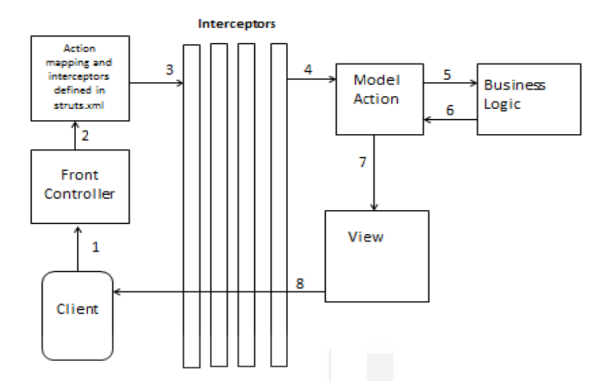
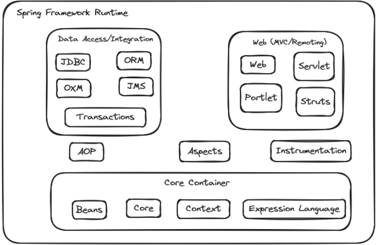
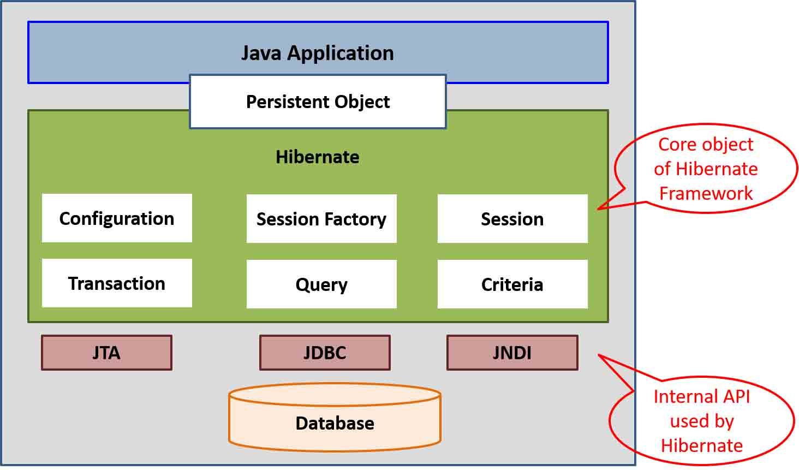

<!-- TOC start (generated with https://github.com/derlin/bitdowntoc) -->

- [Introduction to J2EE Frameworks](#introduction-to-j2ee-frameworks)
  - [Struts](#struts)
    - [Struts2 features](#struts2-features)
    - [Struts 2 - Core Components](#struts-2---core-components)
    - [Working and Flow of Struts-2](#working-and-flow-of-struts-2)
    - [Struts 2 Features and Configuration](#struts-2-features-and-configuration)
  - [Spring Framework](#spring-framework)
    - [Key features/Benefits and components of the Spring Framework include:](#key-featuresbenefits-and-components-of-the-spring-framework-include)
    - [Explained](#explained)
  - [Spring MVC](#spring-mvc)
  - [Spring Boot](#spring-boot)
    - [Application Development Components](#application-development-components)
    - [Advantages of Spring Boot](#advantages-of-spring-boot)
  - [Java Annotations](#java-annotations)
    - [Applications of Java Annotations](#applications-of-java-annotations)
    - [Built-in Java Annotations](#built-in-java-annotations)
    - [Examples](#examples)
    - [Java Custom Animations](#java-custom-animations)
  - [Hibernate with Java Persistence API(JPA)](#hibernate-with-java-persistence-apijpa)
    - [Object-Relational Mapping (ORM) Frameworks:](#object-relational-mapping-orm-frameworks)
    - [Hibernate](#hibernate)
    - [Java Persistence API (JPA)](#java-persistence-api-jpa)
    - [Hibernate Architecture](#hibernate-architecture)
    - [Object States in Hibernate](#object-states-in-hibernate)
    - [State Transition](#state-transition)
    - [Hibernate Framework Advantages](#hibernate-framework-advantages)
    - [Java Persistence API (JPA)](#java-persistence-api-jpa-1)
    - [Java Persistence Query Language (JPQL)](#java-persistence-query-language-jpql)
    - [Example of Database using Hibernate and JPA](#example-of-database-using-hibernate-and-jpa)
  - [Check Your Progress - 1](#check-your-progress---1)
  - [Check Your Progress - 2](#check-your-progress---2)
  - [Check Your Progress - 3](#check-your-progress---3)

<!-- TOC end -->

<!-- TOC --><a name="introduction-to-j2ee-frameworks"></a>
# Introduction to J2EE Frameworks

<!-- TOC --><a name="struts"></a>
## Struts

***Struts 1***
- Open-source framework for developing Java EE web applications.
- Created by Craig McClanahan and later given to the Apache Foundation.
- WebWork framework initially developed independently, based on Struts, to provide additional features.
- Eventually, Struts 1 and WebWork reunited to form Apache Struts 2.

***Apache Struts 2.x***
- Web application framework based on OpenSymphony.
- Supports the complete application development cycle from build to maintenance.
- Utilizes the Model-View-Controller (MVC) design pattern.

***MVC Architecture in Struts 2***
- **Model**: Handles the application logic and interacts with the database.
- **View**: Responsible for presenting data to the client in the form of HTML pages.
- **Controller**: Manages instances or code that facilitates communication between the Model and View.

***Advantages of Struts 2***
-  MVC architecture isolates application logic from the user interface, improving maintainability.
-  Provides a structured approach to web application development.
-  Supports the complete development lifecycle.

***Issues with Traditional Approaches***
- In typical Java web applications, client-server communication involves a web form, Java Servlet, and JSP.
- Mixing application logic with presentation in these approaches can lead to maintenance challenges in larger projects.

***Struts 2 as a Solution***
- Struts 2 addresses the issues by adopting an MVC architecture.
- Application logic is separated from the user interface layer, enhancing maintainability.
- The Model handles database interactions, the View presents data in HTML, and the Controller facilitates communication between them.

***Conclusion***
- Apache Struts 2.x is a robust web application framework with an MVC architecture.
- It builds on the strengths of Struts 1 and WebWork, providing a structured and maintainable approach to Java EE web development.

<!-- TOC --><a name="struts2-features"></a>
### Struts2 features
- **POJO Forms and POJO Actions**: Struts 2 allows the use of Plain Old Java Objects (POJOs) for form input or Action classes. Developers are not required to implement interfaces or inherit from specific classes.
- **Tag Support**: Introduces new tags that reduce the amount of code developers need to write. Enhances code efficiency, especially in the context of form tags.
- **AJAX Support**: Struts 2 supports asynchronous requests using AJAX tags. Enables improved performance by sending only the necessary field data, avoiding unnecessary information.
- **Easy Integration**: Facilitates easy integration with other frameworks such as Spring, Tiles, Hibernate, etc.Provides flexibility in combining Struts 2 with existing technologies.
- **Template and Plugin Support**: Supports the creation of views using templates. Allows the use of plugins to enhance performance and extend functionality.
- **Profiling**: Supports debugging through integrated debugging and profiling tools.Provides in-built tools for effective debugging during development.
- **Easy Modification of Tags**:Struts 2 enables easy modification of tags with basic knowledge of HTML, XML, and CSS. Offers flexibility in customizing tags to meet specific project requirements.
- **Promotes Less Configuration**:Supports default values for various settings, reducing the need for extensive configuration. Provides ease of access and simplifies the development process.
- **View Technologies**: Struts 2 supports multiple view options, including JSP, Freemarker, Velocity, etc. Allows developers to choose the most suitable view technology for their specific needs.
- **Client-Controller Interaction**:The client sends requests in the form of "Actions" to the Controller based on specifications. The Controller invokes the corresponding Action class to interact with the respective model code. The result is an "ActionForward" string containing output page information, which is sent back to the client for reference.

<!-- TOC --><a name="struts-2-core-components"></a>
### Struts 2 - Core Components
- **Model**
  - Business class where calls to business logic are implemented with actions.
  - Executed with interceptors that intercept specific-purpose requests.
  - Dispatch servlet filter acts as the Front Controller between the framework and the client.
- **View(JSP/HTML)**
  - Represents the presentation layer.
  - Utilizes result types and results to express the MVC pattern.
  - Can use JSP pages, Velocity templates, or other presentation-layer technologies.
- **Controller(Action Class)**
  - Action class characterizes the Controller in the MVC pattern.
  - Routes incoming HTTP requests to the appropriate action, mapping requests to actions.
  - Value stack and Object Graph Navigation Language (OGNL) link with other components.
- **Configuration Files**
  - Creates configuration files (e.g., struts.xml, web.xml, struts.properties) to couple Action, View, and Controllers.
  - struts.xml overrides default settings, while struts.properties modifies framework behavior. Located in the WEB-INF/classes directory.
- **Action**
  - Contains an action class controlling user interaction, the Model, and the View.
  - Holds complete business logic and facilitates data processing.
  - Three methods to create an Action class: simple action class, implementing action interface, or extending ActionSupport class.
- **Interceptors**
  - Part of the Controller, creates or uses interceptors for common actions (e.g., session logging, validation).
  - Executed before and after processing requests.
  - Pluggable, allowing removal without redeploying by editing the struts.xml file.
- **VALUESTACK**
  - Storage area used to store associated data during processing.
  - Stores temporary, Model, Action, and Named objects.
- **Object Graph Navigation Language (OGNL)**
  - Retrieves VALUESTACK data and assists in converting data types.
- **StrutsPrepareAndExecuteFilter**
  - Acts as the Front Controller in Struts 2.
  - Controller component acts first in processing.
  - Pull-MVC based architecture where data is stored in ValueStack and rendered by the view layer.
- **Servlet Filter Object**
  - Scans and regulates each incoming request, determining URL-to-action mappings.

***Note***:Struts 2 employs a Pull-MVC architecture, where the data is stored in the ValueStack and rendered by the view layer. The StrutsPrepareAndExecuteFilter serves as the Front Controller, determining the action to be taken based on the incoming request. Configuration is handled through XML-based files or Java annotations.

<!-- TOC --><a name="working-and-flow-of-struts-2"></a>
### Working and Flow of Struts-2
- **Client Request**:The client/user sends an HTTP resource request to the server.
- **Servlet Container**:The request reaches the Servlet Container.
- **Web Container Verification**:Web Container loads the web.xml and verifies the URL pattern. If the pattern matches, the Web Container forwards the request to StrutsPrepareAndExecuteFilter (Front Controller).
- **Front Controller (StrutsPrepareAndExecuteFilter)**:Based on the request URL mapping in struts.xml, the StrutsPrepareAndExecuteFilter identifies the appropriate action class to execute.
- **Interceptors**:Before the Action class is executed, the request passes through a stack of interceptors.Interceptors allow the execution of common tasks defined in clean, reusable components (e.g., workflow, validation, file upload) separate from action code.
- **Action Class Execution**:The identified action class calls the business logic.Action is executed through action methods that perform database operations, such as storing or retrieving data.
- **Processed Data Return**:Processed data from the business logic is sent back to the Action class.
- **Controller Identifies View**:Based on the result, the Controller identifies the View to be rendered.Before the response is generated, the stack of interceptors is executed again in reverse order, performing clean-up tasks.
- **View Rendering**:The View is rendered to the user through the servlet controller.

<!-- TOC --><a name="struts-2-features-and-configuration"></a>
### Struts 2 Features and Configuration
- Struts 2 offers various methods to create Action classes.
- Allows customization through interceptors for common tasks.
- Supports converters for rendering result pages.
- Configuration can be done using struts.xml or annotations.
- Utilizes tags and Object Graph Navigation Language (OGNL) expression language for building web applications in Java.



<!-- TOC --><a name="spring-framework"></a>
## Spring Framework
- The Spring Framework is a comprehensive and modular framework for developing enterprise applications in Java. It provides a set of features and capabilities that address various aspects of Java application development, promoting good design practices, modularity, and ease of testing.
  
<!-- TOC --><a name="key-featuresbenefits-and-components-of-the-spring-framework-include"></a>
### Key features/Benefits and components of the Spring Framework include:
- **POJO**: It allows developers to use POJOs for enterprise-class applications development, making them evade using an EJB container like an application server instead of using a servlet container like Tomcat.
- **Modular**:It supports a large number of modules, and due to the modular nature of Spring, the developer considers only the one they require for the development.
- **Integration**:It offers good integration with existing frameworks like ORM, logging frameworks and other view technologies etc.
- **Model-View-Controller (MVC) Framework**:Spring MVC is a web module within the Spring Framework that follows the MVC design pattern. It provides a flexible and powerful framework for building web applications.
- **Inversion of Control (IoC) / Dependency Injection (DI)**:Spring's IoC container manages the creation and configuration of objects in an application. It promotes the principle of Dependency Injection, where the dependencies of a class are injected from the outside, making the code more modular, testable, and loosely coupled.
- **Aspect-Oriented Programming (AOP)**:Spring supports AOP, allowing developers to separate cross-cutting concerns (e.g., logging, security, transaction management) from the main business logic. AOP enables cleaner code by encapsulating aspects that cut across multiple modules.
- **Data Access**:Spring provides a comprehensive data access framework that simplifies database interactions. It includes support for both JDBC (Java Database Connectivity) and Object-Relational Mapping (ORM) frameworks like Hibernate.
- **Testing**:Spring's design encourages writing testable code. The use of interfaces, dependency injection, and other features makes it easier to write unit tests and perform integration testing.
- **Transaction Management**:It provides proper scalability for the consistent transaction management interface. It supports a global transaction to local transactions by scaling up and down as required.
- **Lightweight**:It is lightweight compared to EJB containers and is very efficient with low resources like memory and CPU to develop and deploy applications.



<!-- TOC --><a name="explained"></a>
### Explained
- **Core Container**: Contains Beans, Core, Context, Expression Language
  - **Beans**: It offers BeanFactory for the factory pattern implementation, responsible for creating and managing the context structure unit.
  - **Core**: It offers critical parts, like Dependency Injection / Inversion of Control features.
  - **Context**: It offers and ApplicationContext interface to access any object. It is built on a core and beans module base and inherits features from there.
  - **Expression Language**: It offers object graph querying and manipulating at runtime through a powerful expression language.
- **Data Access/Integration Layer**:Contains JDBC(Java Database Connectivity), ORM(Object Relational Mapping), Object XML, JMS(Java Messaging Services) and Transaction module.
  - **JDBC**: It eases access by reducing tedious JDBC coding of manually connecting the database.
  - **ORM**: It offers an integration layer supporting object-relational mapping APIs like JPA, JDO, Hibernate etc.
  - **OXM**: It offers an abstraction layer for linking Object/XML mapping implementations for JAXB, XMLBeans, XStream etc. 
  - **JMS**: It offers offers features for creating, sending receiving messages. 
  - **Transaction**: It offers transaction management for programmatic and declarative classes with POJOs interfaces.
- **Web Layer**:Contains Web, Web-MVC, Web-Socket, and Web-Portlet modules.
  - **Web**: It offers elementary features like uploading/downloading files, intializing the IOC container using Servlet listeners, creating a web application etc.
  - **Web-MVC**: It offers implementation for web applications through Spring MVC.
  - **Web-Socket**: It provides client-server communication using WebSocket-based support in web applications. 
  - **Web-Portlet**: It offers the Model-View-Controller implementation with a portlet environment and mirrors the Web-Servlet module functionality. 
- **Miscellaneous Modules**:Contains AOP, Aspects and Instrumentation
  - **AOP**: It offers aspect-oriented programming capabilities.
	- **Aspects**: It offers robust AOP framework integration AspectJ. 
  - **Instrumentation**: It offers provision to the class instrumentation and loader in the server applications. 

<!-- TOC --><a name="spring-mvc"></a>
## Spring MVC
- **Framework Overview**
  - Java-based MVC framework.
  - Follows MVC design pattern.
  - Promotes loose coupling of input logic, business logic, and UI logic.
  - Implements features like Inversion of Control (IoC), Dependency Injection.
  - Utilizes DispatcherServlet for optimized request handling.
- **MVC Pattern**
  - **Model**: Interacts with the database, encapsulates application data.
  - **View**: Displays data as HTML pages to the client.
  - **Controller**: Manages communication between Model and View.
- **DispatcherServlet Workflow**
  - Handles all HTTP requests and responses.
  - Retrieves handler mapping information.
  - Calls appropriate Controller, which invokes business logic service methods.
  - Determines the View based on configured ViewResolver.
  - Passes Model data to the chosen View for rendering.
- **Spring MVC Configuration**
  - Add spring context and spring web MVC dependencies.
  - Configure DispatcherServlet in web.xml for request handling.
  - Define beans for annotations and configure view resolver.
  - Set up web request mappings to handle client requests.
- **Advantages of Spring MVC**:
  - **Separate Roles**: Different components in the ApplicationContext fulfill specific roles.
  - **Lightweight**: Uses a lightweight servlet container for development and deployment.
  - **Robust Configuration**: Provides strong configuration options for both framework and application classes.
  - **Reusable Business Code**: Enables the reuse of existing code instead of creating new objects.


<!-- TOC --><a name="spring-boot"></a>
## Spring Boot
- **Purpose**
  - Addresses configuration overhead in Spring for scalable applications.
  - Provides an efficient solution for developing production-ready, stand-alone Spring-based applications.
- **Features**
  - Built on top of the Spring framework.
  - Offers Rapid Application Development (RAD) for web-based or straightforward applications.
  - Minimal configuration efforts required.
  - Default configuration ("Opinionated Defaults Configuration") for code and annotations.
  - Supports code-reusability through Spring Boot Batch for transaction management, logs, job processing statistics, etc.
- **Integration and Configuration**
  - Integrates with Spring Framework and Embedded Servers like Tomcat.
  - No need for XML configuration, reducing development time and cost.
  - Auto-configuration tool: Automatically configures using web jars, fast module setup, and easy modification.

<!-- TOC --><a name="application-development-components"></a>
### Application Development Components
- **Spring Boot Starter**
  - Convenient descriptors aggregating dependencies for enhanced productivity.
  - Ensures required libraries are added to the build.
- **Spring Boot Autoconfiguration**
  - Automatically configures the Spring application based on classpath parameter dependencies.
  - Facilitates fast and easy development.
- **Spring Initializer**
  - Web application for creating a skeleton project automatically, reducing development time.
  - Quick start for new projects using the web interface "Spring Initializr."
- **Spring Boot Actuator**
  - Monitors and manages the application for production and debugging.
  - Controls the application using HTTP endpoints.
  - Provides insights into the running Spring Boot application.
  - Enables by adding the dependency `spring-boot-starter-actuator`.
- **Spring Boot CLI**
  - Allows writing Groovy Spring Boot applications with concise code.
  - Eliminates the need for traditional project build processes.

<!-- TOC --><a name="advantages-of-spring-boot"></a>
### Advantages of Spring Boot
- **Stand-alone**
  - Capable of creating stand-alone applications.
- **Embedded HTTP Servers**
  - Eliminates the need for deploying WAR files.
  - Testing of web applications can be quickly done using embedded HTTP servers.
- **CLI Tools**
  - CLI tools available for developing and testing applications.
- **Better Productivity**
  - No requirement for XML configuration, reducing development time and improving productivity.
- **Plugins**
  - Numerous plugins available for application development and testing.
- **Autoconfiguration**
  - Automatically configures classes based on project requirements.
- **Starter**
  - The Starter concept in the `pom.xml` file ensures all required JAR dependencies are downloaded based on application requirements.

<!-- TOC --><a name="java-annotations"></a>
## Java Annotations
- Java Annotations are a form of syntactic metadata in Java programming that allows developers to add supplementary information to the source code. 
- Annotations can be applied to packages, classes, interfaces, methods, and fields, providing additional information without affecting the program's execution. Annotations are represented by symbols such as `@Entity`, where ***Entity*** is the annotation name.

<!-- TOC --><a name="applications-of-java-annotations"></a>
### Applications of Java Annotations
1. **Compiler Instructions**
   - Annotations like `@Deprecated`, `@Override`, and `@SuppressWarnings` are used to provide specific instructions to the compiler.
   - `@Deprecated` marks methods as deprecated, warning users not to use them as they may be removed in the future.
   - `@Override` ensures that a subclass correctly overrides a method from the parent class, preventing compile-time errors.
   - `@SuppressWarnings` is used to suppress specific compiler warnings, such as deprecation or unchecked types.
2. **Compile-Time Instructions**
   - Software tools process metadata information and convey compile-time instructions to the compiler.
   - These tools generate necessary code, XML files, etc., based on annotations.
3. **Runtime Instructions**
   - Java Reflection is used to access runtime annotations, providing instructions to the program during execution.

<!-- TOC --><a name="built-in-java-annotations"></a>
### Built-in Java Annotations
1. `@Override`
   - Ensures that a method in a subclass overrides a method in the superclass. It helps catch errors at compile-time.
2. `@Deprecated`
   - Marks methods as deprecated, indicating that they should not be used. Generates a warning message at compile-time.
3. `@SuppressWarnings`
   - Suppresses specific compiler warnings, allowing developers to ignore certain types of warnings, such as deprecation or unchecked types.
4. **Other Built-in Annotations**
   - `@Target`: Specifies where the annotation can be applied (e.g., method, field, class).
   - `@Retention`:Defines how long the annotation should be retained (e.g., during compilation or runtime).
   - `@Inherited`: Indicates that the annotation is inherited by subclasses.
   - `@Documented`: Specifies that the annotation should be documented by the Javadoc tool.

<!-- TOC --><a name="examples"></a>
### Examples
- **@Override Example**

```
class ClassParent {
   public void display() {
  	System.out.println("Method of Parent class");
   }
}

class ClassChild extends ClassParent {
   @Override
   public void display() {
  	System.out.println("Method of Child class");
   }
}

class Main {
   public static void main(String[] args) {
  	ClassChild c1 = new ClassChild();
  	c1.display(); // OUTPUT: Method of Child class
   }
}
```

- **@Deprecated Example**

```
class Main {
   @Deprecated
   public static void methodDeprecated() {
  	System.out.println("Method is Deprecated");
   }

   public static void main(String args[]) {
  	methodDeprecated(); // OUTPUT: Method is Deprecated
   }
}
```

- **@SuppressWarnings Example**

```
class Main {
   @Deprecated
   public static void methodDeprecated() {
  	System.out.println("Method is Deprecated");
   }

   @SuppressWarnings("deprecated")
   public static void main(String args[]) {
  	Main d1 = new Main();
  	d1.methodDeprecated();
   }
}
```

<!-- TOC --><a name="java-custom-animations"></a>
### Java Custom Animations
- Custom annotations in Java are user-defined annotations that enhance code readability and provide additional information. They are declared using @interface followed by the annotation name. The method declarations within custom annotations are limited to specific types, such as primitives, String, Class, enums, annotations, and arrays of these types.
- Declaration of Custom Annotations

```
@interface MyCustomAnnotation {
   // Method declarations (restricted types) go here
}
```

- **Requirements for Custom Annotations**
  - Custom annotations require a retention policy and a target.
  - Retention policy defines how long the annotation should be retained in the program's life-cycle: Source, Class, or Runtime.
    - **Source**: Discarded by the compiler, invisible for both compiler and runtime.
    - **Class**: Recorded in the class file but not retained by the Java Virtual Machine, visible to the compiler.
  - **Runtime**: Retained by the Java Virtual Machine at runtime, visible to both compiler and runtime.
  - `@Target` Annotation:Specifies the valid Java constructs where the annotation can be applied (e.g., methods, classes, fields).
  - `@Documented` Annotation:Indicates that the annotation should be included in the Java documentation.
  - `@Inherited` Annotation: Allows inheritance of annotations, meaning an annotation applied to a parent class can also be applied to its child classes. Note: Annotation inheritance is not available by default, and @Inherited must be explicitly used for this purpose.
  - `@Repeatable` Annotation:Facilitates the application of an annotation more than once on a Java element. By default, an annotation is applied only once, but @Repeatable allows multiple applications.

<!-- TOC --><a name="hibernate-with-java-persistence-apijpa"></a>
## Hibernate with Java Persistence API(JPA)
- During application development, the need often arises to store information, and relational databases are commonly used for this purpose. While the JDBC API provides database connectivity for Java applications, it involves writing a significant amount of code for managing database operations.

<!-- TOC --><a name="object-relational-mapping-orm-frameworks"></a>
### Object-Relational Mapping (ORM) Frameworks:
- ORM frameworks, such as Java Data Objects (JDO) and Hibernate, simplify database operations like data creation, manipulation, and access in order to implement persistent storage applications.
These frameworks bridge the gap between Java objects and relational databases, making it easier to work with databases in a more object-oriented manner.

<!-- TOC --><a name="hibernate"></a>
### Hibernate
- Hibernate is a lightweight, open-source Java framework designed to simplify database interactions during Java application development.
- It implements the Java Persistence API (JPA) specifications, providing a standardized way to achieve data persistence in Java applications.
- Hibernate enables developers to work with Java objects and seamlessly store/retrieve data from relational databases.

<!-- TOC --><a name="java-persistence-api-jpa"></a>
### Java Persistence API (JPA)
- JPA is a Java specification for managing relational data in Java applications.
- It defines a common abstraction that developers can use to interact with various ORM (Object-Relational Mapping) products, including Hibernate.
- JPA abstracts the underlying database-specific details, allowing developers to focus on working with Java objects rather than dealing with SQL and database-specific intricacies.

<!-- TOC --><a name="hibernate-architecture"></a>
### Hibernate Architecture

- The Hibernate framework is designed with a layered architecture, consisting of four main layers: ***Database***, ***Back-end API***, ***Hibernate Framework***, and ***Java Application Layer***. The core components of Hibernate architecture include:
1. **Configuration Object**
   - Holds configuration properties such as the database configuration file and class mapping files.
2. **Session Factory**
   - A factory of sessions that provides a factory method to obtain the session object.
   - Immutable and heavyweight object created at the time of application startup for later use.
   - Persists until the Hibernate framework is running and is available to all sessions.
3. **Session Objects**
   - Provide an interface between the application and the database.
   - Lightweight objects instantiated whenever the application requires a database interaction.
   - Offers methods for creating, reading, updating, and deleting operations.
4. **TransactionFactory**
   - A factory of transactions that offers methods for transaction management
5. **ConnectionProvider**
   - An optional factory of JDBC connections



<!-- TOC --><a name="object-states-in-hibernate"></a>
### Object States in Hibernate
- ***Transient State***: New objects created in the Java program not associated with any Hibernate session.
- ***Persistent State***: Objects associated with a Hibernate session. Can be in a new persistent state or detached state.
- ***Detached State***: Previously persistent objects currently not associated with any session.

<!-- TOC --><a name="state-transition"></a>
### State Transition
- **Transient to Persistent**: save(), persist(), or saveOrUpdate().
- **Persistent to Transient**: delete().
- **Detached to Persistent**: update(), saveOrUpdate(), lock(), or replicate().
- **Detached to New Persistent**: merge().

<!-- TOC --><a name="hibernate-framework-advantages"></a>
### Hibernate Framework Advantages
- **Open Source**
  - Hibernate is an open-source and lightweight framework.
- **Sound Performance**
  - Offers better performance due to the internal cache mechanism.
  - First-level cache is enabled by default for improved performance.
- **Powerful Query Language (HQL)**
  - Provides Hibernate Query Language (HQL), an object-oriented version of SQL.
  - Creates database-independent queries, reducing maintenance issues with database changes.
- **Automatic Table Creation**
  - Creates database tables automatically.
- **Simplifies Complex Joins**
  - Provides ease in fetching data from multiple tables.
- **Query Statistics**
  - Offers query statistics and database status.
- **Transaction Management**
  - Provides transaction management to ensure data consistency.

In summary, Hibernate simplifies database interactions, enhances performance, and offers various features that contribute to efficient data persistence in Java applications.

<!-- TOC --><a name="java-persistence-api-jpa-1"></a>
### Java Persistence API (JPA) 
- **Introduction**
  - JPA is a Java specification providing functionality and standards for Object-Relational Mapping (ORM) tools.
  - Facilitates mapping, storing, updating, and retrieving data between Java objects and relational databases.
- **JPA Components and Classes**
  - The javax.persistence package contains classes and interfaces bridging the gap between relational databases and object-oriented programming.
- **Benefits of JPA**
  - Automates database access implementation, requiring only a repository interface and custom finder methods.
  - Reduces code complexity and enhances efficiency in database access applications.
- **Object-Relational Mapping (ORM) in Hibernate**
  - Hibernate automatically manipulates domain model entities using ORM tools.
  - No need to modify all associated insert and update commands upon adding a new column.
- **Entities**
  - Entities represent tables in the database and are associated with a group of states.
  - Each instance corresponds to a row in the table.
  - Entities use annotations for mapping to the relational database, defining persistent fields or properties.
- **EntityManager and EntityManagerFactory**
  - ***EntityManager***: Manages entity instances, handles operations like creating, updating, removing, or finding entities, and manages their life cycle.
  - *EntityManagerFactory*: Linked with a persistence unit, creates an EntityManager.
- **Entity Characteristics**
  - An entity must follow persistability with a unique Persistent Identity and support Transactionality.
  - Should have a no-argument constructor (public or protected), and if passed by value through a remote interface, it should implement the Serializable interface.
  - The class, methods, or persistent instance variables must not be declared final.
- **Entity Primary Keys**
  - An entity must have a unique object identifier or primary key.
  - Types: Simple key denoted by `javax.persistence.Id` annotation, or composite key denoted by `javax.persistence.EmbeddedId` and `javax.persistence.IdClass` annotations.
- **ORM Mapping Types**
  - **One-to-One**: `@OneToOne` represents the association of one entity instance to a single instance of another entity.
  - **One-to-Many**: `@OneToMany` represents the association of one entity instance to many entity instances in another entity.
  - **Many-to-One**: `@ManyToOne` represents the association of many entity instances to one entity instance in another entity.
  - **Many-to-Many**: `@ManyToMany` represents the association of many entity instances to many entity instances in another entity.

<!-- TOC --><a name="java-persistence-query-language-jpql"></a>
### Java Persistence Query Language (JPQL)
- A query language similar to SQL, but operates through Java objects.
- Simplifies database programming using interfaces and classes from the javax.persistence package.
- Defines JPQL, an object-oriented query language for database interactions.


<!-- TOC --><a name="example-of-database-using-hibernate-and-jpa"></a>
### Example of Database using Hibernate and JPA

<!-- TOC --><a name="check-your-progress-1"></a>
## Check Your Progress - 1
1. What are the Struts2 core components?
2. Explain the operational flow of struts2.
3. What is the role of action?
4. How are ValueStack and OGNL related to each other.
5. What is the role of interceptors in Struts2?

<!-- TOC --><a name="check-your-progress-2"></a>
## Check Your Progress - 2
1. What is Dependency Injection?
2. What is Aspect-Oriented Programming?
3. What is the difference between Spring Boot and Spring MVC?.
4. What are the essential components of Spring Boot?

<!-- TOC --><a name="check-your-progress-3"></a>
## Check Your Progress - 3
1. Explain the different entity bean states
2. What do you understand by Java Persistence API?
3. How do you differentiate between Hibernate and JPA?
4. How do you Create an Annotation?
5. What are the differenty types of ORM mapping? 