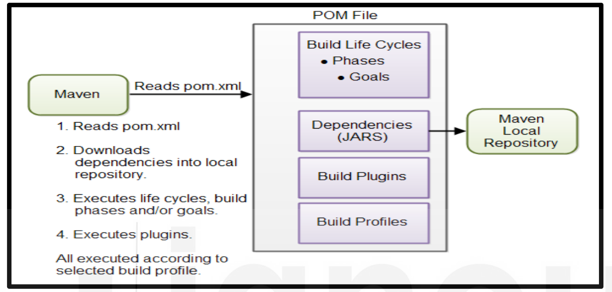

<!-- TOC start (generated with https://github.com/derlin/bitdowntoc) -->

- [FRAMEWORKS AVAILABLE FOR J2EE DEVELOPMENT –STRUTS, SPRING BOOT AND HIBERNATE](#frameworks-available-for-j2ee-development-struts-spring-boot-and-hibernate)
  - [Model 1 Vs Model 2 (MVC) Architecture](#model-1-vs-model-2-mvc-architecture)
    - [Model 1](#model-1)
    - [Model 2 (MVC)](#model-2-mvc)
  - [Struts 2 Features](#struts-2-features)
  - [Spring MVC and Boot Features](#spring-mvc-and-boot-features)
  - [Hibernate with JPA](#hibernate-with-jpa)
  - [Framework Comparison: Struts vs. Spring](#framework-comparison-struts-vs-spring)
  - [Framework Comparison: Spring Boot vs. Spring MVC](#framework-comparison-spring-boot-vs-spring-mvc)
  - [Framework Comparison: Spring vs. Hibernate](#framework-comparison-spring-vs-hibernate)
  - [Maven](#maven)
    - [Maven Installation](#maven-installation)
    - [Maven Core Concepts](#maven-core-concepts)
    - [Basic Structure of the POM file](#basic-structure-of-the-pom-file)
    - [Maven Build Life Cycles, Phases and Goals](#maven-build-life-cycles-phases-and-goals)
    - [Maven Build Profiles](#maven-build-profiles)
    - [Creating a Simple Hello World Java Application Using Maven](#creating-a-simple-hello-world-java-application-using-maven)
  - [Check Your Progress - 1](#check-your-progress---1)
  - [Check Your Progress - 2](#check-your-progress---2)
  - [Check Your Progress - 3](#check-your-progress---3)

<!-- TOC end -->

<!-- TOC --><a name="frameworks-available-for-j2ee-development-struts-spring-boot-and-hibernate"></a>
# FRAMEWORKS AVAILABLE FOR J2EE DEVELOPMENT –STRUTS, SPRING BOOT AND HIBERNATE

<!-- TOC --><a name="model-1-vs-model-2-mvc-architecture"></a>
## Model 1 Vs Model 2 (MVC) Architecture

<!-- TOC --><a name="model-1"></a>
### Model 1

<!-- TOC --><a name="model-2-mvc"></a>
### Model 2 (MVC)

<!-- TOC --><a name="struts-2-features"></a>
## Struts 2 Features
- Already done in Unit-5

<!-- TOC --><a name="spring-mvc-and-boot-features"></a>
## Spring MVC and Boot Features
-  Already done in Unit-5
-  
<!-- TOC --><a name="hibernate-with-jpa"></a>
## Hibernate with JPA
- Already done in Unit-5
- 
<!-- TOC --><a name="framework-comparison-struts-vs-spring"></a>
## Framework Comparison: Struts vs. Spring

| Feature                  | Struts                                                                               | Spring                                                                                          |
| ------------------------ | ------------------------------------------------------------------------------------ | ----------------------------------------------------------------------------------------------- |
| Description              | An open source framework which enables to extend Java Servlet API and MVC framework. | An open source framework to implement Inversion of Control (IoC) and Dependency Injection (DI). |
| Weight                   | Heavyweight framework                                                                | Lightweight framework                                                                           |
| Flexibility              | Less flexible than Spring                                                            | More flexible than Struts                                                                       |
| Architecture             | Non-layered architecture                                                             | Layered architecture                                                                            |
| Coupling                 | Tightly coupled                                                                      | Loosely coupled                                                                                 |
| ORM and JDBC Integration | Provides integration with ORM and JDBC but manual coding is required.                | Provides easy integration with ORM and JDBC technologies.                                       |

<!-- TOC --><a name="framework-comparison-spring-boot-vs-spring-mvc"></a>
## Framework Comparison: Spring Boot vs. Spring MVC

| Feature                            | Spring Boot                                                                                                                                 | Spring MVC                                                                                               |
| ---------------------------------- | ------------------------------------------------------------------------------------------------------------------------------------------- | -------------------------------------------------------------------------------------------------------- |
| Boilerplate Code and Configuration | Removes all boilerplate code and supports auto configuration based on jars available in the classpath.                                      | Requires a lot of configuration and contains a lot of boilerplate code.                                  |
| Dependency Management              | Provides many Spring Boot starters, which are units of related dependencies wrapped together, solving the problem of dependency management. | Dependency management is tough since every dependency with the correct version needs to be declared.     |
| Development Speed                  | Makes application development easier and faster.                                                                                            | Requires a lot of configurations and dependency management is time-consuming, hence development is slow. |
| Embedded Servers                   | Supports embedded servers to be packaged along with applications to run the jar standalone.                                                 | A lot of manual configuration is required to attain the same level of packaging.                         |
| Production-Ready Features          | Supports many production-ready features such as Actuators and Process monitoring out-of-the-box.                                            | Does not support any production-ready feature.                                                           |
| Flexibility                        | Very flexible and provides many modules which can be used to build various types of applications.                                           | Designed only for the development of dynamic web pages and RESTful web services.                         |

<!-- TOC --><a name="framework-comparison-spring-vs-hibernate"></a>
## Framework Comparison: Spring vs. Hibernate

| Feature            | Spring                                                                                                                    | Hibernate                                                                   |
| ------------------ | ------------------------------------------------------------------------------------------------------------------------- | --------------------------------------------------------------------------- |
| Description        | An open source, complete, and modular application framework to develop enterprise applications in Java.                   | An ORM framework specialized in data persisting and data retrieval from DB. |
| Key Features       | Provides many useful features such as transaction management, aspect-oriented programming, and dependency injection (DI). | Provides Object-Relational Persistence and Query service for applications.  |
| Modules            | Has many modules such as Spring-Core, Spring-MVC, Spring-Rest, Spring-Security, and many more.                            | Does not have modules like the Spring framework.                            |
| Connection Pooling | Supports connection pooling by changing the configuration in the Spring configuration file.                               | Supports robust connection pooling features.                                |
| Caching            | -                                                                                                                         | Supports two levels of cache which improve application performance.         |

<!-- TOC --><a name="maven"></a>
## Maven
- Maven is a simple and powerful build automation and management tool used primarily for Java Projects.
- Building the process of a software project may involve a series of tasks among downloading required dependencies, putting jars on classpath, generating source code (for auto generated code), generating documentation from source code, source code compilation, tests execution, packaging compiled code along with the dependencies into deployable artifacts such as WAR, EAR or JAR and deploying the generated artifacts to the application server or repository. This is why use Maven.

<!-- TOC --><a name="maven-installation"></a>
### Maven Installation
- Download and Install JDK
- Download Maven
- Set JAVA_HOME environment variable pointing to valid JDK installation path.
- Set M2_HOME environment variable pointing to the directory of extracted maven.
- Add the executable maven path into PATH variable as `%M2_HOME%\bin` on Windows and `%M2_HOME%/bin` on Unix
- Open a command prompt and execute the command mvn –version to check the maven installation and configuration.

<!-- TOC --><a name="maven-core-concepts"></a>
### Maven Core Concepts
- POM file (Project Object Model) is the focal point of a maven project.
- A maven project is configured using a POM file known as **pom.xml**.
- A POM file is an XML file which describes the project and contains all the references of project resources like source code, test code, dependencies etc.
- Maven execution and the main content of the POM file has been illustrated below.



<!-- TOC --><a name="basic-structure-of-the-pom-file"></a>
### Basic Structure of the POM file
- Basic structure of a typical POM file contains project dentifiers, dependencies, properties, build etc.
- POM file also supports the concept of profile. Profiles are used to customize the build configuration for different environments such as dev, test and prod.
- Example

```
<?xml version="1.0" encoding="UTF-8"?>
<project xmlns="http://maven.apache.org/POM/4.0.0" xmlns:xsi="http://www.w3.org/2001/XMLSchema-instance"
	xsi:schemaLocation="http://maven.apache.org/POM/4.0.0 https://maven.apache.org/xsd/maven-4.0.0.xsd">
	<modelVersion>4.0.0</modelVersion>
	<parent>
		<groupId>org.springframework.boot</groupId>
		<artifactId>spring-boot-starter-parent</artifactId>
		<version>3.3.0</version>
		<relativePath/> <!-- lookup parent from repository -->
	</parent>
	<groupId>com.gautam</groupId>
	<artifactId>IgnouBcaMcaSolutions</artifactId>
	<version>0.0.1-SNAPSHOT</version>
	<name>IgnouBcaMcaSolutions</name>
	<description>Demo project for Spring Boot</description>
	<url/>
	<licenses>
		<license/>
	</licenses>
	<developers>
		<developer/>
	</developers>
	<scm>
		<connection/>
		<developerConnection/>
		<tag/>
		<url/>
	</scm>
	<properties>
		<java.version>22</java.version>
	</properties>
	<dependencies>
		<dependency>
			<groupId>org.springframework.boot</groupId>
			<artifactId>spring-boot-starter-web</artifactId>
		</dependency>

		<dependency>
			<groupId>org.springframework.boot</groupId>
			<artifactId>spring-boot-starter-test</artifactId>
			<scope>test</scope>
		</dependency>
	</dependencies>

	<build>
		<plugins>
			<plugin>
				<groupId>org.springframework.boot</groupId>
				<artifactId>spring-boot-maven-plugin</artifactId>
			</plugin>
		</plugins>
	</build>

</project>
```

  - **Project Identifiers**:Maven combines groupId:artifactId:version (GAV) to form the unique identifier to identify a project uniquely.
    - ***groupId*** – a unique base name of the group or company of the project creator
    - ***artifactId*** – a unique name for the project
    - ***version*** – a version of the project
    - ***packaging*** – a packaging format of the project such as JAR, WAR, EAR, ZIP. If the packaging type is pom, Maven does not create anything for this project since it is just meta-data.
  - **Dependencies**
    - A mid-scale or large scale project uses external Java APIs or frameworks which are packaged in their own JAR files. These Jar files for Java APIs or frameworks are known as dependencies. A dependency JAR may again depend on other dependencies. Keeping projects up-to-date with the correct version of external dependencies a comprehensive task. Downloading all these external dependencies (JAR files) recursively and making sure that the right versions are downloaded is cumbersome.
    - Maven has a built-in powerful dependency management feature. To make the project dependencies available into classpath, we just need to specify all the required dependencies with GAV (groupId, artifactId, version) as shown in sample pom.xml. Maven downloads all the dependencies recursively and puts them into the local maven repository. 
  - **Maven Repositories**
    - Maven repositories are directories of packaged JAR files with extra Meta data. There are three types of repository in Maven.
    - **Local Repository**:As the name indicates, it’s a repository located on the developer's machine itself. Maven downloads the dependencies from Central repository, Remote repositories and stores it into the Local Repository. By default, the Local Repository location is user-home/.m2. 
    - **Central Repository** – The Central Repository is maintained and provided by the maven community. The Central Repository access does not require 
    any specific configuration. It can be accessed at https://mvnrepository.com/ and maven dependencies can be searched.
    - **Remote Repository** – A Remote Repository is like the Central Repository from where maven can download the dependencies and store it into Local Repository. It may be located on any web server on the internet or the local network. It can be configured into pom.xml by putting the following contents just after `<dependencies>` element.
    ```
    <repositories> 
        <repository> 
        <id>test.code</id> 
        <url>http://myremote.maven.com/maven2/lib</url> 
        </repository> 
    </repositories>
    ```
  - **Properties**:Custom properties make the pom file readable and maintainable.
    ```
    <properties> 
            <spring.version>4.3.5.RELEASE</spring.version> 
        </properties> 
        <dependencies> 
            <dependency> 
                <groupId>org.springframework</groupId> 
                <artifactId>spring-core</artifactId> 
                <version>${spring.version}</version> 
            </dependency> 
            <dependency> 
                <groupId>org.springframework</groupId> 
                <artifactId>spring-context</artifactId> 
                <version>${spring.version}</version> 
            </dependency> 
        </dependencies>
    ```
    - If we want to upgrade the spring to a newer version, we just need to change the version at one place only for custom property `<spring.version>` to update all required dependencies versions for spring.
  - **Build**:The build section provides information about the default maven goal, the final name of the artifact and the directory for the compiled project. The default build section is like shown below.
  
    ```
    <build> 
        <defaultGoal>install</defaultGoal> 
        <finalName>${artifactId}-${version}</finalName> 
        <directory>${basedir}/target</directory> 
        //... 
    </build>
    ```
    - Default goal is install 
    - Final name of the artifact contains artifactId and version. It can be modified at any time into the build section. 
    - The default output folder for the generated artifact is target folder.

<!-- TOC --><a name="maven-build-life-cycles-phases-and-goals"></a>
###  Maven Build Life Cycles, Phases and Goals

- Maven follows a **build life cycle** while building an application.The ***build life cycle consists of phases*** and ***phase consists of build goals***.

- ***Build Life Cycle***
  - Maven has 3 built-in build life cycles which are responsible for different aspects of building a software project.
    1. **default** - The default build lifecycle is of most interest since this is what builds the code. It is responsible to handle everything related to compiling and packaging the software project. This build life cycle can’t be executed directly. We need to execute a build phase or goal from the default build life cycle. 
    2. **clean** - The clean build life cycle performs the tasks related to cleaning such as deleting compiled classes, removing previous jar files, deleting the generated source codes, removing temporary files from the output directory etc. The command `mvn clean` cleans the project.
    3. **site** - The site build life cycle performs the task related to generating documents for the project.

- ***Build Phase Descriptions***
  - A Maven phase represents a stage in the Maven build life cycle. Each phase performs a specific task. The most commonly used build phases defined for default build life cycle are as follows.

| Phase            | Description                                                                                                  |
| ---------------- | ------------------------------------------------------------------------------------------------------------ |
| validate         | Verifies the correctness of the project and ensures that all required dependencies are downloaded.           |
| compile          | Compiles the source code to produce the binary artifacts.                                                    |
| test             | Executes the unit test cases using a suitable unit testing framework without packaging the binary artifacts. |
| package          | Packs the binary artifacts into distributable formats such as JAR, WAR, EAR.                                 |
| integration-test | Executes integration test cases which require packaging.                                                     |
| verify           | Verifies the correctness of the package.                                                                     |
| install          | Installs the package into the local Maven repository.                                                        |
| deploy           | Copies the final package to the remote repository for sharing with other developers and projects.            |

  - *Note*: The execution of a phase using command `mvn <phase>` does not execute only the specified phase. Instead it executes all the preceding phases as well. The execution of `mvn install` will execute all other phases in the above table.

- ***Build Goals***
  - The finest step in the maven build process is a Goal. A goal can be bound to zero or more build phases. A phase helps to determine the order in which the goals are executed.
    - Command `mvn <goal>` executes a goal which is not bound to any phase.
    - Command `mvn <phase>:<goal>` executes a goal which is bound to a phase.

<!-- TOC --><a name="maven-build-profiles"></a>
### Maven Build Profiles
- Different build configurations are required for different environments such as production, test, dev. The concepts of Maven Build Profiles enable us to keep the multiple environments build configuration into a single pom.xml file. A sample example to create the configuration based on profiles is shown below. 

```
<project xmlns="http://maven.apache.org/POM/4.0.0" 
         xmlns:xsi="http://www.w3.org/2001/XMLSchema-instance" 
         xsi:schemaLocation="http://maven.apache.org/POM/4.0.0 http://maven.apache.org/xsd/maven-4.0.0.xsd"> 

    <modelVersion>4.0.0</modelVersion> 
    <groupId>com.test</groupId> 
    <artifactId>maven-demo</artifactId> 
    <version>1.0.0</version> 
    
    <profiles> 
        <profile> 
            <id>production</id> 
            <build> 
                <plugins> 
                    <plugin> 
                        <!-- Plugin configuration goes here -->
                    </plugin> 
                </plugins> 
            </build> 
        </profile> 

        <profile> 
            <id>development</id> 
            <activation> 
                <activeByDefault>true</activeByDefault> 
            </activation> 
            <build> 
                <plugins> 
                    <plugin> 
                        <!-- Plugin configuration goes here -->
                    </plugin> 
                </plugins> 
            </build> 
        </profile> 
    </profiles> 

</project>
```
- In the above configuration development profile is set as default. If we want to execute production profile build, it can be executed as mvn clean install –Pproduction. The flag –P is used to provide the profile to be used for the build process.

<!-- TOC --><a name="creating-a-simple-hello-world-java-application-using-maven"></a>
### Creating a Simple Hello World Java Application Using Maven

1. **Create the Maven Project**
   - Create a simple Hello World Java project using the following command. The command will generate the directory structure and `pom.xml` file.
   
   ```
    mvn archetype:generate -DgroupId=org.test -DartifactId=hello-world -DarchetypeArtifactId=maven-archetype-quickstart -DinteractiveMode=false
   ```
2. **Update `pom.xml`**
   - The simple Hello World application is ready to be compiled and packaged. Update the pom.xml as below:
    ```
    <project xmlns="http://maven.apache.org/POM/4.0.0"
         xmlns:xsi="http://www.w3.org/2001/XMLSchema-instance"
         xsi:schemaLocation="http://maven.apache.org/POM/4.0.0 http://maven.apache.org/maven-v4_0_0.xsd">
    <modelVersion>4.0.0</modelVersion>
    <groupId>org.test</groupId>
    <artifactId>hello-world</artifactId>
    <name>hello-world</name>
    <url>http://maven.apache.org</url>
    <dependencies>
        <dependency>
            <groupId>junit</groupId>
            <artifactId>junit</artifactId>
            <version>3.8.1</version>
        </dependency>
    </dependencies>
    <build>
        <sourceDirectory>src</sourceDirectory>
        <plugins>
            <plugin>
                <artifactId>maven-compiler-plugin</artifactId>
                <version>3.6.1</version>
                <configuration>
                    <source>1.8</source>
                    <target>1.8</target>
                </configuration>
            </plugin>
        </plugins>
    </build>
    /project>
    ```
   - Execute the following commands and check the output on the console:
     - `mvn compile`: Maven will execute all the required phases for the compile phase and build the binary artifact.
     - `mvn test`: Only the test phase will be executed with this command.
     - `mvn package`: It packages the binary artifact with the specified package type such as jar, war, ear, etc. The default packaging type is jar, and the generated jar file is located in the target folder.
3. **Add the Exec Maven Plugin**
   - Add the following plug-in into the build section after the compiler plug-in. The plug-in requires the main class into configuration. Update the main class. This added plug-in will enable the jar file execution from the Maven command.

   ```
   <plugin>
    <groupId>org.codehaus.mojo</groupId>
    <artifactId>exec-maven-plugin</artifactId>
    <version>3.0.0</version>
    <configuration>
        <mainClass>org.test.App</mainClass>
    </configuration>
    </plugin>
   ```
   - The command `mvn exec:java` will execute the jar file.

<!-- TOC --><a name="check-your-progress-1"></a>
## Check Your Progress - 1
1. Explain Model 1 architecture with its advantages and disadvantages.
2. Explain Model 2 architecture with its merits and demerits.
3. What are Actions in Struts2?
4. List down the features of Struts.
<!-- TOC --><a name="check-your-progress-2"></a>
## Check Your Progress - 2
1. What are the advantages of Spring Web MVC?
2. Discuss the features of Spring Boot.
3. Explain Hibernate with its advantages.
4. Compare the Struts and Spring frameworks.
5. Compare Spring Boot and Spring MVC. 
<!-- TOC --><a name="check-your-progress-3"></a>
## Check Your Progress - 3
1. What is Maven? Discuss its usage.
2. Explain about Maven repositories.
3. Explain the different build life cycles available in the Maven tool.
4. Write down the command to execute a build goal into Maven.