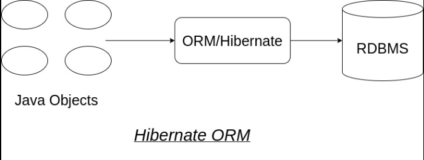
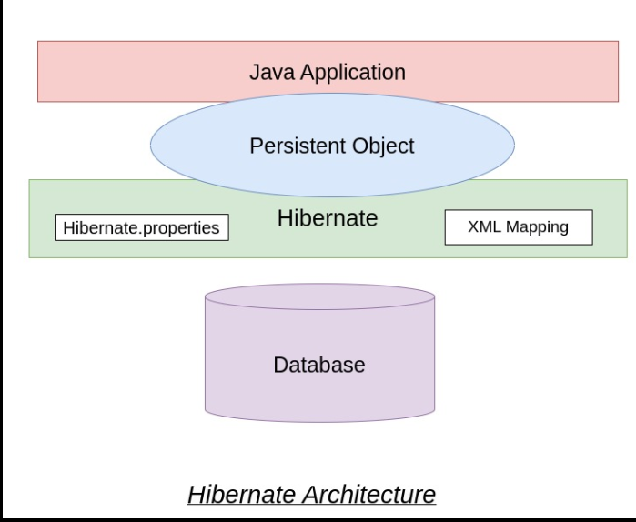
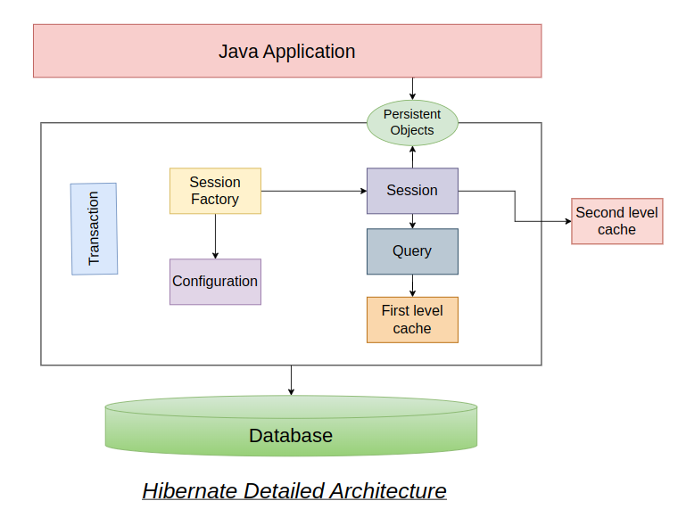

# Configuration of Hibernate

## Object-Relational Mapping
- **Object-Relational Mapping (ORM)** is a technique that lets you query and manipulate data from a database using an object-oriented paradigm.
- An ORM library is a completely ordinary library **written in your language of choice** that **encapsulates the code needed to manipulate the data, so you don't use SQL anymore**; you interact directly with an object in the same language you're using.

## Hibernate
- Hibernate is a Java framework that **simplifies the development of Java application to interact with the database by mapping the POJOs to relational database tables**. It is an open source, lightweight, ORM (Object Relational Mapping) tool. Hibernate *implements the specifications of JPA (Java Persistence API)* for data persistence.
- **JPA**:- The JPA is a specification that defines how to persist data in Java Applications.
- The usage of Hibernate as a persistence framework enables the developers to concentrate more on the business logic instead of making efforts on SQLs and writing boilerplate code. 


## Hibernate Architecture
- 4 Layered architecture





- **Configuration**: It is the first object which is being created in the Hibernate Appliation. 
- **Session**: 
  - This object provides an interface to interact with the database from an application.
  - It is lightweight, which instantiates each time an interaction is required with the database.
  - Session objects are used to retrieve and save persistent objects. It is a short-lived object which wraps the JDBC connection.
  - It also provides a first-level cache of data. 
- **Transaction**:
  - A Transaction represents a unit of work with the database, and most of the RDBMS supports transaction functionality.
  - Transaction object provides a method for transaction management. 
  - It enables data consistency and rollback in case something wrong.
- **Query**:
  - Query objects use SQL or Hibernate Query Language (HQL) string to retrieve data from the database and create objects.
  - A Query instance is used to bind query parameters, limit the number of results returned by the query, and finally to execute the query.
- **Persistent Objects**:
  - These are plain old java objects (POJOs), which get persisted into the database by hibernate. Persistent objects can be configured in configurations files(hibernate.cfg.xml or hibernate.properties) or annotated with @Entity annotation.
- **First level cache**
  - **Cache** is a mechanism that improves the performance of any application.


## Hibernate Configuration with Annotation

### @Entity

```
@Entity
@Table(name = "student")
public class Student {
    @Id
    @GeneratedValue(strategy = GenerationType.IDENTITY)
    @Column(name = "id")
    privateintid;
    @Column(name = "firstname", length = 50, nullable = false, unique = false)
    private String firstName;
    @Column(name = "lastname", length = 50, nullable = true, unique = false)
    private String lastName;
    @Transient
    private int age;
    @Temporal(TemporalType.DATE)
    @Column(name = "dateofbirth", nullable = false)
    private Date dob;
    private String email;
    public Student() {}
    public Student(String firstName, String lastName, String email, Date dob) {
        this.firstName = firstName;
        this.lastName = lastName;
        this.email = email;
        this.dob = dob;
    }
    public int getId() {
        returnid;
    }
    public void setId(int id) {
        this.id = id;
    }
    public String getFirstName() {
        returnfirstName;
    }
    public void setFirstName(String firstName) {
        this.firstName = firstName;
    }
    public String getLastName() {
        returnlastName;
    }
    public void setLastName(String lastName) {
        this.lastName = lastName;
    }
    public String getEmail() {
        returnemail;
    }
    public void setEmail(String email) {
        this.email = email;
    }
    public int getAge() {
        returnage;
    }
    public void setAge(intage) {
        this.age = age;
    }
    public Date getDob() {
        return dob;
    }
    public void setDob(Date dob) {
        this.dob = dob;
    }
    @Override
    public String toString() {
        return "Student [id=" + id + ", firstName=" + firstName + ", lastName=" + lastName + ", age=" + age + ", dob=" +
            dob + ", email=" + email + "]";
    }
}
```