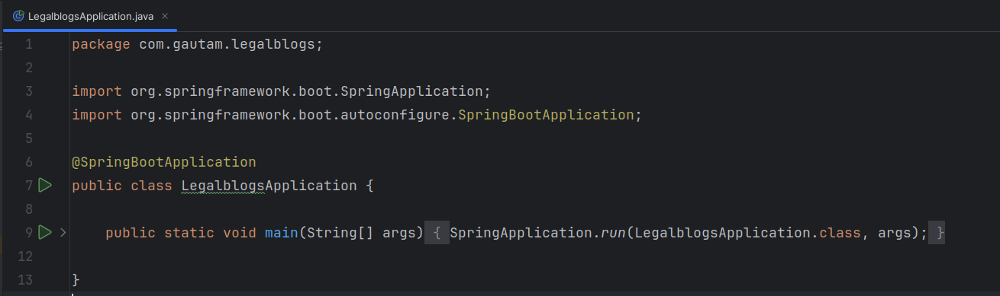
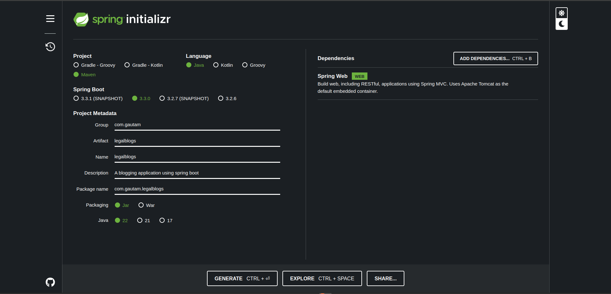
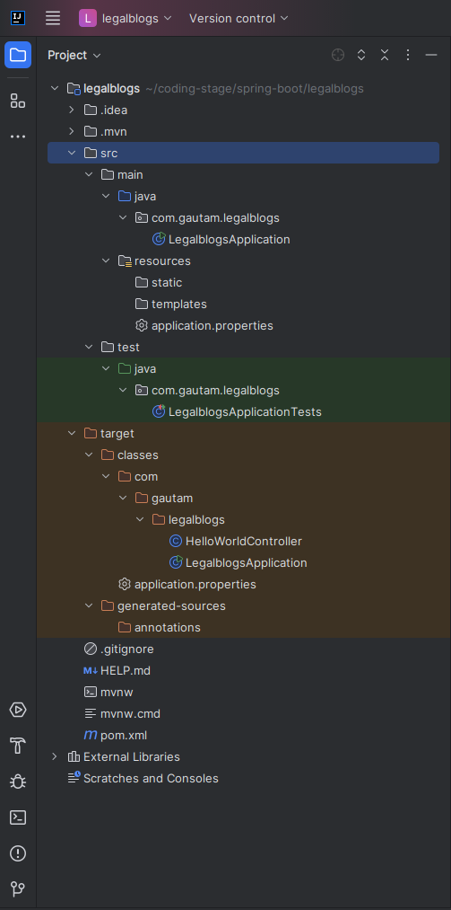
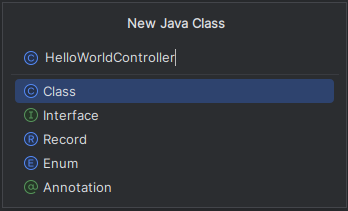
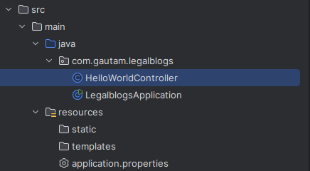
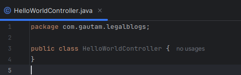
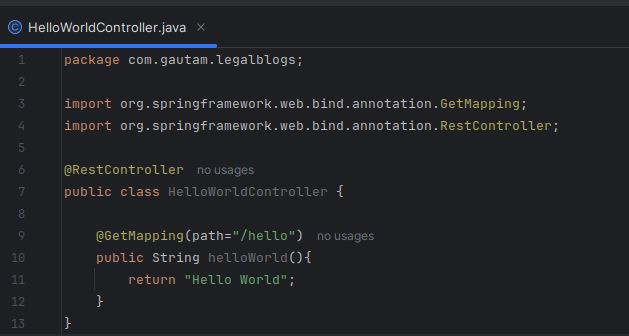
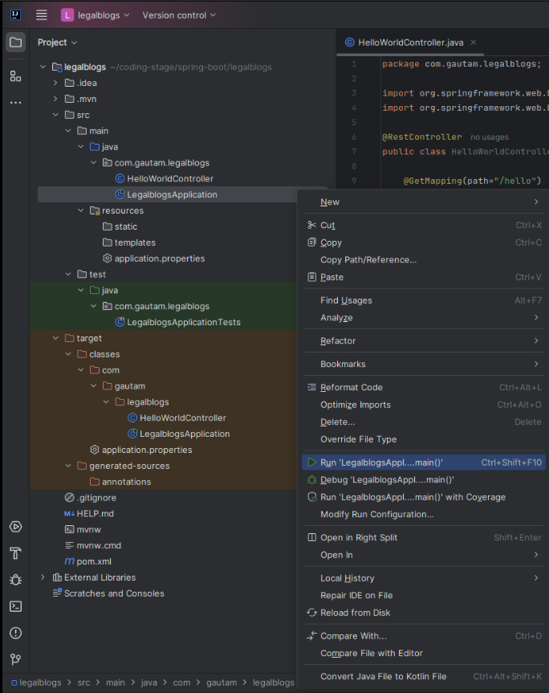
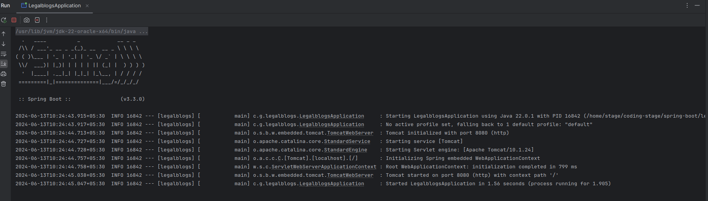
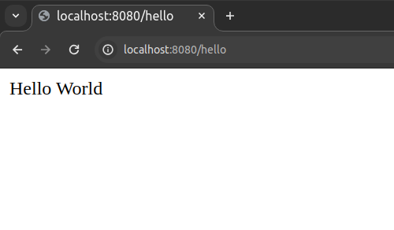

<!-- TOC start (generated with https://github.com/derlin/bitdowntoc) -->

- [Introduction to Spring Boot](#introduction-to-spring-boot)
  - [Limitations of Spring that led to the development of Spring Boot](#limitations-of-spring-that-led-to-the-development-of-spring-boot)
  - [Spring Boot](#spring-boot)
  - [Features and Benefits of Spring Boot](#features-and-benefits-of-spring-boot)
  - [Spring Boot working and annotations](#spring-boot-working-and-annotations)
    - [@EnableAutoConfiguration](#enableautoconfiguration)
    - [@ComponentScan](#componentscan)
    - [@Configuration](#configuration)
    - [How It All Comes Together](#how-it-all-comes-together)
  - [Spring Boot Conditional Annotations](#spring-boot-conditional-annotations)
    - [@ConditionalOnClass](#conditionalonclass)
    - [@ConditionalOnMissingClass](#conditionalonmissingclass)
    - [@ConditionalOnBean](#conditionalonbean)
    - [@ConditionalOnMissingBean](#conditionalonmissingbean)
    - [@ConditionalOnProperty](#conditionalonproperty)
    - [@ConditionalOnResource](#conditionalonresource)
  - [Spring Boot Starter](#spring-boot-starter)
    - [Advantages of using starters](#advantages-of-using-starters)
  - [Creating a spring boot project](#creating-a-spring-boot-project)
    - [Requirements](#requirements)
    - [Installing JDK](#installing-jdk)
    - [IDE](#ide)
    - [Intellij Community version doesn’t have web features](#intellij-community-version-doesnt-have-web-features)
    - [Spring Initializer Configuration](#spring-initializer-configuration)
  - [Spring Boot Project Structure](#spring-boot-project-structure)
  - [Writing First Controller](#writing-first-controller)
  - [RUNNING OUR APP](#running-our-app)
  - [Spring Boot Runners](#spring-boot-runners)
    - [1. Application Runner](#1-application-runner)
    - [2. Command Line Runner](#2-command-line-runner)
  - [Spring Boot Web Application Using Thymeleaf](#spring-boot-web-application-using-thymeleaf)
    - [Thymeleaf](#thymeleaf)
  - [Spring Boot Dev Tools](#spring-boot-dev-tools)
    - [Features of Spring Dev Tools](#features-of-spring-dev-tools)
  - [Spring Boot Actuator](#spring-boot-actuator)
  - [Spring Boot - Application Properties](#spring-boot---application-properties)
    - [Command Line Properties](#command-line-properties)
    - [Properties File](#properties-file)
    - [YAML File](#yaml-file)
    - [Externalized Properties](#externalized-properties)
    - [@Value annotation](#value-annotation)
    - [Active Profile](#active-profile)
    - [Spring Active Profile in application.yml](#spring-active-profile-in-applicationyml)
  - [Running Spring Boot apps from command line](#running-spring-boot-apps-from-command-line)
    - [Running the Code with Maven in Exploded Form](#running-the-code-with-maven-in-exploded-form)
    - [Running the Code as a Stand-Alone Packaged Application](#running-the-code-as-a-stand-alone-packaged-application)
    - [Application Packaging as WAR and Deployment on Tomcat](#application-packaging-as-war-and-deployment-on-tomcat)
  - [Check Your Progress - 1](#check-your-progress---1)
  - [Check Your Progress - 2](#check-your-progress---2)
  - [Check Your Progress - 3](#check-your-progress---3)

<!-- TOC end -->

<!-- TOC --><a name="introduction-to-spring-boot"></a>

# Introduction to Spring Boot

<!-- TOC --><a name="limitations-of-spring-that-led-to-the-development-of-spring-boot"></a>

## Limitations of Spring that led to the development of Spring Boot

- Spring based application requires _many configurations_ and _complicated dependency management_. So, the setup is very _tedious_ and _error prone_
- Some repetition of same configuration steps:
  - Import the **required dependecies** like _spring mvc_,_spring jpa_,_spring jdbc_,_spring rest_
  - Import the **specified spring version** compatible _third party libraries_ such as _hibernate_, _jackson_ etc
  - **Configure web layer beans** such as _view resolver_,_resourcce manager_
  - **Configure DAO layers** such as _data source_, _transaction management_, _entity manager_
  - **Import web containers** in the case of web applications.

<!-- TOC --><a name="spring-boot"></a>

## Spring Boot

- Spring Boot is a an extension of Spring framework which **enables an organization to develop production-ready spring-based applications** and services with _less effort_, _reduced cost_ and _minimal configuration_. It provides _auto-configuration_ which reduces the number of lines of code significantly.
- It eliminates the **boilerplate configuration required** for a spring application.It is a module that enriches the Spring framework with **Rapid Application Development(RAD)** feature.
- It is a combination of Spring Framework with **auto-configuration** and **embedded servers**.

<!-- TOC --><a name="features-and-benefits-of-spring-boot"></a>

## Features and Benefits of Spring Boot

- Everything is **auto-configured** in Spring Boot.
- Spring Boot starter **eases the dependency management** and application
  **configuration**
- It **simplifies the application deployment** by **using an embedded server**
- Production ready **features to monitor and manage applications**, such as health
  checks, metrics gathering etc.
- **Reduces the application development time** and run the application
  independently
- Very easy to understand and develop Spring application
- **Increases productivity** and **reduces the cost**

<!-- TOC --><a name="spring-boot-working-and-annotations"></a>

## Spring Boot working and annotations

- **_ENTRY POINT_**:A class with the **main method** and annotated with **@SpringBootApplication** is the entry point of the Spring Boot application.



- Spring Boot **auto-configures** all required configurations.
- It performs auto-configuration by scanning the classes in class-path annotated with **@Component** or **@Configuration**.
- The **@SpringBootApplication** annotation is a convenient annotation that combines three essential annotations for a Spring Boot application:
  - **@EnableAutoConfiguration**
  - **@ComponentScan**
  - **@Configuration**

<!-- TOC --><a name="enableautoconfiguration"></a>

### @EnableAutoConfiguration

This annotation tells Spring Boot to automatically configure your application based on the dependencies present in the classpath.

- For example, if you have `spring-boot-starter-web` in your dependencies, Spring Boot will automatically configure the necessary components for a web application, such as a `DispatcherServlet`, view resolvers, etc.
- It works by searching for specific configuration classes (provided by Spring Boot) and applying them to the application context.

<!-- TOC --><a name="componentscan"></a>

### @ComponentScan

This annotation tells Spring to scan the current package and its sub-packages for components, configurations, and services.

- By default, it starts scanning from the package of the class that declares this annotation.
- This is crucial for Spring to detect all the beans and components that you have defined in your application.

<!-- TOC --><a name="configuration"></a>

### @Configuration

This annotation indicates that the class can be used by the Spring IoC container as a source of bean definitions.

- It is a marker for classes that provide one or more `@Bean` methods.
- These beans will be managed by the Spring container, and their lifecycle will be handled by Spring.

<!-- TOC --><a name="how-it-all-comes-together"></a>

### How It All Comes Together

When you annotate your main application class with `@SpringBootApplication`, you are enabling auto-configuration, component scanning, and configuration in one go. Here's what typically happens:

1. **Auto-Configuration**: Spring Boot tries to automatically configure your application based on the dependencies in the classpath. If `spring-boot-starter-data-jpa` is present, it will set up a DataSource and JPA-related beans.

2. **Component Scanning**: Spring Boot scans the package of the main application class and all its sub-packages for components and configurations. It finds classes annotated with `@Component`, `@Service`, `@Repository`, `@Controller`, and `@Configuration`, and registers them as beans in the application context.

3. **Configuration Classes**: Spring Boot processes classes annotated with `@Configuration` to create beans that may be needed in the application context.

<!-- TOC --><a name="spring-boot-conditional-annotations"></a>

## Spring Boot Conditional Annotations

Spring Boot provides a set of conditional annotations that allow beans to be registered or not based on specific conditions. These conditions are useful for creating more flexible and modular configurations. Here's an explanation of some commonly used conditional annotations:

<!-- TOC --><a name="conditionalonclass"></a>

### @ConditionalOnClass

This annotation is used to conditionally create a bean if a specified class is present on the classpath.

- **Usage**: It is typically used to enable auto-configuration only when certain dependencies are available.
- **Example**:
  ```java
  @ConditionalOnClass(name = "com.example.MyClass")
  public class MyConditionalConfig {
      // Bean definitions
  }
  ```
- In this example, the configuration inside MyConditionalConfig will only be applied if com.example.MyClass is present on the classpath.

### @ConditionalOnMissingClass

This annotation is the opposite of `@ConditionalOnClass`. It is used to conditionally create a bean if a specified class is not present on the classpath.

- **Usage**: It is useful when you want to apply a configuration only when a certain dependency is absent.
- **Example**:
  ```java
  @ConditionalOnMissingClass(value = "com.example.MyClass")
  public class MyFallbackConfig {
      // Bean definitions
  }
  ```
- Here, the configuration inside MyFallbackConfig will only be applied if com.example.MyClass is not present on the classpath.

<!-- TOC --><a name="conditionalonbean"></a>

### @ConditionalOnBean

This annotation is used to conditionally create a bean if a specified bean is already defined in the Spring context.

- **Usage**: It is often used to create a bean that depends on another bean being present.
- **Example**:
  ```java
  @ConditionalOnBean(name = "myExistingBean")
  public class MyDependentConfig {
      // Bean definitions
  }
  ```
- The configuration inside MyDependentConfig will only be applied if a bean named myExistingBean is already defined.

### @ConditionalOnMissingBean

This annotation is the opposite of `@ConditionalOnBean`. It is used to conditionally create a bean if a specified bean is not already defined in the Spring context.

- **Usage**: It is useful for providing default beans that can be overridden by user-defined beans.
- **Example**:
  ```java
  @ConditionalOnMissingBean(name = "myOptionalBean")
  public class MyDefaultConfig {
      // Bean definitions
  }
  ```
- In this case, the configuration inside MyDefaultConfig will only be applied if a bean named myOptionalBean is not defined.

<!-- TOC --><a name="conditionalonproperty"></a>

### @ConditionalOnProperty

This annotation is used to conditionally create a bean based on the value of a specified property.

- **Usage**: It is commonly used to enable or disable parts of the configuration based on properties set in the `application.properties` or `application.yml` file.
- **Example**:
  ```java
  @ConditionalOnProperty(name = "my.feature.enabled", havingValue = "true")
  public class MyFeatureConfig {
      // Bean definitions
  }
  ```
- The configuration inside MyFeatureConfig will only be applied if the property my.feature.enabled is set to true.

### @ConditionalOnResource

This annotation is used to conditionally create a bean if a specified resource is present on the classpath.

- **Usage**: It is useful for enabling configuration based on the presence of files or other resources.
- **Example**:
  ```java
  @ConditionalOnResource(resources = "classpath:my-resource.txt")
  public class MyResourceConfig {
      // Bean definitions
  }
  ```
- Here, the configuration inside MyResourceConfig will only be applied if my-resource.txt is present in the classpath.

<!-- TOC --><a name="spring-boot-starter"></a>

## Spring Boot Starter

- Before Spring Boot was introduced, Spring Developers used to spend a lot of time on Dependency management. **Spring Boot Starters** were introduced to solve this problem so that the developers can spend more time on actual code than Dependencies. _Spring Boot Starters are dependency descriptors that can be added under the `<dependencies>` section in pom.xml_. There are around 50+ Spring Boot Starters for different Spring and related technologies. These starters give all the dependencies under a single name.
- For example, if you want to use **Spring Data JPA for database access**, you can include `spring-boot-starter-data-jpa` dependency.

<!-- TOC --><a name="advantages-of-using-starters"></a>

### Advantages of using starters

- Increase productivity by decreasing the Configuration time for developers.
- Managing the POM is easier since the number of dependencies to be added is decreased.
- Tested, Production-ready, and supported dependency configurations.
- No need to remember the name and version of the dependencies.

Dependencies in pom.xml:


| Starter                          | Description                                                                                                                                  |
| -------------------------------- | -------------------------------------------------------------------------------------------------------------------------------------------- |
| `spring-boot-starter-web`        | It is used for building web applications, including RESTful applications using Spring MVC. It uses Tomcat as the default embedded container. |
| `spring-boot-starter-jdbc`       | It is used for JDBC with the Tomcat JDBC connection pool.                                                                                    |
| `spring-boot-starter-validation` | It is used for Java Bean Validation with Hibernate Validator.                                                                                |
| `spring-boot-starter-security`   | It is used for Spring Security.                                                                                                              |
| `spring-boot-starter-data-jpa`   | It is used for Spring Data JPA with Hibernate.                                                                                               |
| `spring-boot-starter`            | It is used as a core starter, including auto-configuration support, logging etc.                                                             |
| `spring-boot-starter-test`       | It is used to test Spring Boot applications with libraries, including JUnit, Hamcrest, and Mockito.                                          |
| `spring-boot-starter-thymeleaf`  | It is used to build MVC web applications using Thymeleaf views.                                                                              |

<!-- TOC --><a name="creating-a-spring-boot-project"></a>

## Creating a spring boot project

<!-- TOC --><a name="requirements"></a>

### Requirements

- JDK 17+
- IDE

<!-- TOC --><a name="installing-jdk"></a>

### Installing JDK

- Download from oracle website. Install using GUI in Windows/Mac/Linux.

<!-- TOC --><a name="ide"></a>

### IDE

- **INTELLIJ COMMUNITY**
  - Installation GUI in windows and mac
  - In Linux: https://www.jetbrains.com/idea/download/?section=linux
  ```bash
  sudo snap install intellij-idea-community --classic
  ```
  or download tar file and extract and install.

<!-- TOC --><a name="intellij-community-version-doesnt-have-web-features"></a>

### Intellij Community version doesn’t have web features

- So we need to find a way to run web frameworks in community edition.
- Go to https://start.spring.io/ - It allows us to configure and then download a skeleton spring boot project

<!-- TOC --><a name="spring-initializer-configuration"></a>

### Spring Initializer Configuration

- The most basic spring web app configuration



- Click on generate - A zip file will be downloaded
- Extract and Open it in intellij.
- The setup is done.

<!-- TOC --><a name="spring-boot-project-structure"></a>

## Spring Boot Project Structure

- After opening the configured project in intellij. The directory structure would be like this:
  

- The **@SpringBootApplication** annotation triggers component scanning for the current package and its sub-packages. Therefore, the main class of the project should reside in the base package to use the implicit components scan of spring boot.

<!-- TOC --><a name="writing-first-controller"></a>

## Writing First Controller

- Go to **_src → main → java → com.gautam.legalblogs(your group)_** and create a class.
- Example **_HelloWorldController.java_**

  
  

- Default code in the class
  

- Wrting a basic controller
  

<!-- TOC --><a name="running-our-app"></a>

## RUNNING OUR APP

- **_src → main → java → LegalblogsApplication → right click →run_**
  

- Output
  

- If port 8080 is busy, then you have to configure this to run on different port, or stop the service running on port 8080

- Now, go to your browser and type **_http://localhost:8080/hello_** in the url bar.
- You should be able to see the following screen



<!-- TOC --><a name="spring-boot-runners"></a>

## Spring Boot Runners

- Runners let you to execute the code after the Spring Boot application is started. You can use these interfaces to perform any actions immediately after the application has started.
- Spring boot provides two runner interfaces:
  1. **Application Runner**
  2. **Command Line Runner**

<!-- TOC --><a name="1-application-runner"></a>

### 1. Application Runner

- Application Runner is an interface used to execute the code after the Spring Boot application started. The example given below shows how to implement the Application Runner interface on the main class file.

```
package com.tutorialspoint.demo;

import org.springframework.boot.ApplicationArguments;
import org.springframework.boot.ApplicationRunner;
import org.springframework.boot.SpringApplication;
import org.springframework.boot.autoconfigure.SpringBootApplication;

@SpringBootApplication
public class DemoApplication implements ApplicationRunner {
   public static void main(String[] args) {
      SpringApplication.run(DemoApplication.class, args);
   }
   @Override
   public void run(ApplicationArguments arg0) throws Exception {
      System.out.println("Hello World from Application Runner");
   }
}
```

<!-- TOC --><a name="2-command-line-runner"></a>

### 2. Command Line Runner

- Command Line Runner is an interface. It is used to execute the code after the Spring Boot application started. The example given below shows how to implement the Command Line Runner interface on the main class file.

```
package com.tutorialspoint.demo;

import org.springframework.boot.CommandLineRunner;
import org.springframework.boot.SpringApplication;
import org.springframework.boot.autoconfigure.SpringBootApplication;

@SpringBootApplication
public class DemoApplication implements CommandLineRunner {
   public static void main(String[] args) {
      SpringApplication.run(DemoApplication.class, args);
   }
   @Override
   public void run(String... arg0) throws Exception {
      System.out.println("Hello world from Command Line Runner");
   }
}
```

<!-- TOC --><a name="spring-boot-web-application-using-thymeleaf"></a>

## Spring Boot Web Application Using Thymeleaf

<!-- TOC --><a name="thymeleaf"></a>

### Thymeleaf

- Thymeleaf is a server-side Java template engine for both web and standalone environments. Its main goal is to bring natural templates to your development workflow — HTML that can be correctly displayed in browsers and also work as static prototypes.

1. Initialize the project as explained above and open it in intellij.
2. Add a HomeController. HomeController has two endpoints
   - **“/”**
   - **“/greeting?name=Raj”**
3. Add thymeleaf dependency in pom.xml and press `ctrl+shift+o' to install the changes.
   ```
   <dependency>
   		<groupId>org.thymeleaf</groupId>
   		<artifactId>thymeleaf</artifactId>
   		<version>3.1.2.RELEASE</version>
   	</dependency>
   ```
4. Add the corresponding HTML template file into `src/main/resources/templates`
   - **home.html**
   ```
   <!DOCTYPEhtml>
   <html>
     <head>
       <metacharset="ISO‐8859‐1"/>
       <title>Spring Boot Web Application</title>
     </head>
     <body>
       <h1>Welcome to Thymeleaf Spring Boot web application</h1>
     </body>
   </html>
   ```
   - **greeting.html**
   ```
   <!DOCTYPEHTML>
   <htmlxmlns:th="http://www.thymeleaf.org">
     <head>
       <title>Getting Started: Serving Web Content</title>
       <metahttp‐equiv="Content‐Type"content="text/html; charset=UTF‐8"/>
     </head>
     <body>
       <pth:text="'Hello, ' + ${name} + '!'"/>
     </body>
   </html>
   ```

<!-- TOC --><a name="spring-boot-dev-tools"></a>

## Spring Boot Dev Tools

- Spring Boot DevTools was released with Spring Boot 1.3.
- DevTools stands for developer tool. The aim of DevTools module is to enhance the application development experience by reducing the development time of the Spring Boot Application.
- During a web application development, a developer changes the code many times and then restarts the application to verify the changed code.
- DevToolsreduces the developer effort. It detects the code changes and restarts the application automatically. DevTools can be integrated into a Spring Boot application just by adding the following dependency into pom.xml.

```
<dependency>
  <groupId>org.springframework.boot</groupId>
  <artifactId>spring‐boot‐devtools</artifactId>
  <scope>runtime</scope>
  <optional>true</optional>
</dependency>
```

<!-- TOC --><a name="features-of-spring-dev-tools"></a>

### Features of Spring Dev Tools

- **Automatic Restart**
  - Auto-restart refers to the reloading of Java classes and configures it at the server-side. While developing an application, a developer changes the code frequently and to verify these changes, the steps build, deploy and restart of the server is required.
  - Spring Boot DevTools automates the build and deploys process, which increases productivity. Files change in the class-path triggers Spring Boot DevTools to restart the application. This auto-restart process reduces the time significantly to verify the changes.
  - Spring Boot uses two types of ClassLoaders:
    - **Base ClassLoader**:This ClassLoader loads the classes which do not change. E.g. Third-party jars
    - **Restart ClassLoader**:This ClassLoader loads the classes which we are actively developing
- **Live Reload**
  - Live Reload or auto-refresh is also a very important feature provided by Spring Boot DevTools. Spring Boot DevTools module also comes with an embedded LiveReload server that can be used to trigger a browser refresh whenever a resource is changed.
  - For example, when a developer makes the changes into templates or other resources, he/she has to refresh the browser to verify the changes. With the Live Reload/Auto Refresh feature, developers do not need to press F5 to refresh the browser.
  - Thus, it enhances the development experience and increases productivity.Live Reload or auto-refresh is also a very important feature provided by Spring Boot DevTools.
  - Spring Boot DevTools module also comes with an embedded LiveReload server that can be used to trigger a browser refresh whenever a resource is changed.
  - For example, when a developer makes the changes into templates or other resources, he/she has to refresh the browser to verify the changes. With the Live Reload/Auto Refresh feature, developers do not need to press F5 to refresh the browser. Thus, it enhances the development experience and increases productivity.
  - Steps to enable live reload:
    ```
    <dependency>
      <groupId>org.springframework.boot</groupId>
      <artifactId>spring-boot-devtools</artifactId>
      <scope>runtime</scope>
      <optional>true</optional>
    </dependency>
    ```
    - Install Live Reload extension browser.
    - Live reload works on the following path:
      - /static, /public, /resources, /templates, /META-INF/maven, /META-INF/resources
- **Property defaults**
  - Spring Boot does a lot of auto configuration. It also includes caching for performance improvement. Template technology Thymeleaf contains the property spring.thymeleaf.cache.
  - DevTools disables the caching and allows us to update pages without restarting the application. During the development, caching for Thymeleaf, Freemarker, Groovy Templates are automatically disabled by DevTools.

<!-- TOC --><a name="spring-boot-actuator"></a>

## Spring Boot Actuator

- Spring Boot Actuator is a sub-project of the Spring Boot framework. The Actuator provides production-ready features such as application monitoring, Network traffic, State of database and many more. Without any implementation, Actuator provides production-grade tools.
- In Spring Boot application, Actuator is primarily used to expose operational information about the running application such as info, health, dump, metrics, env etc.
- It provides HTTP and JMX endpoints to manage and monitor the Spring Boot application.
- There are three main features of the Spring Boot Actuator:
  - **Endpoints**
  - **Metrics**
  - **Audit**
- By default, only two endpoints `/health` and `/info` are available. Other required endpoints can be enabled by adding `management.endpoints.web.exposure.include` property into application.properties. By default, all Actuator endpoints are now placed under the /actuator path.
- Some of the important endpoints are listed below –
  - `/health` provides the health status of application
  - `/info` provides general information about the application. It might be build information or the latest commit information.
  - `/metrics` provides metrics of application. Returned metrics include generic metrics as well as custom metric.
  - `/env` provides the current environment properties.

```
<dependency>
  <groupId>org.springframework.boot</groupId>
  <artifactId>spring‐boot‐starter‐actuator</artifactId>
</dependency>
```

- Start the web application and access the `http://localhost:8080/actuator`,`http://localhost:8080/actuator/metrics`, `http://localhost:8080/actuator/health` endpoint

<!-- TOC --><a name="spring-boot-application-properties"></a>

## Spring Boot - Application Properties

- Application Properties enable us to work in different environments such as Prod, Dev, Test.

<!-- TOC --><a name="command-line-properties"></a>

### Command Line Properties

- Spring Boot Environment properties can be passed via command-line properties.
- Command-line properties take precedence over the other property sources.
- The following screenshot shows the command line property `–server.port=9090` to change the port number
- `java -jar demo-0.0.1-snapshot.jar --server.port=9090`
- Double hyphen (--) can be used as a delimiter to pass multiple command-line properties.

<!-- TOC --><a name="properties-file"></a>

### Properties File

- By default, Spring Boot can access configurations available in an `application.properties` file kept under the classpath.
- The application.properties file should be kept in `src/main/resources` directory.

```
server.port = 9090
spring.application.name = demoservice
```

<!-- TOC --><a name="yaml-file"></a>

### YAML File

- Spring Boot also supports YAML based properties configuration.
- Properties file `application.yml` can be used instead of application.properties.
- YAML is a convenient format for specifying hierarchical configuration data.
- The application.yml file also should be kept in src/main/resources directory.

```
server:
port: 9090
spring:
application:
name: demoservice
```

<!-- TOC --><a name="externalized-properties"></a>

### Externalized Properties

- Spring Boot supports keeping properties file at any location.
- We can externalize the properties file so that if any property is changed, a new build is not required. Just application restart will take effect on the changed property.
- While executing the application jar file, the following command-line argument is used to specify the
  location of the property file.
  `java -jar -Dspring.config.location = C:\application.properties demo-0.0.1-snapshot.jar`

<!-- TOC --><a name="value-annotation"></a>

### @Value annotation

- Properties, defined for environment or application, can be fetched in java code using @Value annotation.
- Syntax
  - `@Value(“${property_key}”)`
- If a property spring.application.name is defined into application.properties or application.yml, it can be accessed into java code using as-
  ```
  @Value("${spring.application.name}")
  String appName;
  ```
- While running, if the property is not found, an exception is thrown. The default value can be set while fetching the value using @Value annotation as follows-
  ```
  @Value(“${property_key:default_value}”)
  ```

<!-- TOC --><a name="active-profile"></a>

### Active Profile

- An application is executed in multiple environments such as test, development, production etc.
- To modify application.properties file based on the environment is not an ideal approach. There must be multiple properties files corresponding to each environment.
- At run time, Spring Boot must be able to select the desired environment properties file.
- Spring Boot supports different properties based on the Spring active profile.

`application.properties`

```
server.port = 9090
spring.application.name = demoservice
```

`application-dev.properties`

```
server.port = 9090
spring.application.name = demoservice
```

`application-prod.properties`

```
server.port = 9090
spring.application.name = demoservice
```

- By default, Spring Boot uses application.properties file. But Spring Boot allows to set the active profile and corresponding properties file that is used by Spring Boot.
- The following command shows how to set an active profile while starting an application from the command- line.

`java -jar demo-0.0.1-snapshot.jar --spring.profiles.active=dev`

<!-- TOC --><a name="spring-active-profile-in-applicationyml"></a>

### Spring Active Profile in application.yml

- YAML file allows active profile parameters to be kept into a single application.yml
  file.
- Unlike multiple application.properties files, there is a single application.yml.
- Delimiter (---) is used to separate each profile in an application.yml file. Sample application.yml file is shown with active profile dev and prod.

```
server:
port: 9090
spring:
application:
name: demoservice
‐‐‐
server:
port: 8080
spring:
config:
activate:
on‐profile: dev
application:
name: demoservice
‐‐‐
server:
port: 8080
spring:
config:
activate:
on‐profile: prod
application:
name: demoservice
```

<!-- TOC --><a name="running-spring-boot-apps-from-command-line"></a>

## Running Spring Boot apps from command line

- The Spring Boot Maven plugin is the recommended tool to build, test and package the Spring Boot Application code. The plugin is configured by adding it into pom.xml.

  ```
  <build>
    <plugins>
      ...
      <plugin>
      <groupId>org.springframework.boot</groupId>
      <artifactId>spring-boot-maven-plugin</artifactId>
      </plugin>
      ...
    </plugins>
    </build>

  ```

<!-- TOC --><a name="running-the-code-with-maven-in-exploded-form"></a>

### Running the Code with Maven in Exploded Form

- **mvnspring-boot:run**: On execution of mvnspring-boot:run command in the project root folder, the plugin
  reads the pom configuration. If a web application container is required, the plugin triggers the download of Apache Tomcat and initializes the startup of Tomcat.

<!-- TOC --><a name="running-the-code-as-a-stand-alone-packaged-application"></a>

### Running the Code as a Stand-Alone Packaged Application

- **mvn clean package spring-boot:repackage**: Once the development phase is over, the application is moved to production, and we need to package the application.The execution of the above command packages the application and produces the jar file into the target folder.
- **java –jar `<File Name>`** : The generated jar file can be executed using this command.

<!-- TOC --><a name="application-packaging-as-war-and-deployment-on-tomcat"></a>

### Application Packaging as WAR and Deployment on Tomcat

- By default, Spring Boot builds a standalone Java application that can run as a desktop application. The standalone Java application is not suitable for the environment where installation of a new service or manual execution of an application is not allowed, such as Production environment.
- First, change the packaging type as war into pom.xml with the following content
  - `<packaging>war</packaging>`
- Initialize the Servlet context required by Tomcat by extending
  ```
  @SpringBootApplication
  publicclassDemoApplicationextendsSpringBootServletInitializer
  {
    publicstaticvoid main(String[] args)
    {
        SpringApplication.run(DemoApplication.class, args);
    }
  }
  ```
- By default, generated war file name includes version number also. The Name of the generated war can be modified with following
  ```
  <build>
  <finalName>${artifactId}</finalName>
  ...
  </build>
  ```
- Follow the below steps in order to deploy the generated war file on Tomcat.
  - Download Apache Tomcat and unpack it into the tomcat folder.
  - Copy the generated war file from target/demo.war to tomcat/webapps/demo.war
  - Go to bin dir of Tomcat and start the tomcat using catalina.bat start (on windows) or catalina.sh start (on Unix)
  - Access the application using http://localhost:8080/demo

<!-- TOC --><a name="check-your-progress-1"></a>

## Check Your Progress - 1

1. What is Spring Boot?Explain its need.
2. Describe Spring Boot working with @SpringBootApplication.
3. What are the Spring Boot starters, and what are the available starters?
4. What do you understand by auto-configuration in Spring Boot and how to disable the auto-configuration?
5. What is the need of a Spring Boot runner?

<!-- TOC --><a name="check-your-progress-2"></a>

## Check Your Progress - 2

1. What is the need of Spring Boot DevTools?
2. Explain Spring Boot Actuator and its advantages.
3. Write a simple "Hello World" Spring Boot rest application.

<!-- TOC --><a name="check-your-progress-3"></a>

## Check Your Progress - 3

1. Mention the possible sources of external configuration.
2. Can we change the port of the embedded Tomcat server in Spring boot?
3. Explain the concept of profile in Spring Boot and say how it is useful?
4. Explain the Spring Boot application execution with Maven.
5. What are the steps to deploy Spring Boot web applications as JAR and WAR files?
