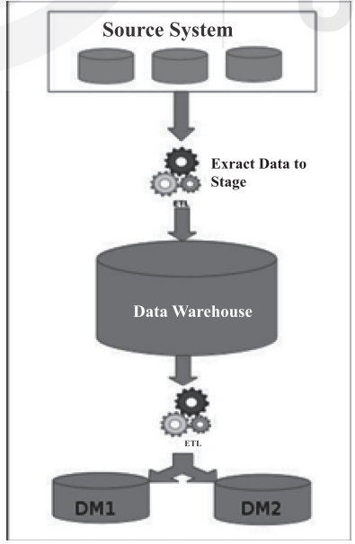
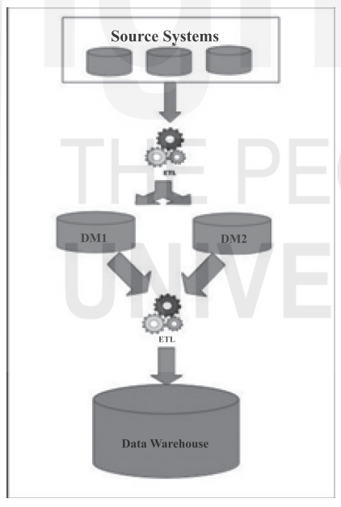
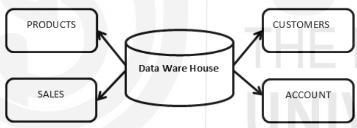
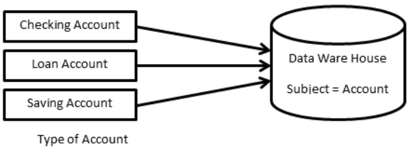
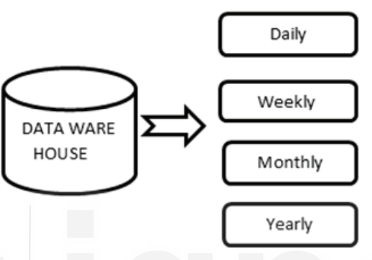
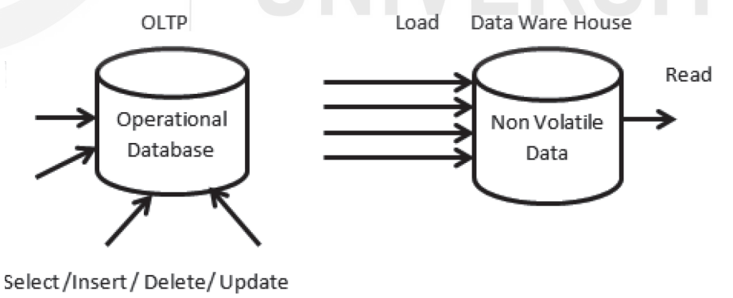
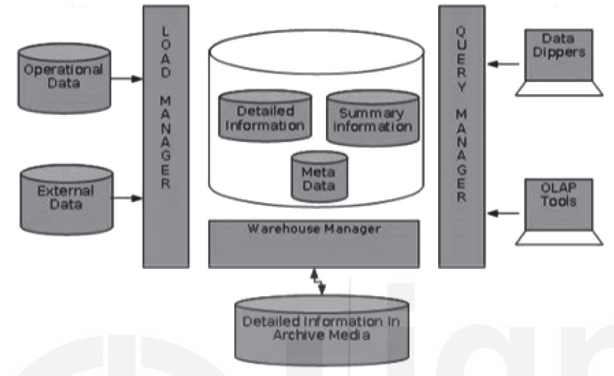

# Fundamentals of Data Warehouse

## Introduction

- A database often contains information or data collection stored electronically.
- Easy to access, manage, modify, update, monitor, and organize data.
- Data is stored in the tables of the database.
- Data warehousing involves consolidating and analyzing data to gain insights.
- Operational systems handle limited data for a limited time.
- Historical data is crucial for high-level operational insights.
- RDBMS emergence in the 1960s led to data warehousing practices.
- Data warehousing became prominent in the late 1980s for decision support systems.
- Customized hardware for data warehouses became available in the late 1990s.
- Well-architected data warehouses provide actionable insights for business decisions.

## Evolution of Data Warehouse

- **1980s**: Relational database revolution improved access to valuable information.
- **Late 1980s**: Genesis of modern data warehousing; IBM's 1988 article coined "business data warehouse."
- **Bill Inmon**: Father of Data Warehousing; discussed principles and coined the term.
  - Early 1990s: Formed Prism Solutions; introduced Prism Warehouse Manager.
  - 1992: Published "Building the Data Warehouse."
  - Concept of Corporate Information Factory.
  - Top-down approach, centralized data repository modeled to the third normal form.
- **Ralph Kimball**: Another key figure in Data Warehousing.
  - 1996: Published "The Data Warehouse Toolkit."
  - Bottom-up approach, data marts integrated via Information Bus architecture.
  - Star-schema modeling for easier end-user understanding.

### Key Definitions:
- **Inmon's Definition**: "A warehouse is a subject-oriented, integrated, time-variant and non-volatile collection of data in support of management’s decision-making process."
- **Kimball's Definition**: "Data Warehouse (DW) is the conglomerate of all data marts within the enterprise. Information is always stored in the dimensional model."

## Data Warehousing and its need

- **Purpose**: Collect and manage data from various sources to provide meaningful business insights.
- **Functions**:
  - Linking and analyzing heterogeneous sources of business data.
  - Central to data collection and reporting framework for BI systems.
  - Stores, filters, retrieves, and analyzes large quantities of organized data.
  - Provides overview and historical data for decision-making.
  - Ensures consistent information across the organization.
  - Offers a flexible and interactive information source.

### Need for Data Warehouse

- Enhances turnaround time for analysis and reporting.
- Improves business intelligence and supports decision-making.
- Benefits from historical data for time-period analysis and trend forecasts.
- Standardizes data from heterogeneous sources for easier readability and accessibility.
- Provides a high ROI by enabling quick and informed decision-making.

### Benefits of Data Warehouse

- **Scalability**: Easy to scale to match the increase in data volume.
- **Access to Historical Insights**: Allows access to past data for pattern tracing.
- **Flexibility**: Can be built on-premises or on cloud platforms.
- **Efficiency**: Increases business efficiency by providing reliable insights.
- **Data Security**: Centralized data warehouse enables multi-level security.
- **Increased Revenue and Returns**: Access to data analytics strengthens business decisions.
- **Faster and Accurate Data Analytics**: Centralized data allows for quicker and more accurate analysis.

## Data Warehouse Design Approaches

### Importance
- Selection of the right data warehouse design is crucial.
- It can save significant time and project costs.

### Main Approaches
There are two primary design approaches for data warehouses:
1. **Top-Down Approach (Bill Inmon)**
2. **Bottom-Up Approach (Ralph Kimball)**

### 1. Top-Down Approach
Bill Inmon’s methodology:
- **Data Warehouse First**: The data warehouse is designed first.
- **Data Marts**: Built on top of the data warehouse.

### Steps:
1. **Extract Data to Stage**:
   - Data is extracted from various source systems.
   - Loaded and validated in the staging area using ETL tools.
2. **Aggregation & Summarization**:
   - Extracted data is aggregated and summarized.
   - Loaded back into the data warehouse.
3. **Data Marts**:
   - Data is extracted from the warehouse to data marts.
   - Further transformations are applied as defined by the data marts.

  

### 2. Bottom-Up Approach
Ralph Kimball’s methodology:
- **Dimensional Modelling**: Known as the Kimball methodology.
- **Data Marts First**: Created for specific business processes, then integrated into an enterprise data warehouse (EDW).

### Steps:
1. **Data Marts Creation**:
   - Data is extracted from source systems into the staging area.
   - Processed and loaded into data marts.
2. **Refresh Data Marts**:
   - Current data is extracted again to the staging area.
   - Transformed and loaded into data marts.
3. **Enterprise Data Warehouse**:
   - Aggregated and summarized data from data marts is loaded into the EDW.
   - Made available for end-user analysis.

  

## Characteristics of a Data Warehouse

1. **Subject-Oriented**:
   - Focuses on specific themes (e.g., Sales, Products, Customers).
   - Aimed at decision making, not just current operations.
  
  

2. **Integrated**:
   - Combines data from various sources into a relational database.
   - Data must be consistent, readable, and coded.

  

3. **Time-Variant**:
   - Data is stored for specific intervals (weekly, monthly, yearly).
   - Provides historical data for analysis.
   - Data cannot be changed once stored.
  
  

4. **Non-Volatile**:
   - Data is permanent and not erased.
   - Separate from the operational database.
   - Manages large amounts of data for analysis.

  

## How Data Warehouse Works

- **Central Repository**: Collects data from multiple sources (structured, semi-structured, unstructured).
- **Integration**: Disparate sources are integrated for comprehensive use.
- **Data Mining**: Finds patterns to increase profits.

### Components

1. **Load Manager**:
   - Collects data from operational systems.
   - Converts data into a usable form.
   - Tasks: Data identification, validation, extraction, cleansing, formatting, standardization, merging, and establishing integrity.

2. **Warehouse Manager**:
   - Core of the data-warehousing system.
   - Organizes data for easy access and frequent updates.

3. **Query Manager**:
   - Provides access to warehouse information.
   - Uses tools for query, reporting, OLAP, statistics, data discovery, and graphical systems.

4. **End-User Access Tools**:
   - Categories: Reporting Data, Query Tools, Data Dippers, Tools for EIS, Tools for OLAP, Tools for Data Mining.

## OLTP and OLAP

### Overview
- **OLTP (Online Transaction Processing)**: Captures, stores, and processes real-time transactional data.
- **OLAP (Online Analytical Processing)**: Analyzes aggregated historical data from OLTP systems using complex queries.

### Online Transaction Processing (OLTP)
- **Function**: Captures and maintains transaction data in a database.
- **Examples**: Banking activities, credit card transactions, retail checkout.
- **Emphasis**: Fast processing with frequent reads, writes, and updates.
- **Data Integrity**: Built-in system logic ensures data integrity during transaction failures.

### Online Analytical Processing (OLAP)
- **Function**: Applies complex queries to large amounts of historical data.
- **Sources**: Data aggregated from OLTP databases and other sources.
- **Purpose**: Used for data mining, analytics, and business intelligence.
- **Emphasis**: Quick response times to complex queries.
- **Examples**: Year-over-year financial performance, marketing trends.
- **Impact of Query Failure**: Does not interrupt customer transactions but can affect business intelligence accuracy.

### Key Differences

| **Characteristics**        | **OLTP**                                                | **OLAP**                                          |
|----------------------------|---------------------------------------------------------|---------------------------------------------------|
| **Handles**                | Large number of small transactions                     | Large volumes of data with complex queries        |
| **Query Types**            | Simple standardized queries                            | Complex queries                                   |
| **Operations**             | INSERT, UPDATE, DELETE commands                        | SELECT commands for data aggregation and reporting|
| **Response Time**          | Milliseconds                                           | Seconds, minutes, or hours                        |
| **Design**                 | Industry-specific (e.g., retail, manufacturing, banking)| Subject-specific (e.g., sales, inventory, marketing)|
| **Source**                 | Transactions                                           | Aggregated data from transactions                 |
| **Purpose**                | Control and run essential business operations in real time| Plan, solve problems, support decisions, discover insights|
| **Data Updates**           | Short, fast updates initiated by user                  | Data periodically refreshed with scheduled batch jobs|
| **Space Requirements**     | Generally small if historical data is archived         | Generally large due to large datasets aggregation |
| **Backup and Recovery**    | Regular backups for business continuity                | Lost data can be reloaded from OLTP database      |
| **Productivity**           | Increases productivity of end users                    | Increases productivity of managers, analysts, executives|
| **Data View**              | Lists day-to-day business transactions                 | Multi-dimensional view of enterprise data         |
| **User Examples**          | Customer-facing personnel, clerks, online shoppers     | Data analysts, business analysts, executives      |
| **Database Design**        | Normalized databases for efficiency                    | Denormalized databases for analysis               |

## Data Warehouse Fundamentals and Architecture

### Data Granularity
- **Granularity**: Refers to the level of detail in data.
  - **Fine Granularity**: Greater detail, less summary.
  - **Gross Granularity**: Fewer details, more summarization.
- **Operational Data**: Stored at the lowest level of information.
  - Example: Sale units stored at the unit level per transaction.
- **Summary Data**: Aggregated data for analysis.
  - Example: Total product orders for a month.
- **Analysis Process**:
  - Starts at a high level of summarization.
  - Drill down to finer details as needed.
- **Storage**: Data at different granularity levels can be maintained effectively.
- **Granularity Levels**: Depend on processing and performance requirements.
  - Example: Yearly, monthly, daily, hourly, minute, second.

### Metadata and Data Warehousing
- **Common Schema**: Data stored using a controlled schema.
- **Data Dictionary**: Stores metadata such as:
  - Logical data structures
  - File and address data
  - Index information
- **Metadata Components**:
  - Data structure from the programmer's view
  - Data structure from DSS analysts' view
  - Data warehouse's data sources
  - Data transformation details
  - Data model
  - Connection between data model and data warehouse
  - Data extraction history
- **Importance**:
  - Ensures reporting accuracy
  - Validates data transformation
  - Ensures calculation accuracy
  - Aligns with business terms

## Data Warehousing Applications
- **Investment and Insurance**: Analyzes customer and market trends.
- **Healthcare**: Forecasts treatment outcomes and shares data with units like research labs and medical units.
- **Retail**: Supports distribution, marketing, pricing, promotional tracking, and customer trend analysis.
- **Social Media Websites**: Analyzes large data sets for members, groups, and locations.
- **Banking**: Analyzes spending patterns for special offers.
- **Government**: Stores and analyzes taxes to detect theft.
- **Airlines**: Supports operations like crew assignments and flight analysis.
- **Public Sector**: Manages data and records for government agencies.

## Types of Data Warehouses
- **Enterprise Data Warehouse**:
  - Central repository for decision support.
  - Stores business information from various sources.
  - Provides a complete overview of objects in the data model.
- **Operational Data Warehouse**:
  - Enterprise-wide scope with near real-time data refresh.
  - Supports routine commercial activities.
  - Data scrubbed and duplication fixed.
- **Data Mart**:
  - Subset of a data warehouse.
  - Supports specific regions, business units, or functions.
  - Enhances user responses and reduces data volume for analysis.

## Popular Data Warehouse Platforms
- **Google BigQuery**:
  - Cost-effective with built-in machine learning.
  - Executes queries on petabytes of data for real-time analytics.
  - Ideal for low-cost, quick decision-making.
- **AWS Redshift**:
  - Cloud-based, processes petabytes of data quickly.
  - Supports automatic concurrency scaling.
  - Requires a database administrator for storage efficiency.
- **Snowflake**:
  - Offers options for public cloud technology.
  - Analyzes data from various sources.
  - Dependent on Azure, AWS, and GCS.
- **Microsoft Azure Synapse**:
  - Robust platform for data management and analytics.
  - Supports querying with serverless or provisioned resources.
  - Integrates data warehousing and analytics with a unified experience.

## Check Your Progress-1
1. What is a Data Warehouse and why is it important?
2. Mention the characteristics of a Data Warehouse.
   
## Check Your Progress-2
1. Why a data warehouse is separated from Operational Databases?
2. Mention the key differences between a database and a data warehouse.