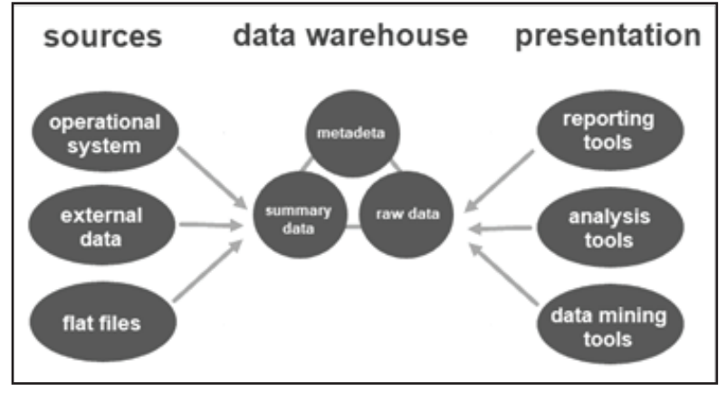
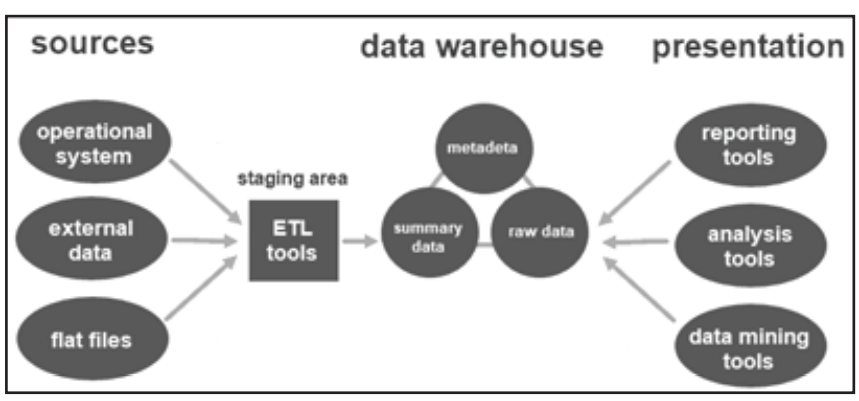
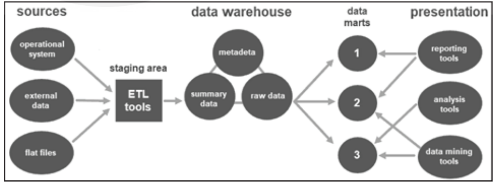

<!-- TOC start (generated with https://github.com/derlin/bitdowntoc) -->

- [Data Warehouse Architecture and Its Types](#data-warehouse-architecture-and-its-types)
  - [Data Warehouse Architecture](#data-warehouse-architecture)
    - [Types of Data Warehouse Architectures](#types-of-data-warehouse-architectures)
    - [Types of Models](#types-of-models)
      - [Cloud-based Data Warehouse Architecture](#cloud-based-data-warehouse-architecture)
  - [Components of Data Warehouse Architecture](#components-of-data-warehouse-architecture)
    - [Data Warehouse Database](#data-warehouse-database)
    - [Extraction, Transformation, and Loading Tools (ETL)](#extraction-transformation-and-loading-tools-etl)
    - [Metadata](#metadata)
    - [Data Warehouse Access Tools](#data-warehouse-access-tools)
    - [Data Warehouse Bus](#data-warehouse-bus)
    - [Data Warehouse Reporting Layer](#data-warehouse-reporting-layer)
  - [Layers of Data Warehouse Architecture](#layers-of-data-warehouse-architecture)
    - [Data Source Layer](#data-source-layer)
    - [Data Staging Layer](#data-staging-layer)
    - [Data Storage Layer](#data-storage-layer)
    - [Data Presentation Layer](#data-presentation-layer)
  - [Best Practices for Data Warehouse Architecture](#best-practices-for-data-warehouse-architecture)
  - [Data Marts](#data-marts)
    - [Definition](#definition)
    - [Data Mart vs Data Warehouse](#data-mart-vs-data-warehouse)
  - [Benefits of Data Marts](#benefits-of-data-marts)
  - [Types of Data Marts](#types-of-data-marts)
  - [Structure of a Data Mart](#structure-of-a-data-mart)
  - [Designing the Data Marts](#designing-the-data-marts)
  - [Limitations with Data Marts](#limitations-with-data-marts)
  - [Check your Progress-1](#check-your-progress-1)

<!-- TOC end -->

<!-- TOC -->
# Data Warehouse Architecture and Its Types

<!-- TOC -->
## Data Warehouse Architecture
- **Definition**: A data storage framework design for an organization.
- **Purpose**: Transforms raw data into a structured, easily digestible format.
- **Importance**: 
  - Databases store and process data.
  - Data warehouses help analyze data.
- **Function**: 
  - Performs complex analytical queries on large multi-dimensional datasets.
  - Extracts, converts, and stores data from different sources.

<!-- TOC -->
### Types of Data Warehouse Architectures
- **Definition**: Arrangement of data in different databases.
- **Purpose**: Organizes and cleanses data for valuable business intelligence.
- **Dimensional Model**: Uses raw data in the staging area and converts it for warehousing.

<!-- TOC -->
### Types of Models
1. **Single-tier Data Warehouse Architecture**:
   - **Goal**: Minimize data redundancy.
   - **Disadvantage**: No separation of analytical and transactional processing.
   

2. **Two-tier Data Warehouse Architecture**:
   - **Structure**: 
     - Includes a staging area for all data sources before the data warehouse layer.
   - **Benefit**: Ensures all data loaded is cleansed and formatted.
   

3. **Three-tier Data Warehouse Architecture**:
   - **Most Widely Used**.
   - **Tiers**:
     1. **Bottom Tier**: Database of the warehouse with cleansed and transformed data.
     2. **Middle Tier**: Application layer with an abstracted view of the database, using OLAP server.
        - **Models**: ROLAP or MOLAP.
     3. **Top Tier**: User access and interaction layer with reporting, query, analysis, or data mining tools.
   

<!-- TOC -->
#### Cloud-based Data Warehouse Architecture
- **Definition**: Data warehouses accessed through the cloud.
- **Benefits**:
  - **Up-front Costs**: Lower than traditional on-premises data warehouses.
  - **Ongoing Costs**: Low, pay-as-you-go model.
  - **Speed**: Faster than on-premises options, often using ELT process.
  - **Flexibility**: Accommodates various formats and structures of big data.
  - **Scale**: Elastic resources allow for scalable and efficient data access and analysis.

- **Advantages of Cloud-based Systems**:
  - **Ease of Use**: Create, share, and store massive datasets efficiently.
  - **Scalability**: Designed for sustainable business growth.
  - **Separation of Data Storage and Computing**: Improves scalability.

- **Notable Cloud Data Warehouses**:
  - Amazon Redshift
  - Google BigQuery
  - Snowflake
  - Microsoft Azure SQL Data Warehouse

<!-- TOC -->
## Components of Data Warehouse Architecture

A data warehouse design consists of six main components:
- Data Warehouse Database
- ETL (Extraction, Transformation, and Loading) Tools
- Metadata
- Data Warehouse Access Tools
- Data Warehouse Bus
- Data Warehouse Reporting Layer

<!-- TOC -->
### Data Warehouse Database
- **Central Component**: Stores all enterprise data for reporting.
- **Database Types**:
  - **Typical Relational Databases**: Microsoft SQL Server, SAP, Oracle, IBM DB2.
  - **Analytics Databases**: Teradata, Greenplum.
  - **Data Warehouse Applications**: SAP Hana, Oracle Exadata, IBM Netezza.
  - **Cloud-based Databases**: Amazon Redshift, Google BigQuery, Microsoft Azure SQL.

<!-- TOC -->
### Extraction, Transformation, and Loading Tools (ETL)
- **Role**: Extracts data from sources, transforms it, and loads it into the data warehouse.
- **Functions**:
  - Time expended in data extraction
  - Approaches to extracting data
  - Type of transformations applied
  - Business rule definition for data validation and cleansing
  - Filling missing data
  - Outlining information distribution to BI applications

<!-- TOC -->
### Metadata
- **Definition**: Describes the data warehouse database and provides a framework.
- **Types**:
  - **Technical Metadata**: Used by developers and managers for development and administration.
  - **Business Metadata**: Offers an understandable view of the data for business users.
- **Importance**: Helps businesses and technical teams understand and utilize warehouse data.

<!-- TOC -->
### Data Warehouse Access Tools
- **Purpose**: Enable working with databases, especially for non-database administrators.
- **Types**:
  - **Query and Reporting Tools**: Produce reports for analysis in various formats.
  - **Application Development Tools**: Create tailored reports for reporting purposes.
  - **Data Mining Tools**: Identify patterns and links using statistical modeling.
  - **OLAP Tools**: Construct multi-dimensional data warehouses for enterprise data analysis.

<!-- TOC -->
### Data Warehouse Bus
- **Definition**: Defines the data flow within a data warehousing bus architecture.
- **Includes**: Data marts for user-level data transfer and partitioning.

<!-- TOC -->
### Data Warehouse Reporting Layer
- **Purpose**: Allows end-users to access the BI interface or BI database architecture.
- **Functions**:
  - Acts as a dashboard for data visualization
  - Creates reports
  - Extracts required information

<!-- TOC -->
## Layers of Data Warehouse Architecture

Data warehouse architecture can be divided into four layers:
- Data Source Layer
- Data Staging Layer
- Data Storage Layer
- Data Presentation Layer

<!-- TOC -->
### Data Source Layer
- **Function**: Stores unique information from various internal and external sources.
- **Examples**:
  - **Operational Data**: Product info, stock info, marketing info, HR info.
  - **Social Media Data**: Website hits, content fame, contact page completion.
  - **Third-party Data**: Demographic info, survey info, statistics info.
- **Consideration**: Future use of unstructured data sources (e.g., voice accounts, scanned images, unstructured text).

<!-- TOC -->
### Data Staging Layer
- **Function**: Extracts, cleanses, and organizes data before loading it into the data warehouse.
- **Components**:
  - **Landing Database and Staging Area**: Stores retrieved data and performs quality checks.
  - **Data Integration Tool**: Uses ETL tools to extract, transform, and load data.

<!-- TOC -->
### Data Storage Layer
- **Function**: Stores cleansed data in a central repository.
- **Types**:
  - **Data Warehouse Core**: Central repository for the entire organization.
  - **Data Mart**: Subset of the data warehouse for specific departments.
  - **Operational Data Store (ODS)**: Stores operational data for real-time processing.

<!-- TOC -->
### Data Presentation Layer
- **Function**: Provides users access to the organized data for querying and analysis.
- **Tools**:
  - OLAP or reporting tools with Graphical User Interface (GUI) for query building, analysis, and report generation.

<!-- TOC -->
## Best Practices for Data Warehouse Architecture
- **Optimization**: Create models optimized for information retrieval using dimensional, de-normalized, or hybrid approaches.
- **Approach**: Choose a single approach (top-down or bottom-up) and stick with it.
- **ETL Process**: Always cleanse and transform data before loading into the data warehouse.
- **Automation**: Automate data cleansing processes for uniform data quality.
- **Metadata Sharing**: Share metadata between components for smooth retrieval.
- **Data Integration**: Ensure proper data integration, not just consolidation (use 3NF normalization).
- **Performance and Security**: Monitor system usage to maintain high performance and security.
- **Data Quality Standards**: Maintain data quality, metadata, structure, and governance.
- **Agility**: Provide a flexible architecture to support varying data mart and warehouse needs.
- **Process Automation**: Use machine learning to automate maintenance and reduce operating costs.
- **Strategic Cloud Use**: Use on-premise systems when needed and capitalize on cloud data warehouses for scalability, cost reduction, and mobile access.

<!-- TOC -->
## Data Marts

<!-- TOC -->
### Definition
- A data mart is a subset of a data warehouse focused on a particular line of business, department, or subject area.
- Provides specific data to a defined group of users for quick access to critical insights.

<!-- TOC -->
### Data Mart vs Data Warehouse
- **Scope**:
  - **Data Warehouse**: Central store of data for the entire business.
  - **Data Mart**: Specific to a department or business function.
- **Purpose**:
  - **Data Warehouse**: Strategic decisions for the entire enterprise.
  - **Data Mart**: Tactical decisions for specific departments.
- **Size and Speed**:
  - **Data Warehouse**: Contains large data sets, slower to query and update.
  - **Data Mart**: Smaller, specialized data sets, faster query speed and updates.
- **Implementation**:
  - **Data Warehouse**: Takes years to implement.
  - **Data Mart**: Implemented in months.

<!-- TOC -->
## Benefits of Data Marts
- **Cost-efficiency**: Lower cost compared to data warehouses.
- **Simplified Data Access**: Easier and quicker data retrieval.
- **Quicker Insights**: Supports department-level decision-making, leading to accelerated business processes and higher productivity.
- **Simpler Maintenance**: Easier to maintain due to a smaller scope.
- **Faster Implementation**: More efficient setup with less time required.

<!-- TOC -->
## Types of Data Marts
- **Dependent Data Marts**:
  - Partitioned segments within an enterprise data warehouse.
  - Extracts a defined subset of primary data for analysis.
- **Independent Data Marts**:
  - Standalone systems that don't rely on a data warehouse.
  - Data extracted from internal or external sources.
- **Hybrid Data Marts**:
  - Combines data from existing data warehouses and other operational sources.
  - Offers speed and user-friendliness with enterprise-level integration.

<!-- TOC -->
## Structure of a Data Mart
- **Relational Database**: Stores transactional data in rows and columns.
- **Schemas**:
  - **Star Schema**: One fact table at the center, surrounded by dimension tables; fewer joins needed.
  - **Snowflake Schema**: Extension of star schema with additional normalized dimension tables; lower disk space demand but complex structure.
  - **Data Vault**: Agile design for enterprise data warehouses, eliminates need for cleansing and allows easy addition of new data sources.

<!-- TOC -->
## Designing the Data Marts
1. **Essential Requirements Gathering**:
   - Collect corporate and technical requirements.
   - Identify data sources and design the logical layout and physical structure.
2. **Build/Construct**:
   - Create the physical database and logical structures.
   - Build tables, fields, indexes, and access controls.
3. **Populate/Data Transfer**:
   - Transfer data into the data mart.
   - Set frequency of data transfer (daily or weekly).
   - Extract, clean, and transform data.
4. **Data Access**:
   - Query, generate reports, and graphs.
   - Set up a meta-layer for easy data access.
5. **Manage**:
   - Control ongoing user access.
   - Optimize and refine the system for performance.
   - Manage new data and configure recovery settings.

<!-- TOC -->
## Limitations with Data Marts
- **User Demand Overload**: Successful data marts may be overrun by user demands, leading to slow response times.
- **Design Flaws**: Poor design can prevent users from retrieving needed information, leading to project failure.
- **Common Design Pitfalls**:
  - Denormalization (dimensional modeling).
  - Storing aggregates at the expense of detail data.
  - Skewing performance towards a small set of queries, limiting exploratory analysis.

<!-- TOC -->
## Check your Progress-1
1. Define data warehouse architecture.
2. What is the correct flow of the data warehouse architecture?
3. Mention some Data Mart Use Cases.