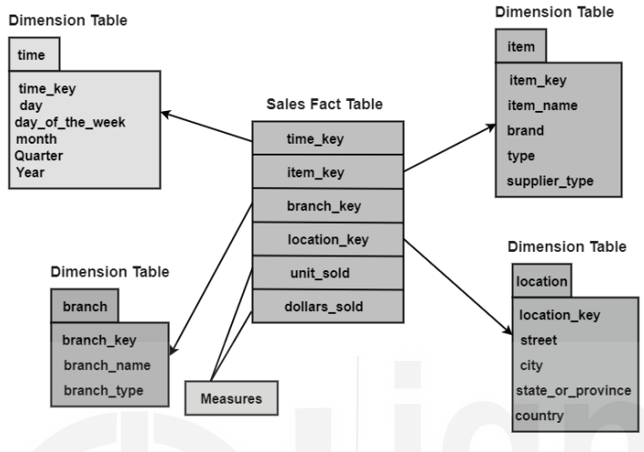
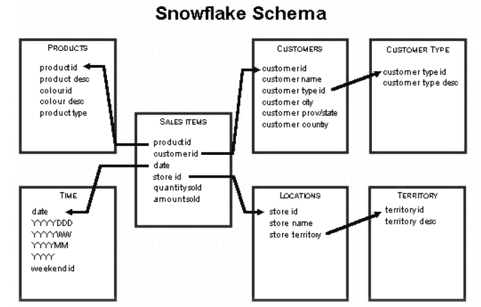
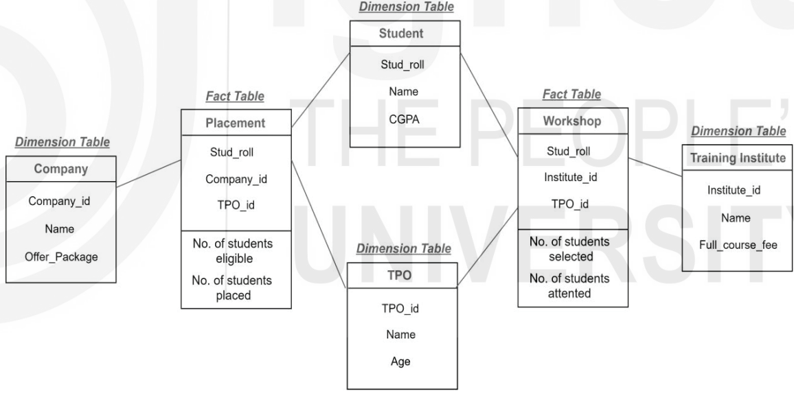
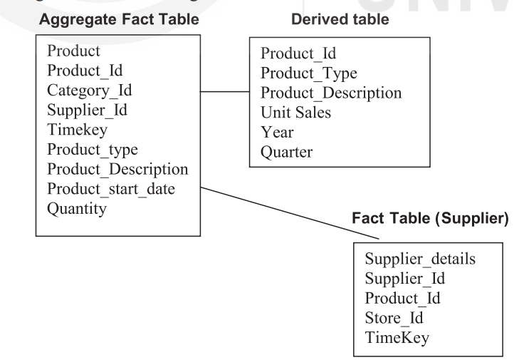

# Dimensional Modeling

## Dimensional Modelling

### Definition and Purpose
- Dimensional modeling is used in data warehouse design to improve query response times compared to traditional relational systems.
- Focuses on conceptual design with fewer tables and simpler relationships for efficient querying.

### Concept and Components
- **Concept**: Designed for reading, summarizing, and computing numeric data in data warehouses.
- **Components**: Uses "fact" tables (numerical transaction data) and "dimension" tables (contextual reference data) to populate data cubes for OLAP management.

### Steps in Dimensional Modeling
1. **Identify Business Process**
   - Select the business process for data warehouse implementation.
   - Define business objectives to avoid repeated processes and software defects.

2. **Identify Granularity**
   - Determine the level of detail needed (e.g., monthly, yearly).
   - Influences the size and scope of the data warehouse.

3. **Identify Dimensions and Attributes**
   - Define entities (e.g., products, time) and their attributes.
   - Specify primary keys and foreign keys for relational integrity.

4. **Build Schema**
   - Create database structure (e.g., star schema, snowflake schema, fact constellation).
   - Schema design should support business requirements and optimize query performance.

### Strengths of Dimensional Modeling
- **Simplicity**: Easy to understand for stakeholders from designers to business clients.
- **Reduced Relationships**: Fewer table relationships simplify data access and querying.
- **Data Quality**: Enforces referential integrity through foreign key constraints.
- **Query Performance**: Optimizes performance with aggregate functions and efficient schema design.

## Facts and Dimensions
- **Fact Tables**: Contain numeric measures (facts) and foreign keys to dimension tables.
- **Dimensions Tables**: Describe contextual background for facts, supporting OLAP operations.
- **Example**: Student registration case study could have facts like student_id, course_id, date_of_registration in a fact table linked to dimension tables like Student_details, Course_details, etc.

## Star Schema in Dimensional Modeling

### Definition and Purpose
- **Star Schema**: A multidimensional model where data is organized into facts (central table) and dimensions (smaller related tables).
- **Purpose**: Provides a simple and efficient structure for querying large data sets in data warehouses.

### Features of Star Schema
- **Denormalized Database**: Data is stored in a denormalized format to optimize query performance.
- **Quick Query Response**: Faster query performance due to fewer join operations.
- **Flexibility**: Easy to change or add dimensions as needed.
- **Simplicity**: Reduces complexity for developers and end users alike.

### Advantages of Star Schema
- **Query Performance**: Fast query response times, especially for single-table queries and simpler join paths.
- **Load Performance**: Efficient data loading due to separate fact and dimension tables.
- **Built-in Referential Integrity**: Ensures data integrity through foreign key relationships.
- **Ease of Understanding**: Intuitive structure makes it easy for users to navigate and analyze data.

### Disadvantages of Star Schema
- **Data Integrity Challenges**: Denormalized structure can lead to data anomalies with insert or update operations.
- **Limited Complex Queries**: Less suitable for handling diverse and complex analytical queries compared to normalized schemas.
- **Many-to-Many Relationships**: Inefficient for modeling many-to-many relationships without additional complexity.

### Examples of Star Schema
- **Example 1**: A sales fact table linked to dimension tables for Time, Branch, Item, and Location.
- **Example 2**: Illustration of a grocery store purchase where sales data (fact) is connected to dimensions like Store, Customer, Sales Type, Product, and Time.

### Visual Representation

## Snowflake Schema in Dimensional Modeling

### Definition and Purpose
- **Snowflake Schema**: An extension of the star schema that normalizes dimension tables to reduce redundancy and improve data integrity.
- **Purpose**: Provides a more structured approach to handling complex data relationships in multidimensional databases.

### Features of Snowflake Schema
- **Normalized Tables**: Dimension tables are normalized into multiple smaller tables, reducing redundancy and improving data integrity.
- **Disk Space Efficiency**: Occupies less disk space compared to star schema due to normalized tables.
- **Complexity**: Requires more lookup time due to increased number of tables and joins.
  
### Advantages of Snowflake Schema
- **Space Efficiency**: Occupies less disk space compared to star schema, which can be advantageous for large data warehouses.
- **Data Integrity**: Better data quality and fewer data anomalies due to normalized tables.
- **Structured Data**: Provides a more structured and organized approach to data storage and maintenance.
  
### Disadvantages of Snowflake Schema
- **Complex Queries**: Queries involving multiple joins across normalized tables can be slower compared to star schema.
- **Performance**: Slower performance for complex queries and cube data processing compared to star schema.
- **Data Integrity Concerns**: While better than star schema, still requires careful handling to ensure data integrity after updates or inserts.

## Star Schema vs Snowflake Schema
| **Features**                 | **Star Schema**                                            | **Snowflake Schema**                                      |
|------------------------------|------------------------------------------------------------|------------------------------------------------------------|
| **Normalized Dimension Tables** | Dimension tables are denormalized.                         | Dimension tables are normalized into multiple tables.      |
| **Query Performance**        | Faster query execution due to fewer joins.                  | Slower query execution due to more joins and normalization.|
| **Storage Space**            | Requires more storage space due to denormalization.         | Requires less storage space due to normalization.          |
| **Usage**                    | Suitable for simpler relationships (1:1 or 1:many).         | Suitable for complex relationships (many:many).            |
| **Dimension Tables**         | Each dimension typically has one table.                     | Each dimension may have multiple tables.                   |

## Example of Snowflake Schema
- **Example**: A schema for customers, sales, products, and locations, with dimensions like customer type and sales territory further normalized.

### Visual Representation

## Fact Constellation Schema

### Definition and Purpose
- **Fact Constellation Schema**: A collection of multiple star schemas that share common dimensions, forming a complex data structure resembling a galaxy of interconnected stars.

### Features
- **Multiple Fact Tables**: Includes two or more fact tables connected through shared dimensions.
- **Complexity**: More flexible than single star schemas but adds complexity to implementation and maintenance.

### Advantages and Disadvantages
- **Advantage**: Offers a wider perspective and flexibility in data analysis by connecting multiple facts.
- **Disadvantage**: Complex to implement and maintain due to interconnecting multiple star schemas.

### Visual Representation

## Aggregate Tables in Dimensional Modeling

### Definition and Purpose
- **Aggregate Tables**: Also known as summary tables, these tables store pre-computed and partially summarized data from base fact tables to enhance query performance in data warehouses.

### Key Points about Aggregate Tables
- **Summary Tables**: They contain pre-computed aggregations of data warehouse schema.
- **Dimensionality Reduction**: Reduces the complexity and dimensionality of base fact tables.
- **Query Performance**: Improves query response time by providing aggregated data that can be quickly accessed.

## Need for Building Aggregate Fact Tables
- **Purpose**: To speed up query response times by storing intermediate results of complex queries.
- **Space Efficiency**: Occupies less space compared to atomic fact tables.
- **Granularity Adjustment**: Helps adjust the granularity of data for different levels of reporting needs.
- **OLAP Operations**: Aggregate tables are generated through roll-up OLAP operations on base fact tables.

## Aggregate Fact Table and Derived Dimension Tables
- **Aggregate Fact Tables**: Contain summarized measures using SQL aggregate functions like SUM, AVG, etc., for faster query handling.
- **Derived Tables**: Additional tables that extend the base fact table with new measures or foreign keys not present in the base fact table.
- **Conformed Dimension**: Dimensions shared across multiple data marts or subject areas without alteration.
- **Consolidated Fact Tables**: Combine data from different fact tables with a common grain to form a unified schema.

### Advantages and Usage
- **Performance**: Significantly improves query performance by reducing the number of rows accessed.
- **Flexibility**: Allows for handling complex queries and diverse reporting needs efficiently.
- **Business Intelligence**: Essential for supporting business intelligence applications and tools.

## Visual Representation

## Check your progress-1
1. Discuss the characteristics of star schema?
2. Draw a Star Schema for a marketing employee staying in a NewYork city of the country USA. He buys products and wants to compute the total product sold and how much sales done?

## Check your progress-2
1. Compare and contrast Star schema with Snowflake Schema?
2. Suppose that a data warehouse consists of dimensions time, doctor, ward and patient, and the two measures count and charge, where charge is the fee that a doctor charges a patient for a visit. Enumerate three classes of 
schemes that are popularly used for modeling. 
   1. Draw a Star Schema diagram
   2. Draw a Snowflake Schema diagram.

## Check your progress-3
1. Discuss the limitations of Aggregate Fact tables.