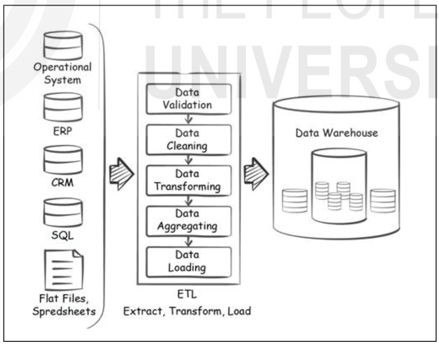
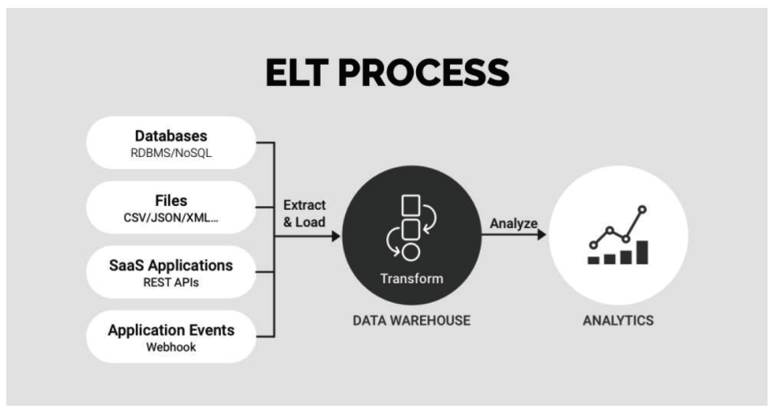

<!-- TOC start (generated with https://github.com/derlin/bitdowntoc) -->

- [ETL and Its Need](#etl-and-its-need)
  - [ETL Overview](#etl-overview)
    - [Why Do You Need ETL?](#why-do-you-need-etl)
    - [Components of ETL](#components-of-etl)
  - [ETL Process](#etl-process)
    - [Data Extraction](#data-extraction)
    - [Data Transformation](#data-transformation)
    - [Data Loading](#data-loading)
  - [Working of ETL](#working-of-etl)
    - [Layered Implementation in Data Warehouse](#layered-implementation-in-data-warehouse)
  - [ETL and OLAP Data Warehouses](#etl-and-olap-data-warehouses)
  - [ETL Tools and their benefits](#etl-tools-and-their-benefits)
  - [Improving the performance of ETL](#improving-the-performance-of-etl)
  - [ELT and its need](#elt-and-its-need)
    - [Benefits of ELT](#benefits-of-elt)
  - [ETL Vs ELT](#etl-vs-elt)
  - [Check Your Progress - 1](#check-your-progress---1)

<!-- TOC end -->

<!-- TOC -->
# ETL and Its Need

<!-- TOC -->
## ETL Overview

- **ETL (Extract, Transform, Load)**: A data integration process with three steps:
  - **Extraction**: Collects data from multiple sources.
  - **Transformation**: Converts data for analysis.
  - **Loading**: Loads data into the warehouse.
  
<!-- TOC -->
### Why Do You Need ETL?

- **Time Savings**: Reduces time on data extraction and preparation.
- **Healthy Data Management Workflow**: Ensures high data quality, availability, and reliability.

<!-- TOC -->
### Components of ETL

- **Extract**: 
  - Determines data sources, refresh rate, and priorities.
  - Impacts time to insight.
  
- **Transform**: 
  - Brings clarity and order to data.
  - Standardizes formats, sums, rounds, averages measures.
  - Deletes useless data, masks PII to comply with privacy regulations.
  
- **Load**: 
  - Determines targets and refresh rates.
  - Supports incremental loading or “upsert”.

<!-- TOC -->
## ETL Process

- **ETL**: Collects and processes data into a single data store (data warehouse or data lake).

<!-- TOC -->
### Data Extraction

- **Steps**:
  - Identify data sources (SQL, NoSQL, SaaS platforms).
  - Estimate data extraction size.
  - Choose extraction method:
    - **Update notifications**: Preferred method.
    - **Incremental extraction**: For changed records.
    - **Full extraction**: Complete data update.

- **SaaS Platforms**: Requires integration with unique APIs (e.g., Xplenty).

<!-- TOC -->
### Data Transformation

- **In Traditional ETL**: Multistage data transformation in staging area.
- **In ELT**: Data transformation after loading into the warehouse.
- **Transformations**:
  - Deduplication
  - Key restructuring
  - Cleansing
  - Format revision
  - Derivation
  - Aggregation
  - Integration
  - Filtering
  - Splitting
  - Joining
  - Summarization
  - Validation

<!-- TOC -->
### Data Loading

- **Process**: Loading extracted information into target data repository.
- **Types of Incremental Loads**:
  - **Batch incremental loads**: Data ingested in packets or batches.
  - **Streaming incremental loads**: Real-time data ingestion.

- **Challenges in Incremental Loading**:
  - Data structure changes
  - Processing data in the wrong order
  - Failure to detect problems

<!-- TOC -->
## Working of ETL

- **Implementation**:
  - **Parsing/Cleansing**: Maps data into table format.
  - **Data Enrichment**: Prepares data for analytics.
  - **Setting Velocity**: Frequency of data loading.
  - **Data Validation**: Detects and handles empty, corrupted, or missing data.

<!-- TOC -->
### Layered Implementation in Data Warehouse

- **Mirror/Raw layer**: Copy of source files/tables.
- **Staging layer**: Holds transformed data.
- **Schema layer**: Final form after transformation.
- **Aggregating layer**: Aggregates data for performance and reporting.

<!-- TOC -->
## ETL and OLAP Data Warehouses

- **ETL Overview**
  - ETL (Extract, Transform, Load) integrates diverse data types into OLAP data warehouses.
  - **OLTP vs. OLAP**
    - OLTP (Online Transactional Processing) databases: Optimized for writing, updating, and editing information.
    - OLAP (Online Analytical Processing) databases: Optimized for high-speed reading and analysis.
  - **ETL Process**
    - Extract: Data from various relational database systems (OLTP or RDBMS) and other sources.
    - Transform: Data transformed in a staging area to a compatible format, integrated with other sources.
    - Load: Data loaded into the OLAP data warehouse server.

- **Modern ETL Solutions**
  - In the past, ETL pipelines were hand-coded in R, Python, and SQL.
  - Today, solutions like Xplenty automate integration, increasing setup speed and reducing human error.

<!-- TOC -->
## ETL Tools and their benefits

- **Types of ETL Tools**
  - Open source and proprietary categories.
  - ETL frameworks and libraries available for Python, GO, and Hadoop.
  - **Custom Coding**
    - Requires setup and maintenance.
    - May need tweaking with additional tasks.

- **Benefits of ETL Tools**
  - **Scalability**
    - Hand-coded solutions are hard to scale.
    - Cloud-based tools like Xplenty offer unlimited scalability.
  - **Simplicity**
    - Cloud-based ETL tools simplify processes, saving time and resources.
  - **Out-of-the-box Solutions**
    - Tools like Xplenty work immediately, unlike customizable open-source tools like Apache Airflow.
  - **Compliance**
    - ETL tools integrate compliance frameworks (GDPR, CCPA, HIPAA) seamlessly.
  - **Long-term Costs**
    - Hand-coded solutions may be cheaper upfront but costlier in the long run.
    - Cloud-based tools handle maintenance and backend caretaking.

<!-- TOC -->
## Improving the performance of ETL

- **Performance Factors**
  - **Tackle Bottlenecks**
    - Log metrics such as time, records processed, and hardware usage.
    - Address the heaviest resource usage, usually building facts and dimensions in the staging environment.
  - **Load Data Incrementally**
    - Save time by loading only changes between previous and new data.
  - **Partition Large Tables**
    - Cut large tables into smaller ones, probably by date, for quicker access.
  - **Cut Out Extraneous Data**
    - Process only relevant data to improve performance.
  - **Cache the Data**
    - Use memory caching to speed up processes.
  - **Process in Parallel using Hadoop**
    - Optimize resources by processing in parallel using Hadoop’s distributed processing system.

<!-- TOC -->
## ELT and its need

- **ELT Overview**
  - Extract, Load, Transform (ELT) extracts data and loads it into the target data warehouse before transformation.
  - ELT uses the target system’s processing capabilities for transformation, boosting efficiency.

- **ELT Process**
  - Extract: Ingest raw data from various sources.
  - Load: Deliver raw data directly to the target storage location.
  - Transform: Sort and normalize data in the target database.

- **Why ELT?**
  - Effective for large enterprises with vast data volumes.
  - Suitable for businesses with multiple data sources and formats.
  - Quick access to integrated data.
  - Low-maintenance solution for IT departments and data stewards.

<!-- TOC -->
### Benefits of ELT

- **Efficient Effort**
  - Integrate and process large amounts of structured and unstructured data.
- **Faster Transformation**
  - Transform data where it resides for quicker access.
- **Combines Diverse Data**
  - Integrate data from various sources and formats.
- **Manage Data at Scale**
  - Handle petabytes of data efficiently.
- **Cost and Time Savings**
  - Reduce data transit time and costs, eliminating the need for interim systems.

<!-- TOC -->
## ETL Vs ELT

- **Key Differences**
  - **Load Time**
    - ETL takes longer to load data from source to target.
  - **Transformation Time**
    - ELT performs transformations on-demand using target system's computing power.
  - **Complexity**
    - ETL tools have user-friendly GUIs.
    - ELT requires deep BI tools knowledge and a capable database.
  - **Data Warehouse Support**
    - ETL is suitable for legacy on-premise warehouses and structured data.
    - ELT is designed for cloud scalability.
  - **Maintenance**
    - ETL requires significant maintenance.
    - ELT offers near real-time data availability.

- **Choosing ETL or ELT**
  - Both ETL and ELT have their place in data warehouse architecture.
  - The choice depends on business needs and strategies.

<!-- TOC -->
## Check Your Progress - 1
1. Define Data Extraction process of ELT along the variety of sources of data accounted for this process. Also, mention the challenge(s) for an ETL tool during the extracting process.
2. Describe the Data Transformation process involved in the ELT.
3. Discuss briefly the Data Loading process of ELT.