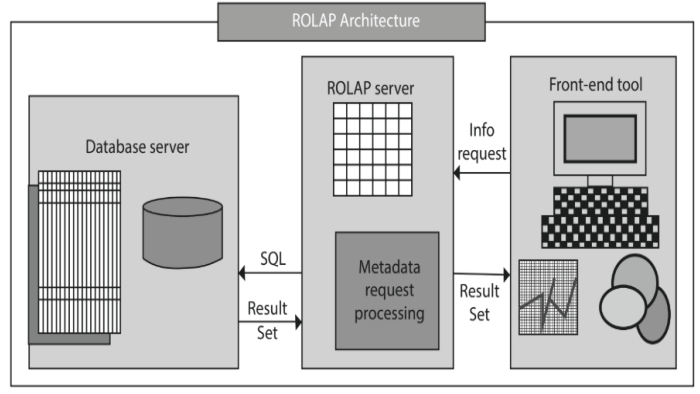

# Intoduction to Online Analytical Processing

## OLAP and its need

- **OLAP Overview**
  - OLAP (Online Analytical Processing) analyzes and processes data from multiple sources simultaneously.
  - It accesses multiple databases at once.
  - Helps data analysts collect data from different perspectives for effective business strategies.
  - Performs query operations like group, join, or aggregation using pre-calculated or pre-aggregated data, making it faster than simple relational databases.

- **Structure and Functionality**
  - OLAP can be understood as a multi-cubic structure, with each cube related to a database.
  - Designed for effective and efficient report generation.
  - Core component of data warehouse implementation.
  - Provides fast and flexible multi-dimensional data analysis for business intelligence (BI) and decision support applications.
  - Used for high-speed, multivariate analysis of large amounts of data in data warehouses, data markets, or other centralized data warehouses.

- **Usage Examples**
  - Sales data can be related to location, time, product, etc.
  - Reorganizes data into a multi-dimensional format for fast processing and in-depth analysis.
  - Example: Comparing sales data across months and locations, analyzing customer purchases for personalized recommendations.

- **Benefits**
  - Consistency of information and calculations.
  - Security restrictions on users and objects to comply with regulations and protect sensitive data.
  - Enhances managerial decision-making by providing efficient multi-dimensional record views.
  - Permits simulation of business models and challenges through extensive analysis capabilities.

- **Need for OLAP over Relational Databases**
  - **Efficient and Effective Methods**
    - Improves organizational sales by effectively searching for products across different regions and time periods.
    - Identifies expenditures producing high ROI.
  - **Comparison with Spreadsheets**
    - Traditional spreadsheets handle two-dimensional data, but OLAP handles multidimensional data from different and unrelated sources.
    - OLAP cubes store and analyze multidimensional data logically and orderly.

## Characterstics of OLAP

- **Fast**
  - Acts as a bridge between Data Warehouse and front-end, improving data accessibility and yielding faster results.

- **Analysis**
  - Stores analysis and computational results in separate data files.
  - Distinguishes zero and missing values, performing correct aggregate values.
  - Facilitates interactive query handling and complex analysis.

- **Shared**
  - Allows drill-down or roll-up operations, navigating between dimensions in a multidimensional cube for effective reporting.

- **Multidimensional**
  - Provides a multidimensional conceptual view and data access at different user levels.
  - Maintains performance even with an increasing number of dimensions and reports.

- **Data and Information**
  - Handles complex queries and data calculations.
  - Visualizes data using graphs and charts.

## OLAP and Multidimensional Analysis

- **Data Cube Storage**
  - Multi-dimensional data model stores data in the form of a data cube.
  - Supports two- or three-dimension cubes.
  - Provides different views and perspectives of data.
  - Example: Retail store data maintained month-wise, item-wise, region-wise.

### Multidimensional Logical Data Modeling and its Users

- **Multidimensional Data Modeling**
  - Provides different views and perspectives from various angles.
  - Business users have a dimensional and logical view of data in the data warehouse.

- **Multidimensional Conceptual View**
  - Allows users to view data dimensionally and logically.
  - Creates an environment for multi-user access.
  - OLAP and database operations (retrieval, update, adequacy control, integrity, security) are easily performed.

- **Example**
  - Dimensions: Time, Regions, Products stored in a cube.
  - Measures: Any quantity such as revenue, expenses, units, statistics.
  - Combining dimensions into cubes allows fluid exploration from any perspective.
  - OLAP cubes can hold more than three dimensions.

- **Managerial Use**
  - Managers can track sales units across different dimensions.
  - Better decision-making with multi-dimensional views and detailed data.
  - Enhances business-oriented multi-dimensional data analysis.

### Multidimensional Structure

- **Organization**
  - Data organized into multiple dimensions, each with multiple levels of abstraction.
  - Concept hierarchies define levels of abstraction.
  - Provides flexibility to view data from different angles.
  - Example: Conceptual hierarchy of a product:
    - Department → Category → Subcategory → Brand → Product

- **Query Performance**
  - Important to identify the hierarchy in terms of query.
  - Focus on performance measures or attributes/dimensions.

### Multidimensional Operations

- **User-Friendly Environment**
  - OLAP provides an interactive data analysis environment.
  - Popular end-user operations: Roll-up, Drill-down, Slice, Dice, Pivot (rotate).

- **Roll-up**
  - Aggregation operation (also called drill-up or consolidation).
  - Aggregates data by climbing up a concept hierarchy or reducing dimensions.
  - Example: Viewing quarterly sales by category.
  

- **Drill-down**
  - Reverse of roll-up (also called roll-down).
  - Navigates from less detailed to more detailed data.
  - Example: Expanding Time dimension from Quarter to Months.
  

- **Slice**
  - Displays one level of information.
  - Queries one dimension and creates a new sub-cube.
  - Example: Slice operation on Time dimension.
  

- **Dice**
  - Selects data from multiple dimensions for analysis.
  - Similar to Projection in RDBMS.
  - Example: Dice operation with multiple dimensions.
  

- **Pivot**
  - Rotates data axes to gain a new view.
  - Fixes one attribute as a Pivot and rotates the cube.
  - Example: Changing dimension presentation for different perspectives.
  

## OLAP Functions

- **OLAP Functions Overview**
  - Return ranking and row numbering, similar to SQL aggregate functions.
  - Aggregate functions return an atomic value.
  - OLAP functions return a scalar value from a query and can be performed at individual row levels.
  - Provide data mining functionalities and detailed data analysis.

- **Functionalities**
  - Support exhaustive and comprehensive data analysis row-wise.
  - Use SQL commands like `INSERT`, `SELECT`, `POPULATE` on tables or views.

## Data Warehouse and OLAP: Hypercube and Multi Analytical Processing Cubes

- **OLAP Cube**
  - Data structure optimized for quick data analysis.
  - Consists of numeric facts called measures categorized by dimensions.
  - Also known as hypercube.
  - Multidimensional databases can be viewed as hypercubes or multi-cubes.

- **Multi-Cube vs. Hypercube**
  

## Applications of OLAP

- Widely used in:
  - Sales and Marketing
  - Retail Industry
  - Financial Organizations – Budgeting
  - Agriculture
  - People Management
  - Process Management
- Examples: Essbase (Hyperion Solution), Express Server (Oracle).

## Steps in the OLAP Creation

- **Basic Unit: OLAP Cube**
  - Data structure designed for better and faster data analysis.
  - Logical view in rows and columns.

- **Steps to Create OLAP**
  1. **Extract Data**
     - From various sources like text, Excel sheets, multimedia files, OLTP data in flat files.
  2. **Transformation and Standardization**
     - Data preprocessing/cleaning to standardize incompatible data.
  3. **Loading Data**
     - Load data onto OLAP server or multidimensional cube.
  4. **Building the Cube**
     - Select dimensions and concept hierarchies.
     - Populate cube with relevant data.
     - Apply aggregate functions to numeric attributes.
  5. **Report Generation**
     - Generate reports from the cube data.

  

## Advantages of OLAP Analytical Processing

- **Faster Data Processing**
  - Tremendous speed of query execution.
  - Saves time and money on calculations and complex reports.
- **Accessibility**
  - Data from various sources stored concisely in one location.
- **Concise and Fine Data**
  - Combines multiple records, forming a schema.
  - Drill-down and drill-up operations for detailed data.
- **Multi-Dimensional Data Representation**
  - Cube contains various attributes and processes.
  - Allows slicing information from different dimensions.
- **Business Expressions**
  - Represents company’s economic and financial conditions.
  - User-friendly, even for non-technical users.
- **Situational Scenarios**
  - Creates "what-if" situations for detailed analysis.
  - Helps in business intelligence and decision-making.
- **Easily Understood Technology**
  - Minimal technical skills required.
  - OLAP technology providers offer tutorials and support.

## OLAP Architecture: MOLAP, ROLAP, HOLAP, and DOLAP

  

- **Types of OLAP Architecture**
  - **ROLAP (Relational OLAP)**
    - Based on relational DBMSs.
    - Dynamic multidimensional analysis.
    - Three-tiered architecture: Database server, ROLAP server, Front-end tool.
    - Converts requests into SQL and presents results in multidimensional format.
    - Characteristics: Utilizes more processing time and disk space, supports larger user groups, processes complex queries.
    - Examples: Metacube (Stanford Technology Group), Red Brick Warehouse (Red Brick Systems).

    

  - **MOLAP (Multidimensional OLAP)**
    - Uses multidimensional cube and pre-computed data.
    - Three components: Database server, MOLAP server, Front-end tool.
    - Characteristics: User-friendly, fast data retrieval with slice and dice operations, small pre-computed hypercubes.
    - Tools: Oracle Essbase, IBM Cognos, Apache Kylin.
  
    

  - **HOLAP (Hybrid OLAP)**
    - Combines ROLAP and MOLAP technologies.
    - Stores intermediate data in ROLAP and MOLAP.
    - Components: Database server, ROLAP and MOLAP server, Front-end tool.
    - Characteristics: Flexible data handling, faster data aggregation, drills down hierarchy to access relational database.
    - Example: Microsoft SQL Server 2000.

    

  - **DOLAP (Desktop OLAP)**
    - Suitable for local multidimensional analysis.
    - Components: Database server, DOLAP server, Front-end.
    - Characteristics: Designed for standalone users, faster local data retrieval, minimal backend load, cost-effective.

## Check Your Progress-1
1. Who are the users of the Multidimensional Data Modeling?
2. What are the five categories of decision support tool?

## Check Your Progress-2
1. Explain the OLAP application reporting system in Marketing?
2. What is the purpose of hyper cube. Show slice and dice operation on the sub-cube/hypercube?
3. List the features of an OLAP.

## Check Your Progress-3
1. Compare ROLAP, MOLAP and HOLAP.
2. Write limitations of OLAP cube.