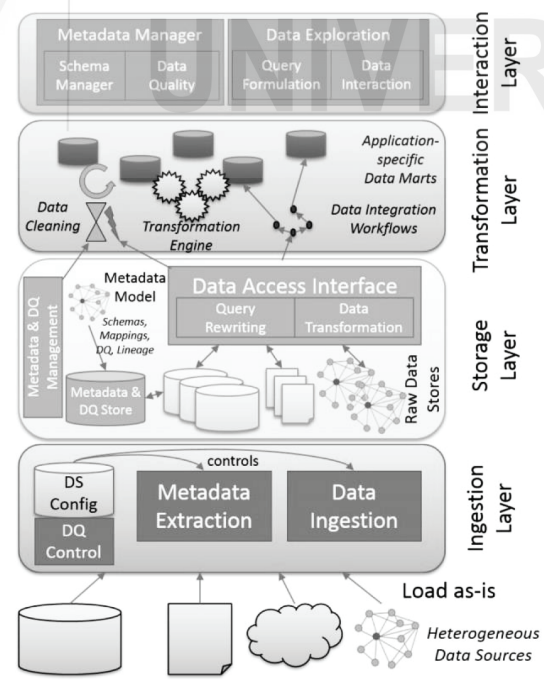

<!-- TOC start (generated with https://github.com/derlin/bitdowntoc) -->

- [Trends in Data Warehouse](#trends-in-data-warehouse)
  - [Data Warehouse – Key Challenges](#data-warehouse--key-challenges)
  - [Data Lakes](#data-lakes)
  - [Data Swamp](#data-swamp)
  - [Complex Data](#complex-data)
    - [Complex Data Modeling](#complex-data-modeling)
  - [Complex Data Models](#complex-data-models)
    - [Anchor Model](#anchor-model)
    - [Data Vault Model](#data-vault-model)
  - [Cloud Data Warehousing](#cloud-data-warehousing)
    - [Reasons for Migrating to the Cloud](#reasons-for-migrating-to-the-cloud)
    - [Challenges of Cloud Data Warehouses](#challenges-of-cloud-data-warehouses)
    - [Building a Successful Cloud Data Warehouse](#building-a-successful-cloud-data-warehouse)
  - [Real-Time Data Warehousing](#real-time-data-warehousing)
    - [Overview](#overview)
    - [Real-Time Data Warehouse (RTDW)](#real-time-data-warehouse-rtdw)
    - [Cloud Data Warehouses (CDWs) and RTDW](#cloud-data-warehouses-cdws-and-rtdw)
    - [Approaches to Real-Time Data](#approaches-to-real-time-data)
    - [Real-Time Data Warehouse Architecture](#real-time-data-warehouse-architecture)
    - [Alternative Architecture (Obali's Team)](#alternative-architecture-obalis-team)
    - [Real-Time Data Warehouse Architecture Tradeoffs](#real-time-data-warehouse-architecture-tradeoffs)
  - [Data Warehousing and Hadoop](#data-warehousing-and-hadoop)
    - [What is Hadoop?](#what-is-hadoop)
    - [Hadoop Architecture](#hadoop-architecture)
    - [Conceptual Architecture of Hadoop Data Warehouse](#conceptual-architecture-of-hadoop-data-warehouse)
    - [Advantages of Hadoop Data Warehouse](#advantages-of-hadoop-data-warehouse)
    - [Challenges of Hadoop Data Warehouse](#challenges-of-hadoop-data-warehouse)
  - [Data Warehouse Automation](#data-warehouse-automation)
    - [Overview](#overview-1)
    - [DWA Maturity](#dwa-maturity)
    - [DWA Tools](#dwa-tools)
    - [Advantages of DWA](#advantages-of-dwa)
  - [Check Your Progress-1](#check-your-progress-1)
  - [Check Your Progrss-2](#check-your-progrss-2)
  - [Check Your Progrss-3](#check-your-progrss-3)
  - [Check Your Progrss-4](#check-your-progrss-4)
  - [Check Your Progrss-5](#check-your-progrss-5)

<!-- TOC end -->

<!-- TOC -->
# Trends in Data Warehouse

<!-- TOC -->
## Data Warehouse – Key Challenges

- **Size and Complexity**:
  - Databases range from hundreds of gigabytes to terabytes, sometimes petabytes.
  - Complexity in analytical queries, data mining, and heterogeneous data.
  - Significant technological challenges.

- **Research Areas**:
  - Conceptual modeling and logical data models.
  - Data warehouse loading (data-refreshing).
  - Execution efficacy of OLAP queries and data mining algorithms.
  - Materialized views and data analysis techniques.
  - Metadata management and evolution management.
  - Stream-based, real-time, and active data warehouses.
  - Complex data warehousing (spatial, XML, object, multimedia).

- **Key Research and Technological Challenges**:
  - Amalgamation of heterogeneous data sources (ETL, cleaning, source characterization, data integration).
  - Data source discovery, metadata management, and standardization.
  - Handling data source evolution and data flow (ETL) performance optimization.
  - Big data management due to data-explosion from diversity and velocity of data-generation.

- **Impact on Architecture**:
  - Exponential data growth impacts architectural elements.
  - New functionalities needed to be integrated seamlessly.
  - Solutions should optimize total cost of ownership (TCO) and return on investment (ROI).

- **Emerging Technological Trends**:
  - Cloud data warehouses (CDWs).
  - Parallel and In-memory computational techniques.

- **Design Considerations**:
  - Minimizing latencies for cubes.
  - Improving update and refresh times for data warehouses.

- **Quality**:
  - Query complexity affects underlying cubes.
  - Modeling techniques and architecture quality play a significant role.
  - Good governance and best practices are essential.

- **Size and Operability**:
  - Fact tables expand exponentially over huge datasets.
  - Seamless integration with external data sources and interoperability.

- **In-memory Representation**:
  - Efficacy of memory-based representation.
  - SAP HANA as an example of in-memory database implementation.

- **User-Centric Interface**:
  - Interface should reduce complexity exposure to users.
  - Autonomous databases and automation of processes.

- **Pioneering Infrastructure Foundation**:
  - Deployment of Converged, Hyper-converged, and Dynamic Infrastructures.
  - Utilization of advanced computing infrastructure components (GPUs, AI, ML processors).

- **Complexity**:
  - Building OLAP cubes over large datasets increases complexity.

- **Optimization and Innovations in Query Language**:
  - Improvement in query languages to handle large data from diverse sources.
  - Performance and capabilities enhancements needed.

- **Data Visualization**:
  - Efficient management to produce viable reports.
  - Real-time analysis for dynamic systems like healthcare and climate change prediction.
  - Innovative algorithms and multi-parameter based optimizations.

<!-- TOC -->
## Data Lakes

- **Definition**:
  - Central location holding large amounts of data in its native, raw format.
  - Flat architecture and object storage.

- **Advantages**/**Need**:
  - Avoids lock-in to proprietary systems.
  - Highly durable and low cost.
  - Supports advanced analytics and machine learning on unstructured data.

- **Comparison with Data Warehouse**:

| Attribute | Data Warehouse | Data Lake |
|---|---|---|
| Type of Data | Structured data from sources like transactional systems and operational databases. | Raw data from varied sources like websites, mobile apps, IoT devices, social media channels, etc. |
| Schema | Schema-on-write | Schema-on-read |
| Intended Users | Primarily business analysts | Data scientists, developers, and business analysts |
| Price/Performance | Fastest query results using higher cost storage | Query results getting faster using low-cost storage |
| Data Quality | Highly curated data that serves as the central version of the truth | Any data that may or may not be curated (i.e., raw data) |
| Type of Analytics | Business intelligence, visualization, and batch reporting | Machine learning, predictive analytics, profiling, and data discovery |
| Agility | Fixed configuration, less agile | Highly agile, can be configured and reconfigured as per requirements |
| Security | More secure storage | Higher accessibility makes ensuring security a challenge |

- **Data Lake Maturity**:
  - ***Bill Inmon's Model***: Raw data pond, analog, application, textual data ponds, archival data pond.
  - ***Alex Gorelik's Model***: 
    - *Data Puddle*: A data mart built using big data technology for a sole purpose or a single project.Data is loaded for consumption by a single project or team. It reduces cost and improves performance.
    - *Data Pond*: A collection of data puddles in the form of collocated data marts or similar to a poorly designed data warehouse. Restricts data usage solely to the projects that necessitate it.
    - *Data Lake*:A storage system catering to business users in two significant aspects. Self-support service allowing business users to utilize data.
    - *Data Ocean*:Facilitates enterprise-wide availability of self-service data and data-driven decision making.Data is available irrespective of its location or existence within the data lake.

- **Data Lake Architecture**:
  - **Ingestion Layer**: Brings data into the data lake, metadata extractor for configuration.
  - **Storage Layer**: Metadata repository and raw data repositories, supports various storage systems.
  - **Transformation Layer**: Cleansing, format transformations, etc.
  - **Interaction Layer**: Visualization, annotation, filtering, basic analytical methods.
  
  

<!-- TOC -->
## Data Swamp

- **Definition**:
  - Data pond expanded to a data lake without self-service and governance.
  - Used like a data pond or left unused.

- **Issues**:
  - Data often unclear, undocumented, and unusable.
  - Technologically proficient users may create small data puddles for their teams.
  - Governance regulations may restrict access to sensitive data.

<!-- TOC -->
## Complex Data
- **Pervasiveness of Big Data**
  - Generated from emails, files, IoT, logs, etc.
  - Does not conform to standard data types like dates, currency, alphabets, numbers.

- **Importance**
  - Essential for raw data processing, data-insights, and big data analytics.
  - Used by pattern matching algorithms in Machine Learning models.

- **Influence on Enterprises**
  - Affects data-driven technologies and enterprises.

<!-- TOC -->
### Complex Data Modeling

- **Standard Practice**
  - Data streams traverse many hubs and technologies.
  - Travels through data processing tools, ETLs, ERP software, data lakes, etc.

- **Intrinsic Traits**
  - Own syntax, schema, technology, terminology, and type.
  - Complicates the work of data modelers.

- **Models**
  - Statistical, polyglot, no payload, multi-level, etc.
  - Standard models: Anchor models, Data Vault Models.
    - **Advantages**: Scalability, Temporal data handling, Resilience to structural and content-based changes.

<!-- TOC -->
## Complex Data Models

<!-- TOC -->
### Anchor Model

- **Elements**
  - Anchors: Model entities and events.
  - Attributes: Model properties of anchors.
  - Ties: Model relationships between anchors.
  - Knots: Model shared properties like states.

- **Versioning (Historization)**
  - Attributes and ties can be versioned to retain changes.

- **Graphical Symbols**
  - Similar to entity-relationship modeling with a few extensions.
  - Outline on a tie or attribute depicts versioning of changes.

<!-- TOC -->
### Data Vault Model

- **Purpose**
  - Long-term storage of historical data from multiple operational systems.
  - Addresses issues like auditing, data traceability, data loading performance, and resilience to change.

- **Components**
  - **Hubs**
    - Distinct business keys with low affinity to change.
    - Contains metadata designating the source of the business key.
    - Attributes: Surrogate key, Business key, Record source, Optional metadata.

  - **Links**
    - Models providing relations between business keys.
    - Many-to-many join tables with some metadata.
    - Contains surrogate keys for linked hubs.

  - **Satellites**
    - Store temporal and descriptive attributes.
    - Contain metadata connecting to parent link or hub.
    - Attributes include time-series with start and end dates.

<!-- TOC -->
## Cloud Data Warehousing

- **Transformation of Raw Data**
  - Challenge made worse by accelerated pace of environmental dynamics.
  - Enterprises need to leverage data for a data-driven transformation.

- **Enterprise Challenges**
  - Space and location demands for storing and utilizing voluminous data.
  - Regulatory and compliance mandates, data velocity, new data sources, performance, scalability, QoS.

- **Trend**
  - Migration of extant data warehouses to the cloud.
  - New data warehouses adopting cloud as the implementation platform.

<!-- TOC -->
### Reasons for Migrating to the Cloud

- **On-premises vs. Cloud**
  - On-premises implementations reducing.
  - Vendors: Google BigQuery, AWS Redshift, Snowflake, Azure Synapse Analytics.

- **Advantages**
  - Near-instantaneous installations.
  - Increased performance and scalability.
  - Pay for use benefits.

<!-- TOC -->
### Challenges of Cloud Data Warehouses

- **Significant Challenges**
  - Data extraction, transformation, and loading.
  - Context and user-based data access.
  - Management of heterogeneous data velocity.
  - Ensuring instant availability of new data sources.
  - Ensuring data quality.
  - Management of sensitive data and compliance.
  - Interoperability with external tools and infrastructure.
  - Communication with legacy systems.
  - Data governance and obfuscation.
  - Automation for sophisticated analytics and ML.

<!-- TOC -->
### Building a Successful Cloud Data Warehouse

- **Stages**

  - **Stage 1: Data Curation and Integration**
    - Considerations: Enterprise changes, readiness for new technologies, future objectives, expectations.
    - Due Diligence: Transformation involves technological and other levels, necessitates change management professionals.
    - Flexible architecture for future-proofing.

  - **Stage 2: Leveraging Data Integration Platform**
    - Develop faster decision-making capabilities.
    - Reduce latencies at different levels: extraction, storage, organization, access control, transformation, loading.
    - Fully optimized data integration platform enhances data visualization and decision-making.

  - **Stage 3: Ensuring High Data Quality**
    - Scrupulous evaluation of tools to meet business requirements.
    - Cloud-aware ETL tools for reliable and accessible data.
    - Implementing right tools reduces operational latencies and expedites analytics.

<!-- TOC -->
## Real-Time Data Warehousing

<!-- TOC -->
### Overview
- Essential for data-driven enterprises.
- Ensures timely availability of data across the enterprise.
- Data visualization reports need current and trustworthy data.
- Processes of sourcing, transforming, and making data available need to be optimized.

<!-- TOC -->
### Real-Time Data Warehouse (RTDW)
- Real-time data availability is crucial but often referred to as near-real-time due to practical constraints.
- Performance thresholds define real-time capabilities.
- RTDWs are synonymous with immediate data updates.

<!-- TOC -->
### Cloud Data Warehouses (CDWs) and RTDW
- CDWs are ideal for RTDW due to scalable resources.
- Real-time processes require specialized handling.
- ETL processes need significant alterations for real-time needs.

<!-- TOC -->
### Approaches to Real-Time Data
- Novel ETL architectures and update methods ensure real-time data.
- Tools like Hadoop and Spark enhance real-time processing capabilities.

<!-- TOC -->
### Real-Time Data Warehouse Architecture
- Integration Layer binds Analytics and Decision layers.
- Data production systems with Source Flow Regulator (SFlowR) for data transmission.
- Data Processing Area (DPA) with Data Flow Regulator (DFlowR) for data quality and transformation.
- ETL workflow for data cleaning and transformation.
- Workflow Regulator (WFlowR) manages data transmission to the warehouse.

<!-- TOC -->
### Alternative Architecture (Obali's Team)
- Components: Metadata, Web Service (WS) client, WS provider, ETL, Real-time Partition, Real-time data integration, Data warehouse.
- Change Data Capture (CDC) initiates data updates.
- Real-time data integration handles orchestration between data warehouse and real-time partition.

<!-- TOC -->
### Real-Time Data Warehouse Architecture Tradeoffs
- Use of message queues and transaction log files instead of batch files.
- Restricted scrutiny of data quality.
- Publishing facts with dimensions.
- Precluding data-staging.
- Real-time partitions for data visualization and transactions.
- Real-time partition based on periodic snapshots.

<!-- TOC -->
## Data Warehousing and Hadoop

<!-- TOC -->
### What is Hadoop?
- Open-source, Java-oriented framework.
- Components: HDFS (storage) and MapReduce (processing).
- Modules: HDFS, MapReduce, Hadoop Common, YARN, Hadoop Ozone.

<!-- TOC -->
### Hadoop Architecture
- **NameNode**: Master server managing file-system namespace and client access.
- **DataNodes**: Store user data in files, perform block creation, deletion, and replication.
- **File System Namespace**: Supports hierarchical file organization, user quotas, access permissions, encryption, and snapshots.
- **Data Replication**: Ensures fault tolerance through block replication.

<!-- TOC -->
### Conceptual Architecture of Hadoop Data Warehouse
- Implemented using Apache Hive or Cloudera Impala.
- Benefits from Hadoop for ETL processes.
- **Components**:
  - Data Extraction: Apache Sqoop.
  - Data Transformation: Spark, Cloudera Impala, Apache Hive, Apache Pig, MapReduce.
  - Data Loading: Apache Hive or Cloudera Impala.
  - Data Analysis/Visualization: External DWs, BI tools, Apache Sqoop.

<!-- TOC -->
### Advantages of Hadoop Data Warehouse
- Heterogeneous data processing.
- Improved ETL processing throughput.
- Near-real-time data warehousing.
- Efficient workload management.
- Reduced TCO, increased ROI.

<!-- TOC -->
### Challenges of Hadoop Data Warehouse
- Integrating patterns in raw data to DW.
- Data propagation latencies.
- Costs of importing/exporting historical data.

<!-- TOC -->
## Data Warehouse Automation

<!-- TOC -->
### Overview
- Automation accelerates and enhances the DW life-cycle.
- Reduces repetitive tasks, improves productivity, and quality.

<!-- TOC -->
### DWA Maturity
- Use of sophisticated tools and models for planning, design, integration, and implementation.
- Handles large-scale data storage and high-performance integration.
- Processes diverse and fast-velocity data from various sources.

<!-- TOC -->
### DWA Tools
- Seamless integration and transition from source to DW.
- Automates ETL scripts, batch-processing, and various functions.
- Components: Source Data Modeler, Dimension Modeler, Connectivity, Robust ELT engine, High Performance ETL engine.

<!-- TOC -->
### Advantages of DWA
- End-to-end data pipeline acceleration.
- Automation of data capture and streaming.
- Automation of data management and integration.
- Optimization of data propagation paths.
- Ensures automatic data flows.
- Automatic setup of target-oriented data models.
- Transforms data lakes into DWs.

<!-- TOC -->
## Check Your Progress-1
1. What are present challenges in data-management?
2. Describe in your own words the logical data lake concept?
3. What is your interpretation of a successful data lake?

<!-- TOC -->
## Check Your Progrss-2
1. Explain your understanding of complex data and the need for complex data modeling.

<!-- TOC -->
## Check Your Progrss-3
1. What are the reasons for migrating to a Cloud Data Warehouse (CDW)?

<!-- TOC -->
## Check Your Progrss-4
1. How is a real-time data warehouse different from a traditional data warehouse?
2. Why is CDW a good candidate for real-time data warehousing?

<!-- TOC -->
## Check Your Progrss-5
1. How would DWA be advantageous in the case of an enterprise like Amazon?