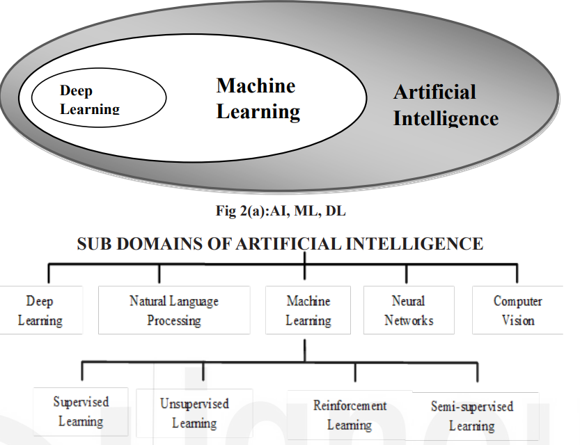

<!-- TOC start (generated with https://github.com/derlin/bitdowntoc) -->

- [Artificial Intelligence (AI) - Introduction](#artificial-intelligence-ai---introduction)
  - [AI in Modern Applications](#ai-in-modern-applications)
  - [Knowledge vs. Intelligence](#knowledge-vs-intelligence)
  - [What is Artificial Intelligence?](#what-is-artificial-intelligence)
  - [AI Objectives](#ai-objectives)
  - [AI Levels](#ai-levels)
    - [Software Level (Embodied AI):](#software-level-embodied-ai)
    - [Hardware Level (Embedded AI):](#hardware-level-embedded-ai)
  - [Types of AI](#types-of-ai)
    - [Type 1 - Stages of AI](#type-1---stages-of-ai)
  - [Brief History of Artificial Intelligence](#brief-history-of-artificial-intelligence)
  - [Components of Intelligence](#components-of-intelligence)
  - [Approaches to Artificial Intelligence](#approaches-to-artificial-intelligence)
- [Comparison: Artificial Intelligence, Machine Learning, and Deep Learning](#comparison-artificial-intelligence-machine-learning-and-deep-learning)
    - [Overview](#overview)
    - [Relationship Between AI, ML, and DL](#relationship-between-ai-ml-and-dl)
    - [Subdomains of AI](#subdomains-of-ai)
    - [Machine Learning (ML)](#machine-learning-ml)
    - [Deep Learning (DL)](#deep-learning-dl)
    - [Analytics in Machine Learning](#analytics-in-machine-learning)
  - [Application Areas of Artificial Intelligence Systems](#application-areas-of-artificial-intelligence-systems)
    - [a) Healthcare](#a-healthcare)
    - [b) Agriculture](#b-agriculture)
    - [c) Smart Mobility (Transport and Logistics)](#c-smart-mobility-transport-and-logistics)
    - [d) Retail](#d-retail)
    - [e) Manufacturing](#e-manufacturing)
    - [f) Energy](#f-energy)
    - [g) Smart Cities](#g-smart-cities)
    - [h) Education and Skilling](#h-education-and-skilling)
    - [i) Financial Industry](#i-financial-industry)
    - [Top Used Applications of Artificial Intelligence](#top-used-applications-of-artificial-intelligence)
  - [Intelligent Agents](#intelligent-agents)
    - [Definition](#definition)
    - [Task Environment Specification (PEAS)](#task-environment-specification-peas)
    - [Example: Automated Public Road Transport Driver Agent](#example-automated-public-road-transport-driver-agent)
    - [Agent Structure](#agent-structure)
    - [Categories of Agents](#categories-of-agents)
  - [Check Your Progress-1](#check-your-progress-1)
  - [Check Your Progress-2](#check-your-progress-2)
  - [Check Your Progress-3](#check-your-progress-3)
  - [Check Your Progress-4](#check-your-progress-4)

<!-- TOC end -->

<!-- TOC -->
# Artificial Intelligence (AI) - Introduction

<!-- TOC -->
## AI in Modern Applications
- **Engineering and Technology**: AI is widely used in various engineering and technological applications.
- **Military**: AI is implemented for strategic and operational efficiency.
- **Opinion Mining and Sentiment Analysis**: AI helps in understanding public sentiment and opinions.
- **Language Processing and Aerospace**: Advanced AI applications are seen in these fields.
- **Voice and Face Recognition**: AI is used in systems recognizing voices and faces.
- **Shopping Recommendations**: AI provides personalized shopping recommendations.
- **Spam Detection and Fraud Prevention**: AI helps in identifying spam and preventing fraudulent activities.
- **Virtual Assistants**: AI powers assistants like Siri, Alexa, Cortana, and Google Assistant.

<!-- TOC -->
## Knowledge vs. Intelligence
- **Knowledge**: 
  - Accumulated information and skills from life experiences.
  - Represents what we have learned over the years.
- **Intelligence**: 
  - Ability to apply knowledge.
  - Not just about possessing information but understanding and using it.
  - "Marks are not the measure of intelligence" highlights that intelligence is about comprehension and application.

<!-- TOC -->
## What is Artificial Intelligence?
- **Definition**: Incorporating intelligence into machines.
- **Knowledge Engineering**: 
  - Applies rules to data to simulate expert thinking.
  - Analyzes job structures and decision-making processes.

<!-- TOC -->
## AI Objectives
- **Think Like Humans**: Systems that mimic human thought processes.
- **Logical Thinking**: Systems capable of logical reasoning.
- **Mimic Human Behaviour**: Machines that imitate human actions.
- **Logical Behaviour**: Systems behaving logically.

<!-- TOC -->
## AI Levels
<!-- TOC -->
### Software Level (Embodied AI):
- **Examples**: Search engines, virtual assistants, speech and facial recognition systems, image analysis tools.

<!-- TOC -->
### Hardware Level (Embedded AI):
- **Examples**: Robots, autonomous vehicles, drones, Internet of Things (IoT).

<!-- TOC -->
## Types of AI
<!-- TOC -->
### Type 1 - Stages of AI
1. **Artificial Narrow Intelligence (ANI)**: 
   - Also called Weak AI or Narrow AI.
   - Simulated thinking without true awareness.
   - Example: Chatbots.
2. **Artificial General Intelligence (AGI)**: 
   - Strong or General AI.
   - True thinking with conscious, subjective mind.
   - Example: Self-driving cars, hospital operating systems.
3. **Artificial Super Intelligence (ASI)**: 
   - Super intelligence surpassing human intelligence.
   - Advanced decision-making, rationality, and emotional relationships.
   - Example: Hypothetical advanced AI systems.

<!-- TOC -->
## Brief History of Artificial Intelligence

AI's ideas originate from early research into human learning and thinking. The concept of machines acting like humans dates back to Greek mythology.

- **Aristotle (384 BC - 322 BC)**:
  - Developed a non-formal syllogistic logic system.
  - Laid the groundwork for formal deductive reasoning.

- **17th Century**:
  - Descartes proposed that animal bodies function like complex machines.
  - Pascal created the first mechanical digital calculator in 1642.

- **1800s**:
  - George Boole developed binary algebra, showcasing some "laws of thought."
  - Charles Babbage and Ada Byron worked on programmable mechanical calculators.

- **Late 19th - Early 20th Century**:
  - Mathematicians and philosophers like Frege, Russell, Whitehead, and Godel advanced Boole's ideas on logic.
  - The advent of electronic computers revolutionized intelligence studies.
  
- **1943**:
  - McCulloch and Pitts created a Boolean circuit model of the brain, discussing neural networks in "A Logical Calculus of Ideas Immanent in Nervous Activity."

- **1950**:
  - Alan Turing's paper "Computing Machines and Intelligence" introduced key AI concepts, including problem-solving heuristics.
  - Turing used chess as an example to explain machine thinking.

- **1951**:
  - Minsky and Edmonds developed SNARC, the first randomly wired neural network learning machine.

- **1952-1956**:
  - Samuel created programs to improve checkers gameplay.

- **1956**:
  - The Dartmouth Conference marked the formal inception of AI.
  - Newell and Simon published "The Logic Theorist," considered the first AI demonstration.

- **1959**:
  - Gelernter's Geometry Engine and Slagle's SAINT program were developed.
  - Feigenbaum and Feldman published "Computers and Thought" in 1963, compiling key AI articles.

- **1965**:
  - Robinson introduced the Resolution Method, enhancing formal logic as a programming language.
  - Stanford's Dendral program became a successful application of scientific knowledge in AI.

- **1969-1979**:
  - The first knowledge-based systems emerged.
  - MYCIN demonstrated the power of rule-based systems for medical diagnosis in 1974.
  
- **1980s**:
  - Lisp Machines were developed and sold.
  - Probabilistic and decision-theoretic methods were revived in 1988.

- **1989**:
  - Dean Pomerleau's ALVINN, a neural network system, autonomously drove a car across the US.

- **1990s**:
  - Advances in machine learning, data mining, intelligent tutoring, case-based reasoning, multi-agent planning, and scheduling.
  - Significant projects included Rod Brooks' COG at MIT and the first Robo-Cup soccer game in 1997.
  - IBM's Deep Blue defeated world chess champion Gary Kasparov.

- **2000s**:
  - The Nomad robot explored Antarctica for meteorite samples.
  - NASA's Mars rovers, Spirit and Opportunity, successfully completed missions.
  - AI-based Internet agents gained prominence.

<!-- TOC -->
## Components of Intelligence

Human intelligence is viewed as a collection of distinct components, with AI research focusing on:

- **Learning**:
  - Various approaches include *learning by mistakes*, *rote learning*, *instruction*, *analogy*, *induction*, and *deduction*.
  - *Supervised*, *unsupervised*, and *reinforcement* learning are key methods.

- **Reasoning**:
  - Involves drawing conclusions using deductive and inductive methods.
  - AI reasoning must be contextually appropriate.

- **Problem-Solving**:
  - AI solves a wide range of problems, from board games to image recognition and robotic planning.
  - Techniques include special-purpose and general methods like means-end analysis.

- **Perception**:
  - Involves analyzing the environment using sensory inputs.
  - AI perception enables tasks like autonomous driving and object recognition.

- **Language Understanding**:
  - Language is a system of signs with pre-determined meanings.
  - AI aims to develop productive languages that allow for an infinite variety of expressions.

<!-- TOC -->
## Approaches to Artificial Intelligence

To evaluate AI's human-likeness, several approaches are used:

- **Turing Test**:
  - Proposed by Alan Turing in 1950.
  - Measures AI's ability to exhibit intelligent behavior indistinguishable from a human.
  - Criticized by John Searle's Chinese Room Test, which argues that mimicking understanding does not equate to actual understanding.

- **Cognitive Modelling**:
  - Based on human cognition, utilizing introspection, psychological experiments, and brain imaging.

- **Laws of Thought**:
  - Relies on logical statements dictating mental operations.
  - Faces challenges in real-world problem-solving.

- **Rational Agent**:
  - Aims to find the best possible outcome in any situation.
  - More flexible and adaptable than the Laws of Thought approach.

<!-- TOC -->
# Comparison: Artificial Intelligence, Machine Learning, and Deep Learning

<!-- TOC -->
### Overview
- **Artificial Intelligence (AI)**
  - Broad field with many subdomains.
  - Includes top-down (knowledge representation) and bottom-up (machine learning) approaches.
  - Goal: Create systems with human-like intelligence.
  
- **Machine Learning (ML)**
  - Subfield of AI focused on learning through experience.
  - Uses algorithms to find patterns, make predictions, and recommendations.
  - Learns from data and experiences, improving over time.

- **Deep Learning (DL)**
  - Subfield of ML based on artificial neural networks (ANN).
  - Can handle diverse data sources with less pre-processing.
  - Often yields more accurate results than traditional ML methods.

<!-- TOC -->
### Relationship Between AI, ML, and DL
- **AI** is the most general term.
- **ML** is a part of AI.
- **DL** is a type of ML.

<!-- TOC -->
### Subdomains of AI
- Reverse-engineering human traits and machine abilities.
- Understanding different parts of AI for various industrial applications.

<!-- TOC -->
### Machine Learning (ML)
- **Definition**: Learning through experience without explicit programming.
- **Function**:
  - Algorithms learn from data, finding patterns, making predictions, and recommendations.
  - They adapt as they receive new data, becoming more effective over time.
- **Key Points**:
  - Modeled on human learning processes.
  - Automates decision-making, saving time and improving accuracy.

<!-- TOC -->
### Deep Learning (DL)
- **Definition**: Subfield of ML using artificial neural networks (ANN).
- **Function**:
  - Processes large data sets through multiple layers of neurons.
  - Each layer learns more complex features of the data.
  - Makes decisions based on learned features, improving with new data.
- **Key Points**:
  - Inspired by the structure and function of the human brain.
  - Effective in tasks involving image, text, or sound classification.
  - Uses large labeled data sets and neural network architectures for training.

<!-- TOC -->
### Analytics in Machine Learning
- **Descriptive Analytics**: Analyzes past data to understand what happened.
- **Predictive Analytics**: Uses data to predict future outcomes.
- **Prescriptive Analytics**: Suggests actions based on predictive analysis to achieve desired outcomes.

<!-- TOC -->
## Application Areas of Artificial Intelligence Systems

Artificial intelligence is a transformative force in various industries, optimizing operations and providing competitive advantages. Below are some key application areas of AI:

<!-- TOC -->
### a) Healthcare
- **Challenges**: High barriers to access, especially in rural areas with limited healthcare professionals.
- **AI Solutions**:
  - AI-driven diagnostics
  - Personalized treatment
  - Early diagnosis of potential pandemics
  - Imaging diagnostics

<!-- TOC -->
### b) Agriculture
- **Challenges**: Inadequate demand prediction, lack of secure irrigation, misuse of pesticides and fertilizers.
- **AI Solutions**:
  - Real-time advisory for crop output increase
  - Advanced pest infestation detection
  - Crop price forecasting for better sowing methods

<!-- TOC -->
### c) Smart Mobility (Transport and Logistics)
- **AI Solutions**:
  - Autonomous ride-sharing fleets
  - Semi-autonomous driver assistance
  - Predictive engine monitoring and maintenance
  - Self-driving trucks and delivery
  - Improved traffic control

<!-- TOC -->
### d) Retail
- **AI Solutions**:
  - Personalized recommendations
  - Browsing based on user preferences
  - Image-based product search
  - Inventory management
  - Efficient delivery management

<!-- TOC -->
### e) Manufacturing
- **AI Solutions**:
  - Factory automation ("Factory of the Future")
  - Predictive maintenance
  - Quality assurance (e.g., vision systems with ML algorithms)
  - In-plant logistics and warehousing

<!-- TOC -->
### f) Energy
- **AI Solutions**:
  - Energy system modeling and forecasting
  - Smart meters and intelligent grids
  - Reliable and cost-effective photovoltaic energy
  - Predictive maintenance of grid infrastructure

<!-- TOC -->
### g) Smart Cities
- **AI Solutions**:
  - Traffic control to reduce jams
  - Crowd management for improved security

<!-- TOC -->
### h) Education and Skilling
- **Challenges**: Quality and access issues in education.
- **AI Solutions**:
  - Personalized learning experiences
  - Automating administrative tasks
  - Predicting and preventing student dropouts

<!-- TOC -->
### i) Financial Industry
- **AI Solutions**:
  - Fraud detection and prevention
  - Efficient trading systems

<!-- TOC -->
### Top Used Applications of Artificial Intelligence
- Plagiarism checkers
- Facial recognition
- AI autopilot in commercial planes
- Ride-sharing applications (e.g., Uber, Lyft)
- Email spam filters
- Voice-to-text features
- Search suggestions
- Google Maps predictions
- Fraud prevention
- Smart personal assistants (e.g., Siri, Alexa)

-
<!-- TOC -->
## Intelligent Agents

<!-- TOC -->
### Definition
An intelligent agent perceives its environment through sensors and acts upon it through actuators. Attributes include:
- Autonomous control
- Perception of the environment
- Persistence over time
- Adaptability to environmental changes
- Goal-oriented behavior

<!-- TOC -->
### Task Environment Specification (PEAS)
- **Performance Measures**: Criteria for evaluating agent success.
- **Environment**: The surrounding world where the agent operates.
- **Actuators**: Mechanisms for agent actions.
- **Sensors**: Tools for gathering information from the environment.

<!-- TOC -->
### Example: Automated Public Road Transport Driver Agent
- **Performance Measures**: Safety, comfort, timely arrival, traffic rule adherence, cost minimization.
- **Environment**: Various road conditions, traffic types, passenger behaviors.
- **Actuators**: Steering wheel, brakes, gears, accelerator, communication devices.
- **Sensors**: Odometer, speedometer, engine sensors, GPS, distance sensors.

<!-- TOC -->
### Agent Structure
1. **Architecture**: The hardware with sensors and actuators.
2. **Agent Program**: Converts percepts into actions, dependent on the specific architecture.

<!-- TOC -->
### Categories of Agents
1. **Simple Reflex Agents**: React to current percepts without memory.
2. **Model-Based Reflex Agents**: Use an internal state to handle partial observability.
3. **Goal-Based Agents**: Actions are driven by the goal information.
4. **Utility-Based Agents**: Use a utility function to evaluate the success of states.
5. **Stimulus-Response Agents**: React to environmental stimuli, often used in gaming and simulation.
6. **Learning Agents**: Adapt by learning from interactions with the environment.

<!-- TOC -->
## Check Your Progress-1
1. Difference between Knowledge and Intelligence
2. Classify AI by Functionality
3. Compare ANI, AGI, and ASI

<!-- TOC -->
## Check Your Progress-2
1. Discuss the various components of intelligence.
2. How do we measure if AI is making a machine behave like a human?
3. What is the Turing Test? What is the criticism of the Turing Test?

<!-- TOC -->
## Check Your Progress-3
1. Compare Artificial Intelligence (AI), Machine Learning (ML), and Deep Learning (DL).
2. Compare Descriptive, Predictive, and Prescriptive analytics in Machine Learning.

<!-- TOC -->
## Check Your Progress-4
1. What are Intelligent agents in AI? Briefly discuss the properties of Agents?
2. What are Task environments? Briefly discuss the standard set of measures or parameters for specifying a task environment under the heading PEAS.