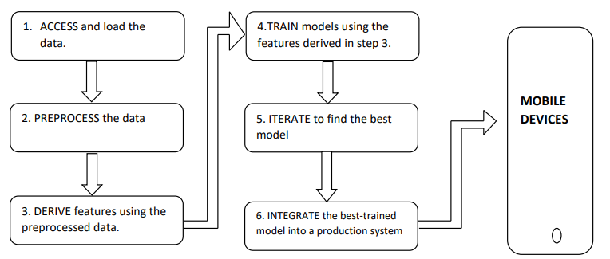

# CLASSIFICATION

## INTRODUCTION

- **Learning and Machine Learning**
  - Philosophical aspects won't be the focus.
  - Emphasis on practical understanding of classification and clustering.

- **Data Mining vs. Machine Learning**
  - **Data Mining**: 
    - A subset of business analytics.
    - Involves exploring large datasets to find unknown patterns, correlations, and anomalies.
  - **Machine Learning**:
    - A subfield of AI.
    - Involves computers learning from data to make predictions without human intervention.

- **Similarities between Data Mining and Machine Learning**
  - Both are analytical processes.
  - Effective at recognizing patterns.
  - Focus on gaining knowledge from data to enhance decision-making.
  - Require substantial quantities of data for accuracy.

- **Key Differences**
  - Machine learning predicts future events based on existing data, while data mining looks for existing patterns.
  - Data mining starts without known rules; machine learning uses pre-existing rules.
  - Data mining is more manual and requires human decision-making; machine learning is automated after initial setup.
  - Data mining uses existing datasets; machine learning uses training datasets to make predictions.

- **Approaches to Data Mining Problems**
  - **Classification**: Assigns data into predefined classes.
  - **Clustering**: Creates distinct classes from groups of tuples with similar values.
  - **Association Rules**: Finds interesting connections between elements in a dataset.

- **Distance Measures**
  - **Euclidean distance**: `dis(ti, tj) = √(Σ(thi - thj)²)`
  - **Manhattan distance**: `dis(ti, tj) = Σ|thi - thj|`

- **Applications and Trends**
  - Machine learning and data mining are converging for better predictive analytics.
  - Classical machine learning algorithms can be categorized into ***supervised (labelled data)*** and ***unsupervised learning (unlabelled data)***.

## UNDERSTANDING OF SUPERVISED LEARNING

- **Overview**
  - Essential to understand how machine learning techniques work for effective use.
  - Different techniques suit different problems.

- **Key Questions**
  - What kind of data is available?
  - What realizations are expected from the data?
  - How will these realizations be utilized?

- **Workflow at a Glance**
  

- **Process**
  - Training data is labelled, e.g., pictures of shoes labelled as "shoes".
  - System learns from these labels to make future predictions.

- **Technical Representation**
  - Function: `y = f(x)`
  - Input data `x`, output variable `y` (predicted value).
  - Uses "supervisory signal" for training.

- **Example**
  - Predicting heart attacks based on patient data (age, weight, height, blood pressure).

- **Steps in Supervised Learning**
  1. Determine the type of training examples.
  2. Prepare/gather the training data.
  3. Determine the relation between input feature and representing learned function.
  4. Select a learning algorithm.
  5. Run the algorithm on training data.
  6. Evaluate the accuracy using test set values.

  

- **Common Issues**
  - High computational time for training and classifying, especially with big data.
  - Overfitting: model learns noise in data as concepts.
  - Supervised learning doesn't create new classes for unfamiliar inputs.

- **Practical Applications**
  - Detection of spam
  - Detection of fraudulent activities
  - Medical diagnosis
  - Image recognition
  - Predictive maintenance

## Introduction to Classification

## Supervised Learning: Classification vs. Regression

- **Classification**:
  - Predicts specific outcomes (e.g., spam vs. legitimate email, malignant vs. benign tumor).
  - Classifies data into categories.
  - Applications: Medical imaging, speech recognition, credit scoring.

- **Regression**:
  - Forecasts continuous responses (e.g., temperature changes, power requirements).
  - Applications: Stock price prediction, handwriting recognition, power load forecasting, acoustic signal processing.

## Key Considerations

- **Classification or Regression?**
  - Can your information be tagged or grouped? Use classification algorithms.
  - Are you working with a continuous data set? Use regression techniques.

## Key Terms

- **Classification**:
  - Organizing data into predetermined categories.
  - Goal: Determine which category a new data set belongs to.
  - Data Types:
    - **Structured data**: Stored in fixed fields (e.g., relational databases).
    - **Unstructured data**: Not predictably organized (e.g., rich media, text, social media).

- **Classifier**:
  - An algorithm that categorizes data.

- **Classification Model**:
  - Analyzes output values to interpret training data.
  - Predicts class labels or categories of new data.

- **Feature**:
  - A measurable property of an object.

- **Classification Predictive Modeling**:
  - Assigning a class label to input examples.

## Types of Classification

- **Binary Classification**:
  - Two possible outcomes (e.g., male or female).
  - Algorithms:
    - Logistic Regression
    - k-Nearest Neighbors
    - Decision Trees
    - Support Vector Machines
    - Naive Bayes
  - Applications:
    - Email spam detection
    - Churn prediction
    - Purchase or conversion prediction

- **Multi-class Classification**:
  - More than two groups.
  - Each sample has one target label.
  - Algorithms:
    - k-Nearest Neighbors
    - Decision Trees
    - Naive Bayes
    - Random Forest
    - Gradient Boosting
  - Techniques:
    - **One vs. Rest**: Fit one binary classification model for each class vs. all others.
    - **One vs. One**: Fit one binary classification model for each pair of classes.
  - Applications:
    - Face classification
    - Plant species classification
    - Optical character recognition

- **Multi-label Classification**:
  - Each sample can have multiple target labels (e.g., a news story about Games, People, and Location).
  - Specialized algorithms:
    - Multi-label Decision Trees
    - Multi-label Random Forests
    - Multi-label Gradient Boosting

- **Imbalanced Classification**:
  - Unequal number of examples in each class.
  - Applications:
    - Fraud detection
    - Outlier detection
    - Medical diagnostic tests

## Learners in Classification Problems

- **Lazy Learners**:
  - Store the training dataset.
  - Wait until provided with the test dataset.
  - Classification based on relevant information from the training dataset.
  - Less training time, more prediction time.
  - Examples:
    - k-Nearest Neighbors (K-NN)
    - Case-based reasoning

- **Eager Learners**:
  - Create a classification model from the training dataset before receiving the test dataset.
  - Spend less time on training, more on making predictions.
  - Examples:
    - Decision Trees
    - Naive Bayes
    - Artificial Neural Networks (ANN)
    - Bayesian classification
    - Rule-based classification
    - Support Vector Machines
    - Classification based on association rule mining

- **Comparison**:
  - **Lazy Learners**:
    - Store training tuples (instances).
    - More work during classification or prediction.
    - Favor incremental learning.
    - Examples: k-Nearest Neighbor, Case-based reasoning.

  - **Eager Learners**:
    - Construct a generalization model from training pairs.
    - Prepared to categorize unseen tuples.
    - Examples: Decision Trees, Naive Bayes, ANN, Bayesian classification, Support Vector Machines.

## Check Your Progress-1

1. Compare between Supervised and Un-Supervised Learning.
2. Steps Involved in Supervised Learning.
3. Common Issues Faced While Using Supervised Learning

## Check Your Progress-2

1. Compare between Multi-Class and Multi-Label Classification
2. Compare between Structured and Unstructured Data
3. Compare between Lazy Learners and Eager Learners
