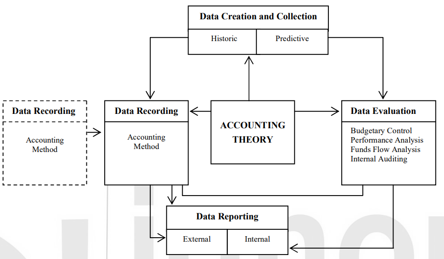

<!-- TOC start (generated with https://github.com/derlin/bitdowntoc) -->

- [Accounting and its Functions](#accounting-and-its-functions)
  - [Introduction](#introduction)
  - [The Scope of Accounting](#the-scope-of-accounting)
  - [The Emerging Role of Accounting](#the-emerging-role-of-accounting)
  - [Accounting as an Information System](#accounting-as-an-information-system)
    - [Information Needs of Various Users](#information-needs-of-various-users)
  - [The Role and Activities of an Accountant](#the-role-and-activities-of-an-accountant)
  - [Accounting Personnel](#accounting-personnel)
  - [Organization for Accounting and Finance](#organization-for-accounting-and-finance)

<!-- TOC end -->

<!-- TOC -->
# Accounting and its Functions

<!-- TOC -->
## Introduction

- **Accounting**: Called the language of business, it communicates the results of business operations and its various aspects.
- **Common Definition**: "Accounting is the art of recording, classifying, and summarizing in a significant manner and in terms of money, transactions, and events which are, in part at least, of financial character and interpreting the results thereof."
- **Broad Definition**: "Accounting is the process of identifying, measuring, and communicating economic information to permit informed judgments and decisions by the users of information."

<!-- TOC -->
## The Scope of Accounting

- **Data Creation and Collection**:
  - Provides necessary inputs for the accounting system.
  - Related to economic and financial transactions (historic data).

- **Data Recording**:
  - Transactions are recorded in books of original entry (journals) and ledgers.
  - Can be done manually, mechanically, or electronically.

- **Data Evaluation**:
  - Includes budgetary control, performance analysis, funds flow analysis, and decision-making analysis.
  - Can be internal or external.
  - Involves auditing for verification of transactions.

- **Data Reporting**:
  - External reporting: Communicating financial information to outside parties (shareholders, government agencies).
  - Internal reporting: Communication of results to management for decision-making.

  

<!-- TOC -->
## The Emerging Role of Accounting

- **Forensic Accounting**:
  - Investigates accounting records and financial statements for legal support and conflict resolution.
  - Steps:
    - **Investigation**: Collecting evidence and identifying fraud.
    - **Reporting**: Presenting findings and suggesting preventive measures.
    - **Litigation**: Acting as an expert witness in court.

- **Carbon Accounting**:
  - Measures GHG emissions and the carbon within forest ecosystems.
  - Objectives:
    - Identify carbon density for low carbon impact land use planning.
    - Compare climate change impact of forestry sector with other sectors.
    - Enable trade of project emission reductions on carbon markets.

- **Stewardship Accounting**:
  - Historical practice where stewards managed property and reported to owners.
  - Root of modern financial reporting and bookkeeping.
  - Originated in Italy during the 15th century (double entry bookkeeping).

- **Financial Accounting**:
  - Developed with large-scale business and Joint Stock Companies.
  - Provides annual financial statements: income statement and balance sheet.
  - Ensures reliable information for investors.

- **Cost Accounting**:
  - Emerged during the industrial revolution as a tool for industrial management.
  - Concerned with ascertaining costs to control them and assess profitability and efficiency.

- **Management Accounting**:
  - Uses accounting information for managerial decision-making.
  - Focuses on preparing and presenting information to assist in policy formulation and decision-making.

- **Social Responsibility Accounting**:
  - Considers social effects of business decisions.
  - Addresses environmental and social impacts of industrial growth.

- **Human Resource Accounting (HRA)**:
  - Reports the importance of human resources in a company's earning process.
  - Involves identifying, measuring, and communicating data about human resources.

- **Inflation Accounting**:
  - Adjusts the value of assets and profit according to changes in price levels.
  - Aims to correct distortions caused by price level changes.

<!-- TOC -->
## Accounting as an Information System

- **Series of Activities**: 
  - Collecting data
  - Recording data
  - Analyzing and evaluating data
  - Communicating information

- **Features of Accounting System**:
  - Inputs (raw data)
  - Processes (men and equipment)
  - Outputs (reports and information)

- **Goals**:
  - Provide information meeting users' needs
  - Identify users' needs to determine output
  - Output requirements determine data selection

- **Stakeholders**:
  - Managers
  - Shareholders
  - Creditors
  - Employees
  - Customers
  - Community (economic and social interests)
  - Government

<!-- TOC -->
### Information Needs of Various Users

- **Shareholders and Investors**:
  - Profitability
  - Investment soundness
  - Growth prospects

- **Creditors**:
  - Credit worthiness
  - Liquidity
  - Profitability
  - Financial soundness

- **Employees**:
  - Industrial relations
  - Wage settlement
  - Bonus and profit-sharing

- **Government**:
  - Economic policy
  - Business regulations
  - National economic management

- **Management**:
  - Decision-making support
  - Planning, organizing, and controlling

- **Consumers and Others**:
  - Efficiency and social role of enterprises
  - Profit and output levels
  - Social responsibility and growth plans

<!-- TOC -->
## The Role and Activities of an Accountant

- **Accountant Definitions**:
  - Accounts keeper
  - Functionary aiding control
  - Conscience of an organization
  - Professional in information management
  - Fiscal adviser
  - Income statement and balance sheet producer
  - Verifier and certifier of accounts
  - Provider of information for decisions

- **Accountant Roles**:
  - Financial Accountant: Score-keeping, financial statement production
  - Management Accountant: Decision-making, management control
  - Tax Adviser: Minimizing tax liability, fiscal management
  - Auditor: Verifying and certifying accounts
  - Conscience Keeper: Protecting employer's interests ethically
  - Information Manager: Managing internal and external information

<!-- TOC -->
## Accounting Personnel

- **Public Practice**:
  - Auditors: Financial and cost audit, advisory services

- **Private Employment**:
  - Various roles in business or non-business organizations
  - Titles: Finance officers, internal auditors, chief accounts officers, controllers

- **Internal Auditor**:
  - Monitoring activities, internal control
  - Verifying financial transactions
  - Distinction from external auditor

- **Controller**:
  - Head of accounting
  - Functions: Financial, cost, management, and tax accounting

- **Treasurer**:
  - Manager of cash resources
  - Handles credit, bank relationships, short-term financing

- **Finance Officer**:
  - Investment decision, financing decision, dividend decision, working capital decision
  - Balance between liquidity and shareholder returns

<!-- TOC -->
## Organization for Accounting and Finance

- **Typical Structure**:
  - Director (Finance) at the top
  - General Managers (Finance)
  - Deputy General Managers (systems, accounts, finance, internal auditing)
  - Senior Managers (financial accounting, tax planning, management auditing)

- **Management Audit**:
  - Review of organizational sub-systems
  - Objectives, structure, technical system, personnel policies, control and coordination, communication systems
  - Internal and external resource persons