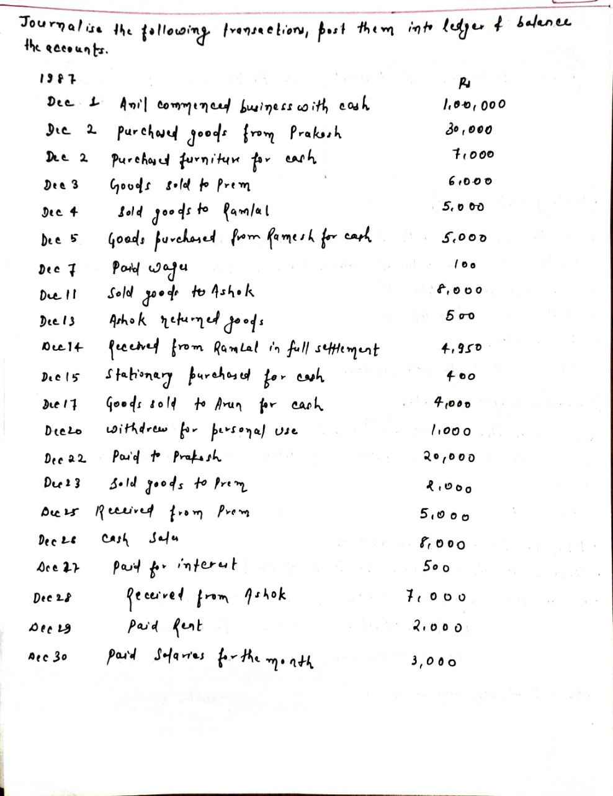

<!-- TOC start (generated with https://github.com/derlin/bitdowntoc) -->

- [Journal and Ledger](#journal-and-ledger)
- [Trial Balance](#trial-balance)
  - [Objectives of Preparing Trial Balance](#objectives-of-preparing-trial-balance)
  - [Limitations of Trial Balance](#limitations-of-trial-balance)
- [The Accounting Cycle](#the-accounting-cycle)
- [Journal, Ledger and Trial Balance Example](#journal-ledger-and-trial-balance-example)

<!-- TOC end -->

<!-- TOC -->
## Journal and Ledger

<!-- TOC -->
## Trial Balance

- **Definition**:
  - A statement showing debit and credit balances for each account.
  - Prepared after posting accounts in the ledger and finding each account's balance.
  - Lists each account and enters their balances into separate debit and credit columns.
  - Totals of debit and credit columns must be equal, indicating no arithmetical errors.
  - Under Double Entry System, total debit side equals total credit side.
  - Ensures reasonable confidence in accounting accuracy, though not proof of cent per cent accuracy.

- **Undetectable Errors**:
  - **Error of complete omission**: Transaction not entered into the system.
  - **Error of original entry**: Wrong amounts on both sides of a double-entry transaction.
  - **Error of reversal**: Correct amounts but debited and credited accounts reversed.
  - **Error of principle**: Transaction violates fundamental accounting principles (e.g., wrong account type).
  - **Error of commission**: Correct amount but wrong account debited or credited due to oversight.

<!-- TOC -->
### Objectives of Preparing Trial Balance

1. Establish if posting and accounting processes are free from arithmetical errors.
2. Basis for preparing financial statements.
3. Summarizes what is contained in the ledger.
4. Helps locate errors in bookkeeping.

<!-- TOC -->
### Limitations of Trial Balance

1. Transactions not entered in the journal.
2. Incorrect amounts written in both journal columns.
3. Incorrect account mentioned in the journal.
4. Entries not completely posted in the ledger.
5. Entries posted twice in the ledger.

<!-- TOC -->
## The Accounting Cycle

1. **Financial Transactions Occur**:
   - Examples: selling inventory, buying raw materials, making lease payments.

2. **Recording Transactions**:
   - Transactions noted in the appropriate financial journal.
   - Debits indicate money spent, credits indicate money received.

3. **Posting to General Ledger**:
   - Transactions posted to accounts in the general ledger (e.g., rent, wages, marketing).

4. **Running a Trial Balance**:
   - Performed at the end of the accounting period to ensure numbers balance.

5. **Finding and Correcting Imbalances**:
   - Identify the cause of any imbalance and correct it.

6. **Posting Adjustment Entries**:
   - Adjustments for accruals and deferrals at the end of the accounting period.

7. **Preparing Financial Statements**:
   - After accounts are balanced, prepare financial statements.

8. **Closing Books**:
   - Close out books at the end of the period.
   - Create new revenue and expense accounts with zero balances for the next period.

<!-- TOC -->
## Journal, Ledger and Trial Balance Example

