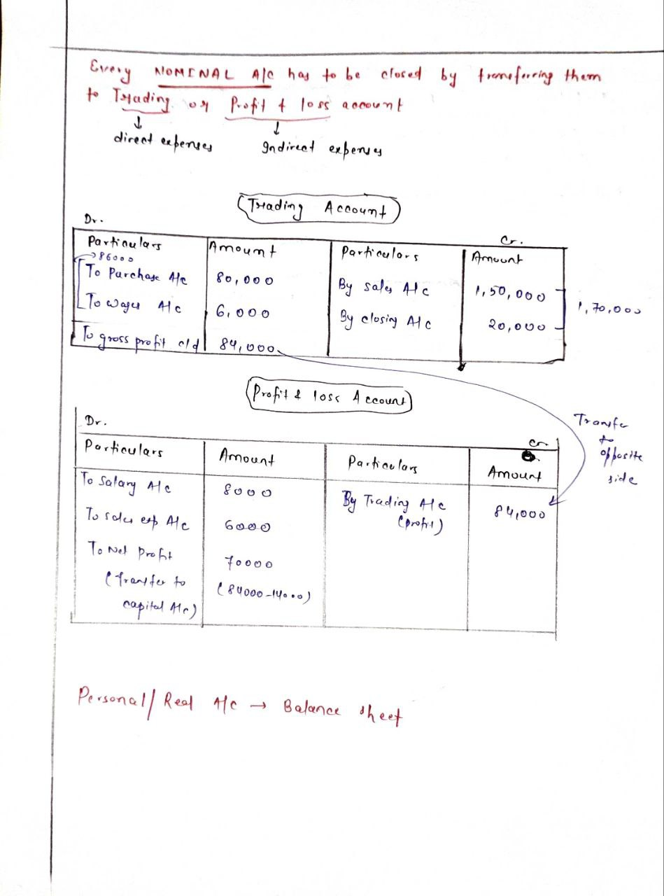
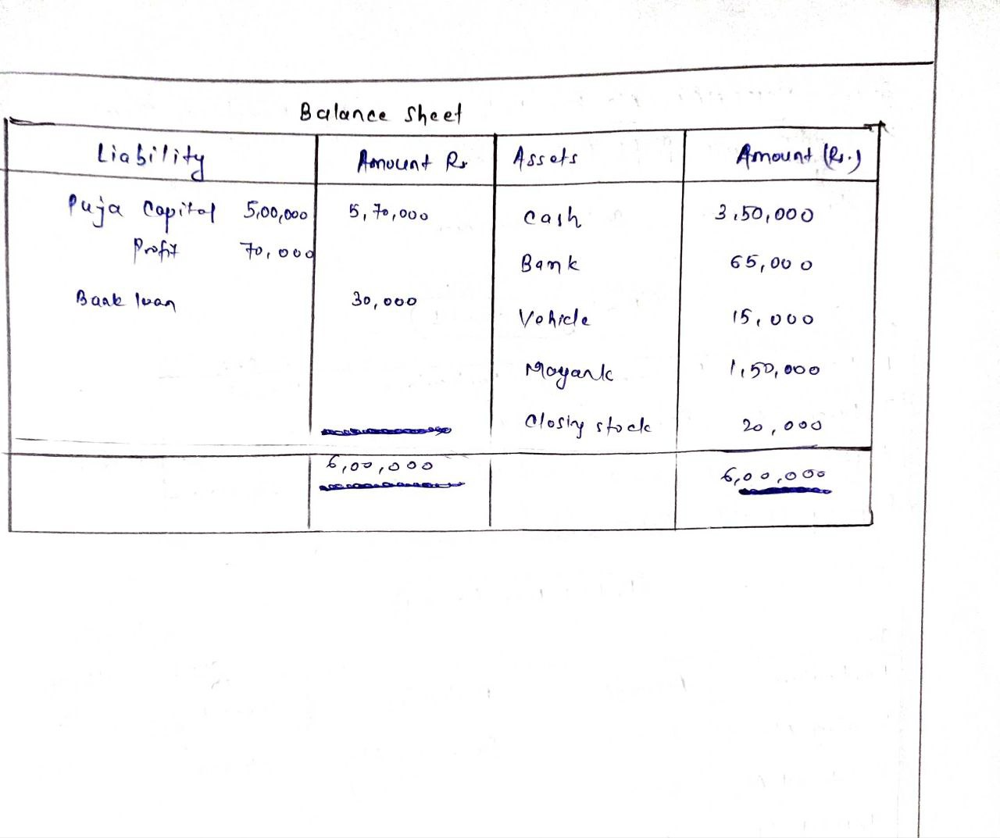

<!-- TOC start (generated with https://github.com/derlin/bitdowntoc) -->

- [Final Accounts](#final-accounts)
- [Trading Account](#trading-account)
  - [Overview](#overview)
  - [Key Formulas](#key-formulas)
  - [Components of Trading Account](#components-of-trading-account)
- [Profit and Loss Account (P \& L A/C)](#profit-and-loss-account-p--l-ac)
  - [Overview](#overview-1)
  - [Structure](#structure)
  - [Items Debited in P \& L Account](#items-debited-in-p--l-account)
  - [Items Credited in P \& L Account](#items-credited-in-p--l-account)
  - [Additional Notes](#additional-notes)
- [Balance Sheet](#balance-sheet)
- [Constructing a Balance Sheet](#constructing-a-balance-sheet)
- [Classification of Balance Sheet Items](#classification-of-balance-sheet-items)
  - [Assets](#assets)
  - [Liabilities](#liabilities)
  - [Capital](#capital)
- [Accounting Concepts to Evaluate a Balance Sheet](#accounting-concepts-to-evaluate-a-balance-sheet)
- [Adjustment Entries](#adjustment-entries)
  - [Overview](#overview-2)
- [Types of Adjustment Entries](#types-of-adjustment-entries)
  - [Closing Stock](#closing-stock)
  - [Depreciation](#depreciation)
  - [Bad Debts](#bad-debts)
  - [Provision for Bad and Doubtful Debts](#provision-for-bad-and-doubtful-debts)
  - [Outstanding Expenses (Liabilities)](#outstanding-expenses-liabilities)
  - [Prepaid Expenses (Assets)](#prepaid-expenses-assets)
  - [Accrued Income (Assets)](#accrued-income-assets)
  - [Income Received in Advance (Liability)](#income-received-in-advance-liability)
- [Forensic Accounting](#forensic-accounting)
  - [Overview](#overview-3)
  - [Definitions](#definitions)
  - [Scope of Forensic Accounting](#scope-of-forensic-accounting)
  - [Difference between Forensic Accounting and Audit](#difference-between-forensic-accounting-and-audit)
  - [Importance of Forensic Accounting](#importance-of-forensic-accounting)
  - [Role of Forensic Accountant](#role-of-forensic-accountant)
- [Trading Account, P and L Account and Balance Sheet](#trading-account-p-and-l-account-and-balance-sheet)

<!-- TOC end -->

<!-- TOC -->
## Final Accounts
- Final accounts are those accounts that are prepared by a joint stock company at the end of a fiscal year. The purpose of creating final accounts is to provide a clear picture of the financial position of the organisation to its management, owners, or any other users of such accounting information.
- Final account preparation involves preparing a set of accounts and statements at the end of an accounting year. The final account consists of the following accounts:

  - **Trading and Profit and Loss Account**
  - **Balance Sheet**
  - **Profit and Loss Appropriation account**

<!-- TOC -->
## Trading Account

<!-- TOC -->
### Overview
- First step in preparing final accounts.
- Helps in finding out gross profit or gross loss during an accounting year.
- Prepared by merchandising concerns purchasing and selling goods.
- Shows the result of buying and selling goods.

<!-- TOC -->
### Key Formulas
- **Gross Profit** = Net Sales Revenue - Cost of Goods Sold
- **Gross Loss** = Cost of Goods Sold - Net Sales Revenue
- **Net Sales Revenue** = Cash Sales + Credit Sales - Sales Returns
- **Cost of Goods Sold** = Opening Stock + Net Purchases + Direct Expenses - Closing Stock
- **Net Purchases** = Cash Purchases + Credit Purchases - Purchase Returns

<!-- TOC -->
### Components of Trading Account
- **Opening/Closing Stock**
  - Opening stock is the carried stock in hand at the beginning of a new accounting year.
  - Includes raw material, in-process goods, and finished goods.
  - Shown on the debit side of the Trial Balance report.
  - Closing stock is captured on the credit side of the Trading Account and becomes the opening stock for the next period.

- **Net Purchases**
  - Continuous purchase and sales of products and services.
  - Includes purchase of raw material and selling of finished goods.
  - Net Purchase = Gross Purchases (Cash + Credit) - Purchase Returns

- **Direct Expenses**
  - Expenses to bring goods to the production site until they become saleable products.
  - Examples:
    - **Wages**: Debited in trading account if no separate manufacturing account.
    - **Carriage/Freight Inwards**: Transportation expenses to the production site or warehouse.
    - **Octroi**: Municipal tax paid when goods enter from a municipal check-post.
    - **Custom Duty**: Paid for importing goods to be sold; debited in trading account.
    - **Factory Rent, Insurance, Lighting & Power, Heating**: Expenses for converting raw material to finished product.

-  **Net Sales**
   - Sales (Cash + Credit) minus Sales Returns to arrive at Net Sales figure.
   - Pertains to sales of finished goods, not the sale of company assets.
   - Goods sold but not delivered are recorded in closing stock, not in the sales head.

<!-- TOC -->
## Profit and Loss Account (P & L A/C)

<!-- TOC -->
### Overview
- Presents the operational results of a business for a particular period.
- Shows the summary of changes in owner’s capital/equity/claim resulting from operations.
- Matches revenues of a particular period with the expenses of the same period.
- **Net Profit**: Excess of revenues over expenditures.
- **Net Loss**: Excess of expenditures over revenues.

<!-- TOC -->
### Structure
- Prepared in two sections: Trading Account and Profit & Loss Account.
- **Trading Account**: Shows gross profit or loss from selling and purchasing goods.
- **Profit & Loss Account**: Shows other operating expenses and incomes from different sources.

<!-- TOC -->
### Items Debited in P & L Account
1. **Administrative Expense**: Office Salaries, premise rentals, electricity, Printing, stationery, postage, insurance, communication expenses, Director’s Fees, etc.
2. **Sales and Distribution Expenses**: Salesmen’s salary, commission, travelling expenses, advertising, packing expenses, royalty, etc.
3. **Financial Expenses**: Interest on loan/capital, cash discount, bad debts, bank charges, etc.
4. **Asset Depreciation**
5. **Other Expenses/Losses**: Loss on sales of fixed assets, loss by fire, theft, accident, etc.
6. **Taxes**: Sales taxes, income taxes, etc.

<!-- TOC -->
### Items Credited in P & L Account
- Dividend, cash discount, interest, rent, selling fixed assets, apprentice premium, etc.

<!-- TOC -->
### Additional Notes
- Household and personal expenses paid by the company to the owner(s) are not included in the P & L account.
- Such expenses are recorded as drawings and subtracted from the Capital Head of the Balance Sheet for the corresponding financial year.

| Trading A/c | Profit & Loss A/c |
|-------------|-------------------|
| Aimed at determining gross profit (GP) or loss for a business entity. | It is made to disclose net profit/loss. |
| Pertains to the sales and cost of goods sold, including direct expenses. | Pertains to the indirect expenses like those of administrative & financial nature. They are adjusted with gross profit and other arising revenues. |
| Results in gross profit/loss being transferred to the P & L a/c. | Results in the net profit/loss being transferred to the capital account. |

<!-- TOC -->
## Balance Sheet
- **Balance Sheet**: Provides the financial position of the firm on a particular date. Lists balances in assets and liabilities accounts.

<!-- TOC -->
## Constructing a Balance Sheet
- **Purpose**: To capture financial transactions and present updated information about the firm's performance and financial position.
- **Timing**: Typically made at the end of a financial year (F.Y), which can also be known as an accounting period or fiscal year.
- **Structure**: A systematic representation of financial data showcasing annual positions of assets, liabilities, and capital accounts.

<!-- TOC -->
## Classification of Balance Sheet Items
<!-- TOC -->
### Assets
- **Current Assets**: Convertible to cash within a year or operating cycle.
  - **Cash**: Legal tender, bank cheques, used for daily business operations.
  - **Account Receivables**: Sums owed by debtors, also called "unpaid customer accounts" or "trade receivables".
  - **Inventory**: Includes merchandise for sale, raw materials, under-production goods, and finished goods.
  - **Pre-paid Expenses**: Expenses paid in advance like rent, advance tax, subscriptions, insurance.

- **Fixed Assets**: Tangible assets with a longer life, essential for production and trade processes.
  - Examples: Land, building, plant, machinery, motor vehicles. 
  - Land is recorded separately as it does not depreciate.

- **Intangible and Other Fictitious Assets**: Carry value but have no physical attributes.
  - **Goodwill**: Ability of a firm to earn profits in excess of normal return.
  - Intangible assets deplete over time (Amortization).

<!-- TOC -->
### Liabilities
- **Current Liabilities**: Outsiders' claims due within an accounting period or operating cycle.
  - **Accounts Payable**: Unsecured debts owed by business.
  - **Accrued Liabilities**: Expenses/obligations of last year paid in next year (e.g., wages, rent).
  - **Provisions or Anticipated Liabilities**: Known liabilities with undefined amounts (e.g., income tax payable).
  - **Contingent Liabilities**: Not liabilities currently but may become so after a defined event.

- **Long Term Liabilities**: Liabilities due in more than a year.
  - Examples: Debentures, bonds, bank borrowings.

<!-- TOC -->
### Capital
- **Assets = Liabilities + Owners’ Equity**.
- **Reserves and Surplus or Retained Earnings**: Profits retained in the business by management instead of being distributed as dividends.

<!-- TOC -->
## Accounting Concepts to Evaluate a Balance Sheet
- **Dual Aspect Principle**: Each transaction has dual effects, placed both at the debit and credit columns.
- **Going Concern Principle**: Assets are written off over a period by the depreciation method.
- **Historical Cost Basis**: Asset valuation is based on historical cost.

<!-- TOC -->
## Adjustment Entries

<!-- TOC -->
### Overview
- Adjustment entries correlate with accounting concepts, conventions, and principles.
- Final accounts are treated on an accrual basis, requiring regular deduction of expenses.
- Adjustments ensure correct matching of costs and revenues for an accurate Profit & Loss statement.

<!-- TOC -->
## Types of Adjustment Entries
<!-- TOC -->
### Closing Stock
- Value of unsold stock of the firm.
- Valuation can be based on cost price or market price; lower values are accepted.

<!-- TOC -->
### Depreciation
- Periodic reduction in value of fixed assets.
- Accounting entry: Depreciation account is debited; individual asset account is credited.

<!-- TOC -->
### Bad Debts
- Loss from unpaid debts or irrecoverable amounts.
- Treated by transferring to the debit side of the Profit & Loss account.

<!-- TOC -->
### Provision for Bad and Doubtful Debts
- Based on past trends or management insights, a provision for doubtful debts is made.
- Ensures the balance sheet reflects the true business essence.

<!-- TOC -->
### Outstanding Expenses (Liabilities)
- Payments for expenses made by business accountants.
- Failure to capture an expense is considered an understatement.

<!-- TOC -->
### Prepaid Expenses (Assets)
- Expenses paid in advance.
- Unconsumed or partially paid expenses become assets in annual financial statements.

<!-- TOC -->
### Accrued Income (Assets)
- Amount earned but not received during the accounting period.

<!-- TOC -->
### Income Received in Advance (Liability)
- Income received but not earned during the accounting period.
- Corresponding amount for goods or services to be offered in future.

<!-- TOC -->
## Forensic Accounting

<!-- TOC -->
### Overview
- Specialized field investigating fraud and analyzing financial information for legal proceedings.
- Involves multiple disciplines: accounting, auditing, law, criminology, psychology, sociology, economics, and finance.
- Findings are used for legal support and conflict resolution.

<!-- TOC -->
### Definitions
- **Dictionary of Accounting Terms**: Application of accounting facts gathered through auditing methods to resolve legal problems.
- **Webster's Dictionary**: Accounting analysis suitable for court use in public discussions, debates, and dispute resolutions.

<!-- TOC -->
### Scope of Forensic Accounting
- Bank frauds
- Securities and Exchange Board of India (SEBI)
- Insolvency cases
- Serious Fraud Investigation Office
- Economic Offenses Wings

<!-- TOC -->
### Difference between Forensic Accounting and Audit
- **Financial Audit**: Provides an impartial evaluation and opinion on financial statements, offering reasonable assurance.
- **Forensic Accounting**: Investigates financial statements, calculates potential loss, and probes deeply into financial transactions to detect fraud.

<!-- TOC -->
### Importance of Forensic Accounting
- Conventional accounting and auditing are not sufficient for detecting fraud.
- Financial auditing checks conformity to GAAP, auditing standards, and accounting policies but does not probe deeply.
- Forensic accounting looks beyond the numbers, investigating past transactions for anomalies and playing a proactive risk-reduction role.

<!-- TOC -->
### Role of Forensic Accountant
- Visit past transactions and report anomalies.
- Conduct explanatory analysis of fraud phenomena.
- Play a proactive role in reducing risk.

<!-- TOC -->
## Trading Account, P and L Account and Balance Sheet

