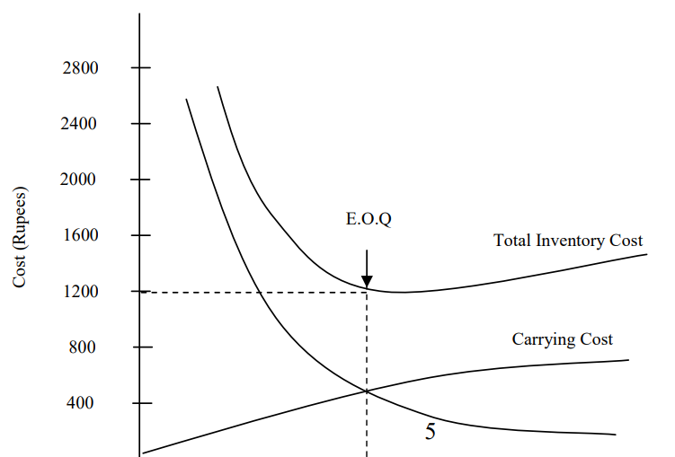
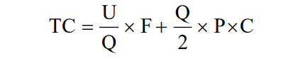
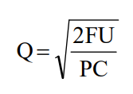

## Inventory Management

**Definition**:
- Helps companies identify which and how much stock to order at what time.
- Tracks inventory from purchase to sale of goods.
- Identifies and responds to trends to ensure sufficient stock and proper warnings of shortages.
- Vital for company health by balancing stock levels to avoid excess or shortage.

**Types of Inventories**:
- **Manufacturing Firms**:
  - Raw material
  - Work in process (WIP)
  - Finished goods
  - Spares
- **Financial Services Firms**:
  - Portfolio of marketable securities (debt, equity, hybrid instruments)
- **Retail Firms**:
  - Products to meet customer demand (shops, malls, supermarkets)

**Importance in Manufacturing Firms**:
- Inventories are the largest asset category after plant and machinery.
- Inventory proportion to total assets: 15-30%.

**Coordination Needed**:
- Between production, purchasing, and marketing departments.
- Purchasing and production departments decide on raw materials.
- Production department manages work in process inventory.
- Both production and marketing departments determine finished goods inventory levels.
- Financial manager ensures proper monitoring and control.

### Reasons for Holding Inventory

- **Smooth Operations**:
  - Prevents disruptions and idle time for men and machines.
  - Avoids lost sales.

- **Types of Inventories**:
  - **Raw Material Inventory**:
    - Prevents production disruption.
    - Depends on procurement speed and supply uncertainty.
  - **Work in Process (WIP) Inventory**:
    - Also known as "Process Inventories".
    - Lower for simple products, higher for complex products with sub-processes.
  - **Finished Goods Inventory**:
    - Meets customer requirements promptly.
    - Depends on order fulfillment time and product line diversity.
  - **Spare Parts Inventory**:
    - Ensures smooth running of business.
  - **Transaction/Precautionary and Speculative Motives**:
    - Transaction inventory for normal business operations.
    - Precautionary inventory for shortage or adverse price movement.

### Objectives of Inventory Management

- **Operational Objectives**:
  - Ensure continuous supply of materials.
  - Ensure uninterrupted production.
  - Minimize risks and losses.
  - Provide better customer service.
  - Avoid stock-out danger.

- **Financial Objectives**:
  - Minimize investment.
  - Minimize inventory-related costs.
  - Ensure economy in purchasing.

### Factors Affecting Level of Inventory

- Nature of business.
- Inventory turnover.
- Nature and type of product.
- Market structure.
- Economies of production.
- Inventory costs.
- Financial position.
- Period of operating cycle.
- Attitude of management.

### Techniques of Inventory Control

- **Planned Approach**:
  - Determine when to buy, how much to buy, and how much to stock.
  - Minimize costs without interrupting production or affecting sales.

- **Traditional Techniques**:
  - **Inventory Control Ratios**:
    - *Overall Inventory Turnover Ratio*: `Cost of goods sold / Average total inventories at cost`
    - *Raw Material Inventory Turnover Ratio*: `Annual consumption of raw material / Average raw material inventory`
    - *Work-in-process Inventory Turnover Ratio*: `Cost of manufacture / Average work in process inventory at cost`
    -* Finished Goods Inventory Turnover Ratio*: `Cost of goods sold / Average inventory of finished goods at cost`
    - *Average Age of Raw Materials in Inventory*: `Average Raw Material Inventory at cost / Average Daily Purchase of Raw Materials`
    - *Average Age of Finished Goods Inventory*: `Average finished goods inventory at Cost / Average cost of goods manufactured per day`
    - *Out-of-stock Index*: `Number of times out of stock / Number of times requisitioned`
    - *Spare Parts Index*: `Value of Spare Parts Inventory / Value of Capital Equipment`
  - **Two Bin Systems**:
    - Store items in two separate bins.
    - First bin: supply for designated period.
    - Second bin: safety stock for lead times.
    - Reorder triggered when first bin is consumed.
  - **Perpetual Inventory System**:
    - Store balances computed and recorded after each issue and receipt.
    - Provides quantity and value of stock at all times.
    - Costly due to frequent physical verification.
  - **Periodic Inventory System**:
    - Stock levels reviewed at fixed intervals.
    - Orders placed up to a pre-determined level during reviews.
    - Review cycle depends on item importance.

## Modern Techniques

### Economic Order Quantity (EOQ) Graphical Methods 
- Ordering cost, carrying cost and total inventory costs according to different lot sizes are plotted in the graph.
- The point at which these lines intersect is the economic order quantity.

- **Assumption of the EOQ Model**
  1. The forecast usage/demand for a given period, usually one year, is known 
  2. The usage/demand is even throughout that period 
  3. Inventory orders can be replenished immediately (There is no delay in placing and receiving orders).

- There are *two distinguishable costs* associated with inventories: ***costs of ordering*** and ***costs of carrying***.

- **EOQ formula**
  - For determining the EOQ formula we shall use the following symbols: 
    - U = annual usage/demand 
    - Q = quantity ordered 
    - F = cost per order 
    - C = per cent carrying cost 
    - P = price per unit 
    - TC = total costs of ordering and carrying
  - Total cost of ordering and carrying inventories
  
  

  - The total cost of ordering and carrying is minimized when:

  

### Quality Discount and Order Quantity

